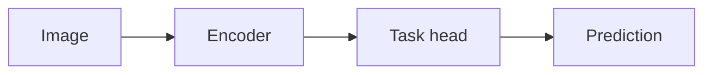

---
# Required
title: "<Common name of the model (e.g. ResNet, SuperPoint, DINOv2)>"
date: YYYY-MM-DD
summary: "<One sentence, index-card length. Declarative. What it takes in, what it produces, and how it is trained.>"
tags: ["computer-vision", "<primary task>", "<secondary tag>"]
category: <detection|depth-stereo|pose-geometry|segmentation-flow|foundation-ssl|calibration-learning>
author: "Vitaly Vorobyev"

# Required for non-draft pages
sources:
  primary: <paper-id>
  references: ["<paper-id>"]
  notes: |
    <Freeform grounding notes — defining equations, symbol definitions,
    table references used by the page. This field is private scaffolding
    for the drafter; it does not render on the page.>

implementations:
  - role: official
    repo: https://github.com/<owner>/<repo>
    commit: <7..40 hex — prefer a release-tag SHA over main>
    framework: <pytorch|tensorflow|jax|caffe|other>
    license: <SPDX-like string — verified from LICENSE at the pinned commit>
    weights_url: https://<url>           # optional
    weights_license: <SPDX-like string>  # required iff weights_url is set
  # Add a community reimpl when it is materially more used than official,
  # or fills a framework gap. Drop this entry if not applicable.
  - role: community
    repo: https://github.com/<owner>/<repo>
    commit: <sha>
    framework: pytorch
    license: <SPDX-like>

# Optional — header badges
arch_family: <cnn|vit|encoder-decoder|diffusion|gan|hybrid>
params: "<25.5M | 86M | 7B | ...>"
flops: "<4.1 GMAC @ 224×224 | 17.6 GMAC @ 1024×1024 | ...>"

# Optional — cross-links and metadata
difficulty: <beginner|intermediate|advanced>
draft: false
relatedPosts: ["<blog-slug>"]
relatedAlgorithms: ["<algo-slug>"]
relatedDemos: ["<demo-slug>"]
coverImage: "./images/<slug>/cover.png"
---

# Motivation

<One paragraph. Input → output → defining property. Declarative.
No narrative opening, no rhetorical question, no named alternative tools,
no attribution — attribution lives in References.>

# Motivation — example (delete)

> Detect interest points and their local descriptors in a single forward pass
> on a grayscale image. Input: grayscale image of shape $(H, W)$. Output:
> keypoint heatmap of shape $(H, W)$ and a descriptor field of shape
> $(D, H/8, W/8)$. The model is specific to jointly-trained detection and
> description, in contrast to pipelines that learn each stage separately.

# Architecture

**Family & shape.** <Model family (CNN / ViT / encoder-decoder / diffusion / hybrid).
Input tensor shape with axis labels. Output tensor shape with axis labels.
Backbone. One or two sentences.>

**Blocks.** <Layer inventory and the defining computation. Attention flavor,
conv kernel sizes, residual pattern, normalization. Name the paper's section
or figure that introduces each block.>

<Optional — code snippet of the signature block, ≤ 30 lines. The block's
computation, not a loader API. One-sentence lead-in of the form
"The residual unit in PyTorch:".>

```python
<Self-contained block definition. No `from transformers import ...`,
no `model = AutoModel.from_pretrained(...)`, no training loop.
The code corresponds line-by-line to the paper's block description.>
```

**Training.** <Dataset(s). Loss / objective — wrap a non-trivial loss in a
`:::definition[Loss name]` block. Schedule in one sentence (optimizer,
LR schedule, number of steps, batch size). Augmentation in one phrase.
Headline metric(s) on the canonical benchmark with paper-table citation —
e.g. "Top-1 76.5 % on ImageNet-1k (Table 2).">

<Optional — defining formula for a named loss, in a :::definition block.>

:::definition[<Loss name>]
<One-sentence gloss of what the loss measures.>

$$
\mathcal{L}_{\text{<name>}} = <expression>.
$$
:::

**Complexity.** <Parameter count. FLOPs or MACs at a stated input size.
Inference memory if the paper reports it. One line.>

# Implementations

<This section's body is at most a one-sentence lead. The table is
auto-rendered from the frontmatter `implementations[]` array by
ModelPost.tsx. Do not hand-write a markdown table here.>

<Optional one-sentence lead when scope needs clarification:>

> Official Caffe release; a widely-used PyTorch port is maintained
> inside torchvision.

# Assessment

**Novelty.**

- <What this paper contributed relative to antecedents, named —
  not narrated. Each bullet names the antecedent.>
- <...>

**Strengths.**

- <Regime or metric where the model wins. Cite a benchmark table
  reference or a direct architectural consequence.>
- <...>

**Limitations.**

- <Failure mode. One line.>
- <Compute cost / domain gap / reproducibility caveat.>
- <Licensing restriction when a restrictive weights license limits
  practical use — CC-BY-NC, RAIL, research-only.>

# References

1. <Primary source.> Authors. *Title.* Venue, Year. [link-text](url)
2. <Closest antecedent or extension, if relevant.>
3. <At most 5 entries total.>

<!-- Figures (illustration pass, SKILL §7.5). Inherit the rules from
     `.claude/skills/algo-page/SKILL.md` §"Illustrations". At most two figures.
     Delete unused rows below. -->

<!-- Mermaid pipeline — inline, no asset file. Use for training loops,
     inference pipelines, multi-stage distillation topology. -->



<!-- Hand-authored SVG — store at content/images/<slug>/<name>.svg.
     Use for architecture block diagrams with < ~15 primitives.
     Place near the block's definition. -->


<!-- Generated SVG — sibling script at py/generate_<slug>_<name>.py writes
     content/images/<slug>/<name>.svg. Use for learning curves, scaling laws,
     parameter-efficiency frontiers. Model the script on
     py/generate_harris_eigenvalue_regions.py. Run with:
     .venv/bin/python py/generate_<slug>_<name>.py -->


<!-- Real-image model-output figures belong in a demo or blog post,
     not on the reference card. Do not commit them here. -->

<!-- Template for content/models/*.md only. For blog posts about a model,
     use tech-writer. For closed-form algorithms, use algo-page.
     Delete the "Motivation — example" block and any placeholder text
     before publishing. -->
