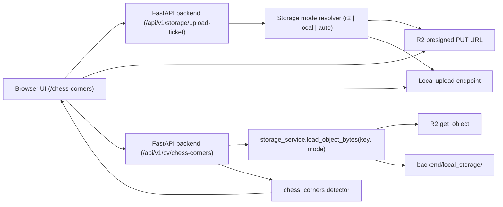

# Vitavision Development README

This document describes the service architecture and how to run the project in development mode.

## Service Architecture



## Services and Responsibilities

| Component | Path | Responsibility |
|---|---|---|
| Frontend prototype page | `src/pages/ChessCornersPage.tsx` | File selection, upload pipeline execution, and detection visualization. |
| Storage API router | `backend/routers/storage.py` | Upload ticket creation, local upload endpoint, local object serving. |
| CV API router | `backend/routers/cv.py` | Load image by storage key and run `chess_corners` detection. |
| Storage service | `backend/services/storage_service.py` | Storage mode resolution, key generation, R2 client calls, local file I/O. |
| Typed frontend storage client | `src/lib/storage.ts` | Calls upload-ticket endpoint and executes direct PUT upload. |
| Typed frontend CV client | `src/lib/api.ts` | Calls `/cv/chess-corners` with key + mode + detector options. |

## Main API Endpoints

- `POST /api/v1/storage/upload-ticket`
  - Input: `filename`, `content_type`, optional `storage_mode`.
  - Output: `key`, `storage_mode`, direct `upload.url`, request headers, expiry.
- `PUT /api/v1/storage/local-upload/{key}`
  - Used only in local storage mode.
- `GET /api/v1/storage/local-object/{key}`
  - Dev preview endpoint for locally stored assets.
- `POST /api/v1/cv/chess-corners`
  - Input: `key`, `storage_mode`, `use_ml_refiner`, optional detector config.
  - Output: corner list with subpixel `(x, y)`, orientation, direction vector, and confidence.

## Environment Variables

`setenv.sh` already contains your R2 secrets. Optional variables used by the backend:

| Variable | Default | Purpose |
|---|---|---|
| `S3_BUCKET` | `vitavision` | R2 bucket name. |
| `STORAGE_MODE` | `auto` | `auto`, `r2`, or `local`. |
| `S3_ENDPOINT` | none | R2 S3-compatible endpoint. |
| `S3_KEY_ID` | none | R2 key ID. |
| `S3_KEY_SECRET` | none | R2 secret key. |
| `R2_PRESIGN_EXPIRES_SECONDS` | `900` | Presigned upload expiration in seconds. |
| `R2_PUBLIC_BASE_URL` | none | Optional public base URL for uploaded objects. |
| `LOCAL_STORAGE_ROOT` | `backend/local_storage` | Filesystem root for local storage mode. |
| `STORAGE_UPLOAD_PREFIX` | `uploads` | Object key prefix. |
| `VITE_API_BASE_URL` | `http://localhost:8000/api/v1` | Frontend API base URL. |

## Run in Development Mode

### 1. Backend

```bash
cd backend
uv venv
source .venv/bin/activate
python -m ensurepip --upgrade
python -m pip install -r requirements.txt
source ../setenv.sh
uvicorn main:app --reload --port 8000
```

### 2. Frontend

```bash
cd ..
npm install
npm run dev
```

### 3. Open the prototype

- URL: `http://localhost:5173/chess-corners`
- Flow:
  - Select image.
  - Choose `Auto (prefer R2)`, `R2 only`, or `Local dev storage`.
  - Click `Upload + Detect`.

## Recommended Dev Modes

- R2 mode:
  - Use `Auto` or `R2 only` in UI.
  - Ensure your R2 bucket CORS allows browser `PUT` from `http://localhost:5173`.
- Local mode:
  - Set `STORAGE_MODE=local` or choose `Local dev storage` in UI.
  - No bucket CORS dependency.

## Quick Manual Smoke Test (Local Mode)

```bash
cd backend
source .venv/bin/activate
export STORAGE_MODE=local

# 1) Request upload ticket
curl -s -X POST http://localhost:8000/api/v1/storage/upload-ticket \
  -H 'Content-Type: application/json' \
  -d '{"filename":"test.png","content_type":"image/png","storage_mode":"local"}'
```

Use the returned `key` and `upload.url`, then:

```bash
# 2) Upload image bytes
curl -X PUT "UPLOAD_URL_FROM_TICKET" \
  -H 'Content-Type: image/png' \
  --data-binary @/absolute/path/to/image.png

# 3) Run detector
curl -s -X POST http://localhost:8000/api/v1/cv/chess-corners \
  -H 'Content-Type: application/json' \
  -d '{"key":"KEY_FROM_TICKET","storage_mode":"local","use_ml_refiner":false}'
```

## Notes

- Coordinates are returned in the `image_px_center` frame with origin at top-left, `x` to the right, `y` downward.
- Confidence is derived from response normalization per image.
