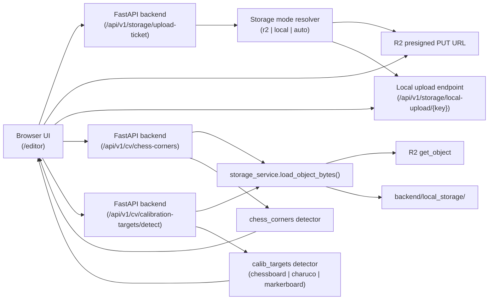

# Vitavision — Developer Guide

This document covers local development setup, running tests, and deploying to production.

---

## 1. Local Development Setup

### Prerequisites

| Tool | Version | Install |
|------|---------|---------|
| Python | 3.12 | [python.org](https://www.python.org/) or `pyenv` |
| uv | latest | `curl -LsSf https://astral.sh/uv/install.sh \| sh` |
| Bun | latest | `curl -fsSL https://bun.sh/install \| bash` |

### Step 1 — Backend

```bash
cd backend
uv venv
source .venv/bin/activate
uv pip install -r requirements.txt

# For local storage (no R2 needed):
export STORAGE_MODE=local

uvicorn main:app --reload --port 8000
```

The backend is now running at `http://localhost:8000`.

> **R2 storage**: if you want to use Cloudflare R2, run `source ../setenv.sh` instead of
> setting `STORAGE_MODE=local`. The setenv.sh file (gitignored) loads your R2 credentials.

### Step 2 — Frontend

```bash
# From repo root (no .env.local needed for pure local dev)
bun install
bun run dev
```

The frontend is now at `http://localhost:5173`.

> **No `.env.local` needed for local dev.** `VITE_API_BASE_URL` defaults to
> `http://localhost:8000/api/v1`. The Vite dev server automatically relaxes the
> Content Security Policy to allow `localhost:8000` — the production CSP stays tight.

### Step 3 — Open the editor

- URL: `http://localhost:5173/editor`
- Upload an image (or pick a curated sample from the gallery)
- Open the algorithm panel, choose an algorithm, and run it

### Pointing the local frontend at the remote backend

Create `.env.local` (gitignored) in the repo root:

```
VITE_API_BASE_URL=https://api.vitavision.dev/api/v1
VITE_API_KEY=<same value as server API_KEY>
```

---

## 2. Service Architecture



### Component Responsibilities

| Component | Path | Responsibility |
|-----------|------|----------------|
| Editor composition root | `src/pages/Editor.tsx` | Integrates toolbar, canvas, right panel |
| Algorithm panel | `src/components/editor/panels/AlgorithmPanel.tsx` | Algorithm selection, config, run, summary |
| Feature panel | `src/components/editor/panels/FeatureListPanel.tsx` | Manual + algorithm feature list |
| Feature layer | `src/components/editor/canvas/FeatureLayer.tsx` | Renders all feature types on canvas |
| Storage API router | `backend/routers/storage.py` | Upload ticket, local upload, local object serving |
| CV API router | `backend/routers/cv.py` | Chess corners + calibration target detection |
| Storage service | `backend/services/storage_service.py` | R2/local resolution, key generation, file I/O |

### API Endpoints

| Method | Path | Purpose |
|--------|------|---------|
| `POST` | `/api/v1/storage/upload-ticket` | Get presigned PUT URL or confirm file exists |
| `PUT` | `/api/v1/storage/local-upload/{key}` | Upload bytes (local storage mode only) |
| `GET` | `/api/v1/storage/local-object/{key}` | Serve stored bytes (local storage mode only) |
| `POST` | `/api/v1/cv/chess-corners` | ChESS X-junction corner detection |
| `POST` | `/api/v1/cv/calibration-targets/detect` | Chessboard / ChArUco / Marker Board detection |

---

## 3. Running Tests

### Backend integration tests

```bash
cd backend
source .venv/bin/activate
STORAGE_MODE=local LOCAL_STORAGE_ROOT=/tmp/vitavision-tests pytest tests/ -v
```

### Python quality gates

```bash
cd backend
source .venv/bin/activate

# Install test/lint tools if not present
uv pip install -r requirements-test.txt

ruff check .                       # lint
ruff format --check .              # formatting
mypy . --ignore-missing-imports    # type check
```

### Frontend build gate

```bash
bun run build    # type-check + Vite production build
bun run lint     # ESLint
```

### Smoke test (curl)

Run both after starting the backend with `STORAGE_MODE=local`:

```bash
# 1. Upload image
curl -s -X POST http://localhost:8000/api/v1/storage/upload-ticket \
  -H 'Content-Type: application/json' \
  -d '{"sha256":"<sha256-hex-of-image>","content_type":"image/png","storage_mode":"local"}'

# Use the returned key and upload.url:
curl -X PUT "http://localhost:8000/api/v1/storage/local-upload/<key>" \
  -H 'Content-Type: image/png' \
  --data-binary @/path/to/image.png

# 2a. Run ChESS corners
curl -s -X POST http://localhost:8000/api/v1/cv/chess-corners \
  -H 'Content-Type: application/json' \
  -d '{"key":"<key>","storage_mode":"local","use_ml_refiner":false}'

# 2b. Run calibration target detection (chessboard example)
curl -s -X POST http://localhost:8000/api/v1/cv/calibration-targets/detect \
  -H 'Content-Type: application/json' \
  -d '{
    "algorithm": "chessboard",
    "key": "<key>",
    "storage_mode": "local",
    "config": {
      "detector": {
        "expected_rows": 7,
        "expected_cols": 11,
        "min_corner_strength": 0.2,
        "completeness_threshold": 0.1
      }
    }
  }'
```

---

## 4. Deployment

### How it works

Every merge to `main` triggers the CI pipeline:

1. **`build-frontend`** — type-check + Vite build (uses `VITE_API_BASE_URL` secret)
2. **`test-backend`** — pytest with local storage
3. **`lint-backend`** — ruff lint/format + mypy type-check
4. **`build-backend`** — Docker image built, pushed to `ghcr.io/vitalyvorobyev/vitavision-backend` with `:latest` and `:sha-<commit>` tags; immutable digest captured
5. **`deploy-hetzner`** — SSH into Hetzner, pull image by digest (not tag), `docker compose up -d`

Deploys by immutable digest to prevent tag-swap attacks.

### Server layout (`/opt/demos/`)

```
/opt/demos/
  docker-compose.yml   # api (FastAPI) + caddy services
  Caddyfile            # reverse proxy config; handles TLS automatically
  .env                 # backend env vars (never committed)
```

### Manual deploy / rollback

```bash
ssh <hetzner-user>@<hetzner-host>
cd /opt/demos
docker compose pull
docker compose up -d --remove-orphans
docker image prune -f
```

### Required server env vars (`.env`)

| Variable | Required | Notes |
|----------|----------|-------|
| `API_KEY` | yes | Any strong random string; must match `VITE_API_KEY` in frontend build |
| `CORS_ORIGINS` | yes | Comma-separated allowed origins, e.g. `https://vitavision.dev` |
| `STORAGE_MODE` | yes | `r2` in production |
| `S3_BUCKET` | yes | R2 bucket name |
| `S3_ENDPOINT` | yes | R2 S3-compatible endpoint URL |
| `S3_KEY_ID` | yes | R2 access key ID |
| `S3_KEY_SECRET` | yes | R2 secret key |
| `LOG_FORMAT` | recommended | `json` for structured logs |
| `R2_CACHE_ROOT` | optional | Local cache dir for R2 objects (e.g. `/data/cache`) |

### Caddy

Caddy handles TLS termination automatically via ACME. The `Caddyfile` only needs updating
if the domain changes. Current config forwards HTTPS traffic to the `api` container on port 8000.

---

## 5. Environment Variables Reference

### Backend

| Variable | Default | Purpose |
|----------|---------|---------|
| `STORAGE_MODE` | `auto` | `auto`, `r2`, or `local` |
| `S3_BUCKET` | `vitavision` | R2 bucket name |
| `S3_ENDPOINT` | — | R2 S3-compatible endpoint |
| `S3_KEY_ID` / `S3_KEY_SECRET` | — | R2 credentials |
| `LOCAL_STORAGE_ROOT` | `backend/local_storage` | Filesystem root for local mode |
| `API_KEY` | *(unset = auth disabled)* | Required `X-API-Key` value on all `/api/v1/*` |
| `CORS_ORIGINS` | `http://localhost:5173,...` | Comma-separated allowed origins |
| `MAX_UPLOAD_BYTES` | `52428800` (50 MB) | Hard cap on request body size |
| `R2_CACHE_ROOT` | *(disabled)* | Local R2 download cache dir |
| `R2_CACHE_MAX_AGE_HOURS` | `24` | Max age before cache cleanup |
| `LOG_FORMAT` | `text` | `json` for structured production logs |
| `LOG_LEVEL` | `INFO` | Python log level |

### Frontend (baked in at build time)

| Variable | Default | Purpose |
|----------|---------|---------|
| `VITE_API_BASE_URL` | `http://localhost:8000/api/v1` | Backend API base URL |
| `VITE_API_KEY` | *(unset)* | Forwarded as `X-API-Key`; must match `API_KEY` |
