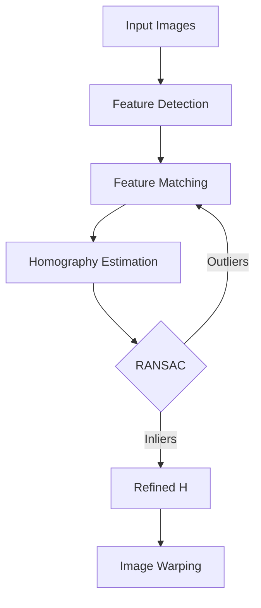

This draft algorithm page mirrors the rich markdown feature coverage of the blog pipeline so the `/algorithms/*` route is exercised with the same authoring tools. It also provides explicit internal links to [the intro post](/blog/00-intro) and [the Harris detector page](/algorithms/harris-corner-detector).

## Typography Basics

Body text is rendered in Source Serif 4 at 18px with a line height of 1.75. This creates comfortable reading rhythm for technical prose. The maximum line width is constrained to approximately 68 characters, which is optimal for sustained reading.

Paragraphs have generous spacing between them. **Bold text** stands out clearly, while *italic text* provides subtle emphasis. Links like [the algorithms index](/algorithms) use a steel blue color with a subtle underline that becomes more prominent on hover.

### Heading Hierarchy

Headings use Inter (sans-serif) to create clear visual contrast with the serif body text. The spacing above headings is generous to signal new sections, while the space below is tighter to keep the heading connected to its content.

#### Fourth-Level Heading

Fourth-level headings are used sparingly for fine-grained structure within subsections.

## Lists

Unordered lists with improved spacing:

- First item with comfortable line height
- Second item demonstrating consistent bullet appearance
- Third item with a longer description that wraps to multiple lines to verify that the indentation and line height remain comfortable

Ordered lists:

1. Normalize the image coordinates using an isotropic scaling transformation.
2. Assemble the linear system $A\mathbf{h} = 0$ from point correspondences.
3. Compute the SVD of $A$ and extract the null space vector.
4. Reshape the solution into the $3 \times 3$ homography matrix $H$.

Nested lists:

- Camera models
  - Pinhole model
  - Fisheye model
  - Omnidirectional model
- Calibration methods
  - Zhang's method
  - DLT (Direct Linear Transform)

## Inline Math and Display Math

The homography matrix $H$ maps points between two views when all observed points lie on a plane. Given a camera intrinsic matrix $K$, rotation $R$, and translation $t$, the plane-induced homography is:

$$
H = K\left(R - \frac{t \, n^\top}{d}\right)K^{-1}
$$

where $n$ is the plane normal and $d$ is the distance from the camera center to the plane.

The reprojection error for a point correspondence $(x_i, x_i')$ is defined as:

$$
\epsilon_i = \|x_i' - \hat{x}_i'\|^2 = \left\|x_i' - \frac{H x_i}{\mathbf{e}_3^\top H x_i}\right\|^2
$$

Equation \eqref{eq:dlt-system} is the linear system solved in Direct Linear Transform, and \ref{eq:dlt-system} is where the homogeneous constraint first appears on the algorithm route.

$$
A\mathbf{h} = 0
\label{eq:dlt-system}
$$

## Code Blocks

Python example with syntax highlighting:

```python
import numpy as np
from numpy.linalg import svd

def normalize_points(pts: np.ndarray) -> tuple[np.ndarray, np.ndarray]:
    """Normalize 2D points so that centroid is at origin and mean distance is sqrt(2)."""
    centroid = pts.mean(axis=0)
    shifted = pts - centroid
    mean_dist = np.sqrt((shifted ** 2).sum(axis=1)).mean()
    scale = np.sqrt(2) / mean_dist

    T = np.array([
        [scale, 0, -scale * centroid[0]],
        [0, scale, -scale * centroid[1]],
        [0, 0, 1],
    ])
    return T, (T @ np.vstack([pts.T, np.ones(len(pts))]))[: 2].T
```

TypeScript example:

```typescript
interface CalibrationResult {
  reprojectionError: number;
  intrinsics: Matrix3x3;
  distortion: number[];
}

async function calibrate(
  imagePoints: Point2D[][],
  objectPoints: Point3D[][],
): Promise<CalibrationResult> {
  const response = await fetch("/api/v1/cv/calibrate", {
    method: "POST",
    body: JSON.stringify({ imagePoints, objectPoints }),
  });
  return response.json();
}
```

Inline code like `np.linalg.svd()` or `CalibrationResult` should be clearly distinct from surrounding prose without being visually noisy.

## Semantic Blocks

### Definitions

:::definition[Homography]
A **homography** is a projective transformation from $\mathbb{P}^2$ to $\mathbb{P}^2$ represented by a non-singular $3 \times 3$ matrix $H$, defined up to scale. It maps points as $x' \sim Hx$ where $\sim$ denotes equality up to a non-zero scalar.
:::

:::definition[Epipolar Geometry]
The **epipolar geometry** describes the intrinsic projective relationship between two views of a scene. It is independent of scene structure and depends only on the cameras' internal parameters and relative pose.
:::

### Theorems and Proofs

:::theorem[Plane-Induced Homography]
If all observed 3D points lie on a plane $\pi: n^\top X = d$, then the correspondence between two views is exactly described by a homography $H = K'(R - tn^\top/d)K^{-1}$, where $K, K'$ are the intrinsic matrices, and $(R, t)$ is the relative pose.
:::

:::proof
Let $X$ be a point on the plane, so $n^\top X = d$. The projection into the first view is $x \sim K[I \mid 0]X = KX$. The projection into the second view is $x' \sim K'[R \mid t]X = K'(RX + t)$.

Since $n^\top X = d$, we have $X = \frac{d}{n^\top X} X$, and thus $t = t \cdot \frac{n^\top X}{d}$. Substituting:

$$x' \sim K'\left(R + \frac{t n^\top}{d}\right)KK^{-1}x = K'\left(R - \frac{tn^\top}{d}\right)K^{-1}x$$

Therefore $x' \sim Hx$ with $H = K'(R - tn^\top/d)K^{-1}$.
:::

### Lemma

:::lemma[Fundamental Matrix Rank]
The fundamental matrix $F$ is a rank-2 matrix. Specifically, $\det(F) = 0$ and $F$ has exactly 7 degrees of freedom (a $3 \times 3$ matrix up to scale, minus the rank constraint).
:::

### Notes and Warnings

:::note
The DLT algorithm requires at least 4 point correspondences to estimate a homography. For robust estimation in the presence of outliers, use RANSAC with a minimum of 4 points per sample.
:::

:::warning
Numerical conditioning is critical when solving linear systems in homography estimation. Always normalize your point coordinates before constructing the design matrix. Failure to normalize can lead to catastrophic cancellation and numerically unstable results.
:::

### Examples

:::example[Applying DLT to a Calibration Pattern]
Given four corners of a known square pattern at positions $(0,0)$, $(1,0)$, $(1,1)$, $(0,1)$ in world coordinates, and their detected image positions $(120, 340)$, $(450, 335)$, $(455, 590)$, $(125, 600)$, we can compute the homography using DLT.

The resulting $H$ maps any world point on the pattern plane to its image projection, enabling us to rectify the image or compute additional derived quantities.
:::

### Algorithm

:::algorithm[Normalized DLT for Homography Estimation]
::input[$n \geq 4$ point correspondences $\{(x_i, x_i')\}$]
::output[Homography matrix $H$ such that $x_i' \sim H x_i$]

1. Compute normalizing transforms $T$ and $T'$ for each set of points.
2. Apply normalization: $\tilde{x}_i = T x_i$, $\tilde{x}_i' = T' x_i'$.
3. For each correspondence, construct two rows of the design matrix $A$.
4. Compute the SVD: $A = U \Sigma V^\top$.
5. Extract $\tilde{H}$ from the last column of $V$, reshaped to $3 \times 3$.
6. Denormalize: $H = T'^{-1} \tilde{H} T$.
:::

### Quote

:::quote[Hartley & Zisserman, Multiple View Geometry]
In dealing with the estimation of geometric relations from image measurements, the issue of normalization of coordinates is of utmost importance, and failure to normalize will lead to serious inaccuracies.
:::

## Tables

| Method | Min. Points | Robust | Use Case |
|--------|:-----------:|:------:|----------|
| DLT | 4 | No | Initial estimate |
| Normalized DLT | 4 | No | Improved accuracy |
| RANSAC + DLT | 4 | Yes | Outlier rejection |
| Gold Standard | 4 | No | Maximum likelihood |

## Blockquote (Standard Markdown)

> The fundamental matrix encapsulates the epipolar geometry of two views. It is a $3 \times 3$ matrix of rank 2, and satisfies the constraint $x'^{\top} F x = 0$ for every pair of corresponding points.

## Mermaid Diagram



## Inline Colored Text

Use inline colour to mark semantic roles inside a paragraph — a :blue[variable], a :amber[warning], a :green[confirmed value], a :violet[symbolic identifier], or a :muted[secondary annotation]. Unknown directive names like `:rainbow[text]` are left as-is by the parser so authors get predictable fallback.

## Emphasized Phrase Block

For a single stand-alone idea that deserves a reader's full attention, use the `:::emph` container directive. It renders as a decorated pull-quote distinct from `:::quote` (which is attribution-oriented) and `:::note` (which is informational).

:::emph
Every subpixel estimator trades bias for variance. There are no exceptions — the best any method can do is shift where the error lives, not eliminate it.
:::

This concludes the content feature demonstration for algorithm pages.
