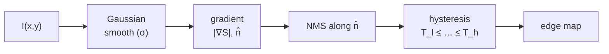

# Goal

Detect step edges in a greyscale image $I: \Omega \to \mathbb{R}$ by finding pixels that are local maxima of the smoothed gradient magnitude $|\nabla(G_\sigma * I)|$ along the gradient direction, then linking them into connected contours via hysteresis thresholding. Input: a scalar greyscale image $I$ and a smoothing scale $\sigma$. Output: a thin binary edge map in which each marked pixel is one pixel wide and carries an edge-strength value equal to $|\nabla(G_\sigma * I)|$ at that location. The filter shape is derived as the variational optimum of three criteria — detection signal-to-noise ratio ($\Sigma$), localisation precision ($\Lambda$), and single-response spacing ($x_\text{max}$) — for a step-edge profile under additive white Gaussian noise; the solution is unique up to spatial scaling.

# Algorithm

Let $I(x,y)$ denote the scalar greyscale image. Let $G_\sigma(x) = \exp(-x^2/(2\sigma^2))$ denote the 1D Gaussian with scale $\sigma$. Let $f(x)$ denote the impulse response of a candidate linear detection filter of finite support $[-W, +W]$. Let $n_0^2$ denote the mean-squared noise amplitude per unit length. Let $G(x) = A\,u_{-1}(x)$ denote the step-edge signal model, where $u_{-1}$ is the unit step (Eq. 16).

:::definition[Detection criterion ($\Sigma$)]
Signal-to-noise ratio of the filter response at the step-edge centre (Eq. 3):

$$
\Sigma(f) = \frac{\displaystyle\left|\int_{-W}^{+W} G(-x)\,f(x)\,dx\right|}{n_0\,\displaystyle\left(\int_{-W}^{+W} f^2(x)\,dx\right)^{1/2}}.
$$
:::

:::definition[Localisation criterion ($\Lambda$)]
Reciprocal of the root-mean-squared distance between the detected and true edge position (Eq. 9):

$$
\Lambda(f) = \frac{\displaystyle\left|\int_{-W}^{+W} G'(-x)\,f'(x)\,dx\right|}{n_0\,\displaystyle\left(\int_{-W}^{+W} f'^2(x)\,dx\right)^{1/2}}.
$$
:::

:::definition[Single-response constraint ($x_\text{max}$)]
Mean distance between adjacent noise response maxima, constrained to prevent multiple detections per edge (Eq. 13):

$$
x_\text{max}(f) = 2\,x_\text{zc}(f) = kW,
$$

where $k$ is a fixed fraction of the operator support and the expected number of noise maxima per support width is $N_n = 2W/x_\text{max} = 2/k$ (Eq. 14). The parameter $k$ is chosen so that the probability of a multiple response $p_m$ equals the probability of a false detection $p_f$ (Eq. 40).
:::

The composite criterion is the product $\Sigma \cdot \Lambda$ (Eq. 10), optimised subject to the constraint Eq. 13. The scale-invariance result (Eq. 21) states that for a spatially scaled filter $f_w(x) = f(x/w)$:

$$
\Sigma(f_w) = w\,\Sigma(f), \qquad \Lambda(f_w) = \tfrac{1}{w}\,\Lambda(f),
$$

so the product $\Sigma \cdot \Lambda$ is invariant under spatial scaling. The design problem therefore has a single solution shape.

Among linear filters satisfying Eq. 13, the variational optimum for a step-edge signal is unique up to spatial scaling. The constrained optimum achieves $r \leq 0.576$ (filter 6, Fig. 4). The **first derivative of a Gaussian**

$$
G'(x) = -\frac{x}{\sigma^2}\,\exp\!\left(-\frac{x^2}{2\sigma^2}\right) \quad \text{(Eq. 42)}
$$

is the efficient approximation. Its performance terms are (Eq. 43):

$$
\int_0^\infty f\,dx = 1, \quad
\int_{-\infty}^{+\infty} f^2\,dx = \frac{1}{\sqrt{2}\,\sigma}, \quad
\int_{-\infty}^{+\infty} f'^2\,dx = \frac{1}{4\sigma^3}, \quad
\int_{-\infty}^{+\infty} f''^2\,dx = \frac{1}{8\sigma^5}.
$$

These yield the composite criterion $\Sigma\Lambda = 0.92/(3\sigma)$ (Eq. 44) and multiple-response value $r \approx 0.51$ (Eq. 45) — approximately 20% below the optimal $\Sigma\Lambda$ and 10% below the constrained-optimal $r \approx 0.576$.

## Procedure

:::algorithm[Canny edge detection]
::input[Greyscale image $I$ on domain $\Omega$; smoothing scale $\sigma$; low threshold $T_l$; high threshold $T_h$.]
::output[Thin binary edge map; each marked pixel is a local gradient-magnitude maximum along the gradient direction and is connected to at least one above-$T_h$ seed.]

1. **Smooth.** Compute $S = G_\sigma * I$ via two separable 1D Gaussian convolutions — one along rows, one along columns.
2. **Gradient.** Compute $S_x = \partial S / \partial x$ and $S_y = \partial S / \partial y$ via finite differences. Magnitude: $|\nabla S| = \sqrt{S_x^2 + S_y^2}$. Unit normal: $\hat{n} = (S_x, S_y)/|\nabla S|$ (Eq. 46).
3. **Non-maximum suppression (NMS).** Retain pixel $(x,y)$ only if $|\nabla S|(x,y)$ is greater than or equal to the gradient magnitude at both sub-pixel neighbours along $\hat{n}$, i.e. at $(x,y) \pm \hat{n}$ (Eq. 47). Suppressed pixels are set to zero. This condition is equivalent to a zero-crossing of the directional second derivative $\partial^2 S / \partial \hat{n}^2$.
4. **Hysteresis double-threshold.** Pixels surviving NMS with $|\nabla S| \geq T_h$ are accepted as edge seeds. A BFS flood-fill (8-connectivity) propagates each seed through neighbouring NMS-survivors with $|\nabla S| \geq T_l$. Pixels in $[T_l, T_h)$ not reachable from any seed are discarded. The recommended ratio is $T_h/T_l \in [2, 3]$ (§VI).
:::



## Multi-scale and directional extensions

The multi-scale feature-synthesis scheme (§VIII) runs the detector at multiple values of $\sigma$ and suppresses large-$\sigma$ responses already predicted by smaller-$\sigma$ responses; most edge information is recovered at the smallest scale. The directional operators (§IX) replace the isotropic Gaussian with 6 elongated masks oriented at 30° intervals, using $d/\sigma \approx 1.4$ sample spacing and 5 samples per mask; worst-case angle error is 15° and the minimum response fall-off is approximately 85% of the on-axis maximum.

# Implementation

The four-stage pipeline in Rust:

```rust
fn canny(img: &[f32], w: usize, h: usize, sigma: f32, t_low: f32, t_high: f32) -> Vec<bool> {
    // Stage 1+2: smooth, then gradient magnitude + quantised direction (helpers hidden).
    let s = gaussian_blur(img, w, h, sigma);                  // two 1-D passes, O(N * sigma)
    let (gx, gy) = gradients(&s, w, h);                       // central differences
    let mag: Vec<f32> = gx.iter().zip(&gy).map(|(a, b)| a.hypot(*b)).collect();
    let bin: Vec<u8> = gx.iter().zip(&gy).map(|(a, b)| {
        let d = b.atan2(*a).to_degrees().rem_euclid(180.0);
        if d < 22.5 || d >= 157.5 { 0 } else if d < 67.5 { 1 }
        else if d < 112.5 { 2 } else { 3 }
    }).collect();

    // Stage 3: non-maximum suppression along the quantised gradient direction.
    let mut nms = vec![0f32; w * h];
    for y in 1..h - 1 { for x in 1..w - 1 {
        let i = y * w + x;
        let (p, q) = match bin[i] {
            0 => (mag[i + 1],     mag[i - 1]),                //   0°
            1 => (mag[i + 1 - w], mag[i - 1 + w]),            //  45°
            2 => (mag[i - w],     mag[i + w]),                //  90°
            _ => (mag[i - 1 - w], mag[i + 1 + w]),            // 135°
        };
        if mag[i] >= p && mag[i] >= q { nms[i] = mag[i]; }
    }}

    // Stage 4: hysteresis double-threshold via BFS from above-T_h seeds.
    let mut edge = vec![false; w * h];
    let mut queue = std::collections::VecDeque::new();
    for i in 0..w * h { if nms[i] >= t_high { edge[i] = true; queue.push_back(i); } }
    while let Some(i) = queue.pop_front() {
        let (x, y) = ((i % w) as i32, (i / w) as i32);
        for dy in -1i32..=1 { for dx in -1i32..=1 {
            if (dx | dy) == 0 { continue; }
            let (nx, ny) = (x + dx, y + dy);
            if nx < 0 || ny < 0 || nx >= w as i32 || ny >= h as i32 { continue; }
            let j = ny as usize * w + nx as usize;
            if !edge[j] && nms[j] >= t_low { edge[j] = true; queue.push_back(j); }
        }}
    }
    edge
}
```

The same procedure in Python using NumPy for the NMS stage:

```python
import numpy as np
from collections import deque

def canny(img, sigma, t_low, t_high):
    s = gaussian_blur(img, sigma)
    gx, gy = np.gradient(s, axis=1), np.gradient(s, axis=0)
    mag = np.hypot(gx, gy)
    angle = np.degrees(np.arctan2(gy, gx)) % 180
    nms = np.zeros_like(mag)
    bins = [
        (((angle <  22.5) | (angle >= 157.5)), (1,  0)),  #   0°
        (((angle >= 22.5) & (angle <  67.5)),  (1,  1)),  #  45°
        (((angle >= 67.5) & (angle < 112.5)),  (0,  1)),  #  90°
        (((angle >=112.5) & (angle < 157.5)),  (1, -1)),  # 135°
    ]
    for mask, (dx, dy) in bins:
        p = np.roll(mag, (-dy, -dx), axis=(0, 1))
        q = np.roll(mag, ( dy,  dx), axis=(0, 1))
        keep = mask & (mag >= p) & (mag >= q)
        nms[keep] = mag[keep]
    edge = nms >= t_high
    q = deque(zip(*np.where(edge)))
    H, W = nms.shape
    while q:
        y, x = q.popleft()
        for ny, nx in [(y+dy, x+dx) for dy in (-1,0,1) for dx in (-1,0,1) if dy or dx]:
            if 0 <= ny < H and 0 <= nx < W and not edge[ny, nx] and nms[ny, nx] >= t_low:
                edge[ny, nx] = True; q.append((ny, nx))
    return edge
```

# Remarks

- The three criteria $\Sigma$ (Eq. 3), $\Lambda$ (Eq. 9), and $x_\text{max}$ (Eq. 13) define a unique linear operator shape for the step-edge model. The first derivative of a Gaussian is the standard approximation; it achieves $\Sigma\Lambda = 0.92/(3\sigma)$ and $r \approx 0.51$ — approximately 20% below the optimal $\Sigma\Lambda$ — at a large computational saving from Gaussian separability.
- Detection and localisation trade off via $\sigma$ (Eq. 21): doubling $\sigma$ doubles $\Sigma$ and halves $\Lambda$. The product $\Sigma\Lambda$ is scale-invariant; no choice of $\sigma$ improves both simultaneously.
- The locally-straight-edge precondition fails at corners and junctions. NMS along the gradient direction $\hat{n}$ smears the response across several pixels at junctions; the exact location is not recovered.
- Single-threshold marking causes streaking: a contour fluctuating near threshold is broken into segments. Hysteresis with $T_h/T_l \in [2, 3]$ (§VI) eliminates most false breaks; a contour must drop below $T_l$, not merely below $T_h$, to be interrupted.
- The separable 2D Gaussian gives $O(N\sigma)$ smoothing cost for an $N$-pixel image, where $\sigma$ is the kernel radius in pixels (§VII).
- A single scale $\sigma$ either misses fine detail (large $\sigma$) or generates excessive false responses in textured regions (small $\sigma$). The multi-scale feature-synthesis scheme (§VIII) is noted in the paper's conclusions as an open problem; most edge information is recovered at the smallest channel.

# References

1. J. Canny. *A Computational Approach to Edge Detection.* IEEE Transactions on Pattern Analysis and Machine Intelligence, 8(6):679–698, 1986. [PDF](https://perso.limsi.fr/vezien/PAPIERS_ACS/canny1986.pdf)
