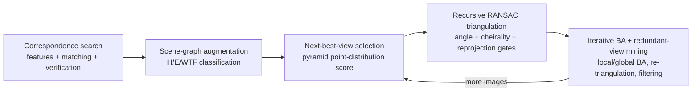

# Goal

Recover camera poses $P = \{P_c \in SE(3)\}$ and a sparse 3-D point cloud $X = \{X_k \in \mathbb{R}^3\}$ from an unordered, uncalibrated (or partially calibrated) collection of images $I = \{I_i\}$, with no prior knowledge of scene coverage or camera parameters. The method retains the standard incremental structure-from-motion pipeline — correspondence search, then incremental reconstruction by initialization, image registration, triangulation, and bundle adjustment — but replaces four of its stages with more robust or efficient variants: scene-graph augmentation after geometric verification, a next-best-view selection criterion, a recursive RANSAC-based multi-view triangulation, and an iterative bundle-adjustment/re-triangulation loop with a redundant-view-mining parameterization for dense photo collections.

# Algorithm

Let $N_F$, $N_H$, $N_E$, $N_S$ denote the inlier counts of, respectively, a fundamental-matrix, homography, essential-matrix, and similarity-transform fit between an image pair's correspondences. Let $H_F$, $E_F$, $S_F$, $S_E$ denote the corresponding decision thresholds and $\alpha_m$ the median triangulation angle of a calibrated pair. Let $T = \{T_n\}$ denote a feature track (a chain of correspondences of one 3-D point across views) with unknown inlier ratio $\varepsilon$. Let $K_l = 2^l$ denote the bin count of a next-best-view scoring grid at pyramid level $l$. Let $V_{ab}$ denote the Jaccard similarity of two images' visibility vectors.

The pipeline runs in four stages:

1. **Correspondence search** (background, unmodified): feature extraction, matching, and pairwise geometric verification produce a scene graph of putative two-view geometries.
2. **Scene-graph augmentation.** A verified pair is reclassified by fitting a homography in addition to the fundamental matrix: if $N_H / N_F < H_F$ the scene is treated as general (non-planar) rather than dominated by a single plane. For pairs with known calibration, an essential matrix is also estimated; if $N_E / N_F > E_F$ the pair is trusted as correctly calibrated, in which case the essential matrix is decomposed, points triangulated, and $\alpha_m$ computed to separate panoramic (pure-rotation) pairs — excluded from triangulation — from planar-scene pairs. A pair is discarded as a watermark/timestamp/frame (WTF) artifact if a border-restricted similarity transform explains most of the inliers: $N_S/N_F > S_F \lor N_S/N_E > S_E$.
3. **Next-best-view selection.** Each candidate image seeing $N_t > 0$ already-triangulated points is scored by discretising the image into a $K_l \times K_l$ grid at every pyramid level $l = 1, \dots, L$; each newly covered cell raises the score by $w_l = K_l^2$, and per-level scores are summed. This rewards both point count and spatial spread while remaining cheap to update incrementally.
4. **Robust multi-view triangulation.** Triangulation is posed as a RANSAC problem over a track $T$ with unknown inlier ratio $\varepsilon$: a candidate two-view triangulation $X_{ab}$ is computed by DLT from a sampled pair, accepted if its triangulation angle is sufficient and both views pass a cheirality (positive-depth) test and a reprojection-error threshold. Once a consensus set is found, its elements are removed from $T$ and the procedure recurses on the remainder, stopping once fewer than 3 elements remain — recovering independently correct points that a non-recursive method would merge into a single corrupted track.
5. **Bundle adjustment with redundant-view mining.** Standard bundle adjustment minimizes total reprojection error under a Cauchy robust loss, using a sparse direct solver for small problems and preconditioned conjugate gradients for large ones. Local BA runs after every registration; global BA runs periodically; a loop of BA, re-triangulation, and outlier filtering repeats until both quantities stop shrinking. To bound the cubic cost of the direct solver on dense photo collections, highly overlapping "unaffected" images are clustered into groups by visibility-vector Jaccard similarity $V_{ab}$ and reparameterized by one group-local pose composed with each image's fixed relative pose, reducing the effective camera count entering the direct solve.



# Implementation

The incremental registration loop, as pseudocode (the reference C++ implementation is `src/colmap/controllers/incremental_pipeline.{h,cc}` in the pinned repository below):

```python
def incremental_reconstruction(images, scene_graph):
    model = initialize_from_best_pair(scene_graph)   # two-view seed
    registered = set(model.registered_images)

    while True:
        candidates = [i for i in images if i not in registered
                      and sees_triangulated_points(i, model)]
        if not candidates:
            break

        # Stage: next-best-view selection (pyramid score, Sec. 4.2).
        next_image = max(candidates, key=lambda i: pyramid_score(i, model))

        pose = estimate_pose_pnp_ransac(next_image, model)  # PnP + RANSAC
        model.register(next_image, pose)
        registered.add(next_image)

        # Stage: recursive RANSAC triangulation (Sec. 4.3).
        triangulate_tracks(model, next_image)

        # Stage: iterative BA / re-triangulation / filtering (Sec. 4.4-4.5).
        local_bundle_adjust(model, next_image)
        if len(registered) % global_ba_interval == 0:
            group_redundant_views(model)             # Sec. 4.5, Eq. 6-7
            global_bundle_adjust(model)
            retriangulate_and_filter(model)

    return model
```

# Remarks

- Correspondence search is held constant across the paper's experiments (RootSIFT features, vocabulary-tree matching); the contributions target scene-graph augmentation and the reconstruction stage, not feature detection or matching.
- On the 17-dataset, 144,953-image benchmark, average reprojection error is consistently sub-pixel (e.g. 0.68 px on Alamo versus 1.47 px for Theia, 2.29 px for Bundler, and 0.70 px for VisualSFM); the pipeline is more than 50 times faster than Bundler and slightly slower than VisualSFM.
- On the Quad dataset with ground-truth camera positions, mean pose error is 0.85 m, versus 1.16 m (DISCO), 1.01 m (Bundler), and 0.89 m (VisualSFM).
- Recursive RANSAC triangulation on the Dubrovnik dataset nearly matches exhaustive recursive triangulation in point count and average track length (906,501 vs 894,294 points; 8.795 vs 9.003 average track length) at 10–40x fewer samples.
- Reducing the redundant-view-mining overlap threshold $V$ from 1.0 to 0.1 trades a small accuracy loss (reprojection error 0.26 → 0.29 px) for runtime savings up to 32%; quality is comparable for all $V > 0.3$ and degrades increasingly below that.
- Panoramic (pure-rotation) image pairs are explicitly excluded from triangulation to avoid erroneous triangulation angles from inaccurate pose estimates; the principal point is fixed at the image center for uncalibrated cameras because its calibration is treated as ill-posed.

# References

1. J. L. Schönberger, J.-M. Frahm. *Structure-from-Motion Revisited.* CVPR 2016. [demuc.de](https://demuc.de/papers/schoenberger2016sfm.pdf)
