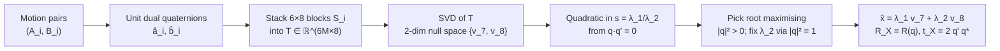

# Goal

Given $N \geq 2$ motion pairs $(A_i, B_i)$ of rigid transforms — $A_i \in SE(3)$ the gripper-to-gripper displacement between two robot stations and $B_i \in SE(3)$ the camera-to-camera displacement observed at the same pair of stations — compute the constant camera-to-gripper transform $X \in SE(3)$ that satisfies $A_i X = X B_i$ for every $i$. Rotation and translation are solved jointly in a single SVD, without the two-stage decoupling used by Tsai-Lenz.

# Algorithm

Write a rigid transform $H = \begin{bmatrix} R & t \\ 0 & 1 \end{bmatrix} \in SE(3)$ with rotation $R \in SO(3)$ and translation $t \in \mathbb{R}^3$. For a vector $v \in \mathbb{R}^3$ let $[v]_\times$ denote the skew-symmetric matrix such that $[v]_\times w = v \times w$. Let $\otimes$ denote the Hamilton product of quaternions.

Every rigid motion admits a **screw decomposition**: there exists an axis line $\ell$ in space, a rotation angle $\theta$ about that axis, and a translation distance $d$ along it (the pitch) such that $H$ is the composition of a rotation by $\theta$ around $\ell$ and a translation by $d$ along $\ell$. The line $\ell$ is specified by a unit direction $n \in S^2$ and its moment $m = p \times n$ for any point $p$ on the line.

:::definition[Unit dual quaternion $\hat q$]
A dual quaternion is a pair $\hat q = q + \varepsilon q'$ of ordinary quaternions, with $\varepsilon^2 = 0$. It is a unit dual quaternion when $|q|^2 = 1$ and $q \cdot q' = 0$. Rigid motions are in one-to-one correspondence with unit dual quaternions up to sign.

$$
q = \cos\tfrac{\theta}{2} + \sin\tfrac{\theta}{2}\,n, \qquad
q' = \tfrac{1}{2}\,t \otimes q,
$$

where $t = (0, t_x, t_y, t_z)$ is the translation as a pure quaternion.
:::

:::definition[Screw form]
A compact equivalent representation in which the dual angle $\hat\theta$ and dual axis $\hat\ell$ are Study's dual-number extensions of the real angle and axis.

$$
\hat q = \cos\tfrac{\hat\theta}{2} + \sin\tfrac{\hat\theta}{2}\,\hat\ell,
\qquad
\hat\theta = \theta + \varepsilon d, \qquad
\hat\ell = n + \varepsilon m.
$$
:::

Write $\hat a$, $\hat b$, $\hat x$ for the unit dual quaternions of $A$, $B$, $X$. The hand-eye equation $A X = X B$ lifts to

$$
\hat a\,\hat x \;=\; \hat x\,\hat b.
$$

:::definition[Screw congruence]
Corresponding hand and eye motions share the same screw angle and pitch; $X$ rotates the hand screw axis into the eye screw axis and offsets its moment.

$$
\theta_a = \theta_b, \qquad d_a = d_b.
$$
:::

The scalar parts of $\hat a$ and $\hat b$ coincide because they encode $\cos(\hat\theta/2)$. Split each quaternion into scalar and vector imaginary parts: $q = (q_0, \mathbf q)$, and write $\hat a = (a_0, \mathbf a) + \varepsilon(a_0', \mathbf a')$, similarly for $\hat b$. Subtracting $\hat x \hat b$ from $\hat a \hat x$ and keeping only the imaginary parts yields six scalar equations per motion pair, linear in the eight unknowns $(q_0, \mathbf q, q_0', \mathbf q')$.

:::definition[Hand-eye constraint matrix]
For each motion pair $(A_i, B_i)$, the 6 × 8 matrix below annihilates the unknown dual quaternion of $X$.

$$
S_i \;=\;
\begin{bmatrix}
\mathbf a_i - \mathbf b_i & [\mathbf a_i + \mathbf b_i]_\times & \mathbf 0 & 0_{3 \times 3} \\
\mathbf a'_i - \mathbf b'_i & [\mathbf a'_i + \mathbf b'_i]_\times & \mathbf a_i - \mathbf b_i & [\mathbf a_i + \mathbf b_i]_\times
\end{bmatrix}.
$$

$$
S_i \begin{pmatrix} q_0 \\ \mathbf q \\ q'_0 \\ \mathbf q' \end{pmatrix} = \mathbf 0_6.
$$
:::

Stacking $M$ motion pairs gives a $6M \times 8$ system $T = [S_1^\top \ldots S_M^\top]^\top$ with $T\,\hat x = 0$. Each pair contributes a rank-6 block in generic position; two pairs with non-parallel screw axes are enough to cut the null space of $T$ down to two dimensions. The two vectors $v_7, v_8$ spanning that null space are the right singular vectors of $T$ associated with the two zero singular values.

The physical solution is a linear combination $\hat x = \lambda_1 v_7 + \lambda_2 v_8$ subject to the two dual-quaternion unit constraints:

$$
|q|^2 = 1, \qquad q \cdot q' = 0.
$$

Split each $v_k$ into its $q$-half $u_k \in \mathbb{R}^4$ (rows 1–4) and its $q'$-half $w_k \in \mathbb{R}^4$ (rows 5–8). The second constraint is quadratic in $s = \lambda_1 / \lambda_2$:

$$
(u_1 \cdot w_1)\,s^2 + (u_1 \cdot w_2 + u_2 \cdot w_1)\,s + (u_2 \cdot w_2) = 0.
$$

Of its two real roots, pick the one that maximises $s^2\,|u_1|^2 + 2s\,u_1 \cdot u_2 + |u_2|^2$; the reciprocal square root of that value fixes $\lambda_2$, and $\lambda_1 = s\,\lambda_2$ follows.

:::algorithm[Daniilidis dual-quaternion hand-eye]
::input[Motion pairs $\{(A_i, B_i)\}_{i=1}^{M}$ with $M \geq 2$ and non-parallel screw axes across pairs.]
::output[Camera-to-gripper transform $X = \begin{bmatrix} R_X & t_X \\ 0 & 1 \end{bmatrix}$.]

1. Convert each $A_i$, $B_i$ to its unit dual quaternion $\hat a_i = (a_{0,i}, \mathbf a_i) + \varepsilon(a'_{0,i}, \mathbf a'_i)$ and $\hat b_i$.
2. Assemble $S_i$ from the imaginary parts $(\mathbf a_i, \mathbf a'_i, \mathbf b_i, \mathbf b'_i)$ and stack into $T \in \mathbb{R}^{6M \times 8}$.
3. Compute the SVD $T = U \Sigma V^\top$; take $v_7, v_8$ as the last two columns of $V$.
4. Split each $v_k$ into $u_k, w_k \in \mathbb{R}^4$. Solve the quadratic $(u_1 \cdot w_1) s^2 + (u_1 \cdot w_2 + u_2 \cdot w_1) s + (u_2 \cdot w_2) = 0$ for $s$.
5. Choose the root maximising $s^2 |u_1|^2 + 2 s\,u_1 \cdot u_2 + |u_2|^2$; set $\lambda_2 = (s^2 |u_1|^2 + 2 s\,u_1 \cdot u_2 + |u_2|^2)^{-1/2}$, $\lambda_1 = s\,\lambda_2$.
6. Assemble $q = \lambda_1 u_1 + \lambda_2 u_2$ and $q' = \lambda_1 w_1 + \lambda_2 w_2$; recover $R_X = R(q)$ and $t_X = 2\,(q' \otimes q^*)_{\text{vec}}$.
:::



# Implementation

The per-pair block $S_i$ of Eq. 31 in Rust. A stacked $T \in \mathbb{R}^{6M \times 8}$ is filled by calling `fill_block` for every motion pair.

```rust
use nalgebra::{DMatrix, Matrix3, Vector3};

fn skew(v: &Vector3<f64>) -> Matrix3<f64> {
    Matrix3::new(0.0, -v.z,  v.y,
                 v.z,  0.0, -v.x,
                -v.y,  v.x,  0.0)
}

fn fill_block(t_mat: &mut DMatrix<f64>, k: usize,
              a: Vector3<f64>, ap: Vector3<f64>,
              b: Vector3<f64>, bp: Vector3<f64>)
{
    let (d, dp) = (a - b, ap - bp);
    let (sx, spx) = (skew(&(a + b)), skew(&(ap + bp)));
    t_mat.fixed_view_mut::<3, 1>(6 * k,     0).copy_from(&d);
    t_mat.fixed_view_mut::<3, 3>(6 * k,     1).copy_from(&sx);
    t_mat.fixed_view_mut::<3, 1>(6 * k + 3, 0).copy_from(&dp);
    t_mat.fixed_view_mut::<3, 3>(6 * k + 3, 1).copy_from(&spx);
    t_mat.fixed_view_mut::<3, 1>(6 * k + 3, 4).copy_from(&d);
    t_mat.fixed_view_mut::<3, 3>(6 * k + 3, 5).copy_from(&sx);
}
```

Null-space resolution after $V = \mathrm{svd}(T).V$. Let $v_7, v_8$ be the right singular vectors at the two smallest singular values; split each into an upper $q$-half and lower $q'$-half of length 4.

```rust
use nalgebra::{SVector, Vector4};

fn resolve(v7: &SVector<f64, 8>, v8: &SVector<f64, 8>)
    -> (Vector4<f64>, Vector4<f64>)
{
    let uq:  Vector4<f64> = v7.fixed_rows::<4>(0).into_owned();
    let uqp: Vector4<f64> = v7.fixed_rows::<4>(4).into_owned();
    let wq:  Vector4<f64> = v8.fixed_rows::<4>(0).into_owned();
    let wqp: Vector4<f64> = v8.fixed_rows::<4>(4).into_owned();

    let (a, b, c) = (uq.dot(&uqp),
                     uq.dot(&wqp) + wq.dot(&uqp),
                     wq.dot(&wqp));
    let disc = (b * b - 4.0 * a * c).max(0.0).sqrt();
    let norm = |s: f64| s * s * uq.dot(&uq)
                        + 2.0 * s * uq.dot(&wq)
                        + wq.dot(&wq);
    let s = [(-b + disc) / (2.0 * a), (-b - disc) / (2.0 * a)]
        .into_iter()
        .max_by(|x, y| norm(*x).partial_cmp(&norm(*y)).unwrap())
        .unwrap();
    let lam2 = norm(s).sqrt().recip();
    let lam1 = s * lam2;
    (lam1 * uq + lam2 * wq, lam1 * uqp + lam2 * wqp)
}
```

The rigid transform is then $R_X = R(q)$ and $t_X = 2\,(q' \otimes q^*)_{\text{vec}}$ by standard quaternion-to-matrix and quaternion multiplication.

# Remarks

- Joint rotation-and-translation solution avoids the error propagation of two-stage decoupled solvers: any bias in the rotation estimate of Tsai-Lenz feeds directly into the translation residual through the $R_X T_{c_{ij}}$ term, while here rotation and translation are co-estimated from the same null space.
- Minimum two motion pairs; uniqueness requires the screw axes of the two (or more) pairs to be non-parallel. Degenerates when all motions share a common screw axis (planar or pure-rotation trajectories) — $T$ loses rank and the null space grows beyond two dimensions.
- Computational cost is dominated by one SVD of a $6M \times 8$ matrix, $O(M)$ in the number of motion pairs.
- The root-selection step is a standard dual-quaternion trick: of the two real roots of the quadratic in $s$, only one yields a non-degenerate $|q|^2$ under the $|q|^2 = 1$ normalisation. A purely imaginary or negative value flags either a sign flip on one of the input quaternions or ill-conditioned motions.
- Unit dual quaternions are a double cover of $SE(3)$: $\hat x$ and $-\hat x$ represent the same rigid transform. The solver returns whichever sign the SVD produces; downstream code should canonicalise by requiring $q_0 \geq 0$.

# References

1. K. Daniilidis. *Hand-Eye Calibration Using Dual Quaternions.* International Journal of Robotics Research 18(3):286–298, 1999. [doi](https://doi.org/10.1177/02783649922066213)
2. R. Y. Tsai and R. K. Lenz. *A new technique for fully autonomous and efficient 3D robotics hand/eye calibration.* IEEE Transactions on Robotics and Automation 5(3):345–358, 1989. [pdf](https://kmlee.gatech.edu/me6406/handeye.pdf)
3. Y. C. Shiu and S. Ahmad. *Calibration of wrist-mounted robotic sensors by solving homogeneous transform equations of the form AX=XB.* IEEE Transactions on Robotics and Automation 5(1):16–29, 1989. [doi](https://doi.org/10.1109/70.88014)
