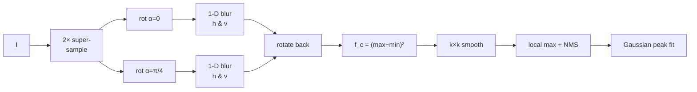

# Goal

Detect the inner corners of a checkerboard pattern in a grayscale image and return their subpixel coordinates. Input: an image $I : \Omega \to \mathbb{R}$ on pixel domain $\Omega \subset \mathbb{Z}^2$. Output: a set of subpixel pixel locations $\{(x_i^\ast, y_i^\ast)\}$ marking point-symmetric X-junctions of bright and dark quadrants. The response is built from 1-D line integrals rather than gradients, so it is robust to image noise, low contrast, and moderate blur; accuracy approaches $1/100$ pixel on crisp inputs.

# Algorithm

Let $I : \Omega \to \mathbb{R}$ denote the grayscale image.
Let $(x, y) \in \Omega$ denote pixel coordinates.
Let $\alpha \in [0, \pi)$ denote a ray angle.
Let $m$ denote the half-length of the line-integral window, in pixels.
Let $\mathcal{A} = \{0,\, \pi/4,\, \pi/2,\, 3\pi/4\}$ denote the discrete angle set.
Let $\mathrm{rot}_\beta$ denote rotation of an image about its centre by angle $\beta$ with bilinear sampling.

:::definition[Localized Radon transform]
Directional line integral through $(x, y)$ at angle $\alpha$, of half-length $m$:

$$
R_f^{\text{local}}[x, y, \alpha] = \sum_{k=-m}^{m} I\bigl(x + k \cos\alpha,\; y + k \sin\alpha\bigr).
$$
:::

:::definition[Corner response]
Squared gap between the brightest and darkest directional integrals over $\mathcal{A}$:

$$
f_c[x, y] = \Bigl[\,\max_{\alpha \in \mathcal{A}} R_f^{\text{local}}[x, y, \alpha] \;-\; \min_{\alpha \in \mathcal{A}} R_f^{\text{local}}[x, y, \alpha]\,\Bigr]^{2}.
$$

At a point-symmetric X-junction the integral along a centreline through two bright sectors is maximal and along a centreline through two dark sectors is minimal; the gap is squared to keep the response non-negative and to sharpen the local maximum.
:::

:::definition[Box-filter approximation]
A 1-D horizontal box blur of half-width $m$:

$$
f_{\text{blur}}[x, y] = \frac{1}{2m + 1} \sum_{i=-m}^{m} I[x + i,\, y].
$$

Each line integral is obtained by rotating the image into alignment with the $x$-axis, blurring horizontally, and rotating back:

$$
f_r[x, y, \alpha] \;\propto\; \mathrm{rot}_{\alpha}\!\bigl(f_{\text{blur}}(\mathrm{rot}_{-\alpha}(I))\bigr)[x, y].
$$

Restricting $\alpha$ to $\mathcal{A}$ halves the number of rotations: the image is rotated once for $\alpha = 0$ and once for $\alpha = \pi/4$; a horizontal box blur on each copy yields the integrals at $\{0, \pi/4\}$, a vertical box blur yields the integrals at $\{\pi/2, 3\pi/4\}$.
:::

## Procedure

:::algorithm[Localized Radon corner detection]
::input[Grayscale image $I$; line half-length $m$; response-smoothing half-size $k$; response threshold $\tau$.]
::output[Set of subpixel corner locations $\{(x_i^\ast, y_i^\ast)\}$.]

1. Supersample $I$ by a factor of two with bilinear interpolation to reduce aliasing in the rotated copies.
2. Produce two rotated copies: $I_0 = I$ and $I_{\pi/4} = \mathrm{rot}_{-\pi/4}(I)$.
3. Apply a $1 \times (2m+1)$ box blur to each copy along $x$ and a $(2m+1) \times 1$ box blur along $y$, producing four directional blurs corresponding to angles $\{0,\, \pi/2,\, \pi/4,\, 3\pi/4\}$.
4. Rotate each blurred copy back to the original frame, obtaining $f_r[\,\cdot\,,\,\alpha]$ for $\alpha \in \mathcal{A}$.
5. Compute $f_c[x, y] = (\max_\alpha f_r - \min_\alpha f_r)^2$ pixelwise.
6. Smooth $f_c$ with a $k \times k$ box filter to suppress discretisation noise.
7. Detect local maxima of the smoothed $f_c$; discard maxima with $f_c < \tau$ and apply non-maximum suppression.
8. Subpixel refinement: fit a Gaussian peak to $f_c$ in a small neighbourhood of each retained maximum; downscale coordinates by two to undo the supersampling.
:::



# Implementation

The four-image combination in Rust, given the rotated-back directional blurs $f_r$ stacked plane-wise:

```rust
fn response_map(fr: [&[f32]; 4], n: usize) -> Vec<f32> {
    let mut fc = vec![0.0f32; n];
    for p in 0..n {
        let v = [fr[0][p], fr[1][p], fr[2][p], fr[3][p]];
        let mut lo = v[0];
        let mut hi = v[0];
        for &x in &v[1..] {
            if x < lo { lo = x; }
            if x > hi { hi = x; }
        }
        let d = hi - lo;
        fc[p] = d * d;
    }
    fc
}

fn line_integrals(i: &[f32], w: usize, h: usize, m: i32) -> [Vec<f32>; 4] {
    let r0 = i.to_vec();
    let r1 = rotate(i, w, h, -std::f32::consts::FRAC_PI_4);
    let bx0 = box_blur_h(&r0, w, h, m);
    let by0 = box_blur_v(&r0, w, h, m);
    let bx1 = box_blur_h(&r1, w, h, m);
    let by1 = box_blur_v(&r1, w, h, m);
    [
        bx0,
        by0,
        rotate(&bx1, w, h, std::f32::consts::FRAC_PI_4),
        rotate(&by1, w, h, std::f32::consts::FRAC_PI_4),
    ]
}
```

`rotate` is an affine resampler with bilinear interpolation about the image centre; `box_blur_h` and `box_blur_v` are separable $(2m+1)$-tap box filters evaluated with a running-sum to stay $O(|\Omega|)$ independently of $m$. The response map is the output of `response_map` applied to the four planes returned by `line_integrals`.

# Remarks

- Complexity: $O(|\Omega|)$ per image. Rotations are $O(|\Omega|)$ with bilinear sampling; box blurs are $O(|\Omega|)$ via running sums; the per-pixel max/min over four values is constant work. Supersampling multiplies $|\Omega|$ by four.
- The four-angle discretisation is justified by point symmetry: $R_f^{\text{local}}[x, y, \alpha]$ at a true X-junction is a smooth, near-sinusoidal function of $\alpha$ with period $\pi$, and the max/min separation is well approximated by sampling two orthogonal pairs $\{0, \pi/2\}$ and $\{\pi/4, 3\pi/4\}$. The approximation degrades when the junction's centreline angle falls midway between sample angles.
- Kernel half-length $m$ encodes the expected radius of the corner support. Typical values are $m \in \{1, \dots, 4\}$ (i.e.\ $1 \times 3$ to $1 \times 9$ blurs). A mismatched $m$ either truncates the line integral inside a single sector (small $m$) or crosses into neighbouring junctions (large $m$).
- The detector is noise-robust because box-filter sums of intensities attenuate additive image noise by a factor proportional to $\sqrt{2m+1}$, whereas gradient-based detectors amplify the same noise through differentiation.
- Skipping the $2\times$ supersample roughly doubles the subpixel error but roughly halves the runtime; the trade-off is linear in pixel count.
- The response map also yields per-corner orientation: fitting a subpixel peak to $f_r[x^\ast, y^\ast, \alpha]$ over $\alpha$ recovers both centreline angles, which a downstream grid-growing step can use to seed neighbour search.

# References

1. A. Duda, U. Frese. *Accurate Detection and Localization of Checkerboard Corners for Calibration.* British Machine Vision Conference (BMVC), 2018. [PDF](https://bmvc2018.org/contents/papers/0508.pdf)
2. E. D. Sinzinger. *A model-based approach to junction detection using radial energy.* Pattern Recognition, 2008. DOI: [10.1016/j.patcog.2007.06.032](https://doi.org/10.1016/j.patcog.2007.06.032)
3. C. Harris, M. J. Stephens. *A Combined Corner and Edge Detector.* Alvey Vision Conference, 1988. DOI: [10.5244/c.2.23](https://doi.org/10.5244/c.2.23)
4. M. Rufli, D. Scaramuzza, R. Siegwart. *Automatic detection of checkerboards on blurred and distorted images.* IEEE/RSJ IROS, 2008. DOI: [10.1109/IROS.2008.4650703](https://doi.org/10.1109/IROS.2008.4650703)
