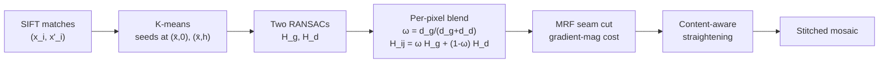

# Goal

Stitch two or more overlapping outdoor photographs of a scene that fits a two-dominant-plane model — a distant background plane (sky, far buildings) plus a ground plane sweeping out from the camera — captured by an arc of camera positions (parallax present, not pure rotation). Output: a seamless panoramic mosaic. The defining contribution is a per-pixel blend of two homographies, one fit to each plane via spatial clustering of SIFT correspondences, replacing the single global homography that produces visible tears whenever the scene violates the planar-or-rotational assumption.

# Algorithm

Let $\{(x_i, x'_i)\}_{i=1}^{N}$ denote SIFT correspondences across two adjacent images of size $w \times h$. The pipeline runs in four stages.

**Stage 1 — spatial clustering.** Partition the correspondence set into a ground group $G_g$ and a distant group $G_d$ by $K$-means on the source-image positions, with seeds placed at $(\bar x, 0)$ for the distant cluster and $(\bar x, h)$ for the ground cluster (Eq. 2). $\bar x$ is the mean horizontal coordinate of all matches. The vertical-axis bias encodes the assumption that distant features cluster near the top of the image and ground features near the bottom.

**Stage 2 — per-group RANSAC.** Fit a homography $H_g$ to $G_g$ and $H_d$ to $G_d$ independently by RANSAC, with a 95% consensus threshold per group. Each fit returns a refined inlier subset $G'_g$ and $G'_d$.

**Stage 3 — per-pixel blending.** At each pixel $(i, j)$ in the source image, compute reciprocal-Euclidean distances $d_g$ to the nearest point in $G'_g$ and $d_d$ to the nearest point in $G'_d$. The blend weight and warp are:

$$
\omega_{ij} = \frac{d_g}{d_g + d_d}, \qquad H_{ij} = \omega_{ij}\,H_g + (1 - \omega_{ij})\,H_d.
\quad \text{(Eq. 3, Eq. 1)}
$$

Pixels near ground-plane features warp predominantly by $H_g$ ($\omega \to 1$ at inlier sites); pixels near distant features warp by $H_d$ ($\omega \to 0$). Pixels equidistant from both groups receive $\omega = 0.5$.

**Stage 4 — post-processing.** The element-wise convex combination $\omega_{ij}\,H_g + (1-\omega_{ij})\,H_d$ is in general **not** a valid rank-3 projective matrix, so the resulting warp can produce a quadratic ("bow") deformation on straight lines. A content-aware straightening step tessellates the panorama into a polygonal mesh and minimises a weighted similarity-deformation energy that penalises non-similarity transforms on high-gradient cells and bending of vertical edges (Eq. 8–12). A graph-cut MRF seam cut on the gradient-magnitude data cost (Eq. 5–7, $\lambda = 2$) followed by a 16-pixel alpha-blending band hides residual colour discontinuities.

# Remarks

- **Two-plane assumption is hard.** The K-means seed placement ($y = 0$ vs $y = h$) and the RANSAC step both assume the scene segregates into a top-distant and a bottom-ground band. Mid-ground structures (a tree at medium depth, a person standing in front of a building) belong to neither cluster — the paper's own Figure 7 shows the failure case explicitly. APAP generalises this from two clusters to a continuous grid of per-cell homographies, which can — in principle — fit a distinct local transform around mid-ground structures without explicit segmentation.
- **Arithmetic mean is not a homography.** Eq. 1 blends two valid homographies element-wise, yielding a $3 \times 3$ matrix that is not in general rank-3 with the projective normalisation. The paper acknowledges this (§6: "our approach is not based on any particular camera model and therefore has no physical meaning regarding light transport"). [APAP](/atlas/apap-image-stitching) instead solves a weighted DLT per cell — the per-cell result is always a proper projective matrix.
- **Why the straightening step exists.** The element-wise interpolation of two projectively-distinct homographies produces a quadratic warp in the blended region, visible as a "bow" on straight architectural features. The content-aware straightening (Section 4.2) tessellates the panorama into a polygonal mesh and minimises a weighted distortion energy with vertical-edge constraints — costly (5–10 s solver time per panorama) but necessary for visually clean output. APAP avoids this need because per-cell projective warps preserve straight lines locally by construction.
- **Multi-image concatenation is non-compositional.** Single homographies compose by matrix multiplication, but the dual-homography blend does not. Concatenating $I_2$ to $I_1$ to $I_0$ requires a special boundary-point inverse-distance weighting for $I_2$'s non-overlapping regions with $I_1$ (Eq. 4) — extrapolating from the boundary of the previous image's transform. This makes long panoramas (>5 images) progressively brittle.
- **When to use Gao over APAP.** Gao requires no parameter tuning beyond RANSAC thresholds and runs faster (no per-cell SVD). For simple two-plane scenes where the ground-vs-sky separation is reliable, the simpler pipeline is easier to validate and debug. APAP becomes strictly preferable when the two-plane assumption is uncertain, when more than two depth layers are present, or when the scene has substantial mid-ground structure.
- **No camera-model constraint.** Like APAP, Gao is image-plane only — no calibration, no camera model. The blend weight is purely spatial (image-coordinate distance), not depth-aware. Depth-aware stitching with explicit disparity (Reliefmosaic, multi-plane scene reconstruction) is a separate lineage.

## When to choose Gao DHW over APAP

[APAP](/atlas/apap-image-stitching) (Zaragoza 2013) is the direct successor to Gao DHW (2011), generalising the two-cluster RANSAC + spatial weight to a continuous grid of per-cell Moving-DLT homographies. The progression is conceptually clean: from a fixed count of two homographies to a continuous field of them.

| | Gao DHW (2011) | APAP (2013) |
|---|---|---|
| Homography count | exactly 2 (ground + distant) | per-cell grid (default 100×100) |
| Per-cell weighting | reciprocal distance to two clusters | Gaussian kernel on every correspondence |
| Cluster discovery | spatial K-means seeded at top/bottom | none — continuous over correspondences |
| Per-cell solve | RANSAC homography per group | weighted DLT per cell |
| Result is a valid homography | no (element-wise convex combination) | yes (each cell is a proper rank-3 projective matrix) |
| Tuning | RANSAC thresholds only | $\sigma$ and $\gamma$ for the Moving-DLT kernel |

Choose Gao DHW when the scene cleanly fits the two-plane model (outdoor panoramas with visible ground and sky), the camera arc is moderate, and simplicity matters more than mathematical purity — the algorithm is an order of magnitude faster than APAP, has fewer parameters to tune, and is much easier to debug visually (the K-means split is inspectable). Choose APAP when the two-plane assumption is uncertain, the scene has substantial mid-ground structure, or you need a guaranteed-valid projective warp at every pixel — Gao's element-wise blended matrix can produce subtle folding artefacts in extrapolation regions, while APAP's per-cell DLT cannot by construction.

# References

1. J. Gao, S. J. Kim, M. S. Brown. *Constructing Image Panoramas Using Dual-Homography Warping.* IEEE CVPR 2011, pp. 49–56. [pdf](http://www.cse.yorku.ca/~mbrown/pdf/cvpr_dualhomography2011.pdf)
2. J. Zaragoza, T.-J. Chin, M. S. Brown, D. Suter. *As-Projective-As-Possible Image Stitching with Moving DLT.* IEEE CVPR 2013. (Generalises two clusters to a continuous grid.)
3. W.-Y. Lin, S. Liu, Y. Matsushita, T.-T. Ng, L.-F. Cheong. *Smoothly Varying Affine Stitching.* IEEE CVPR 2011. (Contemporary alternative using affine instead of homography.)
4. M. Brown, D. G. Lowe. *Automatic Panoramic Image Stitching using Invariant Features.* International Journal of Computer Vision 74(1):59–73, 2007. (AutoStitch — single-homography baseline.)
5. R. Hartley. *In Defense of the Eight-Point Algorithm.* IEEE TPAMI 19(6):580–593, 1997. (Hartley normalisation; reused before each per-group DLT.)
