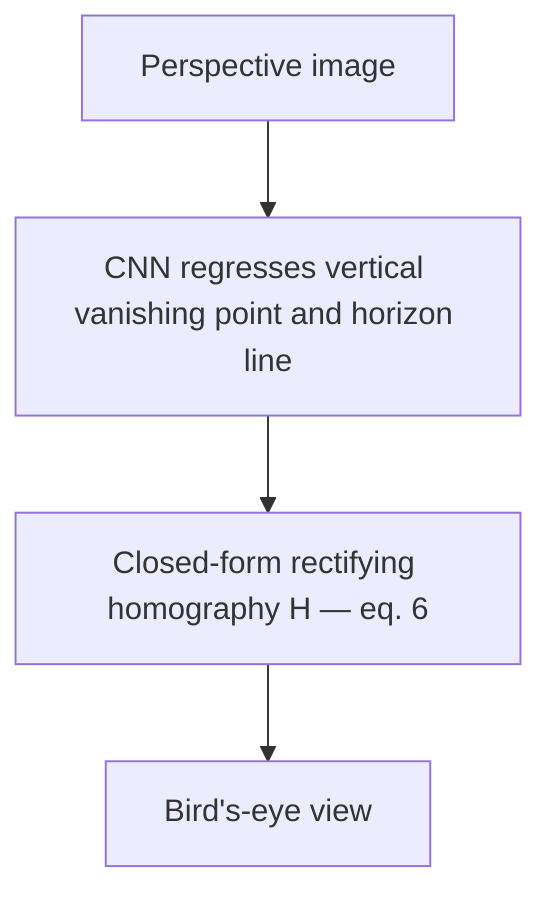

# Goal

Rectify a single monocular perspective image to a geometrically correct bird's-eye (overhead) view. Input: one RGB image of a scene containing a dominant flat ground plane; no calibration target and no prior camera calibration. Output: a $3 \times 3$ homography $H$ that warps the image so that ground-plane geometry is metrically correct up to an overall scale. The homography is constructed in closed form from two projective entities — the vertical vanishing point $v_z$ and the horizon line $h$ — regressed by a CNN. No correspondence solve, no DLT, no SVD, and no RANSAC is performed; the entire geometric construction is algebraic once the two entities are known.

# Algorithm

Let $I$ denote the input perspective image.
Let $H$ denote the $3 \times 3$ rectifying homography mapping $I$ to the bird's-eye view.
Let $K$ denote the $3 \times 3$ camera calibration matrix.
Let $v_z$ denote the vertical vanishing point (image of the world vertical direction).
Let $h$ denote the horizon line with homogeneous line coefficients $(a, b, c)$, satisfying $ax + by + c = 0$.
Let $\omega$ denote the image of the absolute conic, $\omega = (KK^T)^{-1}$.
Let $f$ denote the camera focal length in pixels.
Let $w$ and $h_\mathrm{im}$ denote the image width and height in pixels.
Let $\theta_z$ denote the camera roll angle.
Let $\theta_x$ denote the camera tilt angle.
Let $R_\mathrm{roll}$ denote the rotation matrix removing camera roll.
Let $R_\mathrm{tilt}$ denote the rotation matrix removing camera tilt.
Let $R_\mathrm{align}$ denote the optional rotation aligning the principal horizontal direction to a coordinate axis.
Let $T_\mathrm{scene}$ denote the translation matrix mapping the warped corners to the output canvas.
Let $H_\mathrm{rot}$ denote the intermediate rotational homography.
Let $b$ denote the number of regression bins per scalar ($b = 500$).
Let $c$ denote the number of top bins used in the weighted decode ($c = 11$).
Let $r$ denote the stereographic sphere radius.

:::definition[Calibration matrix]
Under the simplified pinhole model (square pixels, principal point at the image centre), the calibration matrix is:

$$
K = \begin{pmatrix} f & 0 & w/2 \\ 0 & f & h_\mathrm{im}/2 \\ 0 & 0 & 1 \end{pmatrix}
$$

(eq. 3). Focal length $f$ is the single unknown; it is recovered from the horizon and vanishing point.
:::

:::definition[Focal-length recovery via the absolute conic]
The image of the absolute conic $\omega = (KK^T)^{-1}$ satisfies the linear constraint

$$
h = \omega\, v_z
$$

(eq. 4). Given $v_z$ and $h$, this equation determines $f$ in closed form under the calibration model above.
:::

:::definition[Intermediate rotational homography]
The combined roll-and-tilt correction is the homography

$$
H_\mathrm{rot} = K R_\mathrm{tilt} K^{-1} R_\mathrm{roll}
$$

(eq. 5). It maps image pixels to a roll- and tilt-corrected overhead coordinate frame.
:::

:::definition[Rectifying homography]
The full bird's-eye-view homography is

$$
H = R_\mathrm{align}\, T_\mathrm{scene}\, K R_\mathrm{tilt} K^{-1} R_\mathrm{roll}
$$

(eq. 6). $T_\mathrm{scene}$ translates the warped image so all corners lie in the positive canvas region; $R_\mathrm{align}$ is optional.
:::

## Procedure

:::algorithm[Geometric bird's-eye-view rectification]
::input[Perspective RGB image $I$ of width $w$ and height $h_\mathrm{im}$]
::output[Warped bird's-eye-view image; rectifying homography $H$]

1. Regress $v_z$ and $h$ from $I$ using the CNN (four scalars total, decoded from the stereographic-sphere representation).
2. Recover $f$ and form $K$ (eq. 3) by solving $h = \omega v_z$ with $\omega = (KK^T)^{-1}$ (eq. 4).
3. Compute roll $\theta_z = \arctan(-a/b)$ from the horizon line $ax + by + c = 0$; form $R_\mathrm{roll}$.
4. Compute tilt $\theta_x = \tfrac{\pi}{2} - \arctan(v_z / f)$, where $v_z$ here is the perpendicular distance from the vertical vanishing point to the principal point; form $R_\mathrm{tilt}$.
5. Form the intermediate rotational homography $H_\mathrm{rot} = K R_\mathrm{tilt} K^{-1} R_\mathrm{roll}$ (eq. 5).
6. Map the four image corners through $H_\mathrm{rot}$ to determine the bounding box of the warped canvas; build $T_\mathrm{scene}$ to shift all corners into the positive quadrant.
7. Compose the rectifying homography $H = R_\mathrm{align}\, T_\mathrm{scene}\, K R_\mathrm{tilt} K^{-1} R_\mathrm{roll}$ (eq. 6).
8. Warp $I$ by $H$ (bilinear interpolation) to produce the bird's-eye-view image.
:::

## CNN regression target

The vertical vanishing point $v_z$ and the horizon line $h$ may lie at or near the image boundary or entirely outside the image frame. Representing them as raw pixel coordinates is numerically unsafe when values are large or infinite.

**Stereographic-sphere encoding.** A projective point or line that may be at infinity is mapped to a finite scalar pair in $[-r, r]$ via a stereographic construction: the point is first lifted onto a sphere of radius $r$ centred at $(0, 0, r)$, and then projected orthogonally back to the plane. A line is encoded via the normal to the plane it defines with the sphere centre. The resulting four scalars — two for $v_z$, two for $h$ — are bounded regardless of the projective position of the geometric entity. This is the regression target the CNN is trained to predict.

**Regression-by-classification head.** Each of the four scalars is discretised into $b = 500$ equal-width bins spanning the encoded range $[-r, r]$. The CNN head predicts a softmax distribution over these $500$ bins. The decoded scalar is the probability-weighted average of the top $c = 11$ bins by softmax probability. This decoding strategy reduces effective quantisation error relative to hard argmax and smooths the output without requiring a separate regression branch.

If focal length $f$ is known from prior calibration, only the horizon line $h$ (two scalars) is needed; the tilt and roll are then fully determined from $h$ alone.

# Implementation

Given the focal length $f$ recovered from $h = \omega v_z$ (eq. 4), the closed-form homography construction in Rust:

```rust
use nalgebra::Matrix3;

pub fn bev_homography(
    vz: (f64, f64),            // vertical vanishing point, pixels
    horizon: (f64, f64, f64),  // horizon line (a, b, c): a·x + b·y + c = 0
    f: f64,                    // focal length, recovered from h = ω·v_z (eq. 4)
    w: f64,
    h: f64,
) -> Matrix3<f64> {
    let (a, b, _) = horizon;

    // eq. 3 — calibration matrix K (square pixels, centred principal point)
    #[rustfmt::skip]
    let k = Matrix3::new(f,   0.0, w / 2.0,
                         0.0, f,   h / 2.0,
                         0.0, 0.0, 1.0);
    let k_inv = k.try_inverse().expect("K is invertible for f > 0");

    // Step A — roll θ_z from the horizon line
    let tz = (-a).atan2(b);
    #[rustfmt::skip]
    let r_roll = Matrix3::new(tz.cos(), -tz.sin(), 0.0,
                              tz.sin(),  tz.cos(), 0.0,
                              0.0,       0.0,      1.0);

    // Step B — tilt θ_x from the vertical vanishing point
    let d = (vz.0 - w / 2.0).hypot(vz.1 - h / 2.0);
    let tx = std::f64::consts::FRAC_PI_2 - d.atan2(f);
    #[rustfmt::skip]
    let r_tilt = Matrix3::new(1.0, 0.0,       0.0,
                              0.0, tx.cos(), -tx.sin(),
                              0.0, tx.sin(),  tx.cos());

    // eq. 5 — intermediate rotational homography
    let h_rot = k * r_tilt * k_inv * r_roll;

    // eq. 6 — H = R_align · T_scene · H_rot; T_scene shifts the warped corners
    // into the canvas, R_align is optional. Identity placeholders shown here.
    let (t_scene, r_align) = (Matrix3::<f64>::identity(), Matrix3::<f64>::identity());
    r_align * t_scene * h_rot
}
```

The CNN front-end — a standard image-classification trunk followed by the regression-by-classification head — is a conventional network and is not shown; the geometric construction above is the method's specific content.

# Remarks

- The closed-form construction is $O(1)$ per image given the CNN output; the dominant cost is the single CNN forward pass.
- The method parameterises the BEV homography with 4 scalars for uncalibrated cameras, or 2 scalars when $f$ is known, versus 8 degrees of freedom for a general homography.
- Focal-length recovery from $h = \omega v_z$ (eq. 4) is ill-conditioned when $v_z$ approaches the horizon, i.e. when the camera tilt $\theta_x \to 0$. Wide fields of view also amplify focal-length error due to the steep slope of $f \propto 1 / \tan(\gamma/2)$ near $\gamma = \pi/2$.
- A non-planar ground surface breaks the bird's-eye-view assumption; objects above the ground plane (vehicles, people) are not correctly rectified even when the ground plane is correctly handled.
- The stereographic-sphere regression target is not image-observable: the encoded scalars do not correspond to any directly detectable feature in the image, a limitation noted in the paper.
- The output is metric only up to an overall scale; one known reference distance is required for absolute measurements.

# References

1. S. A. Abbas, A. Zisserman. *A Geometric Approach to Obtain a Bird's Eye View From an Image.* ICCV Workshops, 2019. [arXiv 1905.02231](https://arxiv.org/abs/1905.02231)
2. K. He, X. Zhang, S. Ren, J. Sun. *Deep Residual Learning for Image Recognition.* CVPR, 2016. [arXiv 1512.03385](https://arxiv.org/abs/1512.03385)
3. R. Hartley, A. Zisserman. *Multiple View Geometry in Computer Vision.* 2nd ed., Cambridge University Press, 2003.



<!-- TODO figure: geometric scheme — perspective image with the horizon line h and vertical vanishing point v_z marked, mapped to the rectified overhead grid -->
