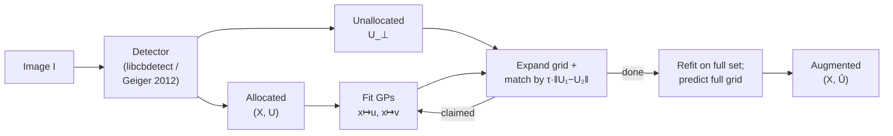

# Goal

Augment a partially-detected checkerboard with the corners that the upstream structure-recovery step did not place in the grid, with corners hidden by occlusion, and with corners outside the image. Inputs: a set of inner corners delivered by an external detector, given as paired image coordinates $\{\mathbf{u}_i\} \subset \mathbb{R}^2$ and local-grid coordinates $\{\mathbf{x}_i\} \subset \mathbb{Z}^2$, plus the image coordinates $\{\mathbf{u}_j\}$ of the additional corners the detector found but the structure recovery did not allocate. Output: an extended grid covering as much of the board as the GP map can support — including occluded and out-of-image positions — with image coordinates replaced by the smooth GP posterior mean.

# Algorithm

The detector returns the inner corners of a planar $r \times c$ checkerboard. Let $\mathbf{x} = (x, y) \in \mathbb{Z}^2$ index a corner in local board coordinates and $\mathbf{u} = (u, v) \in \mathbb{R}^2$ its image coordinates. The mapping $\mathbf{x} \mapsto \mathbf{u}$ is smooth on a planar board imaged through a continuous lens model, and only locally well-behaved through a wide-angle or contaminated lens. Let $X = [\mathbf{x}_1, \ldots, \mathbf{x}_n]^T$ stack the training inputs and $\mathbf{y}_u, \mathbf{y}_v$ the corresponding $u$- and $v$-components of $\mathbf{u}_1, \ldots, \mathbf{u}_n$. Let $X_*$ stack the test inputs.

Two independent Gaussian processes model the two image axes:

$$
f_u(\mathbf{x}) \sim \mathcal{GP}\bigl(0,\, k_{SE}(\mathbf{x}, \mathbf{x}')\bigr), \qquad
f_v(\mathbf{x}) \sim \mathcal{GP}\bigl(0,\, k_{SE}(\mathbf{x}, \mathbf{x}')\bigr).
$$

Each axis is treated as a noisy regression $y = f(\mathbf{x}) + \varepsilon$ with $\varepsilon \sim \mathcal{N}(0, \sigma_\varepsilon^2)$ (paper Eq. 1).

:::definition[Squared-exponential kernel]
The covariance between two board positions falls off with squared distance:

$$
k_{SE}(\mathbf{x}, \mathbf{x}') \;=\; \sigma_f^2 \exp\!\left(-\frac{\|\mathbf{x} - \mathbf{x}'\|^2}{2\,\ell^2}\right).
$$

The lengthscale $\ell$ sets the radius of influence of a training corner; the height-scale $\sigma_f^2$ sets the prior amplitude. Hyperparameters are $\theta = (\sigma_f^2, \ell)$.
:::

:::definition[Predictive posterior]
With kernel matrix $K = k_{SE}(X, X) + \sigma_\varepsilon^2 I$ and cross-covariance $K_* = k_{SE}(X_*, X)$, the posterior over test outputs is normal with mean and variance

$$
\begin{aligned}
\mathbb{E}[f_*] &\;=\; K_* \, K^{-1}\, \mathbf{y},\\
\mathbb{V}[f_*] &\;=\; k_{SE}(X_*, X_*) \,-\, K_* \, K^{-1}\, K_*^T.
\end{aligned}
$$

The mean $\mathbb{E}[f_*]$ is what the enhancer reads at every step (paper Eqs. 3–5).
:::

:::definition[Log marginal likelihood]
Hyperparameters are chosen by gradient ascent on

$$
\log p(\mathbf{y} \mid X, \theta) \;=\; -\tfrac{1}{2}\,\mathbf{y}^T K^{-1} \mathbf{y} \;-\; \tfrac{1}{2} \log |K| \;-\; \tfrac{n}{2}\log 2\pi,
$$

using L-BFGS. The data-fit and complexity-penalty terms balance fidelity and smoothness (paper Eq. 7; Rasmussen & Williams §5.4).
:::

:::definition[Match radius]
A predicted image coordinate $\hat{\mathbf{u}}$ claims an unallocated detected corner $\mathbf{u}_j$ only if

$$
\|\hat{\mathbf{u}} - \mathbf{u}_j\| \;\leq\; \tau \cdot \|\mathbf{u}_1 - \mathbf{u}_2\|,
$$

with $\tau$ set as a fraction of the first edge length (default $\tau = 0.25$). Larger $\tau$ accepts more false positives; smaller $\tau$ misses corners under heavy warping.
:::

## Procedure

:::algorithm[GP-enhanced checkerboard pipeline]
::input[Image $I$; checkerboard inner-corner detector returning allocated corners $(X, U)$ with $X$ in local grid coordinates and $U$ in image coordinates, plus unallocated detected corners $U_\bot$; optional target shape $(r, c)$.]
::output[Augmented sets $(X, U)$ covering the board grid, with $U$ replaced by GP posterior means.]

1. Run the upstream detector to obtain initial $(X, U)$ and the unallocated set $U_\bot$.
2. **Allocation loop.** Repeat up to $i_{\max}$ times:
   1. Standardise $X$, then fit $f_u$ and $f_v$ on $(X, U)$ by maximising the log marginal likelihood.
   2. Expand the local grid: take $X^+$ as the unit-step boundary ring around $X$, growing by $1$ row and column on each side allowed by the target shape.
   3. Predict $\hat{U}^+ = (\mathbb{E}[f_u(X^+)], \mathbb{E}[f_v(X^+)])$. Drop predictions that fall outside the image.
   4. For each $(\mathbf{x}^+, \hat{\mathbf{u}}^+)$, find the nearest unallocated $\mathbf{u}_j \in U_\bot$ and accept the match if $\|\hat{\mathbf{u}}^+ - \mathbf{u}_j\| \leq \tau \cdot \|U_1 - U_2\|$. On accept: append $(\mathbf{x}^+, \mathbf{u}_j)$ to $(X, U)$ and drop $\mathbf{u}_j$ from $U_\bot$.
   5. If no match was made this iteration, widen the expansion ring by $1$ (capped at $2$) to bridge larger gaps; otherwise reset to $1$.
   6. Stop when $U_\bot = \emptyset$, the entire target shape is reached, or no predictions land in the image.
3. **Refinement.** Refit $f_u, f_v$ on the full augmented $(X, U)$. Predict $\hat{U}$ at every integer grid position spanned by $X$ (and beyond, if extrapolation is requested). Replace $U$ by $\hat{U}$.
4. Return $(X, \hat{U})$.
:::



# Implementation

The allocation loop is the algorithmic core. Each iteration trains two GPs (one per image axis), expands the board grid by one ring, predicts the corresponding image coordinates, and claims any unallocated detected corner within the match radius.

```rust
type P2 = [f64; 2];

fn allocate(
    board_xy: &mut Vec<P2>, board_uv: &mut Vec<P2>, corners_uv: &mut Vec<P2>,
    fit_predict: impl Fn(&[P2], &[f64], &[P2]) -> Vec<f64>,
    max_iters: usize, max_expansion: u32, tau: f64,
) {
    let edge = norm(sub(board_uv[1], board_uv[0]));
    let r_match = tau * edge;
    let mut ring = 1u32;

    for _ in 0..max_iters {
        let new_xy = expand_ring(board_xy, ring);
        if new_xy.is_empty() { break; }

        let us: Vec<f64> = board_uv.iter().map(|p| p[0]).collect();
        let vs: Vec<f64> = board_uv.iter().map(|p| p[1]).collect();
        let mu_u = fit_predict(board_xy, &us, &new_xy);
        let mu_v = fit_predict(board_xy, &vs, &new_xy);

        let mut claimed = 0;
        for (k, xy) in new_xy.iter().enumerate() {
            let pred = [mu_u[k], mu_v[k]];
            if let Some(j) = nearest_within(corners_uv, pred, r_match) {
                board_xy.push(*xy);
                board_uv.push(corners_uv.swap_remove(j));
                claimed += 1;
            }
        }

        if corners_uv.is_empty() { break; }
        if claimed == 0 {
            ring += 1;
            if ring > max_expansion { break; }
        } else { ring = 1; }
    }
}
```

`fit_predict(X, y, X_*)` returns the GP posterior mean at $X_*$ after fitting hyperparameters by maximum marginal likelihood; one call per axis. `expand_ring` enumerates the integer grid positions immediately outside the bounding box of `board_xy` (north, south, east, west, and the four corners). The refinement step in §3 of the procedure is a single `fit_predict` per axis on the full $(X, U)$, evaluated at every integer grid position.

# Remarks

- Two independent GPs on a single 2-D input. Per axis, hyperparameter optimisation costs $\mathcal{O}(n^3)$ per L-BFGS evaluation through the Cholesky of $K + \sigma_\varepsilon^2 I$, and prediction costs $\mathcal{O}(n^2 m)$ for $m$ test points. With $n$ in the low hundreds (a typical inner-corner count) the cost is dominated by the upstream detector.
- The squared-exponential kernel assumes infinite differentiability of the board-to-image map; this is consistent with a continuous lens model but oversmooths at strong fisheye distortion or near sharp transitions in lens contamination. Bounding the lengthscale $\ell$ from below — the implementation default is 0 in standardised space — prevents the optimiser from explaining structured residuals as noise.
- The match radius $\tau$ trades false positives for missed corners. For boards under heavy perspective or occlusion the gap between predicted and detected corner can exceed $0.25$ of the first edge; for clean images $\tau = 0.25$ is conservative.
- Refinement is non-local: every detected corner participates in every prediction. This removes per-corner jitter that purely local refiners (Lucchese saddles, Förstner, ChESS subpixel) leave behind, but it propagates a single bad detection across the board if the noise model is too tight.
- Out-of-image extrapolation is bounded by the lengthscale. Predictions far beyond the convex hull of $X$ revert to the prior mean; the posterior variance flags such cases. The implementation can return predictions for corners outside the frame when the caller asks for them.
- The pipeline is detector-agnostic. Replacing the upstream detector swaps the prior on what counts as a corner without changing the GP enhancer.

# References

1. M. Hillen, I. De Boi, T. De Kerf, S. Sels, E. Cardenas De La Hoz, J. Gladines, G. Steenackers, R. Penne, S. Vanlanduit. *Enhanced Checkerboard Detection Using Gaussian Processes.* Mathematics 11(22):4568, 2023. DOI: [10.3390/math11224568](https://doi.org/10.3390/math11224568)
2. A. Geiger, F. Moosmann, Ö. Car, B. Schuster. *Automatic Camera and Range Sensor Calibration Using a Single Shot.* IEEE ICRA, 2012. DOI: [10.1109/ICRA.2012.6224570](https://doi.org/10.1109/ICRA.2012.6224570)
3. C. E. Rasmussen, C. K. I. Williams. *Gaussian Processes for Machine Learning.* MIT Press, 2006. [gaussianprocess.org/gpml](https://gaussianprocess.org/gpml/)
4. P. Fürsattel, S. Dotenco, S. Placht, M. Balda, A. Maier, C. Riess. *OCPAD — Occluded Checkerboard Pattern Detector.* IEEE WACV, 2016. DOI: [10.1109/WACV.2016.7477565](https://doi.org/10.1109/WACV.2016.7477565)
5. A. Duda, U. Frese. *Accurate Detection and Localization of Checkerboard Corners for Calibration.* BMVC, 2018. [bmvc2018.org/contents/papers/0508.pdf](https://bmvc2018.org/contents/papers/0508.pdf)
