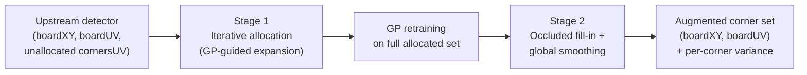

# Goal

Receive the partial output of an upstream checkerboard corner detector — a set of allocated board-to-pixel pairs $(\mathbf{X}_b, \mathbf{u}_b)$ and a set of detected-but-unallocated corner pixel coordinates $\mathbf{u}_u$ — and return an augmented corner set with three properties: (1) previously unallocated detections are assigned to grid positions by iterative GP-guided expansion, (2) UV coordinates are predicted for grid positions with no detected corner (occluded, outside the image, or missed by the upstream detector), and (3) every allocated corner's position is refined via the GP posterior mean, imposing global-board-geometry consistency rather than only local pixel evidence.

The method does **not** perform corner detection itself. It wraps any upstream detector that returns a partial grid; the paper benchmarks against [Geiger 2012](/atlas/geiger-chessboard-detector) `libcbdetect`.

# Algorithm

Let $\mathbf{X} = (X, Y) \in \mathbb{Z}^2$ denote a local board grid coordinate.
Let $\mathbf{u} = (u, v) \in \mathbb{R}^2$ denote the corresponding pixel coordinate.
Let $\{(\mathbf{X}_{b,i}, \mathbf{u}_{b,i})\}_{i=1}^{n}$ denote the allocated training set from the upstream detector.
Let $\sigma_f^2$ denote the GP output variance (signal variance).
Let $l$ denote the GP length scale.
Let $\sigma_\varepsilon^2$ denote the GP observation noise variance.
Let $K \in \mathbb{R}^{n \times n}$ denote the Gram matrix with $K_{ij} = k_{\text{SE}}(\mathbf{X}_{b,i}, \mathbf{X}_{b,j}) + \sigma_\varepsilon^2 \delta_{ij}$.
Let $\mathbf{k}_* \in \mathbb{R}^n$ denote the cross-covariance vector between training points and a query point $\mathbf{X}_*$.



Two independent Gaussian processes — one for $u$ coordinates, one for $v$ coordinates — are trained on the same set of allocated pairs using the squared-exponential kernel.

:::definition[Squared-exponential kernel]
The covariance between board positions $\mathbf{X}$ and $\mathbf{X}'$ under the SE kernel:

$$
k_{\text{SE}}(\mathbf{X}, \mathbf{X}') = \sigma_f^2 \exp\!\left(-\frac{\lVert \mathbf{X} - \mathbf{X}' \rVert^2}{2 l^2}\right).
\tag{Hillen Eq. 6}
$$

The SE kernel implies an infinitely differentiable mapping from board space to pixel space — the prior assumption that the board-to-image transformation is smooth.
:::

Hyperparameters $(\sigma_f^2, l, \sigma_\varepsilon^2)$ are selected by maximising the log marginal likelihood of the training data (Hillen Eq. 7) via L-BFGS, which incorporates an automatic complexity penalty that prevents overfitting.

:::definition[GP posterior mean (refined corner position)]
The posterior mean pixel coordinate at a query board position $\mathbf{X}_*$, after conditioning on the training set:

$$
\bar{u}(\mathbf{X}_*) = \mathbf{k}_*^\top (K + \sigma_\varepsilon^2 I)^{-1} \mathbf{u}_b.
$$

The posterior covariance $\text{cov}(u_*) = k(\mathbf{X}_*, \mathbf{X}_*) - \mathbf{k}_*^\top (K + \sigma_\varepsilon^2 I)^{-1} \mathbf{k}_*$ provides a per-corner confidence measure at no additional cost.
:::

Inference requires solving the linear system $(K + \sigma_\varepsilon^2 I)^{-1} \mathbf{u}_b$ via Cholesky factorisation — $O(n^3)$ in the number of training points.

:::algorithm[GP enhancement pipeline]
::input[Allocated pairs $(\mathbf{X}_b, \mathbf{u}_b)$; unallocated corner pixels $\mathbf{u}_u$ from an upstream detector.]
::output[Augmented allocated pairs $(\mathbf{X}_b', \mathbf{u}_b')$: unallocated corners assigned to grid positions, occluded/out-of-frame positions filled in, all corners globally smoothed.]

1. Train two GPs on the current $(\mathbf{X}_b, \mathbf{u}_b)$ using $k_{\text{SE}}$ and L-BFGS hyperparameter optimisation.
2. For each grid position in the next outward ring `newXY`, predict pixel coordinates $\bar{\mathbf{u}}$ from the GP posterior mean.
3. Match each prediction to the nearest unallocated detected corner within a distance threshold (a fraction of the mean inter-corner spacing).
4. Augment $(\mathbf{X}_b, \mathbf{u}_b)$ with matched pairs; classify unmatched detections as false positives.
5. Repeat steps 1–4 until no new corners are allocated, no predicted UV falls inside the image, or `maxNrOfIterations` (default 10) is reached.
6. Retrain both GPs on the full allocated set.
7. For every grid position with no detected corner (occluded or outside the image), predict UV from the retrained GP posterior mean.
8. For every allocated corner, replace its position with the GP posterior mean evaluated at its board coordinate.
:::

## Stage 1 — Iterative corner allocation (§2.2, Algorithm 1)

Steps 1–5 of the procedure above implement a greedy outward expansion of the board. The GP trained on the current allocated set extrapolates UV coordinates for adjacent unoccupied grid positions; these predictions guide nearest-neighbour matching against unallocated detections. Detections that no prediction claims by the end of iteration are classified as false positives — they detected something corner-like that does not fit any GP-consistent grid extrapolation.

## Stage 2 — GP refinement (§2.3)

After allocation (step 6 onward), the GPs are retrained on the complete set. Two products result. The fill-in (step 7) extends the recovered board to positions where no physical detection exists — corners outside the image boundary, behind an occluder, or simply missed. The smoothing (step 8) differs from per-corner local refinement (Hessian saddle, cone-quadratic): every corner's refined position is influenced by every other corner via the SE kernel, because the posterior mean is a function of all training observations jointly. The SE kernel's infinite differentiability ensures the resulting mapping is smooth.

## Stage 3 — Unwarping by-product (§5)

Querying the retrained GP on a dense regular `newXY` grid produces an unwarped frontal view of the board at no additional training cost. This is a side benefit reported in the paper and available from any trained PyCBD model.

# Implementation

The GP enhancement step is not codeable in isolation as a compact self-contained snippet — it requires a GP regression library (scikit-learn's `GaussianProcessRegressor` or equivalent) and the iterative allocation loop depends on the board structure returned by the upstream detector. The PyCBD library (`pip install pycbd`, [github.com/InViLabUAntwerp/PyCBD](https://github.com/InViLabUAntwerp/PyCBD)) provides the modular post-processor: the GP enhancement step accepts any partial grid `(boardXY, boardUV)` plus an unallocated-corners list `cornersUV` and can be combined with any upstream detector.

The core GP regression in Python follows the standard equations directly:

```python
from sklearn.gaussian_process import GaussianProcessRegressor
from sklearn.gaussian_process.kernels import RBF, WhiteKernel

# boardXY: (n, 2) integer grid coordinates
# boardUV: (n,)   pixel coordinates for one axis (u or v)
kernel = RBF() + WhiteKernel()
gp = GaussianProcessRegressor(kernel=kernel, n_restarts_optimizer=5)
gp.fit(boardXY, boardUV)

# Predict UV for new grid positions newXY: (m, 2)
u_pred, u_std = gp.predict(newXY, return_std=True)
# u_pred: posterior mean (Hillen Eq. 6 + GP posterior)
# u_std:  posterior standard deviation (confidence)
```

Key tunables: the distance-threshold fraction for the matching step in Stage 1 (lower → fewer false matches; higher → more recovered corners); a lower bound on the RBF length scale (prevents collapse on small boards with fewer than $\sim 4 \times 4$ inner corners).

# Remarks

- **Complexity.** Stage 1 trains the GPs once per iteration; each training involves an $O(n^3)$ Cholesky factorisation of the $n \times n$ Gram matrix, where $n$ is the current allocated count. For boards $\leq 15 \times 10$ ($n \leq 150$), this is fast; for very large boards, sparse GP approximations reduce cost to $O(nm^2)$ where $m$ is the number of inducing points (Rasmussen 2006 Ch. 8) — not implemented in PyCBD.
- **Smoothness bias under extreme warping.** The SE kernel imposes a stationary smoothness prior on the board-to-pixel mapping. Strong fisheye or heavy perspective produces high local curvature in this mapping; the SE posterior mean over-smooths corner positions in those regimes. Non-stationary kernels or deep GPs are deferred as future work in the paper.
- **Small-board numerical instability.** Below $\sim 4 \times 4$ inner corners, the marginal likelihood surface becomes uninformative and the GP collapses toward the prior. Mitigate by constraining the length-scale lower bound in software.
- **Upstream detector is the weakest link.** The enhancement requires at least a minimal connected board fragment as training data. If the upstream detector finds nothing, the enhancement cannot run. The paper benchmarks Geiger 2012 as upstream; Geiger fails more easily than OpenCV on high-noise, low-blur inputs but recovers more partial boards on multispectral and thermal IR imagery.
- **Compared with OCPAD.** [OCPAD](/atlas/ocpad) (Fürsattel 2016) recovers partial boards by subgraph isomorphism on the detected corner graph — a combinatorial approach that requires no training. GP enhancement fills in occluded corners by learned interpolation and extrapolation — a regression approach that requires a partial board as training data but extends naturally beyond the image border and provides global smoothing. The two approaches address complementary failure modes.
- **Confidence by construction.** The GP posterior variance provides a per-corner confidence estimate at no additional cost. Available from PyCBD; not exploited downstream in the paper's pipeline.

# References

1. M. Hillen, I. De Boi, T. De Kerf, S. Sels, E. Cardenas De La Hoz, J. Gladines, G. Steenackers, R. Penne, S. Vanlanduit. *Enhanced Checkerboard Detection Using Gaussian Processes.* MDPI *Mathematics* 11(22):4568, 2023. [doi:10.3390/math11224568](https://doi.org/10.3390/math11224568)
2. C. E. Rasmussen, C. K. I. Williams. *Gaussian Processes for Machine Learning.* MIT Press, 2006. (Ch. 2 — GP regression posterior; Ch. 5 — log marginal likelihood for hyperparameter selection.)
3. A. Geiger, F. Moosmann, Ö. Car, B. Schuster. *Automatic Camera and Range Sensor Calibration Using a Single Shot.* IEEE ICRA, 2012. (`libcbdetect` — the upstream detector benchmarked in §4.)
4. P. Fürsattel, S. Dotenco, S. Placht, M. Balda, A. Maier, C. Riess. *OCPAD — Occluded Checkerboard Pattern Detector.* WACV 2016. (Complementary partial-pattern recovery by subgraph isomorphism.)
