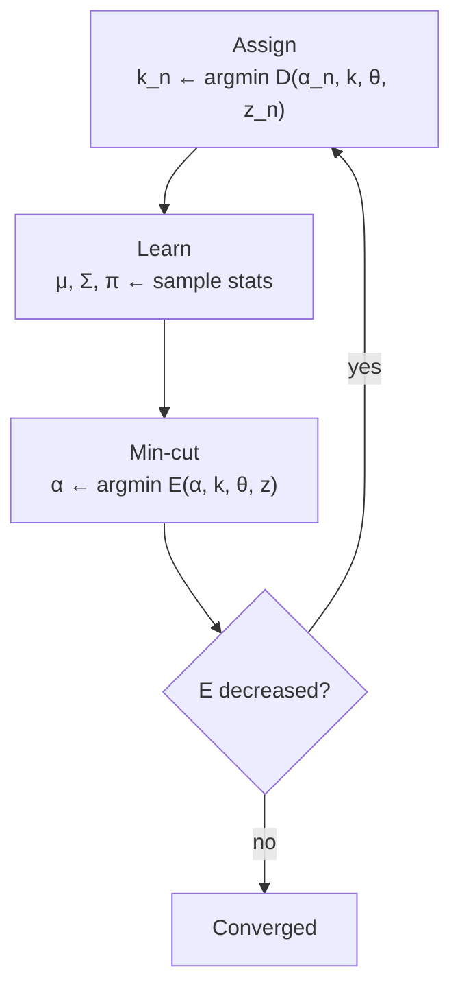

# Goal

A colour image $z = (z_1, \ldots, z_N)$ with $z_n \in \mathbb{R}^3$ and a user-drawn bounding rectangle are the inputs. The output is a binary opacity array $\alpha \in \{0,1\}^N$ partitioning the image into foreground and background, plus a continuous $\alpha_n \in [0,1]$ in a narrow border ribbon of width $\pm w$ pixels for smooth edge transitions. A single rectangle suffices as the sole required interaction; the algorithm needs no inner-boundary trace. The Gibbs energy $E(\alpha, k, \theta, z)$ decreases monotonically across the iterative coordinate-descent loop, guaranteeing convergence to a local minimum.

# Algorithm

Let $z = (z_1, \ldots, z_N)$ denote the RGB image, $z_n \in \mathbb{R}^3$. Let $\alpha \in \{0,1\}^N$ denote the binary opacity matte; $\alpha_n = 0$ is background, $\alpha_n = 1$ is foreground. Let $k = (k_1, \ldots, k_N)$, $k_n \in \{1, \ldots, K\}$, denote the per-pixel GMM component assignment. Let $K = 5$ be the number of Gaussian components per side. Let $\theta = \{\pi(\alpha, k),\, \mu(\alpha, k),\, \Sigma(\alpha, k)\}$ collect the GMM mixture weights, means, and full $3{\times}3$ covariance matrices. Let $T_B$, $T_U$, $T_F$ denote the hard-background, unknown, and hard-foreground pixel sets forming the trimap. Let $C$ denote the set of 8-connected neighbour pairs. Let $\beta$ be the contrast normalisation derived from image statistics. Let $\gamma = 50$ be the smoothness weight. Let $w = 6$ be the border-matting ribbon half-width in pixels. Let $\lambda_1 = 50$ and $\lambda_2 = 10^3$ be the DP regulariser parameters. Let $L = 41$ be the neighbourhood patch size for GMM parameter estimation in border matting. Let $\Delta_t$ and $\sigma_t$ parameterise the $\alpha$-profile step function along contour point $t$.

:::definition[Gibbs energy]
The total energy over $(\alpha, k, \theta, z)$ decomposes into a data term and a smoothness term.

$$E(\alpha, k, \theta, z) = U(\alpha, k, \theta, z) + V(\alpha, z)$$

$U$ is minimised over $\alpha$ and $k$ by the min-cut and GMM-assignment steps; $V$ penalises label discontinuities across high-contrast edges.
:::

:::definition[Data term]
The data term sums per-pixel negative log-likelihoods under the GMM.

$$U(\alpha, k, \theta, z) = \sum_{n} D(\alpha_n, k_n, \theta, z_n)$$

$$D(\alpha_n, k_n, \theta, z_n) = -\log \pi(\alpha_n, k_n) + \tfrac{1}{2}\log\det\Sigma(\alpha_n, k_n) + \tfrac{1}{2}\bigl[z_n - \mu(\alpha_n, k_n)\bigr]^\top \Sigma(\alpha_n, k_n)^{-1}\bigl[z_n - \mu(\alpha_n, k_n)\bigr]$$

Each GMM component contributes a mixture-weight penalty and a Mahalanobis distance from the component mean.
:::

:::definition[Smoothness term]
The smoothness term applies a contrast-weighted penalty at every label boundary in the 8-connected graph.

$$V(\alpha, z) = \gamma \sum_{(m,n)\in C} [\alpha_n \neq \alpha_m]\, \exp\!\bigl(-\beta \|z_m - z_n\|^2\bigr)$$

where $\beta = \bigl(2\langle(z_m - z_n)^2\rangle\bigr)^{-1}$ is computed from all neighbouring pixel pairs in the image, and $\gamma = 50$.
:::

:::definition[Border-matting $\alpha$-profile]
Along contour $C$, a soft step function is fitted per contour point $t$ by dynamic programming.

$$g(r_n;\, \Delta_{t(n)},\, \sigma_{t(n)})$$

$r_n$ is the signed distance of pixel $n$ from the boundary. Parameters $\Delta_{t}$ (position) and $\sigma_{t}$ (width) are optimised with a DP regulariser controlled by $\lambda_1 = 50$ and $\lambda_2 = 10^3$, over a $L = 41$ pixel neighbourhood patch centred on each contour point, with ribbon half-width $w = 6$.
:::

## Procedure

:::algorithm[GrabCut iterative segmentation]
::input[Colour image $z$; bounding rectangle $R$; parameters $K = 5$, $\gamma = 50$, $w = 6$]
::output[Hard segmentation $\alpha \in \{0,1\}^N$; continuous $\alpha$ in $\pm w$-pixel border ribbon]

1. Set $T_B$ to all pixels outside $R$; set $T_U$ to all pixels inside $R$; set $T_F = \emptyset$. Assign $\alpha_n = 0$ for $n \in T_B$ and $\alpha_n = 1$ for $n \in T_U$. Compute $\beta = \bigl(2\langle(z_m - z_n)^2\rangle\bigr)^{-1}$ from all 8-connected neighbour pairs. Initialise foreground and background GMMs ($K = 5$ components each) from pixels with $\alpha_n = 1$ and $\alpha_n = 0$ respectively.
2. Assign: for each pixel $n \in T_U$, set $k_n = \arg\min_{k} D(\alpha_n, k, \theta, z_n)$ (hard assignment to the nearest GMM component).
3. Learn: for each component $k$ in each GMM, recompute the sample mean $\mu$, covariance $\Sigma$, and weight $\pi = |F(k)| / \sum_k |F(k)|$ from the pixels currently assigned to that component.
4. Min-cut: construct the contrast-weighted pixel graph with $T$-links from $U$ and $N$-links from $V$; compute the global s-t min-cut to update $\alpha$ over $T_U$ pixels.
5. Repeat steps 2–4 until $E(\alpha, k, \theta, z)$ ceases to decrease.
6. Optional user editing: hard-constrain misclassified pixels as foreground or background via brush strokes, then re-run step 4 (single min-cut) or the full loop from step 2.
7. Border matting: detect the boundary contour $C$ of the hard segmentation. For each contour point $t$, fit $g(r_n; \Delta_t, \sigma_t)$ by DP with regulariser parameters $\lambda_1 = 50$, $\lambda_2 = 10^3$, over the $L = 41$ pixel patch, within ribbon half-width $w = 6$. Steal foreground colours from $T_F$ to eliminate background bleeding at mixed pixels.
:::



# Implementation

The iterative coordinate-descent loop in Rust:

```rust
trait MinCut {
    fn solve(&mut self, data: &[f32], smoothness: &[f32]) -> Vec<u8>;
}

struct Gmm {
    means: Vec<[f32; 3]>,
    covs: Vec<[[f32; 3]; 3]>,
    weights: Vec<f32>,
}

impl Gmm {
    fn assign(&self, z: [f32; 3]) -> usize {
        (0..self.means.len())
            .min_by(|&a, &b| self.mahal(z, a).partial_cmp(&self.mahal(z, b)).unwrap())
            .unwrap()
    }
    fn mahal(&self, z: [f32; 3], k: usize) -> f32 { /* (z-μ)ᵀ Σ⁻¹ (z-μ) */ 0.0 }
    fn fit(pixels: &[[f32; 3]], component_ids: &[usize], k: usize) -> Gmm { todo!() }
}

fn grabcut_iterate(
    z: &[[f32; 3]],
    alpha: &mut Vec<u8>,
    fg_gmm: &mut Gmm,
    bg_gmm: &mut Gmm,
    tu_mask: &[bool],
    solver: &mut impl MinCut,
) {
    let n = z.len();
    let mut comp = vec![0usize; n];
    loop {
        for i in 0..n {
            if tu_mask[i] {
                comp[i] = if alpha[i] == 1 { fg_gmm.assign(z[i]) }
                           else            { bg_gmm.assign(z[i]) };
            }
        }
        *fg_gmm = Gmm::fit(z, &comp, fg_gmm.means.len());
        *bg_gmm = Gmm::fit(z, &comp, bg_gmm.means.len());
        let new_alpha = solver.solve(&[], &[]);
        for i in 0..n { if tu_mask[i] { alpha[i] = new_alpha[i]; } }
        break; // caller checks ΔE and re-enters; graph build follows graph-cut-segmentation.
    }
}
```

# Remarks

- Each full pass (assign → learn → min-cut) minimises $E$ over one variable group; the energy decreases monotonically per pass. Representative images converge in approximately 12 iterations.
- Each min-cut step runs on a $\Theta(N)$-node graph with $\Theta(N)$ edges for an 8-connected pixel lattice; per-iteration cost is dominated by one max-flow computation.
- $\gamma = 50$ was calibrated on 15 training images; changing it shifts the balance between the colour-model unary and the boundary smoothness term and can cause over-smooth or fragmented results.
- $K = 5$ GMM components per side is a fixed design choice: too few components underfit multi-modal colour distributions; too many starve individual components of training pixels.
- Three failure modes: (i) low-contrast boundaries where the exponential smoothness term cannot localise the edge; (ii) foreground–background camouflage where the GMM unary term provides no gradient; (iii) background material inside the rectangle that is absent from the rectangle exterior, biasing the background GMM at initialisation.
- Border matting covers only the $\pm w = 6$ pixel boundary ribbon; full-image soft transparency (hair, smoke) is out of scope. A lasso input instead of a rectangle provides tighter background coverage and partially mitigates failure mode (iii).

# References

1. C. Rother, V. Kolmogorov, A. Blake. *GrabCut: Interactive Foreground Extraction using Iterated Graph Cuts.* ACM TOG (SIGGRAPH), 2004. [DOI](https://doi.org/10.1145/1015706.1015720)
2. Y. Boykov, M.-P. Jolly. *Interactive Graph Cuts for Optimal Boundary & Region Segmentation of Objects in N-D Images.* ICCV, 2001. [PDF](https://www.csd.uwo.ca/~yboykov/Papers/iccv01.pdf)
