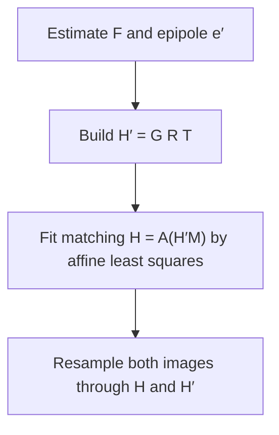

# Goal

Resample a pair of uncalibrated images into a **matched epipolar projection**: a homography pair $(H, H')$ such that corresponding epipolar lines are horizontal in both images and disparities between matched points are purely horizontal. Input: point correspondences $\mathbf{x}_i \leftrightarrow \mathbf{x}'_i$ ($n \geq 8$) sufficient to estimate the fundamental matrix $F$, or $F$ itself if already known. Output: the pair $(H, H')$, each a $3 \times 3$ projective transform, together with the resampled image pair. No camera matrices or calibration are used; the construction depends on $F$ alone. The guarantee is topological and geometric — a rectilinear-stereo-equivalent epipolar geometry that enables 1-D correspondence search — not metric: reconstruction from the rectified pair recovers scene structure only up to an unknown 3-D projectivity.

# Algorithm

Let $\mathbf{x} = (x, y, 1)^T$ and $\mathbf{x}' = (x', y', 1)^T$ denote homogeneous image-1 and image-2 coordinates of a correspondence. Let $F$ denote the $3 \times 3$ rank-2 fundamental matrix satisfying $\mathbf{x}'^T F\,\mathbf{x} = 0$. Let $\mathbf{e}'$ denote the epipole in image 2, the left null vector of $F$: $\mathbf{e}'^T F = \mathbf{0}^T$. Let $M$ denote a non-singular $3 \times 3$ matrix such that $F = [\mathbf{e}']_\times M$ — this factorisation always exists, since $\mathbf{e}'^T[\mathbf{e}']_\times = \mathbf{0}^T$ makes any such $M$ compatible with $\mathbf{e}'^T F = \mathbf{0}^T$. Let $T$ denote the translation centring a chosen reference point $\mathbf{u}_0$ — the image centre, by default — at the origin. Let $R$ denote the rotation about the origin that aligns the translated epipole with the $x$-axis. Let $f$ denote the $x$-coordinate of the epipole after applying $T$ and $R$.

:::definition[Epipole-to-infinity perspectivity ($G$)]
Perspectivity sending the aligned epipole $(f, 0, 1)^T$ to the ideal point $(f, 0, 0)^T$, chosen so its Jacobian at the origin equals the identity to first order.

$$
G = \begin{bmatrix} 1 & 0 & 0 \\ 0 & 1 & 0 \\ -1/f & 0 & 1 \end{bmatrix}.
$$
:::

$G$ maps $(u, v, 1)^T \mapsto (u,\, v,\, 1 - u/f)^T$. After perspective division, $(u, v, 1) \mapsto \tfrac{1}{1 - u/f}(u, v, 1)$, which for $|u/f| < 1$ expands as $(u, v, 1)(1 + u/f + (u/f)^2 + \cdots)$ — a rigid map to first order near the origin. The rectifying homography for image 2 is

$$
H' = G R T.
$$

Writing $F = [\mathbf{e}']_\times M$, a homography $H$ of image 1 preserves epipolar-line correspondence with $H'$ iff $H = (I + H'\mathbf{e}'\,\mathbf{a}^T)\,H' M$ for some free vector $\mathbf{a}$ (Theorem 4.5). When $H'$ sends the epipole to $(1, 0, 0)^T$ exactly, this family collapses (Corollary 4.6) to $H = A\,(H'M)$ with $A$ restricted to a 3-parameter affine form.

:::definition[Matching affine transform ($A$)]
Affine restriction of the epipolar-line-preserving family (Corollary 4.6), leaving the $y$-coordinate of the transformed point unchanged.

$$
A = \begin{bmatrix} a & b & c \\ 0 & 1 & 0 \\ 0 & 0 & 1 \end{bmatrix}.
$$
:::

The free parameters $a, b, c$ are fixed by ordinary linear least squares. Let $\hat{\mathbf{x}}_i = H'M\,\mathbf{x}_i$ and $\hat{\mathbf{x}}'_i = H'\,\mathbf{x}'_i$ denote the matched points transformed by the pre-affine map and by $H'$, with $(\hat x_i, \hat y_i)$ and $(\hat x'_i, \hat y'_i)$ their inhomogeneous coordinates. Because $A$ leaves the $y$-coordinate unchanged, the $y$-residual is constant and drops out of the minimisation; only

$$
\sum_i \bigl(a\,\hat x_i + b\,\hat y_i + c - \hat x'_i\bigr)^2
$$

is minimised over $a, b, c$. Restricting $A$ to the affine subgroup is what keeps this fit linear — a general projective $A$ does not admit a closed-form least-squares solution.

:::definition[Quasi-affine transform]
A projective map $H$ is quasi-affine with respect to a convex view window $W$ if $H(W)$ does not meet the line at infinity $L_\infty$: no point of $W$ is sent to infinity or behind the camera by $H$. Violating this condition tears the resampled image into disconnected pieces.
:::

If the epipole $\mathbf{e}'$ does not lie in the view window $W'$ of image 2, a matching $H$ from the Theorem 4.5 family is quasi-affine on some convex subwindow $W^+ \subseteq W$ of image 1 (Theorem 5.7) — not necessarily on all of $W$.

## Procedure



:::algorithm[Hartley projective rectification]
::input[Point correspondences $\mathbf{x}_i \leftrightarrow \mathbf{x}'_i$, $n \geq 8$ (or a precomputed fundamental matrix $F$); view windows $W, W'$ containing the matched points.]
::output[Rectifying homography pair $(H, H')$.]

1. Estimate $F$ from the correspondences by a linear least-squares method if not already known, and factor it as $F = [\mathbf{e}']_\times M$ with $\mathbf{e}'$ the epipole in image 2.
2. Choose a reference point $\mathbf{u}_0$ in image 2 and build $T$, the translation sending $\mathbf{u}_0$ to the origin.
3. Build $R$, the rotation about the origin that aligns the translated epipole with the $x$-axis, and read off $f$, its distance from the origin.
4. Build $G$ from $f$ and form $H' = G R T$.
5. Verify that $H'$ is quasi-affine on $W'$; if the epipole $\mathbf{e}'$ lies inside $W'$, shrink the view window or choose a different reference point $\mathbf{u}_0$ and repeat from step 2.
6. Transform the matched points by $H'M$ (image 1) and $H'$ (image 2), and fit $a, b, c$ of $A$ by linear least squares.
7. Form $H = A(H'M)$ and confirm it is quasi-affine on some convex subwindow $W^+ \subseteq W$.
8. Resample both images through $H$ and $H'$ by inverse mapping with interpolation.
:::

# Implementation

The epipole-to-infinity perspectivity and the affine matching-transform fit in Rust:

```rust
use nalgebra::{Matrix3, Vector3};

/// Perspectivity sending the aligned epipole (f, 0, 1) to the ideal
/// point (f, 0, 0); its Jacobian at the origin is the identity.
fn epipole_to_infinity(f: f64) -> Matrix3<f64> {
    Matrix3::new(
        1.0,      0.0, 0.0,
        0.0,      1.0, 0.0,
        -1.0 / f, 0.0, 1.0,
    )
}

/// Fit the 3-parameter affine matching transform A (Corollary 4.6) by
/// ordinary linear least squares, minimising
/// sum_i (a*x_i + b*y_i + c - xp_i)^2 over the transformed
/// correspondences (x_i, y_i) <-> xp_i.
fn fit_matching_affine(pts: &[(f64, f64)], xp: &[f64]) -> (f64, f64, f64) {
    let mut m = Matrix3::<f64>::zeros();
    let mut rhs = Vector3::<f64>::zeros();
    for (&(x, y), &xpi) in pts.iter().zip(xp) {
        let row = Vector3::new(x, y, 1.0);
        m += row * row.transpose();
        rhs += row * xpi;
    }
    let sol = m
        .lu()
        .solve(&rhs)
        .expect("normal equations well-posed for n >= 3 non-collinear points");
    (sol.x, sol.y, sol.z)
}
```

# Remarks

- The construction is $O(n)$ in the number of correspondences for the affine fit, plus $O(|\Omega_1| + |\Omega_2|)$ for the final per-pixel resampling of both images; no iterative optimisation is required beyond the optional nonlinear refinement of $F$ itself.
- Theorem 5.7 guarantees quasi-affinity of the matching transform $H$ only on a convex subwindow $W^+ \subseteq W$ of the first image, not necessarily on the whole of $W$; part of $W$ can remain unusable if it corresponds to points outside $W'$.
- If the epipole lies inside the view window $W'$ — forward or near-forward motion — Theorem 5.7 does not apply, since its hypothesis requires the epipole to lie outside $W'$; the paper's only stated remedy is to shrink the view window or choose a different reference point, with no guarantee of a valid full-window solution.
- The first-order approximation of $G$ as a rigid map holds for $|u/f| < 1$; as the epipole approaches the view window, $f$ shrinks, the approximation degrades, and the mapped coordinates grow without bound near $u = f$.
- The rectified pair carries no metric information: reconstruction from $(H, H')$ recovers scene structure only up to an unknown 3-D projectivity, not up to a similarity or Euclidean transform.
- See the [stereo rectification](/atlas/stereo-rectification#decision-table) survey for a comparison against Loop-Zhang and polar rectification.

# References

1. R. I. Hartley. *Theory and Practice of Projective Rectification.* International Journal of Computer Vision, 1999. [pdf](https://users.cecs.anu.edu.au/~hartley/Papers/joint-epipolar/journal/joint3.pdf)
2. H. C. Longuet-Higgins. *A Computer Algorithm for Reconstructing a Scene from Two Projections.* Nature 293, 1981. [doi.org/10.1038/293133a0](https://doi.org/10.1038/293133a0)
