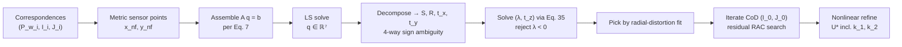

# Goal

Given $N \geq 4$ correspondences between known 3D world points $P_w^{(i)} \in \mathbb{R}^3$ and observed image points $(I^{(i)}, J^{(i)})$ in pixels, recover the intrinsic and extrinsic camera parameters of a perspective camera in which the image sensor is **not** perpendicular to the optic axis. The parameter set is $U = \{I_0, J_0, s_x, s_y, \rho, \sigma, \theta, \phi, \psi, t_x, t_y, t_z, \lambda\}$: pixel coordinates $(I_0, J_0)$ of the centre of radial distortion, pixel sizes $(s_x, s_y)$, Euler angles $(\rho, \sigma)$ specifying the lens–sensor tilt rotation $R$, Euler angles $(\theta, \phi, \psi)$ specifying the world-to-lens rotation $S$, translation $(t_x, t_y, t_z)$, and camera constant $\lambda$. Tsai's radial alignment constraint (RAC) assumes $R = I$; the generalized form relaxes that assumption and solves for $R$ as part of the calibration.

# Algorithm

Let $P_w = (x_w, y_w, z_w) \in \mathbb{R}^3$ be a world point. Write its representation in the lens coordinate system as $P_l = S\,P_w + T$ with $T = (t_x, t_y, t_z)$ and $S \in SO(3)$ parametrised by Euler angles $(\theta, \phi, \psi)$. Write its observed image coordinates in pixels as $(I, J)$ and convert to sensor-frame metric coordinates as

$$
x_{d_{\mathrm{nf}}} = (I + I_0)\,s_x, \qquad y_{d_{\mathrm{nf}}} = (J + J_0)\,s_y,
$$

so $P_{\mathrm{nf}} = (x_{d_{\mathrm{nf}}}, y_{d_{\mathrm{nf}}})$ is the non-frontal sensor-frame point.

:::definition[Lens–sensor tilt $R(\rho, \sigma)$]
Rotation that takes the lens coordinate frame to the sensor coordinate frame. The lens is rotationally symmetric about its optic axis, so rotation about $z$ is redundant; only two Euler angles are identifiable.

$$
R(\rho, \sigma) =
\begin{bmatrix}
\cos\sigma & \sin\rho \sin\sigma & \cos\rho \sin\sigma \\
0 & \cos\rho & -\sin\rho \\
-\sin\sigma & \sin\rho \cos\sigma & \cos\rho \cos\sigma
\end{bmatrix}.
$$
:::

:::definition[Frontal-sensor projection $P_f$]
Projection of $P_{\mathrm{nf}}$ through the lens centre $O_l$ onto a hypothesized sensor plane normal to the optic axis at distance $\lambda$.

$$
\begin{bmatrix} x_{df} \\ y_{df} \end{bmatrix} =
\frac{-\lambda}{r_{13} x_{d_{\mathrm{nf}}} + r_{23} y_{d_{\mathrm{nf}}} - \lambda}
\begin{bmatrix} r_{11} x_{d_{\mathrm{nf}}} + r_{21} y_{d_{\mathrm{nf}}} \\ r_{12} x_{d_{\mathrm{nf}}} + r_{22} y_{d_{\mathrm{nf}}} \end{bmatrix},
$$

where $r_{ij}$ is the $(i, j)$ entry of $R$.
:::

Let $O_p = (0, 0, \lambda)$ be the centre of the frontal sensor on the optic axis, and $P_{oz} = (0, 0, z_l)$ the foot of the perpendicular from $P_l$ onto the optic axis. The vectors $\overrightarrow{O_p P_f}$ and $\overrightarrow{P_{oz} P_l}$ are perpendicular to the same line (the optic axis) and lie in a common plane. Radial alignment requires them to be parallel.

:::definition[gRAC]
Cross-product form of the parallelism condition $\overrightarrow{O_p P_f} \parallel \overrightarrow{P_{oz} P_l}$, expressed in lens-frame $(x, y)$ coordinates.

$$
x_{df}\,y_l \;=\; y_{df}\,x_l.
$$
:::

Substituting the frontal projection (above) and $P_l = S P_w + T$ into the gRAC and eliminating the common scale reduces the per-correspondence equation to a linear form in seven unknown combinations of the calibration parameters:

:::definition[gRAC linear form]
Each world–image correspondence contributes one row to the linear system. The unknowns $q_1, \ldots, q_7$ absorb the extrinsic rotation $S$, the tilt $R$, and the first two translation components $t_x, t_y$.

$$
\begin{bmatrix}
x_{d_{\mathrm{nf}}} x_w & x_{d_{\mathrm{nf}}} y_w & x_{d_{\mathrm{nf}}} z_w & x_{d_{\mathrm{nf}}}
& y_{d_{\mathrm{nf}}} x_w & y_{d_{\mathrm{nf}}} y_w & y_{d_{\mathrm{nf}}} z_w
\end{bmatrix}
\begin{bmatrix} q_1 \\ \vdots \\ q_7 \end{bmatrix}
= y_{d_{\mathrm{nf}}}.
$$

$$
q_1 = \tfrac{r_{11} s_{21} - r_{12} s_{11}}{r_{22} t_x}, \quad
q_2 = \tfrac{r_{11} s_{22} - r_{12} s_{12}}{r_{22} t_x}, \quad
q_3 = \tfrac{r_{11} s_{23} - r_{12} s_{13}}{r_{22} t_x}, \quad
q_4 = \tfrac{r_{11} t_y - r_{12} t_x}{r_{22} t_x},
$$

$$
q_5 = -\tfrac{s_{11}}{t_x}, \quad
q_6 = -\tfrac{s_{12}}{t_x}, \quad
q_7 = -\tfrac{s_{13}}{t_x}.
$$
:::

The system has rank seven, so four or more correspondences determine $q$ by linear least squares. Recovery of $(S, R, t_x, t_y)$ from $q$ proceeds algebraically but with a four-way sign ambiguity:

$$
|t_x| = \frac{1}{\sqrt{q_5^2 + q_6^2 + q_7^2}},
$$

with sign fixed later. Setting $M = q_1 q_5 + q_2 q_6 + q_3 q_7$ and $N = q_1^2 + q_2^2 + q_3^2$, the two tilt ratios are

$$
L = \frac{r_{12}}{r_{22}} = \tan\rho \sin\sigma = t_x^2 M, \qquad
P = \frac{r_{11}}{r_{22}} = \frac{\cos\sigma}{\cos\rho} = \sqrt{N t_x^2 - M^2 t_x^4}.
$$

The first row of $S$ is $s_{1j} = -q_{4+j}\,t_x$ (for $j = 1, 2, 3$). The second row and $t_y$ follow from

$$
s_{2j} = \frac{(q_j - t_x^2 M\,q_{4+j})\,t_x}{P}, \qquad
t_y = \frac{(q_4 + t_x^2 M)\,t_x}{P}.
$$

The third row of $S$ is $\mathbf s_1 \times \mathbf s_2$. The tilt Euler angles follow from $(L, P)$ via

$$
\cos^2\rho = \frac{L^2 + P^2 + 1 - \sqrt{(L^2 + P^2 + 1)^2 - 4 P^2}}{2 P^2}, \qquad
\sin\sigma = \sqrt{1 - P^2 \cos^2\rho}.
$$

The individual signs of $\rho$ and $\sigma$ remain free; their relative sign equals $\mathrm{sign}(L)$. Combined with $\mathrm{sign}(t_x)$, this leaves four candidate parameter sets.

The remaining parameters $\lambda$ and $t_z$ are recovered under a no-distortion assumption. With $u = r_{13} x_{d_{\mathrm{nf}}} + r_{23} y_{d_{\mathrm{nf}}}$, $v = -(r_{11} x_{d_{\mathrm{nf}}} + r_{21} y_{d_{\mathrm{nf}}})$, and $w = s_{31} x_w + s_{32} y_w + s_{33} z_w$, each correspondence gives

$$
\begin{bmatrix} -x_l & v \end{bmatrix}
\begin{bmatrix} \lambda \\ t_z \end{bmatrix}
= -u\,x_l - v\,w.
$$

Stacking this equation over correspondences yields $(\lambda, t_z)$ for each of the four candidates. Two are rejected by $\lambda < 0$; the remaining pair is disambiguated by which one admits a better fit to a symmetric radial-distortion model $P_f = Q_f\,(1 + k_1 r^2 + k_2 r^4)$, where $Q_f$ is the ideal distortion-free projection of the world point onto the frontal sensor and $r^2 = x_f^2 + y_f^2$.


:::algorithm[Kumar-Ahuja generalized RAC calibration]
::input[Correspondences $\{(P_w^{(i)}, I^{(i)}, J^{(i)})\}_{i=1}^{N}$ with $N \geq 4$; pixel sizes $(s_x, s_y)$; initial guess for the centre of radial distortion $(I_0, J_0)$.]
::output[Full parameter set $U = \{I_0, J_0, s_x, s_y, \rho, \sigma, \theta, \phi, \psi, t_x, t_y, t_z, \lambda, k_1, k_2\}$.]

1. Convert pixel observations to sensor-frame metric points via $x_{d_{\mathrm{nf}}} = (I + I_0) s_x$, $y_{d_{\mathrm{nf}}} = (J + J_0) s_y$.
2. Assemble the $N \times 7$ system $A q = b$ and solve by linear least squares.
3. From $q$ compute $|t_x|$, $M$, $N$, $L$, $P$ and reconstruct $S$, $(\rho, \sigma)$, and $t_y$ up to the four-way sign ambiguity.
4. For each of the four candidates $\{(\pm t_x, R_{1,2})\}$, stack Eq. 35 over correspondences and solve for $(\lambda, t_z)$ by linear least squares. Reject candidates with $\lambda < 0$.
5. Fit a symmetric radial-distortion model to the frontal-projected points for each remaining candidate and pick the one with the smaller residual.
6. Refine $(I_0, J_0)$ by iterative image-plane sampling: for each sampled location, re-run steps 1–5 and evaluate the residual RAC error on the resulting frontal coordinates; move the sampling window around the minimiser until convergence.
7. Use $U$ from step 6 to initialise a nonlinear refinement that minimises reprojection error including radial distortion $(k_1, k_2)$.
:::



# Implementation

The row assembly for the linear form $A q = b$ and the stage-1 decomposition into $(t_x, S, t_y)$ in Rust. The remaining steps (four-way disambiguation, Eq. 35 linear solve, CoD iteration) are small wrappers around these two kernels.

```rust
use nalgebra::{Matrix3, Vector3};

fn grac_row(x_nf: f64, y_nf: f64, w: &Vector3<f64>) -> ([f64; 7], f64) {
    let (xw, yw, zw) = (w.x, w.y, w.z);
    ([x_nf*xw, x_nf*yw, x_nf*zw, x_nf,
      y_nf*xw, y_nf*yw, y_nf*zw], y_nf)
}

fn decompose_q(q: &[f64; 7]) -> (Matrix3<f64>, f64, f64, f64, f64) {
    let tx = 1.0 / (q[4]*q[4] + q[5]*q[5] + q[6]*q[6]).sqrt();
    let m = q[0]*q[4] + q[1]*q[5] + q[2]*q[6];
    let n = q[0]*q[0] + q[1]*q[1] + q[2]*q[2];
    let tx2 = tx * tx;
    let l = tx2 * m;
    let p = (n * tx2 - m * m * tx2 * tx2).max(0.0).sqrt();
    let s1 = Vector3::new(-q[4]*tx, -q[5]*tx, -q[6]*tx);
    let s2 = Vector3::new((q[0] - tx2*m*q[4]) * tx / p,
                          (q[1] - tx2*m*q[5]) * tx / p,
                          (q[2] - tx2*m*q[6]) * tx / p);
    let s3 = s1.cross(&s2);
    let s = Matrix3::from_rows(&[s1.transpose(), s2.transpose(), s3.transpose()]);
    let ty = (q[3] + tx2 * m) * tx / p;
    (s, tx, ty, l, p)
}

fn tilt_angles(l: f64, p: f64) -> (f64, f64) {
    let k = l*l + p*p + 1.0;
    let disc = (k*k - 4.0 * p*p).max(0.0).sqrt();
    let cos_rho = ((k - disc) / (2.0 * p*p)).sqrt();
    let rho = cos_rho.acos();
    let sigma = (1.0 - p*p * cos_rho*cos_rho).max(0.0).sqrt().asin();
    (rho, sigma)
}
```

# Remarks

- Rank of $A$ is seven, so the minimum sample size is four correspondences; in practice ten to twenty well-distributed points are used to damp the four-way sign disambiguation and the subsequent CoD search.
- The 2-DoF tilt parametrisation $R(\rho, \sigma)$ is identifiable only when at least two correspondences have distinct world-depth $z_w$; coplanar targets leave $\lambda$ and $t_z$ coupled in Eq. 35 and force the algorithm into multi-plane acquisition (the paper's 2.5D dataset moves the calibration board along its surface normal).
- The four-way ambiguity is inherent to the constraint, not an artifact of the solver: the projection from non-frontal sensor to frontal sensor is many-to-one in the tilt angles, and RAC fixes only the relative sign of $(\rho, \sigma)$ through $\mathrm{sign}(L)$. Disambiguation via radial-distortion-model fit degrades when the true distortion is small.
- The CoD search is an outer loop around the linear solver: each candidate $(I_0, J_0)$ re-runs steps 1–5 and evaluates residual RAC error on the frontal-projected points. Cost is $O(K \cdot N)$ per iteration for $K$ sampled CoD locations and $N$ correspondences; convergence depends on the seed accuracy.
- Reduces to Tsai's RAC when $R = I$: the tilt-induced rows of the $7 \times 1$ unknown collapse ($q_1, q_2, q_3, q_4$ depend only on $S$ and $(t_x, t_y)$; $q_5, q_6, q_7$ are the unchanged Tsai quantities), and Eq. 35 becomes Tsai's linear system for $(\lambda, t_z)$.

# References

1. A. Kumar and N. Ahuja. *Generalized Radial Alignment Constraint for Camera Calibration.* ICPR, 2014. [pdf](https://vision.ai.illinois.edu/html-files-to-import/avi_papers/Kumar_GeneralizedRAC_ICPR_2104.pdf)
2. R. Y. Tsai. *A versatile camera calibration technique for high-accuracy 3D machine vision metrology using off-the-shelf TV cameras and lenses.* IEEE Journal on Robotics and Automation 3(4):323–344, 1987. [pdf](https://cecas.clemson.edu/~stb/ece847/internal/classic_vision_papers/tsai_calibration1987.pdf)
3. J. Weng, P. Cohen, and M. Herniou. *Camera calibration with distortion models and accuracy evaluation.* IEEE Transactions on Pattern Analysis and Machine Intelligence 14(10):965–980, 1992. [doi](https://doi.org/10.1109/34.159901)
