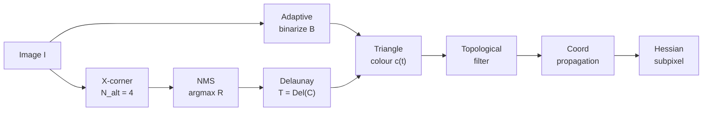

# Goal

Detect every chessboard corner visible in a grayscale image, assign each corner an integer pattern coordinate, and refine the corner to subpixel accuracy — without requiring the full pattern to be present. Input: a grayscale image $I : \Omega \to \mathbb{R}$. Output: a set of subpixel points $\{(x_k, y_k)\} \subset \Omega$ together with integer pattern coordinates $\{(i_k, j_k)\} \subset \mathbb{Z}^2$. Corner legality is decided topologically on a Delaunay mesh over the candidate set rather than by a response threshold.

# Algorithm

Let $I$ denote the grayscale image. For a pixel $p_c$, let $V = \{p_1, p_2, \ldots, p_n\}$ denote its $n$-pixel Bresenham circle neighbourhood, traversed in order around the circumference, with circular indexing $p_0 \equiv p_n$. Let $m = \frac{1}{n}\sum_{i=1}^{n} I(p_i)$ denote the mean intensity over $V$ and $\mathrm{gate}$ a fixed contrast offset. Define the two thresholds

$$
T_\ell = m - \mathrm{gate}, \qquad T_h = m + \mathrm{gate}.
$$

Let $C \subset \Omega$ denote the candidate x-corners surviving non-maximum suppression. Let $B : \Omega \to \{0, 1\}$ denote a binarization of $I$ used to label triangle interiors. Let $T = \operatorname{Del}(C)$ denote the Delaunay triangulation of $C$ — the unique triangulation in which every triangle's circumcircle contains no other point of $C$.

:::definition[Alternation count (N_alt)]
The number of sign transitions of $I$ around the Bresenham ring against the two thresholds:

$$
N_\mathrm{alt}(p_c) = \sum_{i=1}^{n} \mathbb{1}\!\left[\bigl(I(p_i) > T_h \,\wedge\, I(p_{i-1}) < T_\ell\bigr) \,\vee\, \bigl(I(p_i) < T_\ell \,\wedge\, I(p_{i-1}) > T_h\bigr)\right].
$$

A true X-junction produces exactly four transitions — two from dark to light and two from light to dark — around a circle centred on it.
:::

:::definition[X-corner classification]
$p_c$ is declared an x-corner when the alternation count is $4$ and its own intensity lies strictly between the thresholds:

$$
N_\mathrm{alt}(p_c) = 4 \quad \wedge \quad T_\ell < I(p_c) < T_h.
$$
:::

:::definition[NMS cost (R)]
Within a local window of x-corner candidates, the kept corner is the one that maximises the larger one-sided energy against the ring mean:

$$
R(p_c) = \max\!\left(\sum_{p_i \in \mathrm{dark}} |I(p_i) - m|,\; \sum_{p_i \in \mathrm{light}} |I(p_i) - m|\right),
$$

with $\mathrm{dark} = \{p_i : I(p_i) < T_\ell\}$ and $\mathrm{light} = \{p_i : I(p_i) > T_h\}$ partitioning the ring samples.
:::

:::definition[Triangle colour]
Each triangle $t \in T$ inherits a single binary colour $c(t) \in \{0, 1\}$ from $B$, read over the shrunk interior of $t$ so that edge ambiguity from binarization does not corrupt the label.
:::

:::definition[Topological legality]
A triangle $t \in T$ is legal iff all three hold: (i) $B$ is uniform on the shrunk interior of $t$; (ii) $t$ has at least one edge-neighbour with the same colour; (iii) $t$ has at most two edge-neighbours with the same colour. Under the chessboard pattern, each tile splits into exactly two legal triangles that share an interior edge.
:::

:::definition[Chen-Zhang Hessian response]
At a valid x-corner, the Hessian $H = \bigl[\begin{smallmatrix} I_{xx} & I_{xy} \\ I_{xy} & I_{yy} \end{smallmatrix}\bigr]$ of the local intensity has determinant

$$
S = \det H = I_{xx}\,I_{yy} - I_{xy}^{\,2}.
$$

$S$ is negative at saddle-shaped X-junctions; the subpixel offset $(s, t)$ from the pixel centre is the critical point of the local quadratic Taylor expansion, i.e. the solution of $H\,[s,\,t]^\top = -[I_x,\,I_y]^\top$.
:::

## Procedure

:::algorithm[Chessboard detection with x-corners and topology]
::input[Grayscale image $I$; Bresenham ring with $n = 16$ samples at radius $r$; gate constant $\mathrm{gate} = 10$; border margin $r$.]
::output[Subpixel corner set $\{(x_k, y_k)\}$ with integer pattern coordinates $\{(i_k, j_k)\}$.]

1. For every pixel $p_c$ at distance $\geq r$ from the border, sample the ring $V$, compute $m$, $T_\ell$, $T_h$ and $N_\mathrm{alt}(p_c)$, and apply the x-corner classification. Collect candidates $C_0$.
2. Assign each candidate the NMS cost $R(p_c)$. Suppress non-maxima in a local window; keep the argmax. Call the result $C$.
3. Compute the Bradley-Roth integral-image adaptive binarization $B$ of $I$.
4. Compute $T = \operatorname{Del}(C)$.
5. For each $t \in T$, set $c(t)$ by reading $B$ on the shrunk interior of $t$.
6. Iterate: remove every $t \in T$ that fails topological legality; rebuild the adjacency; repeat until no removals occur. Discard vertices that no longer belong to any surviving triangle.
7. Pick a seed legal triangle $T_1$ adjacent through a same-colour edge to a second legal triangle $T_2$. Fix the origin at the vertex of $T_1$ opposite to $T_2$; assign the two remaining vertices coordinates $(1, 0)$ and $(0, 1)$ along the pattern axes.
8. Flood-fill integer grid coordinates across the legal mesh: the coordinate of the unlabelled opposite vertex of a neighbour triangle is the reflection of the already-labelled opposite vertex through the shared edge. Each triangle is visited once.
9. At every surviving vertex, compute $S = I_{xx} I_{yy} - I_{xy}^{2}$ on a small window. Reject if $S \geq 0$. Otherwise solve $H\,[s,\,t]^\top = -[I_x,\,I_y]^\top$ and return $(x_k, y_k) = (x_0 + s, y_0 + t)$ with the propagated $(i_k, j_k)$.
:::



# Implementation

The per-pixel alternation count is the detector's hot kernel. One pass over the ring yields the alternation count, the two one-sided energies for the NMS cost, and the ring mean.

```rust
fn x_corner_response(ring: &[u8], gate: u8) -> Option<u32> {
    let n = ring.len();
    let sum: u32 = ring.iter().map(|&v| v as u32).sum();
    let m = (sum / n as u32) as u8;
    let t_lo = m.saturating_sub(gate);
    let t_hi = m.saturating_add(gate);

    let mut alt = 0u32;
    let mut dark_energy = 0u32;
    let mut light_energy = 0u32;
    for i in 0..n {
        let cur = ring[i];
        let prev = ring[(i + n - 1) % n];
        let up   = cur > t_hi && prev < t_lo;
        let down = cur < t_lo && prev > t_hi;
        if up || down { alt += 1; }

        let delta = (cur as i16 - m as i16).unsigned_abs() as u32;
        if cur < t_lo  { dark_energy  += delta; }
        if cur > t_hi  { light_energy += delta; }
    }
    if alt == 4 {
        Some(dark_energy.max(light_energy))
    } else {
        None
    }
}
```

The caller further enforces $T_\ell < I(p_c) < T_h$ on the centre pixel before admitting the corner; non-maximum suppression then retains the pixel with the largest returned response in a local window.

# Remarks

- Complexity: the x-corner scan is linear in image area with a fixed $n$-sample ring; Delaunay triangulation is $O(|C|\log|C|)$; topological filtering runs a bounded number of fixed-point sweeps, each linear in the mesh; coordinate propagation visits each triangle once; subpixel refinement is invoked only at surviving vertices, not image-wide.
- The detection threshold $\mathrm{gate}$ is set empirically to $10$ on a blurred input. The classification is dominated by the alternation count: any remaining false positives are discarded downstream by the topology, so results are weakly sensitive to $\mathrm{gate}$.
- Binarization is integral-image adaptive (Bradley-Roth) — linear time, window-size independent, and tolerant of slow illumination gradients across the pattern.
- The filter requires only that a sufficient subset of the pattern be visible; it does not demand the full grid. Partial occlusion, missing border tiles, and background clutter all reduce to discarded Delaunay triangles.
- Scope: the method emits ordered integer-coordinate corner lists; it does not solve for camera intrinsics or extrinsics. Those are the downstream calibration problem (e.g. Zhang's method).
- Failure modes: steep viewing angles defocus the X-junctions and push Delaunay edges across tile corners simultaneously; both detection and topology degrade at the same time rather than catching each other. Low-contrast images starve $N_\mathrm{alt}$ at the first stage.

# References

1. G. T. Laureano, M. S. V. de Paiva, A. S. da Silva. *Topological Detection of Chessboard Pattern for Camera Calibration.* IPCV (WorldComp), 2013. [PDF](https://worldcomp-proceedings.com/proc/p2013/IPC3656.pdf)
2. C. Shu, A. Brunton, M. A. Fiala. *A topological approach to finding grids in calibration patterns.* Machine Vision and Applications, 2009. DOI: [10.1007/s00138-009-0202-2](https://doi.org/10.1007/s00138-009-0202-2)
3. E. Rosten, T. Drummond. *Machine Learning for High-Speed Corner Detection.* ECCV, 2006. [PDF](https://www.edwardrosten.com/work/rosten_2006_machine.pdf)
