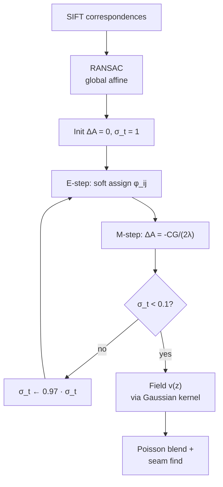

# Goal

Stitch two overlapping images $I$ and $I'$ given a sparse set of SIFT correspondences $\{(b^0_i, t'_i)\}$ across them, **without** requiring the views to be relatable by a single global parametric warp. Output: a per-pixel warp from $I$ to $I'$ defined as a **smoothly varying affine field** $v(z): \mathbb{R}^2 \to \mathbb{R}^6$ that interpolates over the source feature positions and extrapolates smoothly into non-overlapping regions. Joint estimation of the field and the soft correspondence assignments is performed by an EM-style loop derived from the Coherent Point Drift (CPD) framework.

# Algorithm

Let $\{b^0_i\}_{i=1}^{M}$ be SIFT feature positions in the base image and $\{t'_j\}_{j=1}^{N}$ in the target. The global affine $a_\text{global} \in \mathbb{R}^6$ is RANSAC-initialised from corresponding pairs. Each base feature $i$ carries its own affine

$$
a_i = a_\text{global} + \Delta a_i,
$$

where $\Delta a_i \in \mathbb{R}^6$ is regularised to be smooth across the image. The matrix $\Delta A \in \mathbb{R}^{M \times 6}$ collects all deviations.

:::definition[Smoothness regulariser]
The Gaussian-Fourier weight on the deviation field is shown to reduce (Appendix A of paper) to the closed form

$$
\Psi(A) = \mathrm{tr}\bigl(\Delta A^T\,G^{-1}\,\Delta A\bigr),
$$

where $G \in \mathbb{R}^{M \times M}$ is the Gaussian affinity matrix $G(i, j) = g(b^0_i - b^0_j, \gamma)$ between feature positions. This is a Tikhonov-style penalty: deviations correlated by spatial proximity (high $G$) are inexpensive; high-frequency deviations are heavily penalised.
:::

:::definition[Coherent Point Drift likelihood]
The alignment cost is a Gaussian mixture between warped base features $b_i$ and target features $t'_j$, with a uniform-component for outlier handling:

$$
\mathcal{L}(A) = -\sum_{j=1}^{N} \log\!\biggl( \sum_{i=1}^{M} g(t'_j - b_i, \sigma_t) + 2\kappa\pi\sigma_t^2 \biggr).
$$

Total objective: $E(A) = \mathcal{L}(A) + \lambda\Psi(A)$ (Eq. 6 of paper).
:::

:::algorithm[SVA — joint warp + correspondence]
::input[Source SIFT positions $\{b^0_i\}$, target SIFT positions $\{t'_j\}$, global affine $a_\text{global}$ from RANSAC; hyperparameters $\lambda = 10$, $\gamma = 1$, $\kappa = 0.5$.]
::output[Per-feature deviations $\Delta A \in \mathbb{R}^{M \times 6}$, evaluated as a per-pixel warp via the kernel interpolation field $v(z)$.]

1. **Initialise.** $\Delta A \leftarrow 0$, $\sigma_t \leftarrow 1.0$.
2. **Outer annealing loop:** for each $\sigma_t \in \{1.0, 0.97 \cdot 1.0, 0.97^2 \cdot 1.0, \dots, 0.1\}$:
   1. **E-step.** Compute soft assignment weights $\phi_{ij} = g(t'_j - b_i, \sigma_t) / \sum_k (g(t'_j - b_k, \sigma_t) + 2\kappa\pi\sigma_t^2)$ from the current $A$.
   2. **M-step.** Solve the closed-form linear system (Eq. 8): $\Delta A^{k+1} = -CG / (2\lambda)$, where $C$ is the matrix of weighted residuals from the E-step.
3. **Stitching field at query point** $z$ in the source image:
   $$
   v(z) = \sum_{i=1}^{M} w_i\,g(z - b^0_i,\,\gamma), \qquad W = G^+\,\Delta A. \quad \text{(Eq. 9)}
   $$
4. **Compose** $v(z)$ with the global affine to produce the warped pixel position; render via Poisson blending with optimal seam finding.
:::

# Remarks

- **Affine vs projective extrapolation.** SVA's affine field interpolates correctly within the overlap region but extrapolates as a smoothly varying affine map. For a translating camera observing a non-planar scene, the correct extrapolation is projective. The APAP paper's Fig. 1b shows this explicitly: SVA's extrapolated portion drifts from ground truth where APAP's projective extrapolation tracks. This is APAP's stated motivation for upgrading the local model from affine to projective.
- **Hard failure: depth discontinuities.** The smoothness regulariser $\Psi(A)$ cannot represent a step change in motion; foreground objects at sharply different depths from the background produce mean errors 2–3× higher than smooth-depth scenes (Fig. 5 in paper: 1.92 px vs 4.57 px on 500×500 synthetic).
- **Coordinate normalisation.** §3 normalises feature positions to zero mean and unit variance before EM, making $\lambda, \gamma, \sigma_t, \kappa$ approximately image-size-invariant. Scene-to-scene depth variation is not normalised; tuning is still required for novel scenes.
- **$O(M^3)$ pseudo-inverse cost.** The Gaussian affinity matrix $G$ is $M \times M$; $G^+$ is $O(M^3)$. For $M = 1200$, this is the runtime bottleneck. APAP avoids this entirely by solving a separate $2N \times 9$ SVD per cell, each $O(N)$ — closed-form, no iteration.
- **Annealing schedule.** $\sigma_t$ decreases by factor 0.97 from 1.0 to 0.1, giving $\approx 75$ outer iterations. Each outer iteration warm-starts from the previous; the inner M-step is closed-form. The schedule is the convergence criterion in practice.
- **Best matcher use.** §5.3 of the paper shows that the joint EM also produces ~40% more correct matches than SIFT nearest-neighbour and beats A-SIFT on hard pairs — useful as a downstream matcher even when the warp itself is replaced by a different stitching method.

## When to choose Lin SVA over APAP

[APAP](/atlas/apap-image-stitching) (Zaragoza 2013) replaces SVA's affine field with a per-cell projective Moving-DLT homography. The two papers are contemporary entries in the spatially-varying-warp family; APAP improves on SVA on every test in its benchmark.

| | Lin SVA (2011) | APAP (2013) |
|---|---|---|
| Local model | affine (6 DOF) | homography (8 DOF, projective) |
| Per-cell solve | iterative EM (CPD-style) over the global field | closed-form weighted DLT per cell |
| Extrapolation | affine | projective |
| Runtime | ~15 min for 1024×768 (MATLAB) | "tens of seconds" same hardware |
| Scaling cost | $O(M^3)$ pseudo-inverse on $M$ feature Gram matrix | $O(N)$ per cell, parallelisable |
| Test RMSE on APAP's temple pair | 12.3 px | 1.4 px |

Choose Lin SVA when (1) the scene's depth variation is genuinely smooth and the affine extrapolation is adequate (gentle parallax, no large foreground objects); (2) the joint EM's correspondence-refinement side-effect is itself useful — SVA produces ~40% more matches than SIFT-NN and outperforms A-SIFT on hard pairs (§5.3); (3) the implementation simplicity of the CPD framework is attractive (the algorithm fits on one page of pseudocode). Choose APAP when accuracy or runtime is the gating requirement — APAP outperforms SVA on every test in its 5-pair benchmark, and the per-cell DLT structure is much cheaper at large feature counts. The runtime gap (15 min vs sub-minute) makes APAP the practical default whenever both are available.

# References

1. W.-Y. Lin, S. Liu, Y. Matsushita, T.-T. Ng, L.-F. Cheong. *Smoothly Varying Affine Stitching.* IEEE CVPR 2011, pp. 272–279. [pdf](https://www.ece.nus.edu.sg/stfpage/eleclf/Lin_CVPR11.pdf)
2. J. Zaragoza, T.-J. Chin, M. S. Brown, D. Suter. *As-Projective-As-Possible Image Stitching with Moving DLT.* IEEE CVPR 2013. (Direct successor; replaces affine with projective per cell.)
3. A. Myronenko, X. Song, M. Carreira-Perpinan. *Non-rigid point set registration: Coherent Point Drift.* NIPS 2007. (CPD framework that SVA's EM adapts to image stitching.)
4. J. Gao, S. J. Kim, M. S. Brown. *Constructing Image Panoramas Using Dual-Homography Warping.* IEEE CVPR 2011. (Contemporary alternative; two-cluster RANSAC instead of smoothly varying field.)
5. T. Igarashi, T. Moscovich, J. F. Hughes. *As-Rigid-As-Possible Shape Manipulation.* ACM Transactions on Graphics, 2005. (Conceptual ancestor for smooth-field warps.)
