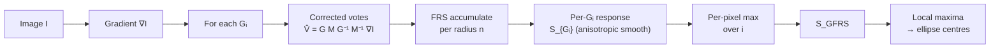

# Goal

Detect ellipse centres in a grayscale image $I: \Omega \to \mathbb{R}$ where circular structures appear as ellipses under bounded perspective projection. Output: a real-valued response map $S_\text{GFRS}: \Omega \to \mathbb{R}$ whose local maxima localise ellipse centres, together with the five ellipse parameters $(c_x, c_y, \theta, a, b)$ recovered from the sampled affine transform $G_i$ that produced each peak. The method is specific to ellipses generated by the constrained affine group $A(2) = \{G = R D \mid R \in SO(2),\, D = \mathrm{diag}(a, b),\, a,b > 0\}$ — equivalently, perspective foreshortening of approximately circular structures. Each image pixel votes along a direction obtained by warping its gradient through $G_i M G_i^{-1} M^{-1}$ for each sampled $G_i$, accumulating an FRS-style orientation-and-magnitude projection per radius and per $G_i$, then reducing the stack of per-$G_i$ responses by per-pixel maximum. Cost is $O(K \cdot |N| \cdot |\{G_i\}|)$ for a $K$-pixel image with $|N|$ detection radii and $|\{G_i\}|$ sampled affine hypotheses.

# Algorithm

Let $I: \Omega \to \mathbb{R}$ denote the grayscale image on pixel domain $\Omega \subset \mathbb{Z}^2$.
Let $g(p) = \nabla I(p)$ denote the image gradient at pixel $p$.
Let $N = \{n_1, n_2, \ldots\}$ denote the set of detection radii in pixels.
Let $\alpha \geq 1$ denote the radial strictness parameter.
Let $\beta \geq 0$ denote the gradient magnitude threshold.
Let $\theta \in [0, \pi)$ denote the ellipse orientation angle, $a > 0$ the major semi-axis, $b > 0$ the minor semi-axis.
Let $R(\theta) = \begin{pmatrix} \cos\theta & -\sin\theta \\ \sin\theta & \cos\theta \end{pmatrix}$ denote the 2-D rotation matrix.
Let $D = \mathrm{diag}(a, b)$ denote the anisotropic scale matrix; the symbol $D$ is used in place of the paper's $S$ to avoid collision with the FRS response.
Let $M = \begin{pmatrix} 0 & 1 \\ -1 & 0 \end{pmatrix}$ denote the 90° rotation that relates an ellipse tangent to the inward normal direction.
Let $\{G_i\}$ denote a finite grid of sampled transforms from $A(2)$, each parametrised by $(\theta_i, a_i, b_i)$.
Let $O_{n,G_i}$ and $M_{n,G_i}$ denote the FRS orientation and magnitude projection images for radius $n$ and transform $G_i$.
Let $k_n$ denote the per-radius normalising factor for the FRS accumulation; in GFRS it depends additionally on the current $(a_i, b_i)$.

:::definition[Constrained affine group ($A(2)$)]
The set of affine transforms that map a unit circle to an ellipse with semi-axes $(a,b)$ and orientation $\theta$:

$$
A(2) = \bigl\{G = R(\theta)\,D \;\big|\; R(\theta) \in SO(2),\; D = \mathrm{diag}(a,b),\; a,b > 0\bigr\}.
$$

Each $G \in A(2)$ maps the unit circle $p(\phi) = c + (\cos\phi, \sin\phi)^\top$ to the ellipse $q(\phi) = G(p(\phi) - c) + c$, with axes of length $a$ and $b$ rotated by $\theta$.
:::

:::definition[Corrected voting direction ($\hat V$)]
For a pixel $p$ on the ellipse boundary with gradient $g(p)$, the corrected voting direction toward the ellipse centre under transform $G$ is:

$$
\hat V_{q(\phi)} = G M G^{-1} M^{-1}\, g(p).
$$

Here $M$ is the 90° rotation relating the ellipse tangent to the inward normal direction; the chain $G M G^{-1}$ maps the circular-symmetry voting direction back through the ellipse parametrisation, and $M^{-1}$ accounts for the fact that the image gradient $g(p)$ already estimates the local normal rather than the tangent. The closed-form $2 \times 2$ matrix $A = G M G^{-1} M^{-1}$ with $c = \cos\theta$, $s = \sin\theta$ is:

$$
A = \frac{1}{ab}
\begin{pmatrix}
a^2 c^2 + b^2 s^2 & cs(a^2 - b^2) \\
cs(a^2 - b^2) & a^2 s^2 + b^2 c^2
\end{pmatrix}.
$$

When $a = b$ the matrix reduces to the identity, recovering the unmodified FRS gradient direction. The determinant of $A$ is $1$ for all $(\theta, a, b)$.
:::

:::definition[Corrected vote locations ($p^{\pm}$)]
The GFRS-corrected positively- and negatively-affected pixels at radius $n$ are:

$$
p^{+}(p) = p + \mathrm{round}\!\left(\frac{\hat V_{q(\phi)}}{\|\hat V_{q(\phi)}\|}\, n\right), \qquad
p^{-}(p) = p - \mathrm{round}\!\left(\frac{\hat V_{q(\phi)}}{\|\hat V_{q(\phi)}\|}\, n\right).
$$

These replace the FRS votes $p \pm \mathrm{round}(g(p)/\|g(p)\|\cdot n)$; for circular structures ($a = b$) the two formulations coincide.
:::

:::definition[Per-$G_i$ FRS response ($S_{G_i}$)]
For a fixed $G_i$, the FRS response at radius $n$ is $S_{n,G_i} = F_{n,G_i} \ast A_{n,G_i}$, where

$$
F_{n,G_i}(p) = \frac{M_{n,G_i}(p)}{k_n} \left(\frac{|\tilde O_{n,G_i}(p)|}{k_n}\right)^{\!\alpha},
$$

with $\tilde O_{n,G_i}$ the clipped orientation projection, $k_n$ recomputed for the current $(a_i, b_i)$ pair to compensate for the varying ellipse perimeter length, and $A_{n,G_i}$ an **anisotropic** Gaussian kernel aligned to $G_i$. The per-$G_i$ response summed over radii is:

$$
S_{G_i} = \sum_{n \in N} S_{n,G_i}.
$$

The isotropic Gaussian used by FRS is replaced by an anisotropic kernel because voting-location error magnitude scales with $\|\hat V_{q(\phi)}\|$, which depends on the ellipse axis lengths; an isotropic kernel over-smooths along the minor axis and under-smooths along the major axis for elongated ellipses.
:::

:::definition[GFRS response map ($S_\text{GFRS}$)]
The combined response is the per-pixel maximum over all sampled transforms:

$$
S_\text{GFRS}(p) = \max_i\, S_{G_i}(p).
$$

Local maxima of $S_\text{GFRS}$ are the detected ellipse-centre candidates; the corresponding $G_i$ at each peak supplies the ellipse parameters $(\theta_i, a_i, b_i)$.
:::

## Procedure

:::algorithm[GFRS detection]
::input[Grayscale image $I$; detection radii $N$; radial strictness $\alpha$; gradient magnitude threshold $\beta$; affine grid $\{G_i\}$ sampling $(\theta, a, b)$.]
::output[GFRS response map $S_\text{GFRS}$; ellipse-centre interest points as its local maxima, each paired with the ellipse parameters $(\theta_i, a_i, b_i)$ from the maximising $G_i$.]

1. Compute the image gradient $g(p) = \nabla I(p)$ at every pixel.
2. Initialise $S_\text{GFRS} \leftarrow -\infty$ across $\Omega$.
3. For each sampled $G_i = R(\theta_i)\,\mathrm{diag}(a_i, b_i)$:
   1. Precompute the closed-form matrix $A_i = G_i M G_i^{-1} M^{-1}$.
   2. Recompute the normalising factor $k_n$ for the pair $(a_i, b_i)$.
   3. Initialise $S_{G_i} \leftarrow 0$ across $\Omega$.
   4. For each radius $n \in N$:
      1. Initialise $O_{n,G_i} \leftarrow 0$ and $M_{n,G_i} \leftarrow 0$ across $\Omega$.
      2. For each pixel $p$ with $\|g(p)\| \geq \beta$, compute $\hat V = A_i\, g(p)$; compute corrected vote offsets $\pm\,\mathrm{round}(\hat V/\|\hat V\|\cdot n)$; update $O_{n,G_i}$ and $M_{n,G_i}$ at both affected pixels.
      3. Form $F_{n,G_i}$ from the clipped, normalised projections.
      4. Construct the anisotropic Gaussian $A_{n,G_i}$ aligned to $(\theta_i, a_i, b_i)$.
      5. Accumulate $S_{G_i} \leftarrow S_{G_i} + F_{n,G_i} \ast A_{n,G_i}$.
   5. Update $S_\text{GFRS}(p) \leftarrow \max(S_\text{GFRS}(p),\, S_{G_i}(p))$ at every pixel.
4. Apply non-maximum suppression on $S_\text{GFRS}$ to extract candidate ellipse centres.
:::



# Implementation

The GFRS vote-correction kernel in Rust: given a gradient $(g_x, g_y)$ at one pixel and one $G = R(\theta)\,\mathrm{diag}(a,b) \in A(2)$, compute the corrected integer vote offset $\mathrm{round}(\hat V/\|\hat V\|\cdot n)$.

```rust
/// Compute the GFRS corrected vote offset for one pixel.
///
/// Closed form for A = G M G⁻¹ M⁻¹ with c = cos θ, s = sin θ:
///
///     A = (1/ab) · ⎡ a²c² + b²s²    cs(a²−b²) ⎤
///                  ⎣ cs(a²−b²)      a²s² + b²c²⎦
///
/// Derivation: G = R·D, G⁻¹ = D⁻¹R⁻¹, M = [[0,1],[-1,0]], M⁻¹ = [[0,-1],[1,0]].
/// Multiplying out G·M·G⁻¹·M⁻¹ and collecting terms yields the matrix above.
/// When a = b the matrix collapses to I and GFRS recovers unmodified FRS voting.
fn gfrs_vote_offset(gx: f32, gy: f32, theta: f32, a: f32, b: f32, n: i32) -> (i32, i32) {
    let c = theta.cos();
    let s = theta.sin();
    let inv_ab = 1.0 / (a * b);

    // Rows of A:
    //   [(a²c² + b²s²)/ab,   cs(a²−b²)/ab]
    //   [cs(a²−b²)/ab,        (a²s² + b²c²)/ab]
    let a11 = (a * a * c * c + b * b * s * s) * inv_ab;
    let a12 = c * s * (a * a - b * b) * inv_ab;
    let a21 = a12; // off-diagonal entries are equal — see closed form above
    let a22 = (a * a * s * s + b * b * c * c) * inv_ab;

    // V̂ = A · (gx, gy)
    let vx = a11 * gx + a12 * gy;
    let vy = a21 * gx + a22 * gy;

    let norm = (vx * vx + vy * vy).sqrt();
    if norm < 1e-9 {
        return (0, 0);
    }

    // round(V̂ / ‖V̂‖ · n)  →  integer vote offset
    let scale = n as f32 / norm;
    ((vx * scale).round() as i32, (vy * scale).round() as i32)
}
```

The matrix entries `a11`, `a12`, `a22` implement the closed-form $A = G M G^{-1} M^{-1}$ defined above; `a21 = a12` follows directly from inspection of the closed form. The final `scale` division unit-normalises $\hat V$ then multiplies by $n$, implementing $\mathrm{round}(\hat V/\|\hat V\|\cdot n)$. The caller uses the returned offset at both $p + \mathrm{offset}$ and $p - \mathrm{offset}$ to update $O_{n,G_i}$ and $M_{n,G_i}$.

# Remarks

- Complexity is $O(K \cdot |N| \cdot |\{G_i\}|)$ for a $K$-pixel image. The per-$G_i$ accumulation is $O(K \cdot |N|)$, identical to FRS; the grid $|\{G_i\}|$ is the sole additional multiplier. The histopathology nuclei detector uses up to 144 samples ($a \in \{6,8,10,12,14,16\}$ px, $b \in \{4,6,8\}$ px, $\theta = i\pi/8$ for $i = 0,\ldots,7$); with camera-geometry priors available (surveillance, fixed-magnification scanners) the grid collapses toward the FRS 1-D scale space and the runtime multiplier approaches 1.
- Grid coverage is the dominant parameter for detection probability. Degradation as the true $(\theta, a, b)$ moves away from the nearest sampled $G_i$ is smooth, not catastrophic — the nearest-neighbour hypothesis still produces an attenuated, possibly displaced peak — but targets whose parameters fall outside the sampled range are missed silently with no runtime indication.
- The anisotropic Gaussian $A_{n,G_i}$ and the $(a,b)$-dependent normalising factor $k_n$ are both required for response calibration across the grid. An isotropic kernel mismatches the anisotropic voting noise; $k_n$ must be recomputed per $(a, b)$ pair rather than per radius alone, because ellipse perimeter length varies with the semi-axes.
- Failure regime: severe perspective foreshortening or out-of-plane rotation that places the true ellipse parameters outside the sampled $A(2)$ grid causes the method to miss detections silently. Fragmented or touching ellipse boundaries (e.g. overlapping nuclei) produce diffuse rather than peaked responses; the method localises ellipse centres but does not segment overlapping structures.
- GFRS is a hypothesis-search detector over a discrete affine grid, not an invariant detector in the SIFT / Harris-Affine sense. Coverage is determined entirely by grid design; there is no analytic guarantee that an arbitrary affine distortion within the bounded-perspective assumption will be covered.
- The per-$G_i$ accumulations are mutually independent and trivially data-parallel; parallelising across the $\{G_i\}$ grid reduces wall-clock time proportionally to the number of available cores without any synchronisation overhead.

# References

1. J. Ni, M. K. Singh, C. Bahlmann. *Fast radial symmetry detection under affine transformations.* Proc. IEEE CVPR, 2012. [ieeexplore.ieee.org/document/6247768](https://ieeexplore.ieee.org/document/6247768/)
2. G. Loy, A. Zelinsky. *Fast radial symmetry for detecting points of interest.* IEEE TPAMI 25(8):959–973, 2003. [ieeexplore.ieee.org/document/1217601](https://ieeexplore.ieee.org/document/1217601)
