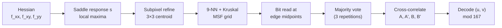

# Goal

Detect every corner of a PuzzleBoard calibration pattern in a grayscale image and assign each detected corner its absolute integer position on the pattern's $501 \times 501$ grid. Input: image $I: \Omega \to \mathbb{R}$ and the pattern's code array $C \in \{0,1,2,3\}^{501 \times 501}$. Output: a set of triples $\{(p_k, u_k, v_k)\}$ where $p_k \in \Omega$ is a subpixel corner location and $(u_k, v_k) \in \{0,\dots,500\}^2$ is that corner's grid coordinate on the pattern. The pattern is self-identifying: the absolute position of any corner is recovered from a local window, without seeing the pattern boundary, tolerating partial occlusion, severe perspective, and image resolution as low as roughly $3.3$ pixels per checkerboard edge.

# Algorithm

Let $I_x, I_y, I_{xx}, I_{xy}, I_{yy}$ denote the first- and second-order Gaussian-smoothed derivatives of $I$. Let

$$
H(x, y) = \begin{bmatrix} f_{xx} & f_{xy} \\ f_{xy} & f_{yy} \end{bmatrix}
$$

denote the Hessian at $(x, y)$, with shorthands $f_{xx} = I_{xx}(x, y)$, etc. A checkerboard corner is a saddle point of $I$ — a critical point where $H$ has eigenvalues of opposite sign.

Let $A \in \{0, 1\}^{3 \times 167}$ and $B \in \{0, 1\}^{167 \times 3}$ denote two cyclic binary sub-perfect maps in which every $3 \times 3$ window is unique. The pattern's code array is their superposition,

$$
C(u, v) = \bigl(\,A(u \bmod 3,\; v \bmod 167),\; B(u \bmod 167,\; v \bmod 3)\,\bigr)
\;\in\; \{0, 1\}^2 \cong \{0, 1, 2, 3\},
$$

cyclic of period $\operatorname{lcm}(3, 167) = 501$ in both axes. Every $3 \times 3$ window of $C$ is unique — two positions sharing a $3 \times 3$ window force equal windows on both factor maps, hence equal indices modulo $(3, 167)$ and $(167, 3)$, hence equal indices modulo $501$.

:::definition[Saddle response ($s$)]
A Hessian-based score, large at X-junctions where the two principal curvatures have opposite sign and balanced magnitudes.

$$
s = f_{xy}^{\,2} - f_{xx} f_{yy} - k\,(f_{xx} + f_{yy})^2.
$$

The default constant is $k = 1$. The first two terms equal $-\det(H)$, positive at saddles; the last term penalises the trace, suppressing blobs where both curvatures have the same sign.
:::

:::definition[Edge-bit encoding]
Each edge of the $501 \times 501$ checkerboard carries one bit of the code, rendered as a circle at the edge midpoint with diameter equal to $\tfrac{1}{3}$ of the edge length.

The $\tfrac{1}{3}$ ratio is the operational constant: under any perspective transform that does not collapse the checkerboard square into a line, the imaged midpoint of the edge lies within the imaged circle, so reading the bit reduces to a grayscale comparison at a known subpixel location.
:::


:::definition[Position decoding]
Given the observed pattern after bit-reading and majority voting, cross-correlate against the four sign-rotations of the factor maps — $A$, $A'$ (rotated $180^\circ$), $B$, $B'$ — at sizes $167 \times 333$ and $333 \times 167$. Let the peaks occur at $(x_A, y_A)$ and $(x_B, y_B)$ with ranges $x_A, y_B \in \{0, \dots, 166\}$ and $x_B, y_A \in \{0, 1, 2\}$. The detected code's top-left position on the $501 \times 501$ grid is

$$
\begin{aligned}
u &= x_A + 167 \cdot \bigl[(x_A - x_B) \bmod 3\bigr], \\
v &= y_B + 167 \cdot \bigl[(y_B - y_A) \bmod 3\bigr].
\end{aligned}
$$

The formula reconstructs the full position from a coarse-resolution index modulo $167$ (from each factor map) and a fine-resolution index modulo $3$ (from their disagreement).
:::

## Procedure

:::algorithm[PuzzleBoard detection and decoding]
::input[Grayscale image $I$; saddle constant $k = 1$; factor maps $A, B$ with $N = 167$; bit-read tolerance.]
::output[Set of $(p_k, u_k, v_k)$ triples: subpixel image location and absolute grid coordinate for each detected corner.]

1. Compute Gaussian-smoothed Hessian components $f_{xx}, f_{xy}, f_{yy}$ across $I$.
2. Compute the saddle response $s$ at every pixel. Retain pixels at which $s$ exceeds a threshold and is a local maximum.
3. Reject candidates that fail a centrosymmetric test on the surrounding intensities.
4. Refine each surviving candidate to subpixel position by grayscale centroid over a $3 \times 3$ neighborhood of the response map.
5. For each corner $p$, find its $9$ nearest neighbours. Separate direct grid neighbours from diagonal neighbours using the two Hessian eigenvector directions at $p$, which bisect the black/white sectors.
6. Build the corner graph with edge weights monotone in edge length and in the saddle response at the endpoints. Run Kruskal's algorithm with a union-find structure; at each merge, rotate one subtree so the two subtrees agree on a local axis orientation.
7. For each axial edge of the reconstructed grid, read one bit: compare the average grayscale at the two endpoints with the grayscale sampled at the subpixel edge midpoint.
8. Apply majority voting: the code repeats every three rows and every three columns, so each bit is observed three times along each axis.
9. Cross-correlate the read grid against $A, A', B, B'$. Pick the two strongest peaks, yielding $(x_A, y_A)$ and $(x_B, y_B)$.
10. Compute $(u, v)$ via the position-decoding formula; assign grid coordinates to every detected corner by offsetting from the decoded anchor.
:::



# Implementation

The saddle response is a per-pixel scalar in the Hessian components; position decoding is modular arithmetic on the cross-correlation peaks.

```rust
/// Hessian-based saddle response for every pixel (default k = 1).
fn saddle_response(fxx: &[f32], fxy: &[f32], fyy: &[f32], k: f32) -> Vec<f32> {
    fxx.iter().zip(fxy).zip(fyy)
        .map(|((&xx, &xy), &yy)| xy * xy - xx * yy - k * (xx + yy).powi(2))
        .collect()
}

/// Decode absolute position on the 501×501 grid from cross-correlation peaks.
/// x_a, y_b ∈ {0, …, 166};   x_b, y_a ∈ {0, 1, 2}.
fn decode_position(x_a: usize, y_a: usize, x_b: usize, y_b: usize) -> (usize, usize) {
    const N: usize = 167;
    let dx = (x_a as i32 - x_b as i32).rem_euclid(3) as usize;
    let dy = (y_b as i32 - y_a as i32).rem_euclid(3) as usize;
    (x_a + N * dx, y_b + N * dy)
}
```

The response kernel is arithmetic-only per pixel; the decoder is four modular operations per frame. The dominant cost of the full pipeline is the cross-correlation in step 9, quadratic in the detected-grid diameter.

# Remarks

- The saddle response uses the Hessian $H$ rather than the structure tensor. At a checkerboard X-junction, $H$ has eigenvalues of opposite sign — so $-\det(H) > 0$ — while a blob gives same-sign eigenvalues and a flat region gives near-zero eigenvalues. The $k \cdot \operatorname{tr}(H)^2$ term subtracts the blob component.
- Complexity is linear in image size: Hessian filtering, response evaluation, non-maximum suppression, and neighbour lookup each run in $O(|\Omega|)$; Kruskal's MSF runs in near-linear time in the corner count.
- Position encoding is local: a decoded grid coordinate uses a $3 \times 3$ window of bits (18 raw bits), so the pattern is self-identifying under occlusion as long as at least one such window is visible.
- Error tolerance: after majority voting across the three repetitions of every row and column, up to $40\%$ of the raw observed bits can be corrupted and the position still decodes correctly. The minimum Hamming distance between the correct alignment and any wrong alignment is $501$ bits.
- Minimum resolution: decoding succeeds at roughly $5$ pixels per checkerboard edge at full reliability, and recovers under error correction at $3.3$ pixels per edge — substantially below the resolution required by the classic checkerboard detectors.
- Backward compatibility: the edge-midpoint circles do not interfere with the saddle test, so a generic checkerboard corner detector still locates corners on a PuzzleBoard; the position decoding is an additive capability on top of standard calibration targets.

# References

1. P. Stelldinger, N. Schönherr, J. Biermann. *PuzzleBoard: A New Camera Calibration Pattern with Position Encoding.* arXiv:2409.20127, 2024. [arxiv.org/abs/2409.20127](https://arxiv.org/abs/2409.20127)
2. C. Harris, M. J. Stephens. *A Combined Corner and Edge Detector.* Alvey Vision Conference, 1988. DOI: [10.5244/c.2.23](https://doi.org/10.5244/c.2.23)
