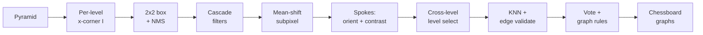

# Goal

Detect inner X-junction corners of a planar chessboard in a grayscale image and assemble them into one or more chessboard graphs. Input: a grayscale image $I : \Omega \to [0, 1]$ on pixel domain $\Omega \subset \mathbb{Z}^2$; optionally an expected pattern shape $(r, c)$. Output: a set of chessboard graphs, each an ordered grid of subpixel corner coordinates with the per-corner pyramid level. The detector targets high-resolution images, focus and motion blur, harsh lighting, and background clutter. Single-scale x-corner intensity functions degrade rapidly as the X-junction smears across pixels; this method evaluates the same intensity over every level of an image pyramid and selects, per corner, the level at which the corner is best resolved.

# Algorithm

Symbols.

- $I_\ell : \Omega_\ell \to [0, 1]$ — pyramid image at level $\ell$, with $\ell = 0$ at full resolution and $I_{\ell+1}$ a 2× downsample of $I_\ell$.
- $v[0..15]$ — sixteen ring samples around a candidate pixel, indexed cyclically (Figure 1 of the paper).
- $a, b, c, d, e, f, g, h$ — eight three-sample group sums constructed from $v$.
- $I(c, \ell)$ — x-corner intensity at corner candidate $c$ on level $\ell$.
- $\mathrm{contrast}(c)$ — corner contrast magnitude returned by the spoke orientation pass.
- $E^\perp_k$, $E^\parallel_k$ — perpendicular and longitudinal edge errors at the $k$-th sample on a candidate edge.

The eight group sums combine three consecutive ring samples each. Four groups are aligned with the cardinal directions on the ring, four are rotated by $45°$:

$$
\begin{aligned}
a &= v[0]+v[1]+v[2],   & b &= v[4]+v[5]+v[6], \\
c &= v[8]+v[9]+v[10],  & d &= v[12]+v[13]+v[14], \\
e &= v[2]+v[3]+v[4],   & f &= v[6]+v[7]+v[8], \\
g &= v[10]+v[11]+v[12], & h &= v[14]+v[15]+v[0].
\end{aligned}
$$

:::definition[xscore]
A symmetric four-point response that fires when opposite groups straddle the local mean by the same sign:

$$
\mathrm{xscore}(v_1, v_2, v_3, v_4) = (v_1 - \mu)(v_3 - \mu) + (v_2 - \mu)(v_4 - \mu),\quad \mu = \tfrac{1}{4}(v_1+v_2+v_3+v_4).
$$

Subtracting the local mean before the products yields affine lighting invariance.
:::

:::definition[X-corner intensity]
The ring response at a candidate pixel; partial rotation invariance comes from taking the maximum of two templates offset by $45°$:

$$
I = \max\bigl(\mathrm{xscore}(a, b, c, d),\ \mathrm{xscore}(e, f, g, h)\bigr).
$$
:::

:::definition[Pyramid level selection]
Given a corner $c$ observed at one or more levels with intensities $I(c, \ell)$, the chosen level is the one that maximises intensity per resolution:

$$
\ell^\ast(c) = \arg\max_{\ell} \frac{I(c, \ell)}{\ell + 1}.
$$

The denominator penalises higher pyramid levels and the maximum trades the strength of the corner response against its localisation precision at that scale.
:::

:::definition[Edge intensity score]
For an edge between corners $c_i$ and $c_j$, sample $K$ point pairs across the edge at spacing determined by the pyramid levels of $c_i$ and $c_j$. The perpendicular error $E^\perp_k = I_i - I_j$ measures intensity contrast across the edge and is maximised by high contrast; the longitudinal error $E^\parallel_k = |I_i - I_j|$ measures intensity similarity along the edge. Both arrays are sorted and the worst entries discarded. The edge score is

$$
L_{ij} = \frac{\sum_k E^\perp_k - E^\parallel_k}{\mathrm{contrast}(c_i) + \mathrm{contrast}(c_j)}.
$$

Level-dependent spacing keeps samples away from the smeared centre of edges incident to blurred corners; constant spacing produces a uniformly low score regardless of whether an edge exists.
:::

## Procedure

:::algorithm[Pyramidal blur-aware x-corner chessboard detection]
::input[Grayscale image $I$; pyramid level count $n$; intensity threshold $\theta$; nearest-neighbour count $k$; optional expected pattern shape $(r, c)$.]
::output[A set of chessboard graphs, each an $r' \times c'$ ordered grid of subpixel corner coordinates with per-corner pyramid level $\ell^\ast$.]

1. Build the pyramid $L = (I_0, I_1, \dots, I_{n-1})$.
2. For each level $I_\ell$:
   1. Convert to grayscale and rescale to $[0, 1]$; apply a $3 \times 3$ Gaussian blur.
   2. For every interior pixel, sample the sixteen ring values $v$ and compute the x-corner intensity $I$.
   3. Convolve $I$ with a $2 \times 2$ box kernel and apply a $(0.5, 0.5)$ pixel offset to break the symmetric two-maximum pattern of an ideal X-junction.
   4. Apply non-maximum suppression to $I$.
   5. Cascade filters: (a) reject pixels with $I$ below $\theta$ times the maximum on the top pyramid level; (b) reject if too many neighbours have positive $I$; (c) reject if the local up-down grayscale pattern around the corner is wrong; (d) Shi-Tomasi eigenvalue test on the structure tensor.
   6. Mean-shift refinement of each surviving corner in the intensity image.
   7. Compute orientation by integrating along $32$ spokes; pair each spoke with the one offset by $90°$ and smooth the resulting array with a Gaussian kernel; the orientation is the smoothed maximum, and the corner contrast is the magnitude of the best-orientation spoke difference.
3. For each persistent corner $c$, set $\ell^\ast(c)$ from the level-selection rule.
4. For each corner $c_i$, find its $k$ nearest neighbours $C_n$ in the same pyramid level or higher. For each $c_j \in C_n$:
   1. Discard if the orientations of $c_i$ and $c_j$ are not perpendicular.
   2. Sample a grid of points connecting $c_i$ and $c_j$ at level-dependent spacing.
   3. Compute the edge score $L_{ij}$; keep the connection if $L_{ij}$ exceeds threshold.
5. For each corner, vote on its connected neighbours; resolve ambiguity by selecting the connection that best fits perspective geometry and grid topology.
6. Discard ambiguous corners with insufficient votes.
7. Enforce grid graph properties: every corner must have $2$, $3$, or $4$ neighbours, and two adjacent neighbours must share exactly one common corner. Prune connections that violate either property.
8. Reorder each grid graph into a counter-clockwise chessboard graph: assign axes from corner orientation, anchor $(0, 0)$ to a corner square, and trim outer rows or columns with missing corners.
9. If the pattern shape $(r, c)$ is given, return only chessboard graphs of that shape; otherwise return all valid graphs.
:::



# Implementation

The per-pixel x-corner intensity in Rust:

```rust
fn xscore(v1: f32, v2: f32, v3: f32, v4: f32) -> f32 {
    let mu = 0.25 * (v1 + v2 + v3 + v4);
    (v1 - mu) * (v3 - mu) + (v2 - mu) * (v4 - mu)
}

fn x_corner_intensity(ring: &[f32; 16]) -> f32 {
    let a = ring[0]  + ring[1]  + ring[2];
    let b = ring[4]  + ring[5]  + ring[6];
    let c = ring[8]  + ring[9]  + ring[10];
    let d = ring[12] + ring[13] + ring[14];
    let e = ring[2]  + ring[3]  + ring[4];
    let f = ring[6]  + ring[7]  + ring[8];
    let g = ring[10] + ring[11] + ring[12];
    let h = ring[14] + ring[15] + ring[0];

    xscore(a, b, c, d).max(xscore(e, f, g, h))
}
```

The per-corner pyramid-level rule from Equation (2):

```rust
fn select_level(samples: &[(usize, f32)]) -> Option<usize> {
    samples
        .iter()
        .max_by(|(la, ia), (lb, ib)| {
            (ia / (*la as f32 + 1.0))
                .partial_cmp(&(ib / (*lb as f32 + 1.0)))
                .unwrap()
        })
        .map(|(level, _)| *level)
}
```

The intensity loop is the pixel hot path and is run once per pyramid level. Each call performs sixteen ring reads, eight three-element sums, two `xscore` evaluations, and one `max` — no trigonometry, no interpolation, no branches.

# Remarks

- Complexity per pyramid level is $O(|\Omega_\ell|)$ for the intensity pass; summed across the pyramid this is $O(\tfrac{4}{3}|\Omega_0|)$.
- The level-selection rule is the central blur-handling mechanism. A corner that responds weakly at level $0$ because of motion or focus blur is recovered at the lowest level where the response per resolution is maximal; choosing level $0$ unconditionally yields noise-dominated subpixel coordinates.
- The $2 \times 2$ box filter step is necessary because the two-template $\max$ admits two adjacent local maxima at an ideal X-junction; without it, non-maximum suppression picks one arbitrarily and subpixel refinement is unstable.
- Sample spacing along candidate edges is set per edge from the pyramid levels of its endpoints. Constant spacing samples the smeared centre of edges incident to blurred corners and produces a uniformly low score regardless of whether an edge exists.
- The detector returns one or more chessboard graphs and rejects graphs that do not match the requested shape; self-identifying patterns are out of scope and must be decoded by a downstream stage.
- Output metadata includes the chosen pyramid level per corner. This can be repurposed for autofocus diagnostics, per-corner uncertainty estimates, or rejection of blur-induced false positives.

# References

1. P. Abeles. *Pyramidal Blur Aware X-Corner Chessboard Detector.* arXiv:2110.13793, 2021. [arxiv.org/abs/2110.13793](https://arxiv.org/abs/2110.13793)
2. S. Placht, P. Fürsattel, E. A. Mengue, H. Hofmann, C. Schaller, M. Balda, E. Angelopoulou. *ROCHADE: Robust Checkerboard Advanced Detection for Camera Calibration.* ECCV, 2014. DOI: [10.1007/978-3-319-10593-2_50](https://doi.org/10.1007/978-3-319-10593-2_50)
3. S. Bennett, J. Lasenby. *ChESS — Quick and Robust Detection of Chess-board Features.* arXiv:1301.5491, 2013. [arxiv.org/abs/1301.5491](https://arxiv.org/abs/1301.5491)
4. L. Lucchese, S. K. Mitra. *Using saddle points for subpixel feature detection in camera calibration targets.* Asia Pacific Conference on Circuits and Systems, 2003. DOI: [10.1109/APCCAS.2002.1115151](https://doi.org/10.1109/apccas.2002.1115151)
5. J. Shi, C. Tomasi. *Good Features to Track.* IEEE CVPR, 1994. DOI: [10.1109/CVPR.1994.323794](https://doi.org/10.1109/cvpr.1994.323794)
