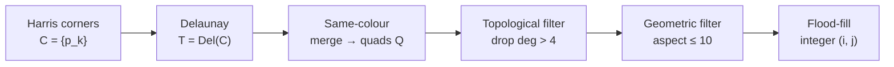

# Goal

Recover the position of every detected corner within the regular grid of a checkerboard calibration pattern. Input: a grayscale image $I: \Omega \to \mathbb{R}$ and a set of detected corner locations $C = \{p_k\} \subset \Omega$. Output: an integer coordinate $(i_k, j_k) \in \mathbb{Z}^2$ assigned to each corner that lies on the pattern grid, and a rejection flag for corners that do not. The method uses only the topology of a Delaunay triangulation of $C$ — it does not fit lines to pattern edges, tolerates curved edges from radial distortion, and handles partial occlusion of the pattern.

# Algorithm

Let $C = \{p_k\} \subset \mathbb{R}^2$ denote the image corner locations. Let $T = \operatorname{Del}(C)$ denote the Delaunay triangulation of $C$ — the unique triangulation in which every triangle's circumcircle contains no point of $C$. Let each triangle $t \in T$ carry an interior colour $\bar c(t) = \operatorname{mean}_{q \in \operatorname{int}(t)} I(q)$, averaged over pixels at a small distance from the triangle edges. Let $Q$ denote the quadrilateral mesh obtained by merging triangle pairs as defined below, and let $\deg_Q(n)$ denote the edge-degree of node $n$ in $Q$.

:::definition[Same-colour merge]
Two Delaunay triangles $t_1, t_2$ sharing an edge are merged into a quadrilateral when their interior means agree under a fixed tolerance $\tau$:

$$
|\,\bar c(t_1) - \bar c(t_2)\,| \leq \tau.
$$

Under the checkerboard pattern, every interior triangle has exactly one same-colour edge-neighbour; pairs that pass the test correspond to a black or white tile.
:::

:::definition[Topological legality]
A quadrilateral $q \in Q$ is topologically legal when fewer than two of its four nodes carry edge-degree greater than $4$ in $Q$:

$$
\bigl|\,\{\,n \in q : \deg_Q(n) > 4\,\}\,\bigr| < 2.
$$

The grid has every interior node at degree $4$ and every boundary node at degree $2$ or $3$; any node of degree $\geq 5$ is a spurious corner from the scene background or pattern-interior noise.
:::

:::definition[Geometric legality]
A quadrilateral $q$ with opposite edges $(e_1, e_3)$ and $(e_2, e_4)$ is geometrically legal when both opposite-edge length ratios stay below $10$:

$$
\frac{\max(|e_1|, |e_3|)}{\min(|e_1|, |e_3|)} \leq 10
\quad\text{and}\quad
\frac{\max(|e_2|, |e_4|)}{\min(|e_2|, |e_4|)} \leq 10.
$$

The constant $10$ is deliberately conservative — an imaged tile stays within it until the camera points at the pattern at a grazing angle, at which point the upstream corner detection is already unreliable.
:::

:::definition[Coordinate propagation]
Given a seed quad with assigned node coordinates and a neighbour quad sharing edge $(n_s, n_e)$, the four node coordinates of the neighbour are fixed by finding the slot $i$ of $n_s$ in the neighbour and assigning:

$$
\begin{aligned}
N_i &= (n_s.x,\; n_s.y), \\
N_{(i+1)\bmod 4} &= (n_s.x + 1,\; n_s.y), \\
N_{(i+2)\bmod 4} &= (n_s.x + 1,\; n_s.y + 1), \\
N_{(i+3)\bmod 4} &= (n_s.x,\; n_s.y + 1).
\end{aligned}
$$

The assignment is purely topological — it uses only the shared-edge indices, not pixel geometry — so it survives radial distortion and perspective foreshortening.
:::

## Procedure

:::algorithm[Topological grid finding]
::input[Grayscale image $I$; corner set $C$; colour tolerance $\tau$; aspect-ratio bound $r_{\max} = 10$; degree bound $d_{\max} = 4$.]
::output[A partial map $\Phi: C \to \mathbb{Z}^2$ assigning integer grid coordinates to corners on the pattern; the remaining corners are rejected.]

1. Compute $T = \operatorname{Del}(C)$.
2. For each triangle $t \in T$, compute $\bar c(t)$ by averaging $I$ over pixels at distance $\geq \delta$ from the triangle edges.
3. For each triangle $t$, merge with its single edge-neighbour $t'$ that satisfies $|\bar c(t) - \bar c(t')| \leq \tau$. Emit a quadrilateral; discard triangles with no same-colour neighbour.
4. Construct the quad mesh $Q$ and compute $\deg_Q(n)$ for every node $n$.
5. Drop every $q \in Q$ that fails topological legality.
6. Drop every remaining $q$ whose opposite-edge length ratio exceeds $r_{\max}$.
7. Drop connected components of $Q$ with a small number of quads.
8. Pick any surviving quad as seed; assign its four nodes coordinates $(0, 0), (1, 0), (1, 1), (0, 1)$.
9. Flood-fill the remaining quads: for each unlabelled quad adjacent to a labelled one through edge $(n_s, n_e)$, apply coordinate propagation. Each quad is visited exactly once.
10. Locate the three marker circles on the pattern, read off the origin and x-axis direction, and transform the labelled coordinates into the reference frame.
:::



# Implementation

The three legality tests and the coordinate propagation step translate directly from the definitions above.

```rust
type Node = (i32, i32);

struct Quad {
    nodes: [NodeId; 4],     // indices into the mesh's node array
    coords: [Option<Node>; 4],
}

fn is_topologically_legal(q: &Quad, deg: &[u32]) -> bool {
    q.nodes.iter().filter(|&&n| deg[n as usize] > 4).count() < 2
}

fn is_geometrically_legal(edge_len: [f32; 4], r_max: f32) -> bool {
    let ratio = |a: f32, b: f32| a.max(b) / a.min(b);
    ratio(edge_len[0], edge_len[2]) <= r_max
        && ratio(edge_len[1], edge_len[3]) <= r_max
}

fn propagate(next: &mut Quad, ns_slot: usize, ns_coord: Node) {
    let (x, y) = ns_coord;
    next.coords[ns_slot]             = Some((x,     y));
    next.coords[(ns_slot + 1) % 4]   = Some((x + 1, y));
    next.coords[(ns_slot + 2) % 4]   = Some((x + 1, y + 1));
    next.coords[(ns_slot + 3) % 4]   = Some((x,     y + 1));
}
```

The flood-fill outer loop enqueues each quad once — every labelled quad pushes its three edge-neighbours; the queue is drained in $O(|Q|)$ time, and $|Q|$ is linear in the corner count.

# Remarks

- Complexity: $O(n)$ in the number of corners. Delaunay triangulation is $O(n \log n)$ in the worst case and near-linear in practice; every subsequent stage — merge, filter, flood-fill — visits each triangle or quad a constant number of times.
- Topological tests are threshold-free and run before geometric tests. The degree test uses the integer grid property $\deg_Q(n) \leq 4$; the aspect-ratio and connected-component tests rely on numerical thresholds and are applied only to what survives.
- Radial distortion does not affect labelling. Curved grid edges alter pixel geometry but not Delaunay adjacency, and coordinate propagation uses only adjacency.
- The detector fails at extreme viewing angles (roughly $\leq 10^{\circ}$ from the pattern plane) where Delaunay triangulation crosses tile boundaries instead of diagonalizing them. At such angles the upstream corner detector is also unreliable.
- Delaunay triangulation is not projective-invariant in general; the algorithm's practical robustness is empirical rather than a theorem. Extreme projective transforms can flip a diagonal and produce misaligned quads even when every corner is detected.
- The method is agnostic to the corner detector used in step 1. Any detector that produces subpixel corner locations on pattern intersections feeds the Delaunay stage identically.

# References

1. C. Shu, A. Brunton, M. A. Fiala. *A topological approach to finding grids in calibration patterns.* Machine Vision and Applications, 2009. DOI: [10.1007/s00138-009-0202-2](https://doi.org/10.1007/s00138-009-0202-2)
2. C. Harris, M. J. Stephens. *A Combined Corner and Edge Detector.* Alvey Vision Conference, 1988. DOI: [10.5244/c.2.23](https://doi.org/10.5244/c.2.23)
