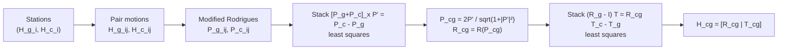

# Goal

Given $N \geq 3$ stations at which a robot pauses with a rigidly mounted camera and observes a fixed calibration target, compute the constant homogeneous transform $H_{cg} \in SE(3)$ from the camera frame $C$ to the gripper frame $G$. The inputs at each station $i$ are the gripper-to-base pose $H_{g_i}$ from robot kinematics and the target-to-camera pose $H_{c_i}$ from extrinsic camera calibration. The algorithm reduces the problem to the homogeneous matrix equation $A X = X B$ on station-pair motions, splits it into a rotation block and a translation block, and solves each by linear least squares.

# Algorithm

Let $H = \begin{bmatrix} R & T \\ 0 & 1 \end{bmatrix} \in SE(3)$ denote a homogeneous transform with rotation $R \in SO(3)$ and translation $T \in \mathbb{R}^3$. Write $[v]_\times$ for the skew-symmetric matrix associated with $v \in \mathbb{R}^3$, so that $[v]_\times w = v \times w$.

For station $i \in \{1, \ldots, N\}$:

- $H_{g_i} = \begin{bmatrix} R_{g_i} & T_{g_i} \\ 0 & 1 \end{bmatrix}$ — gripper-to-base, from robot encoders.
- $H_{c_i} = \begin{bmatrix} R_{c_i} & T_{c_i} \\ 0 & 1 \end{bmatrix}$ — target-to-camera, from extrinsic calibration of the image taken at station $i$.
- $H_{cg} = \begin{bmatrix} R_{cg} & T_{cg} \\ 0 & 1 \end{bmatrix}$ — camera-to-gripper, the unknown.

For each pair $(i, j)$ define the inter-station gripper motion $H_{g_{ij}} = H_{g_j}^{-1} H_{g_i}$ and the inter-station camera motion $H_{c_{ij}} = H_{c_j} H_{c_i}^{-1}$ (the inverse positions reflect the directions of $H_{g}$ and $H_{c}$). Closing the loop $G_i \to C_i \to C_j \to G_j$ yields the underlying constraint

$$
H_{g_{ij}} \, H_{cg} \;=\; H_{cg} \, H_{c_{ij}},
$$

which decomposes into

$$
R_{g_{ij}} R_{cg} = R_{cg} R_{c_{ij}}, \qquad
R_{g_{ij}} T_{cg} + T_{g_{ij}} = R_{cg} T_{c_{ij}} + T_{cg}.
$$


:::definition[Modified Rodrigues vector $P_r$]
A 3-vector that encodes a rotation by angle $\theta$ around unit axis $n$, used in place of $R$ to keep the unknown count fixed at three.

$$
P_r = 2 \sin\!\tfrac{\theta}{2}\,n, \qquad 0 \leq \theta \leq \pi.
$$
:::

:::definition[Rotation matrix from $P_r$]
Reconstructs $R \in SO(3)$ from $P_r$ without trigonometric calls.

$$
R = \Bigl(1 - \tfrac{|P_r|^2}{2}\Bigr) I + \tfrac{1}{2}\Bigl(P_r P_r^T + \alpha \, [P_r]_\times\Bigr),
\qquad
\alpha = \sqrt{4 - |P_r|^2}.
$$
:::

Write $P_{g_{ij}}$, $P_{c_{ij}}$, $P_{cg}$ for the modified Rodrigues vectors of $R_{g_{ij}}$, $R_{c_{ij}}$, $R_{cg}$. The rotation block of $AX=XB$ admits a linear constraint on an unscaled axis $P_{cg}'$ that is parallel to $P_{cg}$ and grows as $\tan(\theta_{cg}/2)\,n_{cg}$:

:::definition[Rotation constraint]
For each station pair $(i, j)$, $P_{cg}'$ satisfies a linear equation in which only the inter-station Rodrigues vectors appear.

$$
[\,P_{g_{ij}} + P_{c_{ij}}\,]_\times \; P_{cg}' \;=\; P_{c_{ij}} - P_{g_{ij}}.
$$
:::

:::definition[Translation constraint]
Once $R_{cg}$ is known, $T_{cg}$ satisfies one linear equation per station pair.

$$
\bigl(R_{g_{ij}} - I\bigr)\,T_{cg} \;=\; R_{cg} T_{c_{ij}} - T_{g_{ij}}.
$$
:::

The skew matrix $[P_{g_{ij}} + P_{c_{ij}}]_\times$ has rank 2, and so does $R_{g_{ij}} - I$. Each station pair contributes only two independent rows; at least two pairs (i.e. three stations) are required to determine a unique solution.

:::algorithm[Tsai-Lenz hand-eye calibration]
::input[Station observations $\{(H_{g_i}, H_{c_i})\}_{i=1}^{N}$ with $N \geq 3$.]
::output[Camera-to-gripper transform $H_{cg} = \begin{bmatrix} R_{cg} & T_{cg} \\ 0 & 1 \end{bmatrix}$.]

1. Choose $M \geq 2$ station pairs $(i, j)$. Prefer pairs with large rotation angles and pairwise non-parallel axes.
2. For each pair, compute $H_{g_{ij}} = H_{g_j}^{-1} H_{g_i}$ and $H_{c_{ij}} = H_{c_j} H_{c_i}^{-1}$. Convert $R_{g_{ij}}$ and $R_{c_{ij}}$ to modified Rodrigues vectors $P_{g_{ij}}$ and $P_{c_{ij}}$.
3. Stack the rotation constraint over all pairs into a $3M \times 3$ system $A_R\,P_{cg}' = b_R$ and solve by linear least squares.
4. Recover the modified Rodrigues vector and rotation matrix:

   $$
   P_{cg} = \frac{2\,P_{cg}'}{\sqrt{1 + |P_{cg}'|^2}}, \qquad R_{cg} = R(P_{cg}).
   $$
5. Stack the translation constraint over all pairs into a $3M \times 3$ system $A_T\,T_{cg} = b_T$ and solve by linear least squares.
6. Special case: if $P_{g_{ij}} + P_{c_{ij}}$ is collinear across pairs while $P_{g_{ij}}$ varies, then $\theta_{cg} = \pi$ and $n_{cg}$ is parallel to $P_{g_{ij}} + P_{c_{ij}}$; assemble $P_{cg} = 2 \sin(\pi/2)\,n_{cg} = 2 n_{cg}$ directly, then proceed to step 5.
:::



# Implementation

Two-stage solver in Rust. The same matrix is filled twice — once for the rotation system, once for the translation system — and solved with a least-squares pseudoinverse. The lines map directly to steps 3–5 of the procedure.

```rust
use nalgebra::{DMatrix, DVector, Matrix3, Vector3};

fn skew(v: &Vector3<f64>) -> Matrix3<f64> {
    Matrix3::new(
        0.0,  -v.z,  v.y,
        v.z,   0.0, -v.x,
       -v.y,   v.x,  0.0,
    )
}

fn rodrigues_of(r: &Matrix3<f64>) -> Vector3<f64> {
    let cos_t = ((r.trace() - 1.0) * 0.5).clamp(-1.0, 1.0);
    let theta = cos_t.acos();
    if theta.abs() < 1e-12 { return Vector3::zeros(); }
    let axis = Vector3::new(r[(2,1)] - r[(1,2)],
                            r[(0,2)] - r[(2,0)],
                            r[(1,0)] - r[(0,1)]) / (2.0 * theta.sin());
    2.0 * (theta * 0.5).sin() * axis
}

fn rot_from_rodrigues(p: &Vector3<f64>) -> Matrix3<f64> {
    let n2 = p.norm_squared();
    let alpha = (4.0 - n2).max(0.0).sqrt();
    (1.0 - 0.5 * n2) * Matrix3::identity()
        + 0.5 * (p * p.transpose() + alpha * skew(p))
}

fn solve_handeye(pairs: &[(Matrix3<f64>, Vector3<f64>,
                          Matrix3<f64>, Vector3<f64>)])
    -> (Matrix3<f64>, Vector3<f64>)
{
    let m = pairs.len();
    let mut a = DMatrix::<f64>::zeros(3 * m, 3);
    let mut b = DVector::<f64>::zeros(3 * m);
    for (k, (rg, _tg, rc, _tc)) in pairs.iter().enumerate() {
        let pg = rodrigues_of(rg);
        let pc = rodrigues_of(rc);
        a.fixed_view_mut::<3, 3>(3 * k, 0).copy_from(&skew(&(pg + pc)));
        b.fixed_rows_mut::<3>(3 * k).copy_from(&(pc - pg));
    }
    let p_prime = a.svd(true, true).solve(&b, 1e-9).unwrap();
    let p_prime = Vector3::new(p_prime[0], p_prime[1], p_prime[2]);
    let p_cg = (2.0 / (1.0 + p_prime.norm_squared()).sqrt()) * p_prime;
    let r_cg = rot_from_rodrigues(&p_cg);

    for (k, (rg, tg, _rc, tc)) in pairs.iter().enumerate() {
        a.fixed_view_mut::<3, 3>(3 * k, 0).copy_from(&(rg - Matrix3::identity()));
        b.fixed_rows_mut::<3>(3 * k).copy_from(&(r_cg * tc - tg));
    }
    let t_cg = a.svd(true, true).solve(&b, 1e-9).unwrap();
    (r_cg, Vector3::new(t_cg[0], t_cg[1], t_cg[2]))
}
```

# Remarks

- Two-stage decoupling makes the rotation independent of the translation but couples the translation error to the rotation error: the residual on $T_{cg}$ inherits any bias in $R_{cg}$ through the $R_{cg} T_{c_{ij}}$ term in step 5.
- Minimum three stations (two motion pairs); uniqueness requires the inter-station rotation axes to be non-collinear across pairs. Pairs with rotation angles close to zero contribute almost no information — both $[P_g + P_c]_\times$ and $R_g - I$ vanish in that limit.
- The modified Rodrigues parametrisation is singularity-free for $\theta \in [0, \pi)$ but degenerates at $\theta = \pi$, where $P_r$ is well-defined ($|P_r| = 2$) but the recovery formula in step 4 has to be replaced by the explicit branch in step 6.
- Computational cost is dominated by the two $3M \times 3$ least-squares solves and is $O(M)$ in the number of station pairs.
- The decoupled formulation amplifies translation error when the camera baseline between stations is short relative to the target depth; simultaneous rotation-and-translation solvers (Park-Martin on the Lie algebra, Daniilidis dual-quaternion) treat the residual jointly and tend to be more robust under that regime.

# References

1. R. Y. Tsai and R. K. Lenz. *A new technique for fully autonomous and efficient 3D robotics hand/eye calibration.* IEEE Transactions on Robotics and Automation 5(3):345–358, 1989. [pdf](https://kmlee.gatech.edu/me6406/handeye.pdf)
2. Y. C. Shiu and S. Ahmad. *Calibration of wrist-mounted robotic sensors by solving homogeneous transform equations of the form AX=XB.* IEEE Transactions on Robotics and Automation 5(1):16–29, 1989. [doi](https://doi.org/10.1109/70.88014)
3. R. Y. Tsai. *A versatile camera calibration technique for high-accuracy 3D machine vision metrology using off-the-shelf TV cameras and lenses.* IEEE Journal on Robotics and Automation 3(4):323–344, 1987. [pdf](https://cecas.clemson.edu/~stb/ece847/internal/classic_vision_papers/tsai_calibration1987.pdf)
