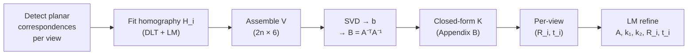

# Goal

Given $n \geq 3$ images of a planar target with known metric coordinates, compute the camera intrinsic matrix $A \in \mathbb{R}^{3 \times 3}$, two radial distortion coefficients $(k_1, k_2)$, and the per-view rigid pose $(R_i, t_i) \in SO(3) \times \mathbb{R}^3$. No 3D calibration object is required and the motion between views need not be known; the pattern and the camera may move freely relative to each other. The defining property is a closed-form linear initialization that turns each view's plane-to-image homography into two linear constraints on the image of the absolute conic.

# Algorithm

Let $I$ be an image of a planar target. Let $M = [X, Y, 0]^T$ denote a target point in the world frame (plane on $Z = 0$) and $m = [u, v]^T$ its image projection; their homogeneous forms are $\tilde M$ and $\tilde m$.

The pinhole model with intrinsic matrix $A$ and extrinsic $[R \mid t]$ reads

$$
s\,\tilde m = A \begin{bmatrix} r_1 & r_2 & r_3 & t \end{bmatrix} \tilde M,
\qquad
A = \begin{bmatrix} \alpha & \gamma & u_0 \\ 0 & \beta & v_0 \\ 0 & 0 & 1 \end{bmatrix},
$$

where $r_i$ is the $i$-th column of $R$, $(u_0, v_0)$ is the principal point, $(\alpha, \beta)$ are axis scale factors, and $\gamma$ is the skew. Since $Z = 0$, the third column of $R$ drops out and the model collapses to a $3 \times 3$ homography

$$
s\,\tilde m = H \tilde M, \qquad H = \begin{bmatrix} h_1 & h_2 & h_3 \end{bmatrix} = \lambda\,A \begin{bmatrix} r_1 & r_2 & t \end{bmatrix},
$$

with $\lambda$ an unknown non-zero scalar absorbing the homography's scale ambiguity.

:::definition[Image of the absolute conic (IAC)]
A symmetric $3 \times 3$ matrix encoding the intrinsic parameters; its vectorisation $b$ is what the linear step estimates.

$$
B = A^{-T} A^{-1},
\qquad
b = \bigl[B_{11},\; B_{12},\; B_{22},\; B_{13},\; B_{23},\; B_{33}\bigr]^T.
$$
:::

:::definition[Constraint vector $v_{ij}$]
The row induced by $h_i^T B h_j = v_{ij}^T b$; two such rows per homography constrain $b$.

$$
v_{ij} = \bigl[\,h_{i1}h_{j1},\; h_{i1}h_{j2} + h_{i2}h_{j1},\; h_{i2}h_{j2},\; h_{i3}h_{j1} + h_{i1}h_{j3},\; h_{i3}h_{j2} + h_{i2}h_{j3},\; h_{i3}h_{j3}\,\bigr]^T.
$$
:::

Orthonormality of $r_1$ and $r_2$ yields two linear constraints on $b$ per view:

$$
v_{12}^T\,b = 0, \qquad \bigl(v_{11} - v_{22}\bigr)^T b = 0.
$$

Stacking the rows from $n$ views produces a $2n \times 6$ matrix $V$ and the homogeneous system $V b = 0$.

:::algorithm[Zhang's planar calibration]
::input[Images $\{I_i\}_{i=1}^n$ with $n \geq 3$ of a planar target at different orientations; correspondences $\{(M_j, m_{ij})\}$ in each view.]
::output[Intrinsics $A$, radial distortion $(k_1, k_2)$, per-view extrinsics $\{(R_i, t_i)\}_{i=1}^n$.]

1. For each view $i$, estimate the homography $H_i$ by DLT on normalized point coordinates followed by Levenberg-Marquardt refinement of the geometric reprojection error.
2. For each $H_i$, build the row pair $v_{12}^T$ and $(v_{11} - v_{22})^T$; stack them into $V \in \mathbb{R}^{2n \times 6}$. If $n = 2$, append the zero-skew row $[0, 1, 0, 0, 0, 0]$.
3. Solve $V b = 0$ by SVD of $V$; take $b$ as the right singular vector associated with the smallest singular value.
4. Recover the intrinsics from $b$ in closed form:

   $$
   \begin{aligned}
   v_0 &= \frac{B_{12} B_{13} - B_{11} B_{23}}{B_{11} B_{22} - B_{12}^2}, \\
   \eta &= B_{33} - \frac{B_{13}^2 + v_0 (B_{12} B_{13} - B_{11} B_{23})}{B_{11}}, \\
   \alpha &= \sqrt{\eta / B_{11}}, \\
   \beta &= \sqrt{\eta B_{11} / (B_{11} B_{22} - B_{12}^2)}, \\
   \gamma &= -B_{12} \alpha^2 \beta / \eta, \\
   u_0 &= \gamma v_0 / \beta - B_{13} \alpha^2 / \eta.
   \end{aligned}
   $$

5. For each view, set $\lambda_i = 1 / \lVert A^{-1} h_1^{(i)} \rVert$ and

   $$
   r_1^{(i)} = \lambda_i A^{-1} h_1^{(i)}, \quad
   r_2^{(i)} = \lambda_i A^{-1} h_2^{(i)}, \quad
   r_3^{(i)} = r_1^{(i)} \times r_2^{(i)}, \quad
   t_i = \lambda_i A^{-1} h_3^{(i)}.
   $$

   Project $[r_1^{(i)}\;r_2^{(i)}\;r_3^{(i)}]$ to $SO(3)$ by SVD ($R = UV^T$).
6. Initialise $k_1 = k_2 = 0$ (or by linear least squares on the residuals of the distortion-free model).
7. Refine $(A, k_1, k_2, \{R_i, t_i\})$ by Levenberg-Marquardt minimisation of the total reprojection error

   $$
   \sum_{i=1}^{n} \sum_{j=1}^{m} \bigl\lVert\, m_{ij} - \breve m\bigl(A, k_1, k_2, R_i, t_i, M_j\bigr)\bigr\rVert^2,
   $$

   where $\breve m$ is the pinhole projection of $M_j$ followed by radial distortion

   $$
   \breve u = u + (u - u_0)\bigl[k_1 r^2 + k_2 r^4\bigr], \qquad r^2 = x^2 + y^2,
   $$

   with $(x, y)$ the normalised image coordinates and the analogous expression for $\breve v$.
:::



# Implementation

The linear initialization — building $V$ from homographies and extracting $A$ from the right null vector — in Rust:

```rust
use nalgebra::{Matrix3, Matrix6xX, Vector6, DMatrix};

fn v_row(h: &Matrix3<f64>, i: usize, j: usize) -> Vector6<f64> {
    let (hi, hj) = (h.column(i), h.column(j));
    Vector6::new(
        hi[0]*hj[0],
        hi[0]*hj[1] + hi[1]*hj[0],
        hi[1]*hj[1],
        hi[2]*hj[0] + hi[0]*hj[2],
        hi[2]*hj[1] + hi[1]*hj[2],
        hi[2]*hj[2],
    )
}

fn intrinsics_from_homographies(hs: &[Matrix3<f64>]) -> Matrix3<f64> {
    let mut v = DMatrix::<f64>::zeros(2 * hs.len(), 6);
    for (i, h) in hs.iter().enumerate() {
        let v12 = v_row(h, 0, 1);
        let d   = v_row(h, 0, 0) - v_row(h, 1, 1);
        v.row_mut(2*i    ).copy_from(&v12.transpose());
        v.row_mut(2*i + 1).copy_from(&d.transpose());
    }
    let svd = v.svd(false, true);
    let vt  = svd.v_t.expect("right singular vectors");
    let b   = vt.row(vt.nrows() - 1);
    let (b11, b12, b22, b13, b23, b33) =
        (b[0], b[1], b[2], b[3], b[4], b[5]);

    let den  = b11 * b22 - b12 * b12;
    let v0   = (b12 * b13 - b11 * b23) / den;
    let eta  = b33 - (b13 * b13 + v0 * (b12 * b13 - b11 * b23)) / b11;
    let alpha = (eta / b11).sqrt();
    let beta  = (eta * b11 / den).sqrt();
    let gamma = -b12 * alpha * alpha * beta / eta;
    let u0    = gamma * v0 / beta - b13 * alpha * alpha / eta;

    Matrix3::new(
        alpha, gamma, u0,
        0.0,   beta,  v0,
        0.0,   0.0,   1.0,
    )
}
```

The per-view pose from $(A, H)$, with the final rotation projected to $SO(3)$:

```rust
fn pose_from_homography(a_inv: &Matrix3<f64>, h: &Matrix3<f64>)
    -> (Matrix3<f64>, nalgebra::Vector3<f64>)
{
    let lambda = 1.0 / (a_inv * h.column(0)).norm();
    let r1 = lambda * (a_inv * h.column(0));
    let r2 = lambda * (a_inv * h.column(1));
    let r3 = r1.cross(&r2);
    let t  = lambda * (a_inv * h.column(2));
    let q  = Matrix3::from_columns(&[r1, r2, r3]);
    let svd = q.svd(true, true);
    let r = svd.u.unwrap() * svd.v_t.unwrap();
    (r, t)
}
```

Nonlinear refinement of $(A, k_1, k_2, \{R_i, t_i\})$ over the total reprojection error is standard Levenberg-Marquardt and is not reproduced here; the rotations are parameterised by the Rodrigues 3-vector to keep the Jacobian unconstrained.

# Remarks

- Complexity per calibration is dominated by the per-view homography fit ($O(N)$ in the number of correspondences) and the closed-form $2n \times 6$ SVD of $V$; the LM refinement is $O(n \cdot m)$ per iteration in the image count $n$ and target-point count $m$.
- The linear step minimises an algebraic distance on $b$ and does not enforce positive definiteness of $B$; the recovered $\alpha, \beta$ can turn imaginary under heavy noise. The LM stage on the geometric reprojection error is what delivers calibration-grade accuracy — the closed form supplies the initial guess only.
- Parallel orientations of the planar target are degenerate: a second view obtained from the first by a rotation about the plane normal (and any translation) contributes constraints linearly dependent on those of the first view.
- Minimum view count depends on which intrinsics are fixed: $n \geq 3$ for the full five-parameter $A$, $n \geq 2$ with skew fixed to $\gamma = 0$, and $n = 1$ can only solve two parameters (typical choice: $(\alpha, \beta)$ with principal point at the image centre).
- Distortion scope is two-term radial only; tangential (decentering) and thin-prism terms belong to the Brown-Conrady / Weng model and are a drop-in extension of the projection function $\breve m$ and its Jacobian in the LM step.

# References

1. Z. Zhang. *A Flexible New Technique for Camera Calibration.* MSR-TR-98-71 (also IEEE TPAMI 22(11), 2000). [pdf](https://www.microsoft.com/en-us/research/wp-content/uploads/2016/02/tr98-71.pdf)
2. R. Y. Tsai. *A versatile camera calibration technique for high-accuracy 3D machine vision metrology using off-the-shelf TV cameras and lenses.* IEEE Journal on Robotics and Automation 3(4):323–344, 1987. [pdf](https://cecas.clemson.edu/~stb/ece847/internal/classic_vision_papers/tsai_calibration1987.pdf)
3. P. Sturm and S. J. Maybank. *On plane-based camera calibration: A general algorithm, singularities, applications.* IEEE CVPR, 1999. [pdf](https://inria.hal.science/inria-00525681/document)
4. J. Weng, P. Cohen, and M. Herniou. *Camera calibration with distortion models and accuracy evaluation.* IEEE TPAMI 14(10):965–980, 1992. [pdf](https://www.cs.auckland.ac.nz/courses/compsci773s1c/lectures/camera%20distortion.pdf)
