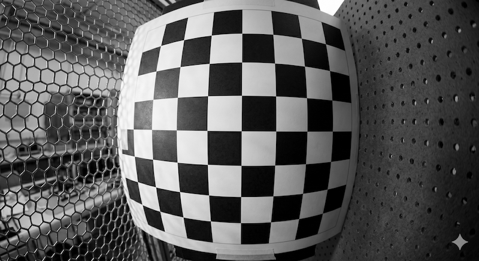
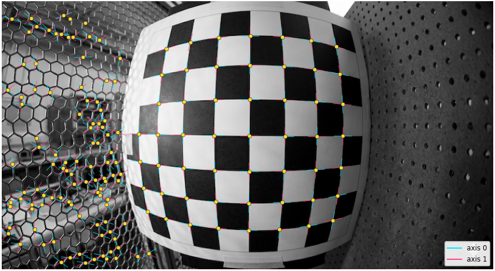
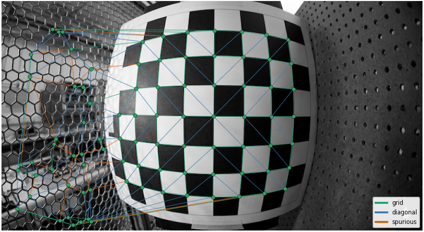
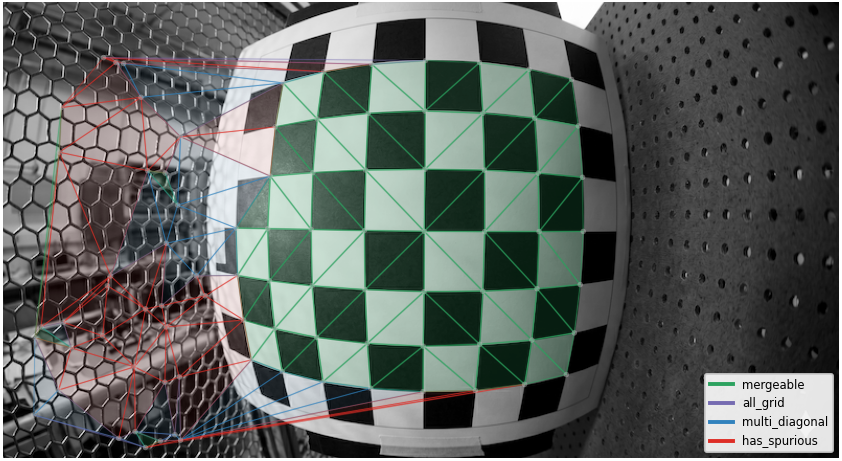
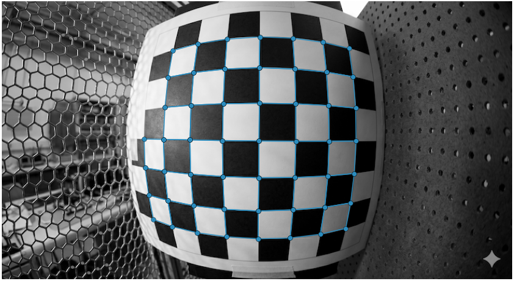
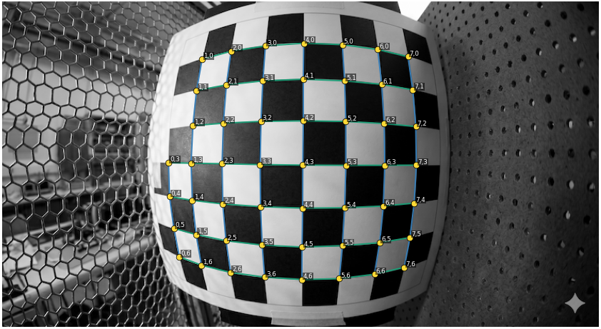
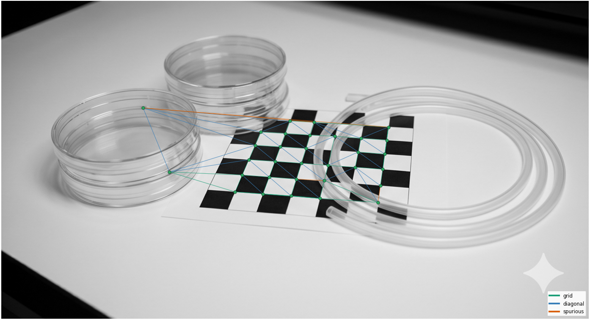
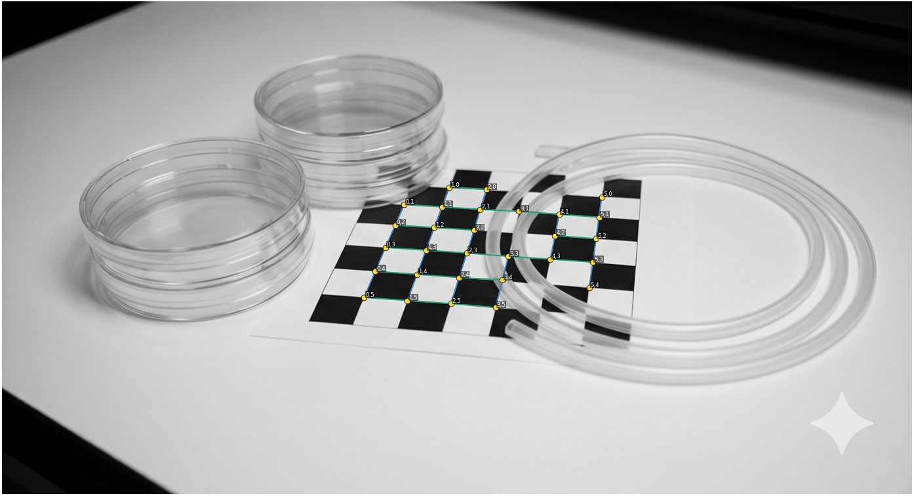
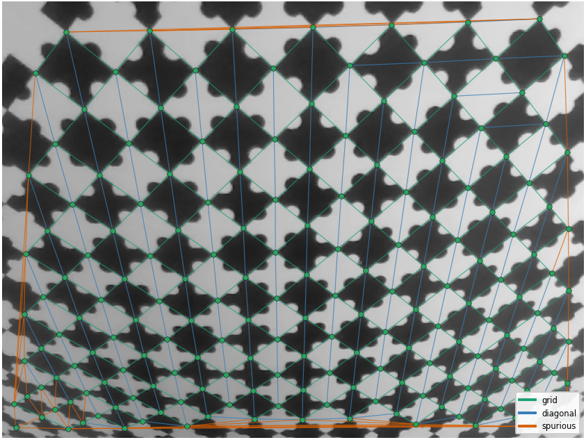
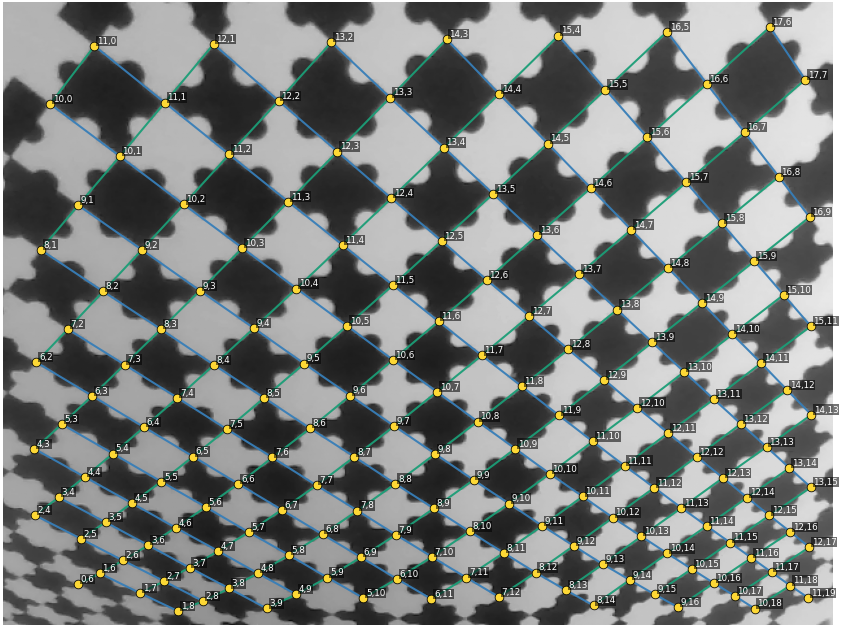

# 1. Introduction

The [previous post](blog/01-chesscorners) showed how to detect chessboard corners with [ChESS response](atlas/chess-corners). That gives a sparse set of X-junctions, each with two local grid axes. Some may be missing and some may be false positives. This post covers what comes next: connecting neighboring corners, rejecting inconsistent detections, and assigning integer grid coordinates to the connected points.

The setups I care about are partially visible or occluded boards under strong lens distortion. This rules out detectors that require the full requested pattern to be visible, including OpenCV's `findChessboardCornersSB`. It also makes global lines or a homography model not applicable.

The approach is topological, inspired by [Topological Grid Finding](atlas/shu-topological-grid). It is also the idea behind the topological grid finder in the [projective-grid](https://crates.io/crates/projective-grid) crate.

> maybe delete this paragraph?
The method starts locally. It first connects nearby corners into plausible cells, then uses the grid topology to remove inconsistent detections and assign integer coordinates. Geometric models such as homographies or grid lines can still be used later, after the structure is known.

We will use this image to illustrate all the steps.

# 2. Grid as a graph

We start from a set of candidate X-junctions like the ones shown below (I use [my implementation](https://github.com/VitalyVorobyev/chess-corners-rs) of X-junction detector that provides local grid orientations, also indicated in the overlay).

Now the problem becomes combinatorial. We need to decide which corners are neighbors, which groups of four corners form grid cells, and how to assign consistent integer coordinates to all connected corners.

This is naturally a graph problem:

- detected corners are nodes,
- possible neighbor relations are edges,
- grid cells are quadrilaterals,
- the recovered board is a connected component with regular grid topology.

The topological approach starts by building a candidate graph from the detected points. This graph does not need to be perfect. It only needs to contain enough correct local connections so that invalid edges and false detections can be removed later.

## Delaunay triangulation as a candidate graph

[Shu, Brunton, and Fiala](atlas/shu-topological-grid) suggest starting with Delaunay triangulation of the detected corners.

:::definition[Delaunay triangulation]
Delaunay triangulation connects a set of points into triangles such that no point lies inside the circumcircle of any triangle.
:::

This is useful because Delaunay triangulation tends to connect nearby points. For a regular grid, it usually contains the true neighbor connections, plus one diagonal inside each grid cell. On the test image, this gives:

The method does not fit lines through the corner cloud - it only uses local connections between nearby points. This is what makes it usable when grid rows do not project to straight image lines.

:::illustration[delaunay-voronoi]{preset="compact"}
:::

# 3. From triangles to cells

Delaunay triangulation gives triangles, but a chessboard grid is made of quadrilateral cells. For each real board square, the triangulation usually creates two triangles separated by one diagonal. The next step is to merge the right pairs of neighboring triangles back into quadrilaterals.

Shu, Brunton, and Fiala use image intensity for this step. Two neighboring triangles are merged if they have similar average color, because both triangles should belong to the same black or white square.

My implementation does not use image pixels. Each ChESS corner already stores two local grid directions. I check whether the triangle edges follow these directions. If two neighboring triangles pass this check and share the right diagonal, they can be merged into a quadrilateral cell.

:::algorithm[Triangle merging]
::input[]
::output[]
1.
:::

The next overlay show all mergable triangle pairs. For the test image it gives the complete correct set of quadrilaterals.

# 4. Filtering the quad mesh

After triangle merging, we have a set of quadrilateral cell candidates. In a clean image, this usually enough (as it is for our test image). In harder images, false corner detections, background texture, noise, or missing corners can create wrong cells.

The Shu, Brunton, and Fiala filter these candidates using topology before applying geometric checks.

## Topological filtering

In a regular grid mesh, each corner has only a few valid edge connections:

- degree 2 at a grid corner,
- degree 3 on a grid boundary,
- degree 4 inside the grid.

So if a node has edge-degree greater than 4 in the quad mesh, something is wrong around that node.

The paper uses a simple rule:

:::quote[]
If a quadrilateral has two illegal nodes, remove it from the mesh.
:::

Here “remove” means removing the quadrilateral candidate, not deleting its corner points. The same detected corner can still be part of other valid cells.

This is a good first filter because it uses only mesh topology. It does not care whether the image edges are straight, whether the board is viewed at an angle, or whether the cell looks like a perfect square.

## Geometry filters

After the topological filter, geometric checks can be applied.

Shu, Brunton, and Fiala use a very loose shape test. They compare the lengths of opposite sides of a quadrilateral. If one side is more than 10 times longer than the opposite side, the quadrilateral is rejected.

This does not require a cell to look like a square. The threshold is intentionally weak and only removes candidates with clearly unreasonable shape.

In `projective-grid`, I use local consistency checks between neighboring cells instead: adjacent cells should agree on their shared edge and should predict similar local grid directions.

# 5. Ordering the grid

After filtering, we have a mesh of quadrilateral cells. This is still not enough for calibration. We need to assign each detected corner a position in the board coordinate system: `(0, 0)`, `(1, 0)`, `(2, 0)`, and so on.

This can be done by walking through the quad mesh. Start from one cell, assign integer coordinates to its four corners, then visit neighboring cells through shared edges and propagate the coordinates.

The important point is that this step uses mesh connectivity, not straight image lines. The image of a row can be curved by lens distortion, but the next corner in the row is still the next node in the graph.

This gives us the final output of the detector: image points with consistent integer grid coordinates.

# 6. Using the library

Rust example first, because the crate is Rust-native.
Python example second, if bindings are available.

## Performance

Give image size, hardware, crate version/commit, feature flags, and timing stages if possible.

# 7. More examples

Consider two more examples.

The first one is partially occluded chessboard:

One detail here is that there are two connected components of quadrilaterals are initially detected. The algorithm has tools to merge different components. This goes beyond scope of this blog.

The second example is an image of [PuzzleBoard](atlas/puzzleboard).

Note that in the bottom left corner the distortion are so strong that Delaunay triangulation doesn't reflect the board structure and some corners are lost.

# 8. Practical notes

This approach works best when false detections are sparse or unstructured. That is usually the case for plain chessboards and puzzleboard-like calibration targets: wrong corners may appear, but they rarely form a consistent grid.

The harder case is structured clutter inside the target itself. ChArUco markers are a good example. Marker interiors contain many extra corners, and some of them can form locally plausible cells. For these targets, I use a different graph-growth algorithm with local homography checks, which I will discuss in the next post.

Delaunay triangulation also has a geometric limit: it is not projective invariant. At very oblique viewing angles, it can connect points that are not real grid neighbors. In practice, these views are rare and usually not the best views for calibration.

# Summary

The main idea is simple: start from detected corners, build a local candidate graph with Delaunay triangulation, merge triangles into cell candidates, and then use topology and local geometry to recover an ordered grid.

The strength of this approach is that it does not start from a single global homography or a straight-line model. It first recovers local grid structure, which makes it useful for partially visible targets and images with visible lens distortion.

In the practical implementation, this gives a fast and robust grid finder for chessboards and similar calibration targets. The next post will cover the second strategy used in [projective-grid](https://crates.io/crates/projective-grid): graph growth with local homography consistency checks, which is better suited for targets with many structured false positives.
