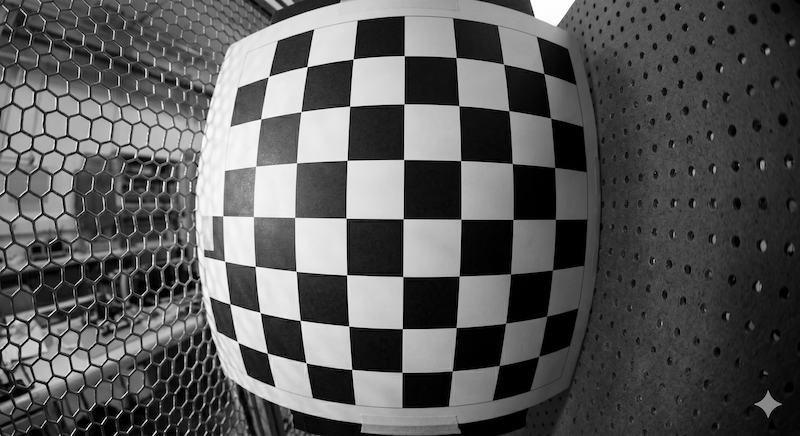
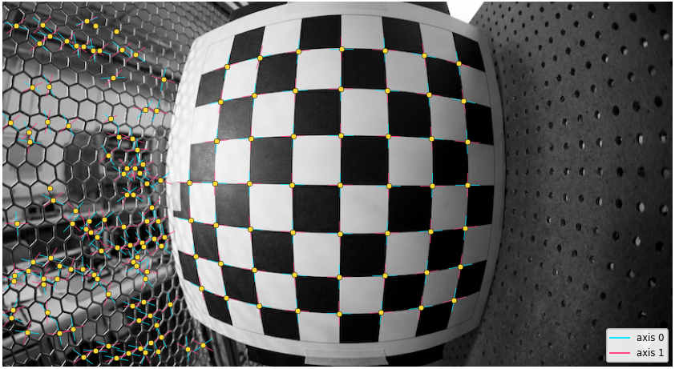
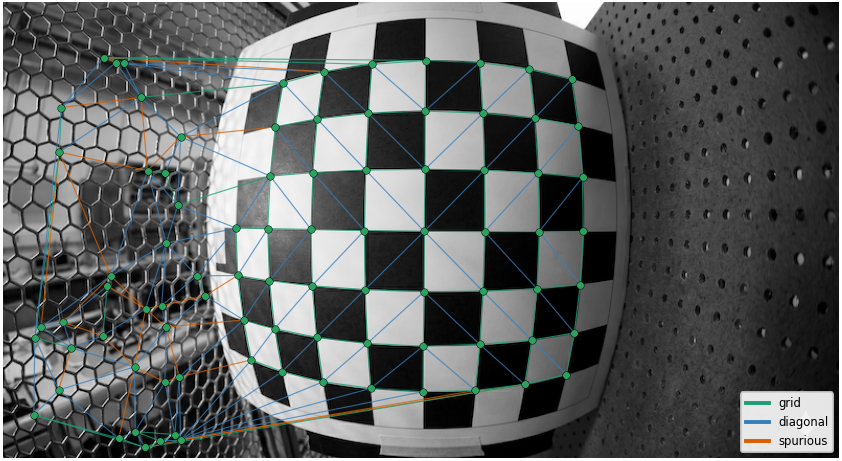
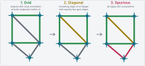
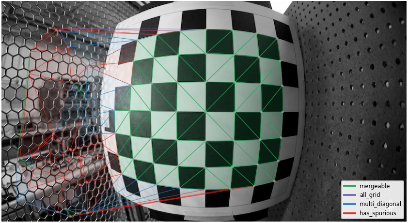
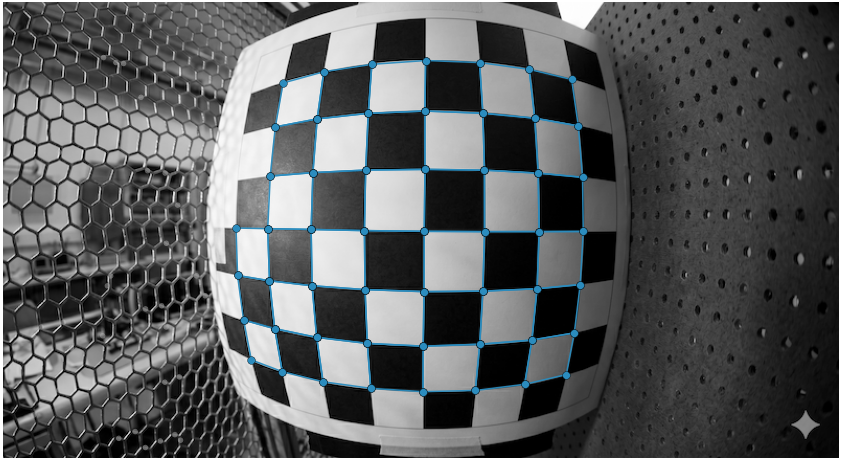
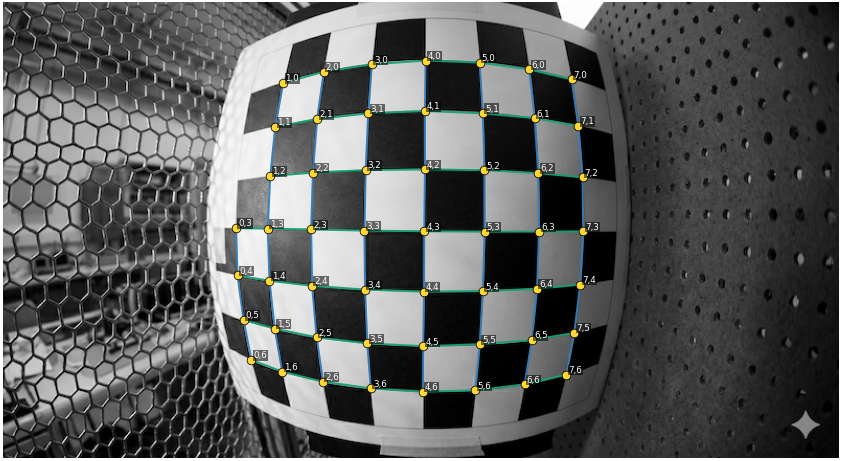
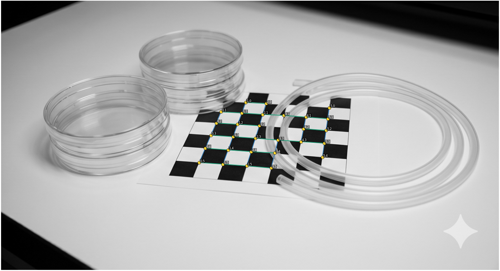

# Introduction

The [previous post](/blog/01-chesscorners) showed how to detect chessboard corners using the [ChESS response](/atlas/chess-corners). The result is a sparse set of X-junctions, each with two local grid axes. Some true corners may be missing, and some detections may be false positives.

This post starts from that output and focuses on **grid reconstruction**: recovering grid connectivity and assigning integer coordinates to the detected corners.

The cases I am interested in involve partially visible or occluded calibration targets under strong lens distortion. In such conditions, global grid lines or a single homography are poor choices as the primary reconstruction model. Instead, I want to reconstruct whatever grid structure is supported by the detected corners.

I use a topological approach based on the [Topological Grid Finding](/atlas/shu-topological-grid) method. I implemented it in the [projective-grid](https://crates.io/crates/projective-grid) crate. This post walks through the main steps of the method as implemented there.

The method starts from local relationships between corners. It connects nearby corners into plausible cells, then uses grid topology to remove inconsistent detections and assign integer coordinates. Geometric refinement can still be applied later, once the structure is known.

We will use this image throughout the post to illustrate each stage of the reconstruction.



# 1. Grid as a graph

We start from a set of candidate X-junctions such as those shown below. I use [chess-corners](https://crates.io/crates/chess-corners), which provides local grid orientations for each corner.



To recover the grid, we need to determine which corners are neighbors and which groups of four form grid cells. We represent these relationships as a graph:

- detected corners are nodes,
- candidate neighbor relations are edges,
- grid cells are quadrilaterals.

## Delaunay triangulation

Following [Shu, Brunton, and Fiala](/atlas/shu-topological-grid), the initial graph is built using Delaunay triangulation of the detected corners.

:::definition[Delaunay triangulation]
Delaunay triangulation connects a set of points into triangles such that no point lies inside the circumcircle of any triangle.
:::

For a regular grid, the triangulation usually contains the grid-neighbor edges plus one diagonal across each grid cell. On the test image, this gives:



The graph is only an initial hypothesis: it may contain incorrect edges and connections to false detections. The following steps classify these edges and identify quadrilateral grid cells.

Importantly, this construction is local. It does not assume that grid rows appear as straight lines in the image, which makes it suitable for strongly distorted images.

:::illustration[delaunay-voronoi]{preset="compact"}
:::

# 2. From triangles to cells

Delaunay triangulation gives us triangles, while the grid itself consists of quadrilateral cells. The next step is to classify the triangulation edges and merge suitable pairs of triangles back into cells.

## Edge classification

Edge classification is performed in three passes.



:::definition[Grid edge]
A Delaunay edge is classified as `grid` if its direction agrees with the local grid orientation at both endpoints within an angular tolerance $\sigma$.

The default tolerance is $15^\circ$.
:::

:::definition[Diagonal edge]
After `grid` edges have been classified, each Delaunay triangle is inspected. If exactly two of its edges are `grid`, the remaining edge is classified as `diagonal`.
:::

:::definition[Spurious edge]
Any edge still unclassified after the first two passes is classified as `spurious` and is rejected.
:::

The order matters: a `diagonal` edge is inferred from the other two edges of its triangle being `grid`, rather than from its own orientation.

## Merging triangles

:::definition[Mergeable triangle]
A triangle is `mergeable` if exactly two of its edges are classified as `grid`.
:::

Two mergeable triangles that share the same `diagonal` edge are merged into a quadrilateral cell candidate. The shared diagonal is removed, and the four vertices are ordered clockwise around their centroid, starting from the top-left vertex.

The overlay below shows triangle pairs with classified edges. For the test image, they recover all valid quadrilateral cells.



# 3. Filtering the mesh

The candidate mesh can still contain incorrect cells caused by false or missing corner detections. I filter them first by topology, then with a few weak geometric checks.

## Topological filter

:::note
In a regular grid, a node has degree 2 at a corner, 3 at a boundary, and 4 in the interior.
:::

A node with degree greater than 4 is therefore *illegal*. Following [Shu, Brunton, and Fiala](/atlas/shu-topological-grid), a quadrilateral is removed if it contains two illegal nodes. Only the quadrilateral is removed; its corner detections may still belong to other cells.

## Geometry checks

My implementation adds two geometric checks:

- an **opposing-edge ratio** check rejects extreme cases where opposite edge lengths become implausibly different;
- a **per-component edge-size** check rejects unusually large cells, typically created by connections that skip a missing corner.

These checks are deliberately permissive. They guard against obvious failures while preserving cells under strong optical and projective distortion.

Applying these filters gives the following mesh:



# 4. Ordering the grid

The filtered mesh gives us connectivity, but we still need to assign integer grid coordinates to the detected corners.

**For each connected component**, we traverse the quad mesh. Starting from one cell, we assign coordinates to its four corners and propagate them to neighboring cells through shared edges.

The reconstruction cannot determine an absolute grid orientation from topology alone. By convention, grid indices are non-negative, with the origin at the top-left of the full grid, whether or not that corner is visible; indices increase to the right and downward.

The ordering follows the mesh topology rather than fitted image lines. A grid row may appear strongly curved under lens distortion, but its order in the mesh remains unchanged.

This gives each connected component a consistent set of integer grid coordinates.



# 5. Using grid reconstruction for chessboard detection

The grid reconstruction described above forms the core of the chessboard detector in [`calib-targets`](https://crates.io/crates/calib-targets). The crate provides a high-level API that runs the complete pipeline, from an input image to an ordered set of chessboard corners.

```sh
cargo add calib-targets image
```

```rust
use calib_targets::chessboard::ChessboardParams;
use calib_targets::detect;
use image::ImageReader;

let img = ImageReader::open("image.png")?.decode()?.to_luma8();

let result = detect::detect_chessboard(
    &img,
    &detect::default_chess_config(),
    &ChessboardParams::default(),
);

match result {
    Ok(found) => println!("detected {} corners", found.corners.len()),
    Err(err) => println!("no board detected: {err}"),
}
```

The same API is available in Python through the [`calib-targets`](https://pypi.org/project/calib-targets/) package.

```sh
uv pip install calib-targets
```

```python
import numpy as np
from PIL import Image
import calib_targets as ct

image = np.asarray(Image.open('image.png').convert("L"), dtype=np.uint8)
params = ct.ChessboardParams()
result = ct.detect_chessboard(image, params=params)
```

The test image used throughout this post is `800×436` pixels. Detection on my MacBook Pro M4 takes `1.21 ms` on average: `0.84 ms` for X-junction detection and `0.37 ms` for the remaining grid logic.

# 6. Subtleties and further work

## Handling fragmented grids

I have left out two implementation details that matter in difficult cases: growing a grid component with detected corners that were not assigned to any cell, and merging nearby disconnected components.

These steps allow the detector to recover grids that would otherwise remain fragmented. With them, it can handle cases like the following one:



More details can be found in the [documentation](https://vitalyvorobyev.github.io/calib-targets-rs/book/).

## Beyond plain chessboards 

The reconstruction stage itself is not limited to plain chessboards. The [`calib-targets`](https://crates.io/crates/calib-targets) crate uses the same topological backbone in its chessboard, ChArUco, and [PuzzleBoard](/atlas/puzzleboard) detectors.

ChArUco is a particularly interesting stress case: its markers introduce many genuine corner detections inside the grid cells, yet the same topological reconstruction still recovers the underlying grid.

PuzzleBoard is a relatively new target type. I consider it one of the most interesting self-localizing square-grid targets available today, and I plan to discuss it in more detail in a future post.

# Conclusion

Once the corner candidates and their local grid orientations are available, the reconstruction no longer depends on image pixels. It operates entirely on a sparse geometric and topological representation, without requiring a known board size, straight projected grid lines, or a global homography.

In practice, this makes the method both robust and extremely fast. It tolerates missing corners and false detections, yet still recovers the underlying grid structure. In the benchmark above, the reconstruction itself takes only 0.37 ms, compared with 0.84 ms for X-junction detection.

The main geometric limitation comes from Delaunay triangulation itself: it is not projective invariant. At very oblique viewing angles, it can connect points that are not actual grid neighbors.
