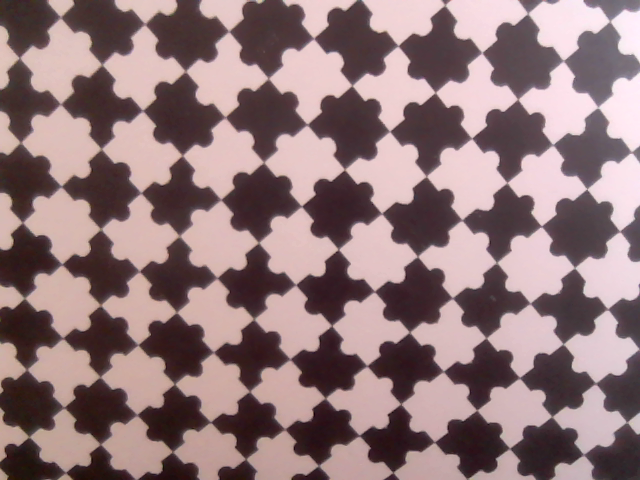
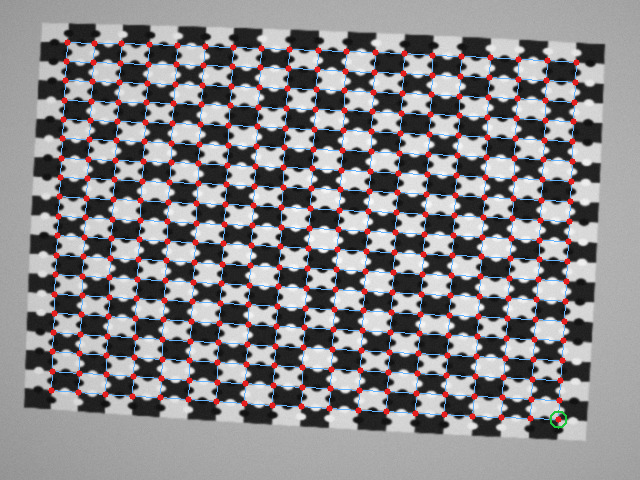
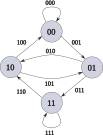

# Introduction

This post closes the series of three posts devoted to detecting chessboard-based calibration targets. We started from fundamental features detection: X-junction based on ChESS, then we solved the problem of identifying the grid structure starting from sparse cloud of X-junction features. Finally, we are solving the problem of establishing the correspondence between the detected image features and local metric calibration target coordinates. This problem should be solved during sensor calibration or metrology tasks with calibrated devices.

We do not imply that the whole calibration target is visible in the image. It means that we need local references. There are several solutions widely used in computer vision and robotics, among them boards with fiducial markers and ChArUco boards as on the image below (an example from the [authors GitHub](https://github.com/PStelldinger/PuzzleBoard/tree/main))



Both these targets are supported in my [calib-targets-rs](https://github.com/VitalyVorobyev/calib-targets-rs) library. But I think the PuzzleBoard solution is the most interesting and practical one, so we will discuss it here in more detail. It is also based on an interesting mathematical problem.

# 1. Quick start

Before spending some time explaining mathematical beauty of thee PuzzleBoard solution, I want to begin with explaining the main idea, showing the API of my implementation and performance.

The idea for self-identification is to use every board edge as one bit of information: dark or bright circle: 


A fairly small area (a 4x4 grid patch) contains enough information to uniquely establish the grid coordinates. The position encoding circles has the same scale as board cell, it makes this board working in extreme low resulituion, when only a cell only spans a few pixels.

```sh
cargo add calib-targets image
```

```rust
use calib_targets::detect;
use calib_targets::puzzleboard::{PuzzleBoardParams, PuzzleBoardSpec};
use image::ImageReader;

let img = ImageReader::open(path)?.decode()?.to_luma8();

let spec = PuzzleBoardSpec::master(1.0)?;
let params = PuzzleBoardParams::for_board(spec);

match detect::detect_puzzleboard(&img, &params) {
    Ok(found) => println!(
        "detected {} labelled corners",
        found.corners.len(),
    ),
    Err(err) => println!("no board detected: {err}"),
}
```

Using this code on my MacBook Pro M4 for a 640x480 image took 3.25 ms with 0.68 ms for ChESS corner detection, 1.62 ms for grid reconstruction (as discused in [the previous post]()), and 0.95 ms for the PuzzleBoard registration:



And similar python API:

```sh
uv pip install calib-targets
```

Now, when we know the main method idea an know how to use the software, let't dive into beautiful math stying behing this simplicity and computational efficiency.

# 2. The PuzzleBoard Pattern

The maximal size of the PuzzleBoard is 501x501 cells. There are very specific reasons for this size, and it is our goal by the end of this section to understand the origin of this size and to be able to reason about the uniqness of the pattern. But first things first, we begin from simple building blocks.

## De Bruijn sequence and De Bruijn graph

The sequence

$$
00010111
$$

is called a [De Bruijn sequence](https://en.wikipedia.org/wiki/De_Bruijn_sequence) of order 3 over the alphabet $\{0, 1\}$. This is a *minimal* *cyclic* sequence that contains every possible combination of 3 bits exactly once.

:::definition[De Bruijn sequence]
A de Bruijn sequence of order n over an alphabet of $k$ symbols is a cyclic sequence in which every possible length-$n$ string appears exactly once as a consecutive window. Its length is therefore $k^n$
:::

This formulation of the task doesn't make it obvious how to build such a sequence. The situation is changed dramatically after formulating the equivalent graph problem. Let's introduce the De Bruijn graph.

:::definition[De Bruijn graph]
A De Bruijn graph of order $n$ has all length-$(n−1)$ strings as its vertices, and all length-$n$ strings as its directed edges. An edge goes from the $(n−1)$-symbol prefix of a string to its $(n−1)$-symbol suffix.
:::

For our example the vertices are $00$, $01$, $10$, and $11$, and the De Bruijn graph reads:



The task of building a De Bruijn sequence is reduced to finding an *Eulerian cycle* in this graph.

:::definition[Eulerian cycle]
An Eulerian cycle is a cycle that uses every edge exactly once.
:::

This graph problem has a well-established efficient algorithmic solution. Graph theory also gives the answer to the question of the number of different binary de Bruijn sequences of order $n$:

$$
N(n) = 2^{2^{n-1}-n}
$$

For $n=3$ it gives $N(3) = 2^{2^{2-1}-3} = 2^{2^{1}-3} = 2^{1} = 2$. The second sequence is $00011101$.

First hint that bridges this concept with grid localization is this.

:::note
Observing $n$ consecutive symbols uniquely determines the position in the cyclic sequence.
:::

## De Bruijn torus

The 2D generalization of the De Bruijn sequence is what we need for the chessboard.

:::definition[De Bruijn torus (for binary alphabet)]
A binary de Bruijn torus is a cyclic 2D array of bits in which every possible $m\times n$ binary pattern appears exactly once as a contiguous window. The array wraps around in both directions, so opposite edges are connected.
:::

That defines *perfect map*. We need a slightly weaker construct: a *sub-perfect map*. Not every possible pattern has to occur, but no occurring pattern can appear twice.

Comming back to the Puzzleboard.
