# Motivation

Detect the inner corners of a planar checkerboard pattern in a single forward pass, without requiring the number of squares as a prior. Input: grayscale image of arbitrary size. Output: a response map of identical spatial size carrying a per-pixel corner score. The model is specific to per-pixel fully-convolutional regression of corner likelihood followed by threshold + NMS + clustering post-processing, in contrast to pattern-aware algorithms that reason about the checkerboard's global grid structure (OCamCalib, ROCHADE) and to hand-crafted local corner responses (ChESS, Harris).

# Architecture

**Family & shape.** Fully-convolutional CNN. Input: grayscale image $X \in \mathbb{R}^{H \times W}$. Output: response map $L_6(X) \in \mathbb{R}^{H \times W}$, same spatial size. Six convolutional layers, 20 channels each except the final single-channel head.

**Blocks.** Six convolutional layers with ReLU after each. Conv1 uses a $9 \times 9 \times 1$ kernel; conv2–conv6 use $3 \times 3$ kernels. Max-pooling of size $2 \times 2$ follows conv1 and conv4. The defining design choice is **stride 1 on every convolution and max-pool** with zero-padding, so the response map retains the input's spatial resolution (§2.1). Weights are initialised from $\mathcal{N}(0, 0.1^2)$; biases constant $0.1$. Parameter count: 16,301 (conv1 1,640 + conv2–5 each 3,620 + conv6 181).

```mermaid
flowchart LR
    X["input<br/>H×W, gray"] --> C1["conv 9×9×1<br/>20 ch"]
    C1 --> P1["maxpool 2×2<br/>stride 1"]
    P1 --> C2["conv 3×3<br/>20 ch"]
    C2 --> C3["conv 3×3<br/>20 ch"]
    C3 --> C4["conv 3×3<br/>20 ch"]
    C4 --> P2["maxpool 2×2<br/>stride 1"]
    P2 --> C5["conv 3×3<br/>20 ch"]
    C5 --> C6["conv 3×3<br/>1 ch"]
    C6 --> R["response map<br/>H×W"]
    R --> T["threshold<br/>0.5 · max"]
    T --> N["NMS<br/>4×4, IoU 0.5"]
    N --> K["k-means++<br/>k=10, drop N<2"]
    K --> O["corner set"]
```

:::definition[Weighted cross-entropy loss]
Per-pixel cross-entropy normalised by the count of ground-truth positives $N_p$ and negatives $N_N$ to compensate for the $\sim 10^{-4}$ positive-label fraction, with $L_2$ regularisation coefficient $\lambda = 0.01$.

$$
\begin{aligned}
L(p) = \frac{\lambda}{2} \lVert p \rVert^2
 &- \frac{1}{N_p} \sum_{G(x,y)=1} \log a(x,y) \\
 &- \frac{1}{N_N} \sum_{G(x,y)=0} \log\bigl(1 - a(x,y)\bigr),
\end{aligned}
$$

with $a(x, y)$ the output $L_6(X)(x, y)$ clipped to $[10^{-6}, 1]$ on positives and $[0, 1 - 10^{-6}]$ on negatives (Eq. 5) so the log stays finite.
:::

Inference appends three post-processing stages applied in order (§2.2): (i) drop pixels whose response is below $0.5 \cdot \max_{x,y} L_6(X)(x, y)$, (ii) non-maximum suppression on $4 \times 4$-pixel bounding boxes with IoU threshold $0.5$, (iii) $k$-means++ with $k = 10$ on the survivors, discarding clusters containing fewer than two points.

**Training.** Dataset: 8,900 grayscale VGA (640 × 480) images captured with 7×7 / 6×9 / 7×11 / 9×9 / 12×13 inner-corner checkerboards and synthetically augmented with $90/180/270°$ rotations, intensity inversion, Gaussian noise, and radial + tangential distortion (§3). Split: 8,000 train / 900 validation. Objective: the weighted cross-entropy + $L_2$ loss above. Optimiser: SGD with momentum $0.9$, batch size 20, initial learning rate $v_0 = 0.01$ on a staircase exponential schedule $v_i = v_0 \gamma^{\lfloor i / \tau \rfloor}$ (Eq. 6). Reported benchmarks on ROCHADE's external sets: mean corner-location error 0.812 px / missed rate 1.169 % on uEye (Table 1), 0.576 px / 0.907 % on GoPro (Table 2); zero double detections on both and zero false positives on GoPro.

**Complexity.** 16,301 trainable parameters on a 640 × 480 input — $\sim 5.5 \times$ the 2,939 parameters of the MATE antecedent. FLOPs and inference memory not reported by the paper.

# Implementations

One public TensorFlow implementation. The repository carries no LICENSE file, which defaults to all-rights-reserved — see Limitations.

# Assessment

**Novelty.**

- Extends MATE's three-convolution corner network to six convolutions, producing a per-pixel response map that preserves input resolution via stride-1 max-pools, contrasting with MATE's subsampled-grid output.
- Replaces MATE's mean-squared-error objective with a positive-negative-normalised cross-entropy to handle the $\sim 10^{-4}$ label imbalance (§2.1).
- Swaps MATE's fixed $0.5$ decision threshold for an adaptive $0.5 \times$ per-image maximum, composed with 4×4 NMS and $k$-means++ cluster pruning as a three-stage false-positive filter (§2.2).

**Strengths.**

- Accepts arbitrary input size and does not require the checkerboard's square count as a prior — unlike OCamCalib and ROCHADE which consume pattern dimensions (§4).
- On the ROCHADE uEye set reduces mean corner-location error from 1.009 px (MATE) and 0.946 px (ChESS) to 0.812 px, and cuts the false-positive count from 492 (MATE) to 93 (Table 1).
- On the ROCHADE GoPro set achieves 0 double detections and 0 false positives under strong lens distortion, with 0.576 px mean accuracy against MATE's 0.835 px (Table 2).

**Limitations.**

- The 5-pixel acceptance radius used in the accuracy metric (§4) sets the precision floor; sub-pixel refinement is not part of the model and must be bolted on from a separate saddle-point or gradient method.
- OCamCalib reaches 0.319 px / 0 % missed on the same uEye set by exploiting known pattern dimensions; CCDN trades that precision for pattern-agnosticism (Table 1).
- The only public TensorFlow implementation is unlicensed, unmaintained since 2018, ships no trained weights, and has no documented provenance from the paper's authors — downstream use requires retraining from scratch and resolving the licensing question.
- The cluster-size floor $N_i \ge 2$ and the fixed $k = 10$ in k-means++ are hand-tuned; sparse partial checkerboards with only a few visible corners at the image border risk being pruned as outliers.

# References

1. B. Chen, C. Xiong, Q. Zhang. *CCDN: Checkerboard Corner Detection Network for Robust Camera Calibration.* arXiv:2302.05097, 2023. [arXiv](https://arxiv.org/pdf/2302.05097)
2. S. Donné, J. De Vylder, B. Goossens, W. Philips. *MATE: Machine Learning for Adaptive Calibration Template Detection.* Sensors 16(11):1858, 2016. [MDPI](https://www.mdpi.com/1424-8220/16/11/1858)
3. S. Bennett, J. Lasenby. *ChESS — Quick and Robust Detection of Chess-board Features.* Computer Vision and Image Understanding 118:197–210, 2014. [arXiv](https://arxiv.org/pdf/1301.5491v1)
4. S. Placht, P. Fürsattel, E. Mengue, H. Hofmann, C. Schaller, M. Balda, E. Angelopoulou. *ROCHADE: Robust Checkerboard Advanced Detection for Camera Calibration.* ECCV 2014, 766–779.
5. M. Rufli, D. Scaramuzza, R. Siegwart. *Automatic Detection of Checkerboards on Blurred and Distorted Images.* IROS 2008, 3121–3126.
