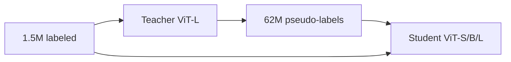

# Motivation

Takes a single RGB image at arbitrary resolution and produces a dense affine-invariant depth map — depth values in disparity space ($d = 1/t$), normalised per image to remove unknown scale and shift. No camera intrinsics or scene-scale prior are required. The defining property is a **data-scaling thesis**: robust zero-shot monocular depth estimation comes from data coverage, not from architectural novelty. Rather than designing a new network, Depth Anything reuses the MiDaS affine-invariant loss and DPT decoder, initialises the encoder from DINOv2, and augments a 1.5M-image labeled corpus with 62M pseudo-labeled unlabeled images generated by a teacher model. Two training-time refinements make unlabeled data genuinely informative rather than a trivial copy of the teacher's output: a CutMix strong-perturbation challenge that forces the student to resolve depth boundaries the teacher never saw, and a tolerance-margined DINOv2 feature-alignment loss that preserves semantic priors without over-constraining depth-varying regions.

# Architecture

**Family & shape.** ViT encoder + DPT decoder. Input: single RGB image (shorter side resized to 518 during training; both dimensions padded to multiples of 14 at inference to match the DINOv2 patch constraint). Output: dense disparity map at input resolution. Three encoder sizes available — ViT-S (24.8M parameters), ViT-B (97.5M), ViT-L (335.3M) — all initialised from DINOv2 checkpoints. The decoder is the Dense Prediction Transformer (DPT) from MiDaS.

**Blocks.** The network body is unmodified DINOv2 ViT (patch size 14) plus DPT decoder; no new layer types are introduced. Depth values are mapped to disparity space ($d = 1/t$) before any loss is computed (§3.1). A pre-trained SegFormer model detects sky pixels and forces their disparity to zero (farthest point) to suppress the uniform-sky bias in MegaDepth training data.

**Training.** A two-stage self-training data engine drives the method.

*Stage 1 — teacher.* A ViT-L model is trained on six labeled datasets totalling 1.5M images (BlendedMVS 115K, DIML 927K, HRWSI 20K, IRS 103K, MegaDepth 128K, TartanAir 306K) for 20 epochs using the affine-invariant loss inherited from MiDaS (Eqs. 1–3):

:::definition[Affine-invariant depth loss (Eqs. 1–3)]
Depth maps are normalised per sample by their median (shift) and mean absolute deviation from the median (scale) before loss computation:

$$
\hat{d}_i = \frac{d_i - t(d)}{s(d)}, \quad t(d) = \operatorname{median}(d), \quad s(d) = \frac{1}{HW}\sum_i |d_i - t(d)|,
$$

$$
\mathcal{L}_l = \frac{1}{HW}\sum_i \rho(\hat{d}^*_i,\, \hat{d}_i),
$$

where $\rho$ is the L1 loss between normalised ground-truth $\hat{d}^*_i$ and prediction $\hat{d}_i$.
:::

*Stage 2 — student.* The trained ViT-L teacher generates pseudo-labels for 62M unlabeled images from eight datasets (SA-1B 11.1M, ImageNet-21K 13.1M, LSUN 9.8M, BDD100K 8.2M, Open Images V7 7.8M, Places365 6.5M, Google Landmarks 4.1M, Objects365 1.7M):

$$
\hat{\mathcal{D}}^u = \{(u_i,\, T(u_i)) \mid u_i \in \mathcal{D}^u\} \quad \text{(Eq.~4)}.
$$

The student (any ViT size) is trained on labeled and pseudo-labeled images at a $1{:}2$ ratio. Two refinements prevent trivial teacher imitation:

**CutMix challenge (Eqs. 5–8).** Images fed to the student are strongly perturbed — colour jitter, Gaussian blur, and CutMix at 50% probability — while images sent to the teacher for pseudo-labeling are clean. CutMix blends two unlabeled images $u_a$, $u_b$ via a binary spatial mask $M$:

$$
u_{ab} = u_a \odot M + u_b \odot (1 - M) \quad \text{(Eq.~5)}.
$$

The unlabeled loss supervises the masked region $M$ and its complement $1{-}M$ separately before aggregation (Eqs. 7–8), so the student must resolve depth boundaries that neither source image contains in isolation. Without this perturbation step, naïve self-training does not improve over the labeled-only baseline: mean AbsRel across six evaluation domains stays at 0.180 with and without unlabeled data; adding the CutMix challenge reduces it to 0.169 (Table 9).

**DINOv2 feature-alignment loss (Eq. 9).** An auxiliary loss aligns the student encoder's intermediate features $f_i$ with a frozen DINOv2 encoder's features $f'_i$ via per-pixel cosine similarity:

$$
\mathcal{L}_\text{feat} = 1 - \frac{1}{HW}\sum_i \cos(f_i,\, f'_i) \quad \text{(Eq.~9)}.
$$

Pixels where $\cos(f_i, f'_i) \geq \alpha = 0.85$ are excluded from the gradient to avoid over-constraining regions where DINOv2 assigns similar features to depth-varying parts of the same object. The tolerance margin $\alpha = 0.85$ is ablated in Table 12: $\alpha = 1.00$ (no exclusion) raises mean AbsRel by 0.013 relative to $\alpha = 0.85$; $\alpha = 0.70$ is slightly worse than $\alpha = 0.85$. $\mathcal{L}_\text{feat}$ is applied to unlabeled images only — applying it to labeled images is neutral or harmful because manual labels are already informative without the auxiliary constraint (Table 13). Adding $\mathcal{L}_\text{feat}$ on top of the CutMix challenge reduces mean AbsRel from 0.169 to 0.160 (Table 9).

The total training objective is $\mathcal{L}_l + \mathcal{L}_u + \mathcal{L}_\text{feat}$. Optimizer: AdamW with linear LR decay; encoder LR $5 \times 10^{-6}$, decoder LR $5 \times 10^{-5}$ (10× larger); 518×518 training crops; patch size 14.

Zero-shot relative depth (Table 2, ViT-L): KITTI AbsRel 0.076 / $\delta_1$ 0.947; NYUv2 AbsRel 0.043 / $\delta_1$ 0.981 — compared to MiDaS ViT-L at KITTI AbsRel 0.127 / $\delta_1$ 0.850 and NYUv2 AbsRel 0.048. After metric fine-tuning: NYUv2 $\delta_1 = 0.984$, AbsRel 0.056 (Table 3); KITTI $\delta_1 = 0.982$, AbsRel 0.046 (Table 4).

**Complexity.** ViT-S 24.8M parameters, ViT-B 97.5M, ViT-L 335.3M (Table 2 caption). Inference requires both spatial dimensions to be multiples of 14 due to the DINOv2 patch constraint; images are padded to the nearest multiple and predictions interpolated back to the original resolution.

# Implementations

Official PyTorch release under Apache-2.0 code and Apache-2.0 model weights.

# Assessment

**Novelty.**

- Demonstrates that data breadth — 62M unlabeled images pseudo-labeled by a teacher — is the primary driver of zero-shot MDE generalisation, contributing more than any architectural change; prior work such as MiDaS was bottlenecked by labeled dataset coverage rather than network capacity.
- Introduces a CutMix strong-perturbation challenge for unlabeled data that prevents the self-training student from collapsing to trivial teacher imitation, resolving the naïve self-training failure mode where mean AbsRel does not improve over the labeled-only baseline.
- Adds a tolerance-margined DINOv2 feature-alignment loss ($\alpha = 0.85$) that transfers DINOv2's semantic priors into the depth encoder without over-constraining depth-varying regions within a single object — a refinement beyond standard knowledge distillation.

**Strengths.**

- Zero-shot relative depth: KITTI AbsRel 0.127 → 0.076 versus MiDaS ViT-L (same backbone), a 40% reduction; NYUv2 0.048 → 0.043 (Table 2).
- After metric fine-tuning: NYUv2 $\delta_1 = 0.984$ (Table 3); KITTI $\delta_1 = 0.982$ (Table 4).
- The encoder also functions as a general dense-prediction backbone: linear-probe semantic segmentation reaches 86.2 mIoU on Cityscapes and 59.4 mIoU on ADE20K (Tables 7–8), exceeding DINOv2 ViT-L on both benchmarks despite being trained primarily for depth.
- Drop-in encoder replacement for ZoeDepth (a metric-depth extension of MiDaS) improves zero-shot metric performance on standard benchmarks (Table 5 comparison).

**Limitations.**

- The base model produces relative depth only — no absolute scale without metric fine-tuning; zero-shot metric errors on SUN RGB-D (AbsRel 0.500) and DIODE Outdoor (AbsRel 0.794) are large (Table 5).
- Superseded for practical relative-depth use by Depth Anything V2, which improves backbone quality and training data curation.
- ViT-L at 335.3M parameters is unsuitable for mobile or real-time inference; ViT-S at 24.8M is the smallest option.
- Performance degrades on image domains completely absent from the eight unlabeled source datasets (satellite, medical, microscopy), where teacher pseudo-labels are unreliable.

# References

1. L. Yang, B. Kang, Z. Huang, X. Xu, J. Feng, H. Zhao. *Depth Anything: Unleashing the Power of Large-Scale Unlabeled Data.* CVPR, 2024. [arXiv 2401.10891](https://arxiv.org/abs/2401.10891)
2. R. Ranftl, K. Lasinger, D. Hafner, K. Schindler, V. Koltun. *Towards Robust Monocular Depth Estimation: Mixing Datasets for Zero-shot Cross-Dataset Transfer.* IEEE TPAMI, 2022. (MiDaS)
3. M. Oquab et al. *DINOv2: Learning Robust Visual Features without Supervision.* TMLR, 2024. [arXiv 2304.07193](https://arxiv.org/abs/2304.07193)
4. L. Yang et al. *Depth Anything V2.* NeurIPS, 2024. [arXiv 2406.09414](https://arxiv.org/abs/2406.09414)
