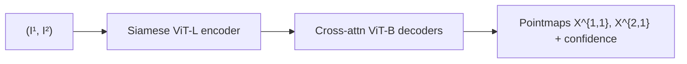

# Motivation

Takes an uncalibrated, unposed RGB image pair $(I^1, I^2 \in \mathbb{R}^{W \times H \times 3})$ and produces two dense pointmaps $X^{1,1}, X^{2,1} \in \mathbb{R}^{W \times H \times 3}$ — both expressed in the first camera's coordinate frame — plus per-pixel confidence maps $C^{1,1}, C^{2,1} \in \mathbb{R}^{W \times H}$ (§3, p. 3). A pointmap is a dense 2D field of 3D scene points forming a one-to-one pixel-to-point mapping $I_{i,j} \leftrightarrow X_{i,j}$ for all $(i,j)$; by regressing both $X^{1,1}$ and $X^{2,1}$ in the same coordinate frame, the network simultaneously encodes correspondence, relative depth, and relative pose without computing essential matrices, triangulating points, or requiring known intrinsics. The defining property is the collapse of the classical structure-from-motion pipeline — keypoint detection, descriptor matching, essential-matrix estimation, triangulation, and bundle-adjustment refinement — into a single feed-forward pass that accepts raw unordered images and recovers dense 3D geometry, camera poses, focal lengths, and pixel correspondences as trivial post-processing on the predicted pointmaps. Predictions carry an unknown scale factor per pair; absolute metric scale requires an external reference.

# Architecture

**Family & shape.** Siamese ViT encoder–decoder. Input: image pair $(I^1, I^2 \in \mathbb{R}^{W \times H \times 3})$. Output: per-view pointmaps $X^{v,1} \in \mathbb{R}^{W \times H \times 3}$ and confidence maps $C^{v,1} \in \mathbb{R}^{W \times H}$ for $v \in \{1,2\}$, all in camera-1's frame. The full network is initialised from CroCo v2 pretrained weights — a cross-view image completion pretext task on unlabelled image pairs that gives the encoder and cross-attention decoders a strong prior for inter-view correspondence (§3.1).

**Blocks.** Four stages executed in order:

1. *Shared ViT-Large encoder.* Both images are independently patchified and encoded by a single shared ViT-Large backbone, producing token sequences $F^1$ and $F^2$ (§3.1, Fig. 2).

2. *Cross-attention ViT-Base decoders.* Two separate ViT-Base decoders refine $F^1$ and $F^2$ simultaneously. Each decoder layer $i$ exchanges information between views:

$$
G^v_i = \mathrm{DecoderBlock}^v_i\!\bigl(G^v_{i-1},\; G^{\text{other}}_{i-1}\bigr), \quad G^v_0 = F^v \quad \text{(§3.1)}.
$$

Each block applies self-attention within one view followed by cross-attention to the other view's tokens, giving every position in one image full context from the other — the mechanism by which the network discovers correspondences without any explicit matching step.

3. *DPT-style regression heads.* One Dense Prediction Transformer head per view converts the final decoder tokens to a full-resolution pointmap $X^{v,1}$ and a scalar confidence map parameterised as $C^{v,1} = 1 + \exp(\hat{C}^{v,1})$, ensuring strict positivity (§3.1).

4. *Pointmap coordinate convention.* The pointmap from camera $n$ expressed in camera $m$'s frame is defined as (Eq. 1, §3):

$$
X^{n,m} = P_m\, P_n^{-1}\, h(X^n),
$$

where $P_m, P_n \in \mathbb{R}^{3 \times 4}$ are world-to-camera poses and $h : (x,y,z) \mapsto (x,y,z,1)$ is the homogeneous lift. Regressing $X^{1,1}$ and $X^{2,1}$ both in frame 1 implicitly encodes the relative transform $P_1 P_2^{-1}$ in the difference between the two outputs; relative pose is read out by Procrustes alignment and focal lengths by Weiszfeld iterations (§3.3).

**Training.** Trained on 8.5 million image pairs from eight datasets: Habitat, ARKitScenes, MegaDepth, Static Scenes 3D, BlendedMVS, ScanNet++, CO3Dv2, and Waymo (Table 8, Appendix F.1). The objective is a confidence-weighted, scale-normalised pointmap regression loss (Eqs. 2–4, §3.2). The per-pair normalising factor

$$
z = \mathrm{norm}(X^{1,1}, X^{2,1}) = \frac{1}{|D^1| + |D^2|} \sum_{v \in \{1,2\}} \sum_{i \in D^v} \|X_i^{v,1}\|   \quad \text{(Eq. 3)}
$$

is the mean Euclidean distance of all valid predicted points to the origin across both views; the ground-truth counterpart $\bar{z}$ is computed identically. The per-pixel regression residual is then

$$
\ell_{\mathrm{regr}}(v, i) = \left\|\frac{1}{z}\, X_i^{v,1} - \frac{1}{\bar{z}}\, \bar{X}_i^{v,1}\right\|   \quad \text{(Eq. 2).}
$$

:::definition[Confidence-weighted pointmap loss]
The network jointly predicts per-pixel confidence to up-weight reliable regions; a log-regulariser with coefficient $\alpha$ prevents confidence from collapsing to zero (Eq. 4, §3.2).

$$
\mathcal{L}_{\mathrm{conf}} = \sum_{v \in \{1,2\}} \sum_{i \in D^v} \bigl[\, C_i^{v,1} \cdot \ell_{\mathrm{regr}}(v,i) - \alpha \log C_i^{v,1} \bigr].
$$
:::

Training follows a three-stage curriculum: 224×224 resolution with linear head → 512 px with linear head → 512 px with DPT head (Table 7, Appendix F.2). Depth at pixel $(i,j)$ in view 1 is the $z$-coordinate of the pointmap: $D^1_{i,j} = X^{1,1}_{i,j,2}$ (Eq. 8, Appendix F.1).

**Global alignment for $N > 2$ views.** The pairwise network is applied to all connected pairs in a coverage graph; a post-hoc optimisation fuses the results. World-space pointmaps $\chi$, per-pair scales $\sigma_e$, and camera poses $P_e$ are jointly optimised by minimising the confidence-weighted 3D projection distance (Eq. 5, §3.4), subject to $\prod_e \sigma_e = 1$ to fix the global scale. The optimisation runs via standard gradient descent (~hundreds of steps, seconds on a GPU). Critically, it minimises 3D projection errors rather than 2D reprojection errors, avoiding the sparse Jacobian computation of classical bundle adjustment (§3.4, p. 6). Camera poses $\{P_n\}$, focal lengths $\{f_n\}$ via Weiszfeld iterations, and depth maps $\{D_n\}$ are all read out directly from the fused pointmaps by substituting the pinhole model into $\chi$ (§3.4).

**Complexity.** ViT-Large encoder (24 layers, $D=1024$) paired with two ViT-Base decoders (12 layers, $D=768$) plus DPT heads; encoder alone follows the ViT-L/16 configuration (~307 M parameters). No single total count is reported in the paper.

# Implementations

Official PyTorch release from NAVER Labs Europe; both code and pretrained weights carry a **non-commercial CC-BY-NC-SA-4.0 license**.

# Assessment

**Novelty.**

- Introduces *pointmap regression* as a unified output representation encoding correspondence, relative depth, relative pose, and camera intrinsics in a single dense prediction, replacing the classical SfM/MVS pipeline — keypoint detection, matching, essential-matrix estimation, triangulation, bundle adjustment — with one feed-forward inference pass.
- Operates on fully uncalibrated, unposed images: focal length, principal point, and extrinsic poses are not inputs, eliminating the prerequisite-calibration dependency that defines classical SfM.
- The global alignment post-step (Eq. 5, §3.4) minimises 3D projection errors rather than 2D reprojection errors, sidestepping the sparse Jacobian complexity of standard bundle adjustment while maintaining pose consistency across $N > 2$ views.

**Strengths.**

- Multi-view relative pose on CO3Dv2 (10 frames): RRA@15 = 96.2, RTA@15 = 86.8, mAA@30 = 76.7 versus PoseDiffusion 80.5 / 79.8 / 66.5 (Table 2 / Table 5, §4.2) — a decisive margin over prior regression-based pose methods.
- Multi-view relative pose on RealEstate10K (10 frames): mAA@30 = 67.7 versus PoseDiffusion 48.0 (Table 5, §4.2), demonstrating broad generalisation to diverse indoor video scenes.
- Zero-shot monocular depth (DUSt3R 512): AbsRel 6.50 on NYUv2 and 10.74 on KITTI, on par with supervised DPT-BEiT and NeWCRFs (Table 2, p. 8), achieved by feeding the same image twice as $F(I, I)$.
- Requires no calibration target, GPS, or prior pose estimate — directly applicable to unstructured image collections.

**Limitations.**

- Pairwise design: the core network processes exactly two views; $N > 2$ images require the separate global alignment step, which is not end-to-end and adds latency proportional to the number of pairs in the coverage graph.
- Metric-scale ambiguity: predictions are valid up to an unknown scale factor per pair; absolute metric reconstruction requires an external anchor such as ground-truth depth, a known baseline, or IMU data.
- 3D accuracy trails specialised methods when camera parameters are known: DTU benchmark 1.74 mm overall versus 0.295 mm for the best per-domain learning method with ground-truth poses and training data (Table 4, p. 9) — regression to pointmaps is inherently less precise than sub-pixel triangulation from explicit cameras.
- Visual localisation with unknown intrinsics on Cambridge Landmarks degrades to translation errors of 64–245 cm versus 6–38 cm with ground-truth focal lengths (Appendix E, Table 6), because sparse database pointmaps prevent reliable scale transfer.
- Successor models address distinct gaps: MASt3R adds a dense matching head for explicit feature-level correspondence; VGGT generalises the pointmap paradigm to arbitrary numbers of input views and arbitrary token-level predictions.
- **Non-commercial CC-BY-NC-SA-4.0 license** on both code and weights restricts deployment in commercial products.

# References

1. S. Wang, V. Leroy, Y. Cabon, B. Chidlovskii, J. Revaud. *DUSt3R: Geometric 3D Vision Made Easy.* CVPR, 2024. [arXiv:2312.14132](https://arxiv.org/abs/2312.14132)
2. P.-E. Weinzaepfel, V. Leroy, T. Lucas, R. Brégier, Y. Cabon, V. Arora, L. Barroso-Laguna, T. Janulewicz, D. Csurka, J. Revaud. *CroCo: Self-Supervised Pre-Training for 3D Vision Tasks by Cross-View Completion.* NeurIPS, 2022.
3. V. Leroy, Y. Cabon, J. Revaud. *MASt3R: Grounding Image Matching in 3D with MASt3R.* ECCV, 2024. [arXiv:2406.09756](https://arxiv.org/abs/2406.09756)
4. S. Wang, H. Hu, Y. Li, Y. Du, H. Liu, J. Revaud, C. Caesar. *VGGT: Visual Geometry Grounded Deep Structure From Motion.* CVPR, 2025. [arXiv:2503.11651](https://arxiv.org/abs/2503.11651)
