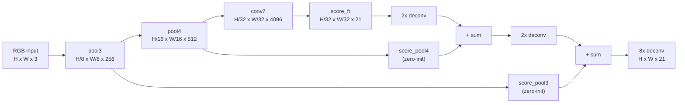

# Motivation

Assign a semantic class label to every pixel of an arbitrary-resolution RGB image in a single forward pass, without region proposals, superpixels, or post-processing. Input: $H \times W \times 3$ RGB image. Output: per-pixel probability distribution over $K$ semantic classes at the full input resolution (K = 21 for PASCAL VOC, 40 for NYUDv2, 33+3 for SIFT Flow). The defining contribution is the fully-convolutional reinterpretation of pretrained ImageNet classifiers — replacing all fully-connected layers with equivalent 1×1 convolutions — combined with a skip-fusion deconvolution architecture (FCN-8s) that recovers spatial detail lost by pooling. This supersedes patch-CNN sliding-window segmenters (Farabet et al. 2013; Pinheiro & Collobert 2014) and superpixel-plus-classifier pipelines, replacing them with a single end-to-end trained network that operates on whole images.

# Architecture

**Family & shape.** Encoder-decoder CNN derived from VGG-16 (16 parameter layers, 134 M parameters) by replacing its three fully-connected layers with 1×1 convolutions, yielding a fully convolutional network that accepts inputs of arbitrary spatial size. Input shape: $H \times W \times 3$ (RGB, arbitrary resolution). Output shape: $H \times W \times K$ (per-pixel class scores at input resolution, $K = 21$ for PASCAL VOC). Three skip-fusion variants exist — FCN-32s, FCN-16s, FCN-8s — differing in which intermediate pooling layers are tapped before the final deconvolution to full resolution.

**Blocks.** The architecture has three structural components.

(1) **Fully-convolutional reinterpretation.** VGG-16's fc6 and fc7 layers (originally 4096-unit fully-connected) are replaced by 1×1 convolutions of output widths 4096 and 4096 respectively, operating over the full spatial feature map. The 1000-way ImageNet classifier is replaced by a 1×1 convolution with 21 output channels (PASCAL VOC). This substitution is exact: a fully-connected layer over a fixed-size input is mathematically equivalent to a 1×1 convolution covering the full feature map (Section 3.1, Figure 2). After VGG-16's five max-pooling stages (each with stride 2), the total stride is 32 — a 640×480 input yields a 20×15 score map before upsampling.

(2) **Deconvolution upsampling.** Upsampling by factor $f$ is implemented as a backwards strided convolution ("deconvolution") with output stride $f$. All deconvolution filters are initialised to bilinear interpolation weights; intermediate deconvolutions are fine-tuned, and the final deconvolution layer may be frozen or learned (Section 4.3, Dense Prediction paragraph).

(3) **Skip fusion (FCN-8s).** Rather than upsampling 32× from the final conv7 score map alone, intermediate pool layers are tapped via 1×1 convolutions that produce class score maps at their native strides. These score maps are element-wise summed (not concatenated — max fusion was found to impede learning) before the final deconvolution. Pool4 (stride 16) and pool3 (stride 8) 1×1 prediction layers are zero-initialised; the learning rate is decreased 100× when each skip branch is added (Section 4.2).

The FCN-8s skip-fusion forward pass in PyTorch pseudocode, corresponding line-by-line to Figure 3 of the paper:

```python
def fcn8s_forward(x, vgg, score_fr, score_pool4, score_pool3,
                  upscore2, upscore_pool4, upscore8):
    # Encoder: VGG-16 convolutionalised, total stride 32
    pool3 = vgg.pool3(x)             # H/8  x W/8  x 256
    pool4 = vgg.pool4(pool3)         # H/16 x W/16 x 512
    conv7 = vgg.conv7(pool4)         # H/32 x W/32 x 4096

    # Score maps at each scale (21-channel, 1x1 conv)
    s7   = score_fr(conv7)           # H/32 x W/32 x 21
    u2   = upscore2(s7)              # H/16 x W/16 x 21  (2x deconv)
    s4   = score_pool4(pool4)        # H/16 x W/16 x 21  (zero-init)
    f4   = u2 + s4                   # skip fusion 1 (element-wise sum)

    u4   = upscore_pool4(f4)         # H/8  x W/8  x 21  (2x deconv)
    s3   = score_pool3(pool3)        # H/8  x W/8  x 21  (zero-init)
    f3   = u4 + s3                   # skip fusion 2

    out  = upscore8(f3)              # H x W x 21        (8x deconv)
    return out
```



:::definition[Per-pixel cross-entropy loss]
Per-pixel multinomial logistic loss, summed over all unmasked spatial output positions. For a prediction $\hat{y}_{ij}$ at pixel $(i, j)$ and ground-truth label $y_{ij}$:

$$
\mathcal{L} = -\sum_{(i,j) \in \Omega} \log \hat{y}_{ij,\, y_{ij}},
$$

where $\Omega$ is the set of unmasked (labelled) spatial positions. Whole-image training computes this loss over the full image in a single forward pass; Section 3.4 and Figure 5 of the paper show it is equivalent in expectation to patchwise training but faster in wall clock.
:::

**Training.** Dataset: PASCAL VOC 2011 segmentation training set — 1112 images native, extended to 8498 training images with Hariharan et al. extra annotations (Section 4.3). Loss: per-pixel multinomial logistic (softmax cross-entropy), summed over unmasked positions. Whole-image training with no patch sampling. SGD, momentum 0.9, weight decay $5 \times 10^{-4}$ (or $2 \times 10^{-4}$), learning rate $10^{-4}$ for FCN-VGG16 (Section 4.3). Minibatch: 20 images. Staged fine-tuning: FCN-32s first (~3 days on a single Tesla K40c), then FCN-16s (~1 day), then FCN-8s (~1 day). Bilinear initialisation for all deconvolution layers; skip-stream 1×1 prediction layers zero-initialised; learning rate decreased 100× when each skip stage is added.

Headline metrics: PASCAL VOC 2011 test mean IU = **62.7** (FCN-8s, Table 3), a 20% relative gain over the prior SOTA SDS at 52.6 (Table 3). PASCAL VOC 2012 test mean IU = **62.2** (FCN-8s, Table 3). NYUDv2 RGB-HHA late fusion mean IU = **34.0** (FCN-16s, Table 4). SIFT Flow geometric pixel accuracy = **94.3**, mean IU = **39.5**, pixel accuracy = **85.2** (FCN-16s, Table 5). Inference time approximately **175 ms** per image on Tesla K40c (Table 3, abstract).

**Complexity.** 134 M parameters for FCN-VGG16 (Table 1). Receptive field 404 pixels (Table 1). Forward pass ~210 ms for a 500×500 input on Tesla K40c (Table 1). Five 2×-stride max-pool stages yield total stride 32.

# Implementations

Official Caffe release (no `LICENSE` file at pinned commit; BSD-2-Clause declared in the repository README, inherited from Caffe); torchvision ships a community FCN-ResNet50/101 port that swaps VGG-16 for ResNet — a substantive backbone deviation from the paper's reported design.

# Assessment

**Novelty.**

- Fully-convolutional reinterpretation of fc layers as 1×1 convolutions, enabling transfer of any pretrained ImageNet classifier (AlexNet, VGG-16, GoogLeNet) to dense prediction without architectural retraining (contrast: Pinheiro & Collobert 2014 and Farabet et al. 2013 operate on fixed-size patches with sliding-window inference).
- Skip architecture (FCN-8s) that fuses deep coarse-semantic features (conv7, stride 32) with shallow fine-spatial features (pool3, stride 8) via element-wise sum on per-class score maps — framed as a "deep jet" by analogy to Koenderink–van Doorn's feature jet (Section 4.2).
- End-to-end per-pixel training on whole images, shown equivalent in expectation to patchwise training but faster in wall clock (Section 3.4, Figure 5).
- Learnable deconvolution layers initialised to bilinear upsampling rather than fixed bilinear or hand-crafted unpooling, enabling the network to refine spatial layout during fine-tuning.

**Strengths.**

- 20% relative improvement over the prior SOTA on PASCAL VOC 2011 test (FCN-8s 62.7 vs SDS 52.6, Table 3).
- ~286× faster than SDS overall at inference (Table 3 footnote / Section 5); ~114× faster on the convnet-only component.
- Single forward pass — no region proposals, no superpixels, no post-processing CRF.
- General recipe: benchmarked on AlexNet (mean IU 39.8 on VOC 2011 val, Table 1), VGG-16 (59.4 with extra data, Section 4.1), and GoogLeNet (mean IU 42.5 on VOC 2011 val, Table 1); foundational for U-Net, DeepLab, SegNet, and the dense-prediction literature broadly.

**Limitations.**

- Coarse boundary resolution: even FCN-8s upsamples from 1/8-resolution score maps; fine object boundaries are blurred. DeepLab (Chen et al. 2015, dilated convolutions + dense CRF) and U-Net (Ronneberger et al. 2015, symmetric encoder-decoder) were required to recover this detail.
- Very thin or small structures whose spatial support falls below the stride-8 effective resolution tend to be classified as background.
- Class confusion in homogeneous regions (sky vs. water, road vs. sidewalk) where discriminative cues require context that the receptive field spans but the network conflates — explicitly noted as a failure case in Section 5, Figure 6.
- Backbone-sensitivity: FCN-AlexNet achieves only 39.8 mean IU on VOC 2011 val vs FCN-VGG16's 56.0 (Table 1); headline numbers are not portable across backbones. The torchvision community port swaps VGG-16 for ResNet-50/101, making published accuracy figures from the paper non-reproducible from that codebase.
- Reference implementation carries no `LICENSE` file at the pinned commit (`shelhamer/fcn.berkeleyvision.org` at `1305c73`); BSD-2-Clause is declared in the README only, inherited from Caffe. Practitioners should retrieve the README at the pinned SHA before deploying.

# References

1. J. Long, E. Shelhamer, T. Darrell. *Fully Convolutional Networks for Semantic Segmentation.* IEEE CVPR, 2015. [arXiv:1411.4038](https://arxiv.org/abs/1411.4038)
2. J. Long, E. Shelhamer, T. Darrell. *Fully Convolutional Networks for Semantic Segmentation* (extended journal version). IEEE TPAMI, 2016. [arXiv:1605.06211](https://arxiv.org/abs/1605.06211)
3. K. Simonyan, A. Zisserman. *Very Deep Convolutional Networks for Large-Scale Image Recognition.* ICLR, 2015. [arXiv:1409.1556](https://arxiv.org/abs/1409.1556) (VGG-16 backbone.)
4. O. Ronneberger, P. Fischer, T. Brox. *U-Net: Convolutional Networks for Biomedical Image Segmentation.* MICCAI, 2015. [arXiv:1505.04597](https://arxiv.org/abs/1505.04597) (Immediate extension: symmetric encoder-decoder with dense skip connections.)
5. L.-C. Chen, G. Papandreou, I. Kokkinos, K. Murphy, A. L. Yuille. *Semantic Image Segmentation with Deep Convolutional Nets and Fully Connected CRFs.* ICLR, 2015. [arXiv:1412.7062](https://arxiv.org/abs/1412.7062) (DeepLab: dilated convolutions + CRF post-processing to recover boundary precision.)
