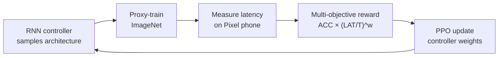

# Motivation

Takes an RGB image (224×224) as input and produces 1000-way ImageNet class logits. The architecture is discovered by platform-aware neural architecture search (NAS) that maximizes a multi-objective reward combining top-1 accuracy and directly measured on-device inference latency, rather than hand-designing the network or approximating latency with FLOPs. The search operates over a factorized hierarchical space of MBConv-based blocks, producing architectures that are Pareto-near-optimal for a specified latency target on a given mobile CPU.

# Architecture

**Family & shape.** Searched CNN backbone; input RGB at 224×224; output 1000-way logits. The two primary released models are MnasNet-A1 (search space includes squeeze-and-excitation) and MnasNet-B1 (baseline without SE).

**Blocks.** The building block is the mobile inverted-bottleneck convolution (MBConv) inherited from MobileNetV2. Rather than stacking identical repeated cells (NASNet-style), MnasNet uses a *factorized hierarchical search space* (Sec. 4.1, Figure 4): the network is partitioned into $B = 7$ predefined blocks with fixed input resolutions and filter-size schedules. Within each block $i$, the search independently selects ConvOp $\in$ {conv, dconv, MBConv}, KernelSize $\in$ \{3, 5\}, SERatio $\in$ \{0, 0.25\}, SkipOp $\in$ \{pool, identity, none\}, output filter size $F_i$, and layer count $N_i$; all layers within a block share one architecture. The total search space is approximately $S^B = 432^5 \approx 10^{13}$, compared with $\approx 10^{39}$ for a flat per-layer approach. Critically, latency is measured by running each sampled model on the single-thread big CPU core of a Pixel 1 phone (batch size 1) — not approximated by FLOPs, which the paper shows is an unreliable proxy: MobileNetV1 (575M MAdds, 113ms) and NASNet (564M MAdds, 183ms) have nearly identical FLOPs but a 1.6× latency difference (Table 1, Sec. 1).

**Training.** An RNN controller maps each architecture to a token sequence and is trained with Proximal Policy Optimization (PPO) to maximize the expected multi-objective reward over sampled architectures. The reward embeds latency directly into the objective:

:::definition[Multi-objective NAS reward]
Maximize accuracy and on-device latency jointly via a weighted product that approximates the Pareto frontier in a single search.

$$
\max_m \; \mathrm{ACC}(m) \times \left[\frac{\mathrm{LAT}(m)}{T}\right]^{w}, \quad w = \begin{cases} \alpha, & \mathrm{LAT}(m) \le T \\ \beta, & \text{otherwise} \end{cases}
$$

with $\alpha = \beta = -0.07$, calibrated so that doubling latency trades for approximately 5% relative accuracy gain (Sec. 3, Eq. 2–3).
:::

Approximately 8K models are sampled per search; the top 15 are transferred to full ImageNet training, and 1 is transferred to COCO. Each full search takes 4.5 days on 64 TPUv2 devices. Headline result: MnasNet-A1 achieves 75.2% top-1 at 78ms on a Pixel phone (Table 1).

**Complexity.** MnasNet-A1: ~3.9M parameters, ~312M MAdds; ~1.8× faster than MobileNetV2 at 0.5% higher accuracy, and ~2.3× faster than NASNet-A at 1.2% higher accuracy (Table 1, Sec. 1).

# Implementations

Authors' TPU/TensorFlow release; torchvision provides the de-facto PyTorch port.

# Assessment

**Novelty.**

- Embeds direct real-device latency in the NAS reward in place of FLOPs proxies used by NASNet and DARTS; the paper demonstrates the proxy failure empirically (MobileNetV1 vs. NASNet, Table 1).
- Introduces the factorized hierarchical search space — independently searching each predefined block rather than repeating a single cell — enabling per-block layer diversity.
- Uses the MBConv block from MobileNetV2 as the primary search primitive, extending it with optional squeeze-and-excitation (SERatio $\in$ \{0, 0.25\}).

**Strengths.**

- MnasNet-A1 achieves 75.2% top-1 / 92.5% top-5 at 78ms on Pixel 1 with 3.9M parameters and 312M MAdds (Table 1).
- 1.8× faster than MobileNetV2 at 0.5% higher top-1 accuracy; 2.3× faster than NASNet-A at 1.2% higher accuracy (Table 1, Sec. 1).
- On COCO object detection (MnasNet-A1 + SSDLite): 23.0 mAP at 203ms with 4.9M parameters and 0.8B MAdds — comparable to SSD300 (23.2 mAP) at far fewer MAdds (Table 3).
- SE ablation (Table 2): removing SE moves MnasNet-A1 (75.2%) to MnasNet-B1 (74.5% at 77ms), confirming the search-space contribution.

**Limitations.**

- The latency reward is device-specific: an architecture optimized for the Pixel 1 ARM big core may not be Pareto-optimal on GPU, DSP, or newer ARM targets; the search must be re-run per hardware class.
- Search cost is high: ~8K model evaluations over 4.5 days on 64 TPUv2 devices; not reproducible without substantial TPU and device infrastructure.
- The 7-block macro-skeleton with fixed stride positions is a hard prior; the search cannot discover architectures requiring a different block partition.
- The reward exponent $\alpha = \beta = -0.07$ encodes a fixed accuracy-latency preference; different application requirements require recalibration, and the two regimes produce qualitatively different Pareto curves (Figure 3).

# References

1. M. Tan, B. Chen, R. Pang, V. Vasudevan, M. Sandler, A. Howard, Q. V. Le. *MnasNet: Platform-Aware Neural Architecture Search for Mobile.* CVPR, 2019. [arXiv:1807.11626](https://arxiv.org/abs/1807.11626)
2. M. Sandler, A. Howard, M. Zhu, A. Zhmoginov, L. Chen. *MobileNetV2: Inverted Residuals and Linear Bottlenecks.* CVPR, 2018. [arXiv:1801.04381](https://arxiv.org/abs/1801.04381)
3. A. Howard, M. Sandler, et al. *Searching for MobileNetV3.* ICCV, 2019. [arXiv:1905.02244](https://arxiv.org/abs/1905.02244)

