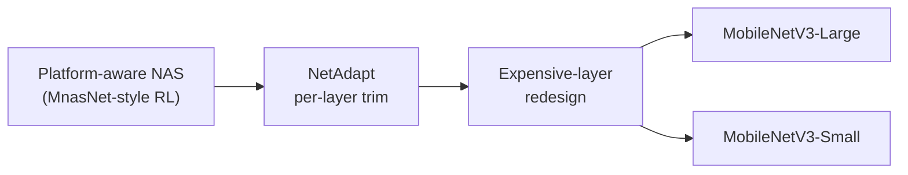

# Motivation

RGB image $(3, H, W)$ in, class logits (1000-way) or dense per-pixel scores out. MobileNetV3 targets sub-80 ms and sub-16 ms latency on a single Pixel-phone CPU core for the Large and Small variants respectively. The architecture is found by a two-stage search — platform-aware NAS establishes the coarse block structure and NetAdapt trims per-layer filter counts — then completed by two hand-crafted fixes to known high-cost layers. The defining properties are the inverted-residual block augmented with Squeeze-and-Excitation and the hard-swish (h-swish) nonlinearity, and the Lite Reduced ASPP (LR-ASPP) segmentation decoder that strips DeepLab's parallel multi-rate ASPP branches for mobile latency.

# Architecture

**Family & shape.** CNN backbone. Input: RGB tensor $(3, H, W)$, canonical evaluation at $224 \times 224$, with optional width multipliers (0.35, 0.5, 0.75, 1.0, 1.25) and resolution sweeps (96–256 px). Output: 1000-way class logits for classification, or — with downstream heads — bounding-box predictions (SSDLite) or per-pixel class scores (LR-ASPP). Two released sizes: MobileNetV3-Large and MobileNetV3-Small.

**Blocks.** The core building primitive is the inverted-residual + linear-bottleneck block inherited from MobileNetV2: a 1×1 expansion convolution, a depthwise 3×3 or 5×5 convolution, and a 1×1 projection, with a residual skip when input and output channel counts match. Inside the expansion, after the depthwise convolution, a Squeeze-and-Excitation module gates the feature map: global-average-pool collapses the expanded channels to a vector, a linear reduction to 1/4 of the expansion-layer channels followed by a hard-sigmoid produces a per-channel weight, and the weight is broadcast-multiplied back onto the expanded map (Section 5.3). The hard-sigmoid is:

$$
\operatorname{hard\text{-}sigmoid}(x) = \frac{\operatorname{ReLU6}(x + 3)}{6}
$$

The deeper half of the network uses h-swish in place of ReLU, where:

$$
\operatorname{h\text{-}swish}[x] = x \cdot \frac{\operatorname{ReLU6}(x + 3)}{6}
$$

and $\operatorname{ReLU6}(x) = \min(\max(x, 0), 6)$. Earlier layers retain ReLU for speed; the shift by 3 and division by 6 make the approximation numerically compatible with optimized hardware kernels (Section 5.2).

The inverted-residual block with SE and h-swish in PyTorch:

```python
import torch.nn as nn
import torch.nn.functional as F

class InvertedResidualSE(nn.Module):
    def __init__(self, in_ch, exp_ch, out_ch, kernel_size, use_hs, use_se):
        super().__init__()
        self.use_residual = in_ch == out_ch
        self.expand = nn.Sequential(
            nn.Conv2d(in_ch, exp_ch, 1, bias=False), nn.BatchNorm2d(exp_ch))
        self.dw = nn.Sequential(
            nn.Conv2d(exp_ch, exp_ch, kernel_size, padding=kernel_size // 2,
                      groups=exp_ch, bias=False), nn.BatchNorm2d(exp_ch))
        self.use_se = use_se
        if use_se:                                  # SE bottleneck = 1/4 of exp_ch
            se_ch = max(1, exp_ch // 4)
            self.se_reduce = nn.Conv2d(exp_ch, se_ch, 1)
            self.se_expand = nn.Conv2d(se_ch, exp_ch, 1)
        self.act = (lambda x: x * F.relu6(x + 3) / 6) if use_hs else F.relu
        self.project = nn.Sequential(
            nn.Conv2d(exp_ch, out_ch, 1, bias=False), nn.BatchNorm2d(out_ch))

    def forward(self, x):
        out = self.act(self.expand(x))              # 1×1 expand
        out = self.act(self.dw(out))                # depthwise
        if self.use_se:                             # SE gate
            s = out.mean((2, 3), keepdim=True)
            s = F.relu(self.se_reduce(s))
            s = F.relu6(self.se_expand(s) + 3) / 6  # hard-sigmoid
            out = out * s
        out = self.project(out)                     # 1×1 project (linear)
        return out + x if self.use_residual else out
```

Two hand-crafted layer redesigns reduce latency outside the NAS search space (Section 5.1). The final feature expansion is moved past global-average-pool to operate at $1 \times 1$ spatial resolution, eliminating a preceding bottleneck projection and saving 7 ms / 30 M MAdds (11% of runtime). The initial 3×3 stem is reduced from 32 to 16 filters (using h-swish), saving a further 2 ms and 10 M MAdds.

The LR-ASPP segmentation decoder (Section 6.4, Figure 10) strips DeepLab ASPP's parallel multi-rate convolution branches, keeping only a global-average-pool context branch with large-kernel large-stride pooling and a single 1×1 convolution, plus a skip connection from low-level features. Atrous convolution in the last backbone block preserves output stride 16.

**Training.** ImageNet-1k classification with standard supervised cross-entropy. Architecture search proceeds in two stages: a platform-aware NAS controller (MnasNet-style RL with a factorized hierarchical search space) finds the coarse block structure using the reward below, then NetAdapt iteratively trims per-layer filter counts subject to a fixed latency reduction per step, short-training each candidate and selecting on accuracy.

:::definition[NAS latency-accuracy reward]
Multi-objective reward balancing top-1 accuracy against measured on-device latency, with weight $w$ controlling the accuracy-latency tradeoff.

$$
\mathrm{ACC}(m) \times \left[\frac{\mathrm{LAT}(m)}{\mathrm{TAR}}\right]^{w}
$$
:::

The weight is $w = -0.07$ for Large and $w = -0.15$ for Small (the steeper penalty accounts for the sharper accuracy-latency tradeoff at small scale). Headline results (Table 3, floating-point, 224 px, Pixel 1): MobileNetV3-Large 1.0 achieves 75.2% top-1 at 51 ms, versus MobileNetV2 1.0 at 72.0% top-1 and 64 ms (+3.2% accuracy, −20% latency). MobileNetV3-Small 1.0 achieves 67.4% top-1 at 15.8 ms, versus MobileNetV2-0.35 at 60.8% top-1 and 16.6 ms (+6.6% accuracy at comparable latency).

**Complexity.** Redesigned expensive layers recover 7 ms / 30 M MAdds (last stage) and 2 ms / 10 M MAdds (stem 32→16); Pixel-1 floating-point latencies are 51 ms (Large) and 15.8 ms (Small).



# Implementations

Official TensorFlow-slim release; torchvision's port is the de-facto PyTorch reference.

# Assessment

**Novelty.** Fuses MobileNetV2's inverted-residual + linear-bottleneck block, MnasNet-style platform-aware NAS with the accuracy-latency reward, NetAdapt per-layer filter trimming, and Squeeze-and-Excitation channel gating, then adds two original contributions: h-swish and LR-ASPP.

- The SE bottleneck ratio (1/4 of expansion channels) is fixed globally; MnasNet sized SE relative to the convolutional bottleneck.
- h-swish replaces the soft sigmoid in swish, avoiding the numerically unstable fixed-point sigmoid in INT8 runtimes (Section 5.2).
- LR-ASPP removes the parallel multi-rate branches from DeepLab's ASPP, retaining only the global-average-pool context path.

**Strengths.**

- Classification: +3.2% top-1 accuracy and −20% latency versus MobileNetV2 1.0 (Table 3, Pixel 1, 224 px).
- Small variant: +6.6% top-1 accuracy at comparable latency (67.4% at 15.8 ms vs. 60.8% at 16.6 ms; Table 3).
- Cityscapes segmentation: MobileNetV3-Large + LR-ASPP (F=128) reaches 72.36% mIOU in 657 ms on Pixel 3 CPU at half-resolution, versus MobileNetV2 + R-ASPP (F=256) at 72.56% mIOU in 793 ms (Table 7). The abstract reports a 34% latency reduction at similar accuracy; comparing Table 7 rows directly for matched filter counts gives roughly 16%, with the 34% figure referring to a specific matched-setting comparison.
- h-swish is piecewise-linear and representable exactly in quantized runtimes that support ReLU6, reducing INT8 quantization loss relative to soft sigmoid.

**Limitations.**

- The NAS latency reward is measured on Pixel-family CPUs via TFLite; the discovered architecture is not guaranteed Pareto-optimal on GPU or NPU targets.
- h-swish requires ReLU6 support in the inference runtime; hardware lacking this primitive falls back to custom clipping or full sigmoid, losing the quantization advantage (Section 5.2).
- Latency-accuracy gains from SE and h-swish diminish at very small width multipliers (≤0.35), where bottleneck overhead remains fixed but fewer channels reduce the relative benefit.

# References

1. A. Howard, M. Sandler, G. Chu, L. Chen, B. Chen, M. Tan, W. Wang, Y. Zhu, R. Pang, V. Vasudevan, Q. V. Le, H. Adam. *Searching for MobileNetV3.* ICCV, 2019. [arXiv 1905.02244](https://arxiv.org/abs/1905.02244)
2. M. Sandler, A. Howard, M. Zhu, A. Zhmoginov, L. Chen. *MobileNetV2: Inverted Residuals and Linear Bottlenecks.* CVPR, 2018. [arXiv 1801.04381](https://arxiv.org/abs/1801.04381)
3. M. Tan, B. Chen, R. Pang, V. Vasudevan, M. Sandler, A. Howard, Q. V. Le. *MnasNet: Platform-Aware Neural Architecture Search for Mobile.* CVPR, 2019. [arXiv 1807.11626](https://arxiv.org/abs/1807.11626)
4. L. Chen, G. Papandreou, I. Kokkinos, K. Murphy, A. Yuille. *DeepLab: Semantic Image Segmentation with Deep Convolutional Nets, Atrous Convolution, and Fully Connected CRFs.* IEEE TPAMI, 2018.
5. J. Long, E. Shelhamer, T. Darrell. *Fully Convolutional Networks for Semantic Segmentation.* CVPR, 2015.
