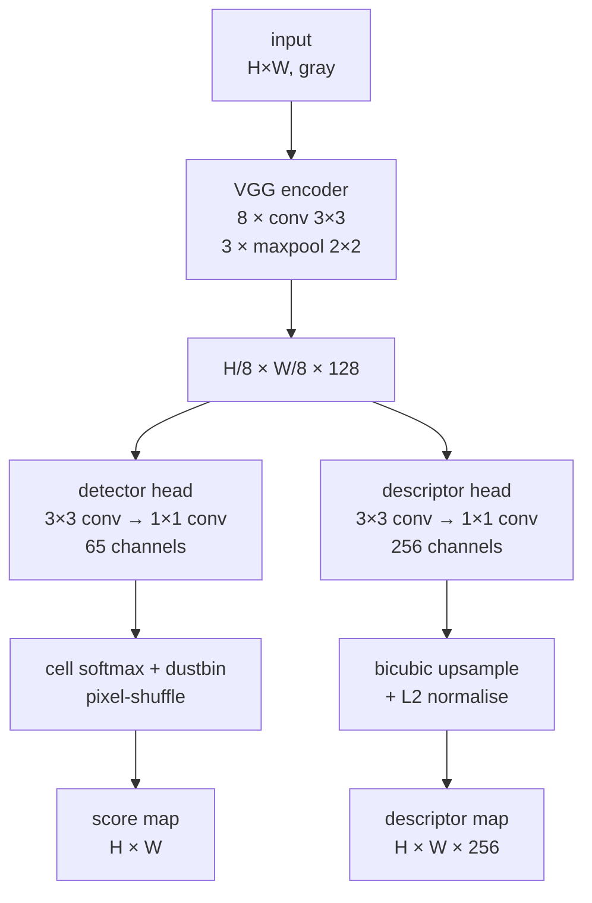

# Motivation

Jointly detect interest points and compute discriminative descriptors for full images in a single forward pass, trained without any human keypoint annotations. The detector head produces a sparse keypoint set (after threshold + NMS); the descriptor head produces a dense 256-D map sampled at the detected positions. The system replaces sequential detect-then-describe pipelines (SIFT's DoG + 128-D descriptor; LIFT's staged supervised architecture) with a single shared VGG-style encoder feeding two parallel decoder heads, and circumvents the absence of labelled real-image keypoint data via a self-supervised procedure called Homographic Adaptation.

# Architecture

**Family & shape.** Fully-convolutional CNN. Input: grayscale image $X \in \mathbb{R}^{H \times W}$. Two simultaneous outputs: a per-pixel keypoint score map $L \in \mathbb{R}^{H \times W}$ (decoded from a $\mathbb{R}^{H/8 \times W/8 \times 65}$ cell softmax) and a dense descriptor map $D \in \mathbb{R}^{H \times W \times 256}$ (bicubic-upsampled from $\mathbb{R}^{H/8 \times W/8 \times 256}$ and L2-normalised).

**Blocks.** Shared VGG-style encoder of eight $3 \times 3$ convolutions with channel widths 64-64-64-64-128-128-128-128 and a $2 \times 2$ max-pool after every pair of convolutions — three poolings yield $H_c = H/8$, $W_c = W/8$ at the encoder output (§3.1). Every conv layer is followed by ReLU + BatchNorm. Each decoder head is a single $3 \times 3$ conv (256 channels) followed by a $1 \times 1$ conv to 65 (detector) or 256 (descriptor) channels.

**Detector head.** A 65-channel softmax per cell — 64 positions inside an $8 \times 8$ image-cell plus a 65th "no-keypoint" dustbin class (§3.2). No learned upsampling: the 64 spatial classes are reshaped into the $8 \times 8$ block via depth-to-space ("pixel shuffle"), recovering the $H \times W$ resolution exactly. The dustbin lets the network express "no point in this cell" without inflating one of the 64 spatial bins.

**Descriptor head.** A semi-dense 256-D map at the encoder resolution $H/8 \times W/8$ is bicubic-upsampled to $H \times W$ and L2-normalised at every spatial position (§3.3). Inspired by UCN (Choy et al. 2016).

:::definition[Homographic Adaptation]
A self-supervised procedure for generating pseudo-ground-truth keypoint labels on real images. Apply $N_h$ random homographies to an unlabelled image, run the current detector on each warped copy, back-project detections through the inverse homography, and aggregate:

$$
\hat{F}(I; f_\theta) = \frac{1}{N_h} \sum_{i=1}^{N_h} H_i^{-1}\,f_\theta\bigl(H_i(I)\bigr).
\quad \text{(Eq. 10)}
$$

The aggregated heatmap promotes points consistently detected across many viewpoints; isolated false positives wash out. Repeatability saturates at $N_h = 100$ — diminishing returns beyond that (§5.2).
:::

**Training.** Two stages. (1) **MagicPoint** — train the encoder + detector head on *Synthetic Shapes* (rendered triangles, quadrilaterals, lines, ellipses, cubes, checkerboards, stars) with full supervision since corner ground truth is unambiguous on these primitives (§4). 200,000 iterations on-the-fly. (2) **SuperPoint** — apply MagicPoint to MS-COCO 2014 (80k grayscale images at $240 \times 320$) under Homographic Adaptation with $N_h = 100$ to generate pseudo-labels, then jointly train both heads on image pairs related by random homographies (§6). Combined loss (Eq. 1):

$$
\mathcal{L} = \mathcal{L}_p(X, Y) + \mathcal{L}_p(X', Y') + \lambda\,\mathcal{L}_d(D, D', S),
$$

with $\lambda = 0.0001$. The detector loss $\mathcal{L}_p$ is a cell-wise cross-entropy over the 65 classes (Eq. 2–3); the descriptor loss $\mathcal{L}_d$ is a hinge loss on cell-pair correspondences induced by the homography (Eq. 5–6) with margins $m_p = 1$, $m_n = 0.2$ and class-balance weight $\lambda_d = 250$. Optimiser: Adam, lr $= 0.001$, batch 32. Augmentation: Gaussian noise, motion blur, brightness changes.

**Complexity.** ~1.3M trainable parameters (estimate from eight VGG-style conv layers + two decoder heads — not stated explicitly in the paper). Inference: ~11 ms per image on Titan X GPU at $480 \times 640$ → 70 FPS (§7.1). Descriptor sampling at $N = 1000$ detected points: ~1.5 ms on CPU. No FLOPs figure reported.

# Implementations

The official Magic Leap PyTorch release ships pretrained weights (`superpoint_v1.pth`) and an inference notebook; the LICENSE at the pinned commit restricts use to noncommercial academic research — see Limitations.

# Assessment

**Novelty.**

- First system to jointly detect keypoints and compute descriptors in a single fully-convolutional forward pass over full images (not patches), with no human keypoint annotations and no SfM supervision (contrast: LIFT requires SfM-derived labels; SIFT uses handcrafted DoG; ORB uses FAST + steered BRIEF).
- **Homographic Adaptation** as a multi-homography aggregation procedure for self-supervised label generation from any unlabelled image collection (Eq. 10). The recipe is general — not tied to any specific architecture.
- 65-class cell softmax with **dustbin** as a parameter-free upsampling scheme that avoids the checkerboard artefacts of learned deconvolution (§3.2).

**Strengths.**

- Descriptor discriminability under illumination change: NN mAP 0.821 on HPatches vs SIFT 0.694, LIFT 0.664, ORB 0.735 (Table 4).
- Real-time on GPU: 70 FPS at $480 \times 640$ on Titan X (§7.1) — well below SIFT's CPU runtime.
- Self-supervised — re-training on a new domain requires only unlabelled images and a re-run of Homographic Adaptation; no manual annotation.
- Foundational influence: the two-head (shared encoder + 65-class detector + descriptor) design is directly reused by [XFeat](/atlas/xfeat) and inspired R2D2, DISK, and ALIKE.

**Limitations.**

- **No subpixel localisation.** MLE 1.158 px on HPatches vs SIFT 0.833 px (Table 4). The cell-aligned softmax output has no subpixel correction; downstream tasks requiring sub-pixel accuracy must add a refinement step (Hessian saddle, mean-shift) at the detected positions.
- **Not rotation-invariant.** Fails on extreme in-plane rotation outside the training homography distribution (§7.3, Figure 8 caption: "failure case … due to extreme in-plane rotation not seen in the training examples"). ORB's steered BRIEF handles this regime better.
- **Not scale-invariant by construction.** No scale-space, no orientation normalisation. Scale coverage is empirical, limited to the training homography range.
- **Supervision from homographies only.** Generalisation to non-planar parallax scenes is unverified by the paper's HPatches-centric evaluation protocol.
- **Keypoint density ceiling.** The $8 \times 8$ cell design caps effective keypoint density to one point per 64 pixels; at $480 \times 640$ the theoretical maximum is 4800 points (paper evaluates at $N = 1000$).
- **Restrictive code and weights license.** The official Magic Leap repository's LICENSE is a custom "academic or non-profit organization noncommercial research use only" agreement — the pretrained weights inherit the same restriction. Commercial deployment requires either a separate licensing agreement with Magic Leap or retraining from scratch on a redistributable dataset.

## When to choose SuperPoint over XFeat

[XFeat](/atlas/xfeat) (Potje 2024) is the direct architectural successor to SuperPoint, inheriting the two-head (detector + descriptor) shared-encoder design and the 65-class cell-softmax-with-dustbin output convention. The structural departure: XFeat's keypoint head operates on **unfolded $8 \times 8$ raw-pixel blocks** rather than the deep encoder output — a radical simplification motivated by inference on hardware-constrained devices.

| | SuperPoint (2018) | XFeat (2024) |
|---|---|---|
| Encoder | VGG-style, 8 conv layers, ~1.3M params | Featherweight, 6 basic blocks, channel widths {4, 8, 24, 64, 64, 128} |
| Keypoint head | shared encoder output | unfolded raw $8 \times 8$ pixel blocks (parallel branch) |
| Descriptor dim | 256 | 64 |
| Inference | 70 FPS on Titan X GPU at $480 \times 640$ | 27 FPS on i5-1135G7 **CPU** at $480 \times 640$ |
| Training data | MS-COCO + Synthetic Shapes (self-supervised) | MegaDepth + synthetic COCO warps (6:4) |
| HPatches MLE | 1.158 px (Table 4) | similar regime — both lack subpixel refinement |
| Match refinement | not built in | MLP head on coarse-NN descriptor pair (§3.2) |

Choose SuperPoint when (1) you have GPU inference and want maximum descriptor capacity (256-D vs 64-D matters for very large keypoint corpora and for re-ID-style retrieval); (2) you specifically need the Homographic Adaptation pipeline for self-supervised retraining on a new domain — XFeat uses MegaDepth supervision and does not provide a self-supervised retrain recipe; (3) you need the foundational reference for downstream comparisons (R2D2, DISK, ALIKE all benchmark against SuperPoint, not XFeat). Choose XFeat when CPU inference is the requirement — XFeat is purpose-built for hardware-constrained deployment (Orange Pi Zero 3, mobile robots) where SuperPoint's encoder is impractical.

# References

1. D. DeTone, T. Malisiewicz, A. Rabinovich. *SuperPoint: Self-Supervised Interest Point Detection and Description.* CVPR Workshops, 2018. [arXiv:1712.07629](https://arxiv.org/abs/1712.07629)
2. G. Potje, F. Cadar, A. Araújo, R. Martins, E. R. Nascimento. *XFeat: Accelerated Features for Lightweight Image Matching.* IEEE CVPR, 2024. (Direct architectural successor.)
3. E. Rosten, T. Drummond. *Machine Learning for High-Speed Corner Detection.* ECCV, 2006. (FAST — the prior art that "cast high-speed corner detection as a machine learning problem.")
4. K. M. Yi, E. Trulls, V. Lepetit, P. Fua. *LIFT: Learned Invariant Feature Transform.* ECCV, 2016. (Supervised SfM-trained competitor; superseded on HPatches.)
