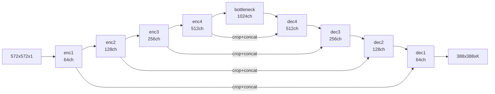

# Motivation

Dense pixel-level semantic segmentation of 2D biomedical images — electron microscopy, phase-contrast, and DIC microscopy — assigns a class label to every pixel of an input tile of 572×572 pixels and produces a segmentation probability map at 388×388 pixels per forward pass; the spatial reduction arises directly from unpadded 3×3 convolutions applied throughout the network. The defining constraint at design time was extreme training-data scarcity: the primary benchmark contains fewer than 35 partially annotated images, far below the thousands required by earlier sliding-window convolutional approaches. The central architectural contribution is a symmetric contracting–expansive U-shape in which skip connections carry the full (cropped) encoder feature maps into the decoder by concatenation — in contrast to FCN-8s, which fuses shallow score maps via element-wise summation at coarse resolutions and provides no learned per-stage decoder. The design produces both a rich decoder that recovers fine cell-boundary detail through those concatenated feature maps and a pixel-distance-weighted cross-entropy loss that forces the network to learn separation between touching cell instances.

# Architecture

**Family & shape.** Encoder-decoder fully convolutional CNN trained from scratch on the target domain; no ImageNet pretraining is used. Weight initialisation follows a Gaussian with standard deviation $\sqrt{2/N}$ (He-style). Input tensor: 572×572×1 (single-channel grayscale tile; generally $H \times W \times C$). Output tensor: 388×388×$K$ per-pixel class probability map ($K$ = number of classes). The H/W mismatch between input and output is a direct consequence of unpadded 3×3 convolutions throughout; each such convolution reduces each spatial dimension by 2 pixels, and the overlap-tile strategy compensates at inference.

**Blocks.** The network contains 23 convolutional layers (Section 2, Figure 1) organised into three structural parts.

*Contracting path.* Four symmetric resolution levels, each consisting of 2× (3×3 unpadded conv + ReLU) followed by 2×2 max-pool with stride 2. At each downsampling step the channel count doubles: 64 → 128 → 256 → 512 → 1024 at the bottleneck. The contracting path ends at the 1024-channel bottleneck; dropout is applied at the end of the contracting path (Section 3.1).

*Expansive path.* Four symmetric levels, each consisting of a 2×2 up-convolution (transposed conv, halving channels) followed by concatenation with the correspondingly cropped feature map from the contracting path, then 2× (3×3 unpadded conv + ReLU). Cropping is necessary because the unpadded convolutions in the contracting path reduce spatial size before the skip is formed; the decoder crop aligns the tensors for concatenation.

*Final layer.* A 1×1 convolution maps the 64-channel feature vector at the output resolution to $K$ class scores.

**Overlap-tile strategy** (Section 2, Figure 2): for images larger than a single tile, prediction proceeds in overlapping input tiles; missing border context is filled by mirroring the input at the boundary, making the network applicable to arbitrarily large images without retraining.

The U-Net topology as a PyTorch forward-pass outline (shapes given for the canonical 572×572 input, K=2):

```python
def unet_forward(x, enc1, enc2, enc3, enc4, bottleneck,
                 dec4, dec3, dec2, dec1, final_conv, crop):
    # Contracting path — channel-doubling at each level
    s1 = enc1(x)          # 2x conv3x3 ReLU  -> (B, 64,  568, 568)
    s2 = enc2(pool(s1))   # 2x conv3x3 ReLU  -> (B, 128, 280, 280)
    s3 = enc3(pool(s2))   # 2x conv3x3 ReLU  -> (B, 256, 136, 136)
    s4 = enc4(pool(s3))   # 2x conv3x3 ReLU  -> (B, 512,  64,  64)

    # Bottleneck + dropout
    b  = bottleneck(pool(s4))   # 2x conv3x3 ReLU  -> (B, 1024, 28, 28)

    # Expansive path — 2x2 up-conv, concat cropped skip, 2x conv3x3 ReLU
    d4 = dec4(upconv(b),  crop(s4))  # -> (B, 512,  52,  52)
    d3 = dec3(upconv(d4), crop(s3))  # -> (B, 256, 100, 100)
    d2 = dec2(upconv(d3), crop(s2))  # -> (B, 128, 196, 196)
    d1 = dec1(upconv(d2), crop(s1))  # -> (B, 64,  388, 388)

    # Final 1x1 conv -> K class scores
    return final_conv(d1)            # -> (B, K,   388, 388)
```



**Training.** Datasets: ISBI 2012 EM segmentation challenge (35 partially annotated images, augmented by random elastic deformations); ISBI 2015 cell-tracking challenge (PhC-U373 and DIC-HeLa subsets). Loss: pixel-wise weighted cross-entropy (Section 3, Eq. 1–2); see the definition block below. Optimizer: SGD with momentum 0.99 (Section 3); the high momentum value means each weight update is dominated by the accumulated gradient history rather than the single-image gradient — this compensates for the effective batch size of 1. Effective batch size 1: training processes one large tile per update (Section 3). Weight initialisation: Gaussian with standard deviation $\sqrt{2/N}$, where for a 3×3 convolution on 64 input channels $N = 9 \times 64 = 576$ (Section 3). Data augmentation: random elastic deformations sampled from a 3×3 grid with displacements drawn from a Gaussian (standard deviation 10 px), bicubic interpolation; dropout at the end of the contracting path (Section 3.1). Training time approximately 10 hours on an NVidia Titan GPU with 6 GB memory (Section 5).

Headline metrics (paper tables):

- ISBI 2012 EM segmentation: warping error **0.0003529**, rand error **0.0382** (Table 1) — rank 1 at the time of submission.
- ISBI 2015 cell-tracking — PhC-U373: IoU **92.03%** (second-best method: 83%) (Table 2).
- ISBI 2015 cell-tracking — DIC-HeLa: IoU **77.5%** (second-best method: 46%) (Table 2).

:::definition[Weighted cross-entropy loss]
Pixel-wise weighted softmax cross-entropy that simultaneously balances class frequencies and penalises mis-labelling of the narrow gaps between touching cell instances (Section 3, Eq. 1–2):

$$E = -\sum_{\mathbf{x} \in \Omega} w(\mathbf{x}) \log p_{\ell(\mathbf{x})}(\mathbf{x})$$

$$
w(\mathbf{x}) = w_c(\mathbf{x}) + w_0 \cdot \exp\!\left(-\frac{(d_1(\mathbf{x}) + d_2(\mathbf{x}))^2}{2\sigma^2}\right)
$$

$w_c(\mathbf{x})$ is the class-frequency balancing term; $d_1(\mathbf{x})$ and $d_2(\mathbf{x})$ are the distances to the borders of the nearest and second-nearest cell, respectively. The exponential term rises sharply in the gap between touching cells, forcing the network to predict inter-instance separation background precisely. Paper values: $w_0 = 10$, $\sigma \approx 5\text{ px}$.
:::

**Complexity.** Parameter count is not stated in the paper; `milesial/Pytorch-UNet` at v4.0 reports approximately 31M parameters for a 1-channel input / 2-class configuration. Input/output sizes: 572×572 → 388×388 per Figure 1. The contracting path's four 2×2 max-pool stages accumulate a large effective receptive field at the bottleneck. FLOPs are not reported in the paper.

# Implementations

Official Fiji/ImageJ plugin with Caffe backend from the authors' lab; a widely-used PyTorch port (milesial) is the de-facto reference for modern training.

# Assessment

**Novelty.**

- Symmetric encoder-decoder with channel-doubling contracting path and channel-halving expansive path, in contrast to FCN-8s's asymmetric design that fuses coarse score maps at the decoder without a per-stage learned upsampling block.
- Skip connections carry the full (cropped) encoder feature tensors into the decoder by concatenation, propagating fine-grained spatial detail (cell boundaries, membrane locations) across all resolutions — distinct from FCN's element-wise sum of low-channel class-score maps that carries no additional spatial information.
- Pixel-distance-weighted cross-entropy with $w_0 = 10$, $\sigma \approx 5\text{ px}$ (Eq. 2) to force the network to learn the narrow separation background between touching cell instances — a loss regime absent from FCN.
- Overlap-tile inference with mirror-padding allowing application to arbitrarily large images without retraining or architectural change.

**Strengths.**

- State-of-the-art on ISBI 2012 EM segmentation at publication: warping error 0.0003529, rand error 0.0382 (Table 1), a significant margin over the prior sliding-window ConvNet of Ciresan et al.
- Trained from scratch on approximately 35 images via heavy elastic-deformation augmentation — demonstrates the design is effective in extreme data-scarcity regimes where FCN-style ImageNet pretraining is unavailable or inappropriate.
- Per-tile inference covers a 388×388 output region per forward pass; tiles compose seamlessly to any image size via the overlap-tile scheme.
- Architecture transfers across imaging modalities: PhC-U373 (phase contrast), DIC-HeLa (differential interference contrast), and EM, with leading results on each (Table 2).

**Limitations.**

- Unpadded convolutions force an input/output size mismatch (572 → 388) and require the overlap-tile strategy at inference; most subsequent reimplementations switch to same-padding, deviating from the paper's exact specification.
- Designed for grayscale 2D input; volumetric or multi-channel data requires adapted variants (3D U-Net, V-Net, nnU-Net).
- Both verified public implementations — the official Fiji/ImageJ Caffe plugin (`lmb-freiburg/Unet-Segmentation`) and the milesial PyTorch port — carry **GPL-3.0** licenses; integrating either into a proprietary pipeline requires a clean-room reimplementation.
- The Carvana pretrained weights distributed with `milesial/Pytorch-UNet` v3.0 are for natural-image car silhouettes and are not transferable to biomedical targets without retraining.

# References

1. O. Ronneberger, P. Fischer, T. Brox. *U-Net: Convolutional Networks for Biomedical Image Segmentation.* MICCAI, 2015. [arXiv:1505.04597](https://arxiv.org/abs/1505.04597)
2. J. Long, E. Shelhamer, T. Darrell. *Fully Convolutional Networks for Semantic Segmentation.* IEEE CVPR, 2015. [arXiv:1411.4038](https://arxiv.org/abs/1411.4038) (Immediate antecedent: U-Net inherits the fully-convolutional dense-prediction framing and extends it with a symmetric decoder and skip concatenation.)
3. K. He, X. Zhang, S. Ren, J. Sun. *Delving Deep into Rectifiers: Surpassing Human-Level Performance on ImageNet Classification.* ICCV, 2015. [arXiv:1502.01852](https://arxiv.org/abs/1502.01852) (He weight initialisation $\sqrt{2/N}$ used in U-Net training.)
4. Ö. Çiçek, A. Abdulkadir, S. S. Lienkamp, T. Brox, O. Ronneberger. *3D U-Net: Learning Dense Volumetric Segmentation from Sparse Annotation.* MICCAI, 2016. [arXiv:1606.06650](https://arxiv.org/abs/1606.06650) (Direct 3D extension by the same authors.)
5. F. Isensee, P. F. Jaeger, S. A. A. Kohl, J. Petersen, K. H. Maier-Hein. *nnU-Net: a self-configuring method for deep learning-based biomedical image segmentation.* Nature Methods, 2021. [doi:10.1038/s41592-020-01008-z](https://doi.org/10.1038/s41592-020-01008-z) (Modern standardisation of the U-Net training recipe.)
