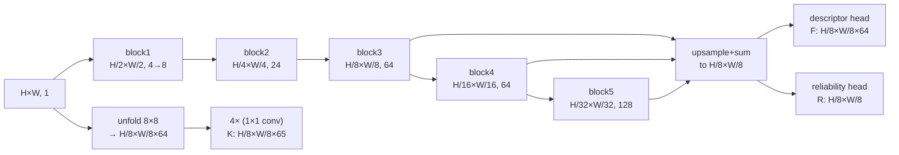

# Motivation

Extract sparse or semi-dense local correspondences between two images under a fixed CPU compute budget, in a single forward pass that produces keypoints, 64-D descriptors, and a per-feature reliability score. Input: grayscale image $I \in \mathbb{R}^{H \times W \times 1}$. Output: a keypoint heatmap $K$, a descriptor field $F \in \mathbb{R}^{H/8 \times W/8 \times 64}$, and a reliability map $R \in \mathbb{R}^{H/8 \times W/8}$; at match time, an additional MLP refines coarse nearest-neighbour pairs to pixel-level offsets. The model is specific to an **early-downsampling backbone with triple-rate channel progression** and a **keypoint head that is decoupled from the descriptor encoder**, which together remove the resolution / depth trade-off that forces prior detectors either to share a heavy encoder (SuperPoint) or to evaluate high-resolution feature maps at match time (DISK, LoFTR).

# Architecture

**Family & shape.** Three-headed convolutional encoder. Input: grayscale $I \in \mathbb{R}^{H \times W \times 1}$. Outputs: keypoint logits $K \in \mathbb{R}^{H/8 \times W/8 \times 65}$ (64 intra-cell positions + dustbin), descriptors $F \in \mathbb{R}^{H/8 \times W/8 \times 64}$, reliability $R \in \mathbb{R}^{H/8 \times W/8}$. A separate match-refinement MLP consumes concatenated nearest-neighbour descriptor pairs at inference time.

**Blocks.** Backbone is six *basic blocks* with channel progression $\{4, 8, 24, 64, 64, 128\}$ and output resolutions $H/2, H/4, H/8, H/16, H/32$ respectively (§3.1, §B). A basic layer is a 2-D convolution with kernel $k \in \{1, 3\}$, ReLU, and BatchNorm; the first basic layer of each block uses stride 2 for spatial halving. The **defining choice is the triple-rate channel schedule** — each spatial halving multiplies the channel count by roughly $3\times$ instead of VGG's $2\times$ (§3.1) — which starves the first two blocks of capacity where resolution is highest, and concentrates depth where the feature maps are small.

The three output heads share the encoder *only for the descriptor and reliability branches* (both feed from the fused multi-scale descriptor tensor). The keypoint branch is parallel and operates on a direct unfold of the 8×8 image grid into a 64-channel tensor, then applies four 1×1 convolutions (§3.2). This avoids the receptive-field conflict that a shared detector-descriptor encoder imposes on compact backbones, ablated in Table 5 row (iii).

:::definition[Dual-softmax descriptor loss]
Symmetric NLL of the diagonal of the descriptor similarity matrix $S = F_1 F_2^\top$ under row-wise softmax in both directions, pulling matched features to mutual nearest neighbours.

$$
\begin{aligned}
\mathcal{L}_{ds} = &- \sum_i \log\bigl(\mathrm{softmax}_r(S)_{ii}\bigr) \\
 &- \sum_i \log\bigl(\mathrm{softmax}_r(S^\top)_{ii}\bigr).
\end{aligned}
$$
:::

At match time a refinement MLP converts a coarse descriptor pair into a pixel-level offset:

$$
(x, y) = \arg\max_{i,j \in \{1, \ldots, 8\}} \mathbf{o}(i, j), \quad \mathbf{o} = \mathrm{reshape}_{8 \times 8}\bigl(\mathrm{MLP}(\mathrm{concat}(f_a, f_b))\bigr).
$$

The MLP takes the two 64-D coarse descriptors, never high-resolution features — the whole refinement stage costs a single linear chain per matched pair (§3.2, Fig. 4).

**Training.** Data: MegaDepth + synthetically warped MS-COCO pairs in a 6:4 ratio, resized to $800 \times 600$ (§B). Loss is a weighted sum (Eq. 7) of the dual-softmax descriptor loss $\mathcal{L}_{ds}$ above, an $L_1$ reliability loss $\mathcal{L}_{rel}$ supervised by the per-row maxima of the dual-softmax probabilities (Eq. 4), an NLL fine-offset loss $\mathcal{L}_{fine}$ on the $8 \times 8$ offset logits (Eq. 5), and an NLL keypoint loss $\mathcal{L}_{kp}$ supervised by **knowledge distillation from ALIKE-tiny's keypoint positions** (Eq. 6). Optimiser: Adam, learning rate $3 \times 10^{-4}$ with exponential decay factor $0.5$ per $30{,}000$ gradient updates, batch size 10 image pairs, 160,000 iterations to convergence (§B). Reported results on Megadepth-1500 relative pose: $\text{AUC}@5° = 42.6$ / $56.4$ / $67.7$ at thresholds $\{5°, 10°, 20°\}$ for XFeat sparse (4,096 keypoints) and $50.2$ / $65.4$ / $77.1$ for XFeat* semi-dense (10,000 keypoints) at $27.1$ and $19.2$ frames per second on an Intel i5-1135G7 CPU at VGA resolution (Table 1). HPatches homography MHA on the viewpoint split at $\{3, 5, 7\}$-pixel thresholds: $68.6$ / $81.1$ / $86.1$ (Table 3).

**Complexity.** Descriptors are 64-D at $H/8 \times W/8$ spatial resolution; 23 convolutional layers in the backbone (§B). The paper does not report a parameter count or FLOPs figure; the released PyTorch checkpoint at the pinned commit is $6.0\,\mathrm{MB}$ on disk. Training peaked at $6.5\,\mathrm{GB}$ VRAM on a single NVIDIA RTX 4090 (§B).

# Implementations

Official PyTorch release with Apache-2.0 code and Apache-2.0 weights shipped in-tree at the pinned commit.

# Assessment

**Novelty.**

- Replaces VGG's $2\times$ channel-doubling with a $3\times$-per-halving schedule $\{4, 8, 24, 64, 64, 128\}$ that starves the early (high-resolution) stages and concentrates depth at the small-resolution end (§3.1, ablation Table 5 row ii).
- Decouples keypoint detection from the descriptor encoder via a parallel $1 \times 1$-convolution branch on $8 \times 8$-unfolded raw pixel cells, contrasting SuperPoint's shared encoder and its ablation-confirmed degradation under a compact backbone (Table 5 row iii).
- Introduces a match-refinement MLP that consumes only coarse 64-D descriptor pairs, not high-resolution feature maps — contrast DISK's and LoFTR's refinement, which re-evaluate dense features at full resolution (§3.2, Fig. 4).
- Trains the keypoint head by distillation from ALIKE-tiny rather than from a hand-crafted ground truth, reusing the teacher's bias toward low-level corner/blob/line structures to match the receptive field of the small detector (Eq. 6).

**Strengths.**

- On Megadepth-1500, XFeat (sparse) reaches AUC@5° $42.6$ vs SuperPoint's $37.3$ at $27.1$ FPS vs $3.0$ FPS on the same i5-1135G7 CPU — $\sim 9 \times$ throughput at matched descriptor dimensionality (Table 1).
- XFeat* (semi-dense) reaches AUC@5° $50.2$ vs DISK's $53.8$ at $19.2$ FPS vs $1.2$ FPS on the same CPU — $\sim 16 \times$ throughput with $1.3$ AUC-point gap (Table 1).
- Generalises to indoor imagery: on ScanNet-1500, XFeat*'s AUC@5°/@10°/@20° $18.4$ / $34.7$ / $50.3$ outperforms SuperPoint's $12.5$ / $24.4$ / $36.7$ and DISK-10k's $11.3$ / $22.3$ / $33.9$ without retraining (Table 2).
- Official code and weights ship under Apache-2.0, covering commercial and redistribution use without explicit licensor permission.

**Limitations.**

- The keypoint head is trained by distillation from ALIKE-tiny (Eq. 6), so its recall ceiling is bounded by the teacher's bias toward low-level corner/blob structures — repetitive scenes without such structures are ablation-identified as a weak regime (Sec. 4.4).
- The paper reports neither parameter count nor FLOPs, and no inference-memory budget beyond the $6.5\,\mathrm{GB}$ training footprint — exact deployment sizing requires measuring the $6.0\,\mathrm{MB}$ checkpoint against the target device.
- Compact $64$-D descriptors reach AUC@5° $42.6$ against DISK's $53.8$ on Megadepth-1500 (sparse setting, Table 1) — the capacity reduction costs absolute pose accuracy on wide-baseline pairs.
- Training used a $6.5\,\mathrm{GB}$-VRAM RTX 4090 for 36 hours on a 6:4 MegaDepth/synthetic-COCO mix; reproducing on consumer GPUs with less VRAM requires either gradient accumulation or a smaller batch, neither of which is evaluated in the paper.

# References

1. G. Potje, F. Cadar, A. Araujo, R. Martins, E. R. Nascimento. *XFeat: Accelerated Features for Lightweight Image Matching.* CVPR 2024. [arXiv](https://arxiv.org/pdf/2404.19174)
2. D. DeTone, T. Malisiewicz, A. Rabinovich. *SuperPoint: Self-Supervised Interest Point Detection and Description.* CVPR Workshops 2018. [arXiv](https://arxiv.org/pdf/1712.07629)
