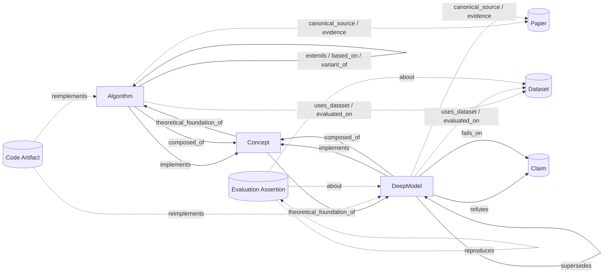
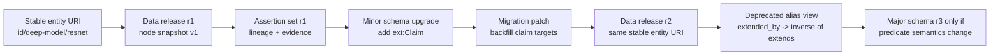

# Relation Schema for a Curated Computer-Vision Atlas

## Executive summary

A robust schema for a manually curated computer-vision atlas should be built as a **two-layer model**. The atlas itself should stay minimal, with only three first-class domain nodes—`Algorithm`, `DeepModel`, and `Concept`—while papers, datasets, code artifacts, evaluation records, and claim objects live in an **extension layer** used for provenance, benchmarking, reproduction, and refutation. That separation preserves the user’s minimal-node requirement while still using mature provenance and metadata patterns designed for specialization, authoring, and linked-data interchange. citeturn13view9turn13view14turn0search7turn19search1

The core relation vocabulary should be **directional, typed, and direct-only**. In practice, that means storing canonical predicates such as `extends`, `based_on`, `inspired_by`, `variant_of`, `implements`, `theoretical_foundation_of`, `composed_of`, `supersedes`, `evaluated_on`, `improves_metric_over`, `refutes`, and `fails_on`, while exposing inverses like `extended_by` and `superseded_by` as query views rather than duplicating both directions in storage. Citation ontologies and provenance ontologies already assume directional, annotatable assertions, and the SKOS design is a good reminder that direct hierarchical links are usually better stored explicitly while closure is computed separately. citeturn29view0turn30view2turn28search7

Every relation should be treated as an **assertion with evidence**, not just an unlabeled edge. The required evidence footprint should include the original paper URL, DOI when available, a page/section/table/figure locator, a short excerpt or paraphrased rationale, the curator identity, a confidence score, whether the statement is explicit or inferred, and timestamps for both assertion time and validity time. PROV-O, PAV, DataCite related-identifier metadata, and SHACL together provide a strong basis for this design. citeturn13view9turn13view14turn14view6turn24search15

Seed ideas such as **RANSAC** should remain first-class roots even when the original form is rarely used directly. The schema should mark them with something like `lineage_role=seed` and connect later families—such as MLESAC, PROSAC, and LO-RANSAC—through explicit lineage predicates, rather than flattening them into loose “historical notes.” That preserves both intellectual ancestry and practical descendant structure. citeturn18view0turn23search0turn23search1turn23search2

Because the storage constraint is unspecified, the safest strategy is a **storage-neutral conceptual schema** with dual serializations. A property-graph representation is usually more ergonomic for curation workflows because both nodes and edges naturally carry properties; RDF/JSON-LD is stronger for global identifiers, ontology reuse, SPARQL, and standard provenance publication. A hybrid design—single conceptual model, multiple serializations—is the most future-proof choice. citeturn20view2turn14view2turn13view12turn14view3turn14view4turn0search7

Versioning should distinguish **stable conceptual identity**, **versioned manifestations**, and **assertion history**. Stable URIs should identify the enduring atlas entity; version snapshots should capture how that entity is represented in a given release; and change logs should record relation additions, removals, deprecations, and evidence updates. Immutable URIs, specialization/versioning patterns, and patch logs are all well-supported by existing best-practice literature. citeturn13view13turn30view3turn24search0turn24search6

## Modeling assumptions

Because no storage constraint is specified, the logical schema should be independent of any particular database. I recommend a core namespace for atlas semantics, for example `cv:`, plus one or more extension namespaces, for example `ext:`, for papers, datasets, code, evaluation assertions, and claims. This follows the general pattern that provenance vocabularies can be specialized for domain needs, that lightweight versioning metadata can sit alongside them, and that linked-data serializations should remain interoperable with ordinary JSON-oriented systems. citeturn13view9turn13view14turn13view12turn0search7

| Core node type | What it represents | Required attributes | Recommended attributes | Default granularity |
|---|---|---|---|---|
| `Algorithm` | A named procedural method or non-neural technique with stable identity across papers or implementations | `uri`, `canonical_label`, `summary`, `first_year`, `canonical_source_id`, `granularity`, `status` | `aliases[]`, `input_contract`, `output_contract`, `task_tags[]`, `lineage_role`, `family_root_uri`, `notes` | Method family |
| `DeepModel` | A named neural architecture or named model family/variant | `uri`, `canonical_label`, `summary`, `first_year`, `canonical_source_id`, `granularity`, `status`, `task_family` | `aliases[]`, `parameterization_level` (`family`/`variant`), `modality`, `lineage_role`, `family_root_uri`, `checkpoint_policy`, `notes` | Model family or named variant |
| `Concept` | A task, principle, objective, module, failure regime, or theoretical device | `uri`, `canonical_label`, `definition`, `concept_kind`, `status` | `aliases[]`, `broader_concept_uri`, `narrower_concept_uris[]`, `notation`, `lineage_role`, `notes` | Controlled vocabulary concept |

Method-level identity should be the default. A single paper may introduce multiple atlas nodes, and one atlas node may legitimately cite multiple papers over time. ResNet is a good example of a deep-model family with named variants; specific variants such as 50-, 101-, and 152-layer forms can be separate `DeepModel` nodes linked by `variant_of` when they carry stable names and distinct benchmarking behavior. The same principle applies to Swin-T, Swin-B, and Swin-L if the curation goal includes variant-level browsing. Paper-level and code-level identity should therefore be optional support layers, not the primary unit of atlas navigation. citeturn27view0turn25view5turn19search1turn13view14

For paper-level, method-level, and code-level granularity, the cleanest rule is this: **the atlas node encodes the method or model identity; papers and code encode manifestations or evidence**. Bibliographic links such as `cites` are strongest at the paper layer, not the method layer, and should be projected upward to atlas nodes only when useful for browsing. Likewise, `reimplements` is usually most faithful as code-to-method or code-to-code, while `reproduces` is often best represented as one evaluation assertion reproducing another. citeturn29view0turn29view1turn13view14turn19search1

Identifiers should be **dereferenceable, immutable HTTP IRIs**, with human-readable but stable slugs. A practical pattern is:

- entity URI: `https://atlas.example.org/id/deep-model/resnet-50`
- version URI: `https://atlas.example.org/version/deep-model/resnet-50/1.0.0`
- assertion URI: `https://atlas.example.org/assertion/a-8f3c...`
- vocabulary URI: `https://atlas.example.org/ontology/extends`

Do not encode mutable labels inside the identifier. Store labels, aliases, paper titles, DOI values, arXiv IDs, and conference metadata as separate properties. When a DOI or canonical URL is genuinely unavailable, mark it explicitly as `unspecified`; do not silently leave the field blank. These practices align well with linked-data guidance on persistent HTTP URIs and vocabulary publication. citeturn13view13turn4search1turn14view7turn19search10

## Core schema

The most useful design is a **small, high-precision traversal vocabulary** plus a **support vocabulary** for evidence and scholarly bookkeeping. The traversal vocabulary should answer “how is this thing related to that thing?” in a way that is stable for lineage browsing; the support vocabulary should answer “how do we know?” and “under what benchmark or claim scope?” The table below synthesizes patterns from citation typing, provenance qualification, concept hierarchies, and graph-schema practice, but specializes them for computer-vision atlas curation. citeturn13view10turn13view9turn28search7turn20view2

### Relation taxonomy for traversal and lineage

| Relation | Domain → Range | Direct meaning | Multiplicity, closure, symmetry | Temporal notes | Key assertion attributes |
|---|---|---|---|---|---|
| `extends` | `Algorithm|DeepModel` → `Algorithm|DeepModel|Concept` | Source is a direct substantive extension of target | M:N; asymmetric; assert direct only; query closure allowed; inverse view `extended_by` | Usually atemporal; version fields optional | `confidence`, `primary_parent?`, `scope_note`, `evidence[]` |
| `based_on` | `Algorithm|DeepModel` → `Algorithm|DeepModel|Concept` | Source directly reuses a material mechanism from target | M:N; asymmetric; not transitive in stored data | Usually atemporal | `confidence`, `mechanism_note`, `evidence[]` |
| `inspired_by` | `Algorithm|DeepModel|Concept` → `Algorithm|DeepModel|Concept` | Conceptual influence weaker than direct reuse | M:N; asymmetric; not transitive | Usually atemporal | `confidence`, `inspiration_type`, `evidence[]` |
| `variant_of` | `Algorithm|DeepModel` → `Algorithm|DeepModel` | Source is a named specialization within the same family | M:N, but recommend at most one `primary_parent=true`; asymmetric; family closure via query, not pre-asserted | Usually atemporal | `variant_kind`, `primary_parent`, `evidence[]` |
| `implements` | `Algorithm|DeepModel` → `Concept` | Source operationalizes or realizes target concept | M:N; asymmetric; not transitive | Usually atemporal | `confidence`, `implementation_role`, `evidence[]` |
| `theoretical_foundation_of` | `Concept` → `Algorithm|DeepModel|Concept` | Target is formally grounded in source concept | M:N; asymmetric; do not assume transitivity | Usually atemporal | `foundation_type`, `evidence[]` |
| `composed_of` | `Algorithm|DeepModel` → `Algorithm|DeepModel|Concept` | Target is an identity-defining component of source | M:N; asymmetric; transitive closure useful for browsing but store direct only | Version-scoped if components change across releases | `component_role`, `required`, `order?`, `evidence[]` |
| `ensemble_of` | `DeepModel` → `Algorithm|DeepModel` | Source aggregates target as an ensemble member | M:N; asymmetric; not transitive | Often benchmark-release-specific | `aggregation`, `weight?`, `evidence[]` |
| `fork_of` | `Algorithm|DeepModel` → `Algorithm|DeepModel` | Source diverges from target lineage or artifact line while retaining recognizable ancestry | M:N; asymmetric; not transitive | Often versioned and date-sensitive | `fork_basis`, `divergence_reason`, `evidence[]` |
| `supersedes` | `Algorithm|DeepModel` → `Algorithm|DeepModel` | Source is the preferred replacement for target within a shared task/identity line | Usually 1:N; asymmetric; closure along a version line is useful; inverse view `superseded_by` | Always time- or version-sensitive | `valid_from`, `valid_to`, `scope_task`, `replacement_reason`, `evidence[]` |
| `refutes` | `Algorithm|DeepModel|Concept|ext:Claim` → `ext:Claim|Algorithm|DeepModel|Concept` | Source disputes a scoped claim made by target | M:N; asymmetric; not transitive | Always scoped by claim and evidence date | `claim_text`, `scope`, `confidence`, `evidence[]` |
| `fails_on` | `Algorithm|DeepModel` → `Concept|ext:Dataset|ext:Claim` | Source has a documented failure regime on target | M:N; asymmetric; not transitive | Always benchmark/protocol/regime scoped | `dataset`, `split`, `metric`, `regime`, `evidence[]` |
| `historical_note_about` | Any core node → Any core node | Curator-authored historical linkage that is too weak for a causal predicate | M:N; asymmetric by convention; excluded from lineage closure | Usually date-ranged | `note_text`, `confidence`, `valid_from`, `valid_to`, `evidence[]` |

### Relation taxonomy for evidence, evaluation, and scholarly bookkeeping

| Relation | Domain → Range | Direct meaning | Multiplicity, closure, symmetry | Temporal notes | Key assertion attributes |
|---|---|---|---|---|---|
| `uses_dataset` | `Algorithm|DeepModel` → `ext:Dataset` | Source uses target dataset in method development, training, or evaluation | M:N; asymmetric | Version-sensitive when dataset revisions matter | `usage_role`, `dataset_version`, `evidence[]` |
| `evaluated_on` | `Algorithm|DeepModel` → `ext:Dataset|ext:EvaluationAssertion` | Source has reported evaluation under a named protocol | M:N; asymmetric | Always split/protocol/date sensitive | `task`, `split`, `metric`, `value`, `protocol`, `evidence[]` |
| `improves_metric_over` | `Algorithm|DeepModel` → `Algorithm|DeepModel|ext:Claim` | Under matched scope, source outperforms target | M:N; asymmetric; do not infer transitivity | Always dataset/metric/protocol scoped | `metric`, `delta`, `higher_is_better`, `dataset`, `split`, `protocol`, `evidence[]` |
| `cites` | Prefer `ext:Paper` → `ext:Paper`; atlas-node projection optional | Bibliographic citation in a primary source | M:N; asymmetric; not transitive | Citation year can be recorded | `source_paper`, `citation_type`, `locator?` |
| `reimplements` | Prefer `ext:CodeArtifact|ext:Paper` → `Algorithm|DeepModel|ext:CodeArtifact` | Source is a fresh implementation of target identity | M:N; asymmetric | Version and codebase sensitive | `implementation_language?`, `code_url`, `equivalence_scope`, `evidence[]` |
| `reproduces` | Prefer `ext:EvaluationAssertion|ext:Paper` → `ext:EvaluationAssertion|Algorithm|DeepModel` | Source reproduces target result or result family | M:N; asymmetric | Protocol and benchmark sensitive | `reproduction_status`, `metric_delta`, `protocol_match`, `evidence[]` |

A good curation rule is to store **only one canonical direction** for each predicate. For example, store `extends(child,parent)` and `supersedes(new,old)`, then expose `extended_by` and `superseded_by` as query-time inverses. Likewise, assert only **direct** edges in source data. Do not precompute all transitive closure into the graph. That is exactly the practical lesson behind SKOS’s treatment of direct broader/narrower links and behind provenance ontologies’ preference for qualified relations when metadata must be attached to an assertion. citeturn28search7turn30view2turn30view0

Three special cases need explicit policy. First, seed ideas such as RANSAC should be first-class roots with descendants attached explicitly; MLESAC, PROSAC, and LO-RANSAC are not “just notes,” they are real lineage branches. Second, named composites should get their own node only when component structure is identity-defining; Faster R-CNN qualifies because the paper explicitly combines RPN and Fast R-CNN training, and the ResNet competition ensemble qualifies only as a distinct published ensemble result, not as the default identity of ResNet. Third, negative relations must be scoped to a claim or regime: ViT supports a claim-level relation that CNN backbones are not necessary for top-tier image recognition, and DETR supports both a claim-level relation about the dispensability of anchor generation/NMS and a scoped `fails_on` relation for small objects on COCO. citeturn18view0turn23search0turn23search1turn23search2turn26view5turn27view0turn25view0turn15view7turn22view4

A practical vocabulary-reuse map is straightforward: `cites` can map to `cito:cites`; support/refutation can project to `cito:supports` and `cito:disputes`; concept hierarchies can use `skos:broader` and `skos:narrower`; and evidence on relations can be implemented either as qualified provenance objects or as quoted triples in RDF-star-capable systems. citeturn29view2turn29view3turn19search4turn14view4turn30view2



The schema should treat each relation as its own **assertion resource**. That ensures provenance, confidence, and scope exist independently of any specific graph backend. A compact JSON-LD sketch looks like this. The example quote is deliberately short and source-located, which is the right pattern for evidence excerpts. citeturn0search7turn13view9turn13view14turn24search15

```json
{
  "@context": {
    "cv": "https://atlas.example.org/ontology/",
    "prov": "http://www.w3.org/ns/prov#",
    "pav": "http://purl.org/pav/",
    "dct": "http://purl.org/dc/terms/"
  },
  "@graph": [
    {
      "@id": "https://atlas.example.org/id/deep-model/faster-r-cnn",
      "@type": "cv:DeepModel",
      "cv:canonicalLabel": "Faster R-CNN",
      "cv:firstYear": 2015,
      "cv:granularity": "method-family",
      "cv:status": "active",
      "cv:taskFamily": "object detection"
    },
    {
      "@id": "https://atlas.example.org/assertion/a-000234",
      "@type": "cv:RelationAssertion",
      "cv:subject": { "@id": "https://atlas.example.org/id/deep-model/faster-r-cnn" },
      "cv:predicate": "based_on",
      "cv:object": { "@id": "https://atlas.example.org/id/deep-model/fast-r-cnn" },
      "cv:scopeTask": "object detection",
      "cv:confidence": 0.98,
      "cv:evidenceType": "primary-source-explicit",
      "cv:evidenceQuote": "train a separate detection network by Fast R-CNN",
      "cv:evidenceLocator": "paper, step 2",
      "prov:wasDerivedFrom": {
        "@id": "https://dl.acm.org/doi/10.5555/2969239.2969250"
      },
      "dct:identifier": "10.5555/2969239.2969250",
      "pav:createdOn": "2026-05-03",
      "pav:createdBy": "curator:alice"
    }
  ]
}
```

If an RDF store supports RDF-star, the same assertion can be emitted more compactly as a quoted triple plus statement metadata, which is usually cleaner than classic reification for edge evidence and relation qualifiers. citeturn14view4turn30view2

## Storage and query patterns

The conceptual model should remain storage-neutral, but the physical trade-offs are clear. A property graph gives you labeled nodes, labeled edges, and properties on both; that maps naturally to curator workflows because relation assertions, confidence, benchmark scope, and UI state can all live directly on edges or assertion nodes. Cypher-style querying is mature and widely adopted, and the broader property-graph ecosystem is moving toward standardization around GQL. citeturn20view2turn14view2turn14view0turn14view1

RDF/OWL is stronger where **interoperability, ontology reuse, and publication** matter. RDF gives IRIs and a standard graph data model; JSON-LD provides a JSON-native serialization; SPARQL 1.1 provides standardized querying across RDF stores; RDF-star gives first-class support for statement metadata; and concept hierarchies, provenance, citations, and versioning all have mature reusable vocabularies already. citeturn13view12turn0search7turn14view3turn14view4turn13view9turn13view10turn19search4

Given that the storage constraint is unspecified, my concrete recommendation is a **hybrid deployment pattern**:

- define the canonical semantics once, independent of backend  
- author and curate in whichever graph form best fits the product UX  
- publish machine-readable snapshots in JSON-LD/RDF  
- preserve evidence-bearing assertions and stable URIs across all serializations

This prevents one database product from silently defining the ontology. It also lets you use SHACL for validation and lightweight OWL/RDFS semantics only where inference is actually useful. citeturn28search8turn24search15turn13view12turn20view2

For indexing and scale, the critical operations are not mysterious. In property-graph deployments, put uniqueness constraints on stable `uri` values; add full-text indexes on `canonical_label`, `aliases`, and `summary`; and add selective indexes for high-selectivity relation properties such as `dataset_uri`, `metric`, `valid_to`, `status`, and `family_root_uri`. In RDF deployments, rely on the store’s native triple indexes, add text search for labels and summaries, partition releases or curation batches into named graphs, and publish read-mostly snapshots in a compact format such as HDT when browse/query speed for large static snapshots matters more than editing convenience. Patch logs are valuable for auditing and migration in both worlds. citeturn14view0turn14view1turn14view8turn13view17turn24search0turn24search6

The examples below assume optional extension nodes `ext:Dataset` and `ext:Claim`, because queries like “find models evaluated on dataset X” and “find refutations” become cleaner when those scopes are explicit rather than buried in edge literals. The Cypher examples assume a property-graph deployment; the SPARQL examples assume the RDF/JSON-LD export. citeturn14view2turn14view3turn14view4

```cypher
// Find broad lineage of a method/model
MATCH p = (n {uri: $uri})-[:EXTENDS|:BASED_ON|:VARIANT_OF|:INSPIRED_BY*1..6]->(ancestor)
RETURN p;

// Find variants of a family root
MATCH (v)-[:VARIANT_OF*1..]->(root {uri: $root_uri})
RETURN DISTINCT v.uri, v.canonical_label
ORDER BY v.first_year, v.canonical_label;

// Find deep models evaluated on dataset X
MATCH (m:DeepModel)-[e:EVALUATED_ON]->(d:Dataset {uri: $dataset_uri})
RETURN m.canonical_label, e.metric, e.value, e.split, e.protocol
ORDER BY e.metric, e.value DESC;

// Find refutations
MATCH (s)-[r:REFUTES]->(c:Claim)
RETURN s.canonical_label, c.claim_text, r.scope, r.confidence, r.asserted_at
ORDER BY r.confidence DESC, r.asserted_at DESC;
```

```sparql
PREFIX cv:   <https://atlas.example.org/ontology/>
PREFIX id:   <https://atlas.example.org/id/>
PREFIX ext:  <https://atlas.example.org/ext/>

# Find broad lineage of a method/model
SELECT DISTINCT ?ancestor WHERE {
  VALUES ?start { id:deep-model/faster-r-cnn }
  ?start (cv:extends|cv:basedOn|cv:variantOf|cv:inspiredBy)+ ?ancestor .
}

# Find variants of a family root
SELECT DISTINCT ?variant WHERE {
  ?variant cv:variantOf+ id:deep-model/resnet .
}

# Find deep models evaluated on dataset X
SELECT ?model ?metric ?value ?split WHERE {
  ?model a cv:DeepModel ;
         cv:evaluatedOn ?eval .
  ?eval cv:dataset ext:dataset/coco ;
        cv:metric ?metric ;
        cv:value ?value ;
        cv:split ?split .
}
ORDER BY ?metric DESC(?value)

# Find refutations
SELECT ?source ?claimText ?scope ?confidence WHERE {
  ?source cv:refutes ?claim .
  ?claim cv:claimText ?claimText .
  OPTIONAL { ?source cv:refutesScope ?scope . }
  OPTIONAL { ?source cv:refutesConfidence ?confidence . }
}
ORDER BY DESC(?confidence)
```

The UI should reflect the schema’s epistemic structure, not hide it. Users need to be able to distinguish **direct vs inferred** relations, **strong reuse vs loose inspiration**, **family lineage vs benchmark comparison**, and **concept-level foundations vs artifact-level lineage**. In practice that means a relation filter, a direct/inferred toggle, edge badges for confidence and evidence type, a provenance drawer showing paper/DOI/locator/quote, and a scope panel for dataset, split, metric, and regime. Seed ideas such as RANSAC should have a dedicated descendant view, and composite models should have a component-expansion view rather than forcing users to infer composition from prose. Those recommendations follow directly from the provenance and hierarchy semantics already discussed. citeturn13view9turn13view14turn28search7

## Validation and lifecycle

The schema becomes trustworthy only if evidence and editorial rules are enforced consistently. Every public relation assertion should minimally carry: `assertion_id`, `subject`, `predicate`, `object`, `evidence_type`, `source_url`, `doi_or_unspecified`, `locator`, `confidence`, `asserted_at`, `curator_id`, and `public_status`. For comparisons and failures, add `dataset`, `split`, `metric`, `protocol`, and `condition_regime`. For negative relations, add `claim_text` or a claim-node target. Those fields are a pragmatic specialization of provenance, authoring/versioning, citation metadata, and data-graph validation standards. citeturn13view9turn13view14turn14view6turn24search15

The most important validation rules are these:

- every core node must have exactly one stable `uri`, one `canonical_label`, one `status`, and one designated `canonical_source_id`
- every public `extends`, `based_on`, `variant_of`, `implements`, `theoretical_foundation_of`, `supersedes`, `refutes`, `fails_on`, or `improves_metric_over` assertion must have at least one evidence object
- `variant_of` should allow at most one `primary_parent=true`
- `improves_metric_over` must specify `dataset`, `metric`, `protocol`, and `delta`
- `fails_on` must specify either `dataset` or `condition_regime`, and normally both
- `refutes` should target a claim object whenever possible; if it targets a node directly, `claim_text` becomes mandatory
- `supersedes` must be scoped to a shared task or version line
- `extends`, `variant_of`, and `supersedes` should be acyclic inside a single family/version line
- duplicate assertions with identical `(subject, predicate, object, scope)` should be blocked unless they differ by evidence provenance and are intentionally versioned
- `historical_note_about` must never enter transitive lineage closure or recommendation ranking

These rules are best implemented with SHACL (for RDF exports) plus database constraints or application-level validators (for operational stores). SHACL exists specifically to validate RDF data graphs against shapes, while graph-database constraints handle identity and property existence well in property-graph deployments. citeturn24search15turn13view11turn14view1turn20view3

A concise curator checklist should therefore ask:

- Is this a method/model/concept node, or is it actually a paper/dataset/code/claim that belongs in the extension layer?
- Is the asserted relation **direct**, or is it merely inferred through other nodes?
- Is `extends` being used only when there is a primary technical parent?
- Is `inspired_by` being used instead of `based_on` when reuse is rhetorical rather than structural?
- Are dataset, split, metric, and protocol recorded for any evaluation- or comparison-like claim?
- Is the evidence primary, explicit, and correctly located?
- Is the confidence score consistent with the evidence class?
- Would the atlas still be understandable if this edge were the only thing a user saw?

For schema evolution, use **semantic versioning** for the ontology and separate release versioning for data snapshots. A workable policy is:

1. **Patch release** for documentation fixes, alias additions, and typo corrections.  
2. **Minor release** for additive predicates, additive attributes, new extension node types, or new controlled vocabularies.  
3. **Major release** only when predicate semantics change, cardinality rules change, or stored direction changes.  
4. Keep old predicates queryable for one deprecation cycle through explicit alias mappings.  
5. Publish machine-readable migration manifests and patch logs for every release.  

Conceptual identity should stay stable across releases, while versioned manifestations should be linked to the stable identity using specialization/versioning metadata. Assertion history should be recorded separately, so that “this edge was asserted on March 1, 2026” is not confused with “this relation was valid for the 2015 paper version only.” URI persistence, specialization, authoring/versioning metadata, and patch logs all support this approach well. citeturn13view13turn30view3turn13view14turn24search0turn24search6



## Case studies

The table below maps eight real computer-vision examples into the recommended schema. The selection includes one explicitly historical algorithm, the seed idea RANSAC, a classical local-feature method, a deep residual family, a two-stage detector, and three transformer-based vision models. The point is not merely to encode papers, but to show how different kinds of relations become necessary as the field evolves from classical procedures to composite neural systems and claim-scoped comparisons. citeturn16view5turn18view0turn15view9turn15view0turn15view2turn25view0turn15view7turn25view5

| Atlas node | Type and identity | Primary source | Suggested schema mappings | Notes |
|---|---|---|---|---|
| `cv:algorithm/canny-edge-detector` | `Algorithm`; method-family; historical root | *A Computational Approach to Edge Detection*, 1986; DOI `10.1109/TPAMI.1986.4767851` citeturn31search3turn16view5 | `concept:detection_localization_tradeoff theoretical_foundation_of canny`; `canny implements concept:edge_detection`; `concept:single_response_criterion theoretical_foundation_of canny` | The paper explicitly defines detection and localization criteria and adds the “only one response” criterion, making it ideal for concept-to-algorithm grounding. citeturn16view5turn16view0 |
| `cv:algorithm/ransac` | `Algorithm`; method-family; `lineage_role=seed` | *Random Sample Consensus: A Paradigm for Model Fitting…*, 1981; DOI `10.1145/358669.358692` citeturn18view0turn6search2 | `concept:robust_model_fitting theoretical_foundation_of ransac`; `ransac implements concept:outlier_rejection`; descendant examples: `mlesac extends ransac`, `prosac extends ransac`, `lo-ransac extends ransac` | This is the canonical seed-idea case. The original paper frames RANSAC as a “new paradigm,” and later variants explicitly generalize or accelerate it. citeturn26view4turn26view2turn23search0turn23search1turn23search2 |
| `cv:algorithm/sift` | `Algorithm`; method-family | *Distinctive Image Features from Scale-Invariant Keypoints*, 2004; DOI `10.1023/B:VISI.0000029664.99615.94` citeturn31search2turn15view9 | `concept:scale_invariance theoretical_foundation_of sift`; `sift implements concept:keypoint_detection`; `sift implements concept:local_feature_description` | The paper names SIFT explicitly, describes scale-invariant local coordinates, and emphasizes distinctiveness. It is a strong example of a method whose identity is concept-heavy rather than bibliography-heavy. citeturn26view0turn26view1turn15view9 |
| `cv:deep-model/resnet` | `DeepModel`; family root | *Deep Residual Learning for Image Recognition*, 2016; DOI `10.1109/CVPR.2016.90` citeturn31search16turn26view6 | `resnet implements concept:residual_learning`; `resnet evaluated_on ext:dataset/imagenet`; `resnet improves_metric_over ext:baseline/plain-nets {metric=top5_error}`; `resnet-ensemble-2015 ensemble_of resnet-50|101|152` | The paper introduces the residual framework, reports 3.57% top-5 ImageNet ensemble error, and explicitly says six models of different depth were combined. citeturn26view6turn15view0turn15view1turn27view0 |
| `cv:deep-model/faster-r-cnn` | `DeepModel`; named composite detector | *Faster R-CNN: Towards Real-Time Object Detection with Region Proposal Networks*, 2015; DOI `10.5555/2969239.2969250` citeturn21search1turn15view2 | `faster_rcnn based_on fast_rcnn`; `faster_rcnn composed_of concept:region_proposal_network`; `faster_rcnn evaluated_on ext:dataset/pascal-voc-2007`, `ext:dataset/pascal-voc-2012`, `ext:dataset/coco`; optional `faster_rcnn improves_metric_over ext:claim/selective-search-bottleneck` | This is the canonical composite-model case: the paper explicitly trains a separate Fast R-CNN detector using RPN proposals and reports 5 fps with strong VOC results. citeturn26view5turn15view2 |
| `cv:deep-model/vit` | `DeepModel`; family root | *An Image Is Worth 16x16 Words: Transformers for Image Recognition at Scale*, 2021 conference publication; DOI **unspecified** in cited publication metadata citeturn32search1turn32search13 | `vit based_on concept:transformer`; `concept:self_attention theoretical_foundation_of vit`; `vit evaluated_on ext:dataset/imagenet`, `ext:dataset/cifar-100`, `ext:dataset/vtab`; optional `vit refutes ext:claim/cnn-backbones-are-necessary` | The paper applies a pure transformer to image patches, reports 88.55% ImageNet accuracy at scale, and also notes weaker behavior than BiT ResNets under smaller pre-training regimes—useful for both positive and scoped negative relations. citeturn25view0turn22view1turn22view0turn25view2 |
| `cv:deep-model/detr` | `DeepModel`; named composite detector | *End-to-End Object Detection with Transformers*, 2020; DOI `10.1007/978-3-030-58452-8_13` citeturn21search18turn15view7 | `detr based_on concept:transformer`; `detr composed_of resnet-backbone + concept:bipartite_matching`; `detr evaluated_on ext:dataset/coco`; `detr refutes ext:claim/anchors-or-nms-are-required`; `detr fails_on ext:claim/small-objects-on-coco` | The paper explicitly removes the need for anchor generation and NMS, reports competitiveness with Faster R-CNN at matched parameter scale, and also reports weaker APS on small objects. That combination makes DETR ideal for claim-level `refutes` plus regime-scoped `fails_on`. citeturn15view7turn22view3turn22view4 |
| `cv:deep-model/swin-transformer` | `DeepModel`; transformer-family branch | *Swin Transformer: Hierarchical Vision Transformer Using Shifted Windows*, 2021; DOI `10.1109/ICCV48922.2021.00986` citeturn31search13turn25view5 | `swin variant_of concept:vision-transformer-family`; `swin implements concept:hierarchical_feature_maps`; `swin implements concept:shifted_window_attention`; `swin evaluated_on ext:dataset/imagenet-1k`, `ext:dataset/coco`, `ext:dataset/ade20k`; `swin improves_metric_over ext:claim/single-resolution-vit-backbones` | Swin is the clearest example of a transformer-family branch optimized for dense prediction: hierarchical features, shifted windows, linear complexity with image size, and improved COCO/ADE20K results. citeturn25view5turn25view4turn25view3 |

These examples show why a single undifferentiated “related_to” edge is not enough. Canny and SIFT are best modeled through concept grounding; RANSAC demands seed-lineage treatment; ResNet forces separate handling for family roots, variants, and ensembles; Faster R-CNN and DETR require composition edges; and ViT, DETR, and Swin together show why claim-scoped negative relations and benchmark-scoped failure relations are indispensable in modern CV lineages. citeturn16view5turn18view0turn27view0turn26view5turn25view0turn22view4turn25view5