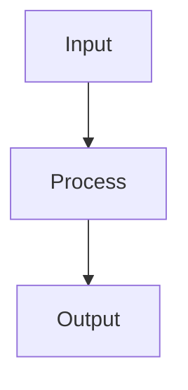

# Blog Authoring Guide

## Creating a post

Add a markdown file to `content/blog/` named `YYYY-MM-DD-slug.md`. The date prefix is stripped to form the URL slug: `2026-03-22-my-post.md` becomes `/blog/my-post`.

### Frontmatter

Every post starts with YAML frontmatter:

```yaml
---
title: "Your Title Here"
date: 2026-03-22
summary: "One or two sentences shown on the blog index card."
tags: ["computer-vision", "calibration"]
author: "Vitaly Vorobyev"
draft: true          # optional — hidden from production, visible with INCLUDE_DRAFTS=true
updated: 2026-04-01  # optional — shown in the metadata bar
coverImage: "https://..."  # optional — used for og:image
repoLinks: ["https://github.com/..."]  # optional — shown in footer
demoLinks: ["https://..."]             # optional — shown in footer
relatedAlgorithms: ["chess-corners"]   # optional — links to /algorithms/:slug
---
```

**Required fields:** `title`, `date`, `summary`, `tags` (at least one), `author`.

---

## Markdown features

Standard GitHub-Flavored Markdown is fully supported: headings, paragraphs, bold, italic, links, images, lists, tables, blockquotes, and fenced code blocks.

### Links

Standard markdown links work as expected:

```
[internal page](/blog)
[external site](https://opencv.org)
```

**External links** (starting with `http://` or `https://`) automatically open in a new tab with `target="_blank"` and `rel="noopener noreferrer"`. No special syntax needed — just use a full URL. Internal links (starting with `/` or `#`) navigate within the site as usual.

---

## Math

Use KaTeX syntax. Math is rendered at build time — no client-side JavaScript.

**Inline math** — wrap with single dollar signs:

```
The matrix $H$ maps points as $x' \sim Hx$.
```

**Display math** — wrap with double dollar signs on their own lines:

```
$$
H = K\left(R - \frac{t n^\top}{d}\right)K^{-1}
$$
```

---

## Code blocks

Fenced code blocks with a language tag get syntax highlighting at build time (Shiki, dual-theme). Supported languages include: `python`, `typescript`, `javascript`, `rust`, `bash`, `json`, `yaml`, `toml`, `html`, `css`, `sql`, `c`, `cpp`, `markdown`, `latex`.

````
```python
def normalize(pts):
    centroid = pts.mean(axis=0)
    return pts - centroid
```
````

Inline code uses backticks: `` `np.linalg.svd()` ``.

---

## Mermaid diagrams

Fenced code blocks with `mermaid` as the language are rendered as diagrams client-side. They automatically follow the light/dark theme.

````

````

---

## Semantic blocks

Use the `:::type[optional label]` directive syntax. The block ends with `:::`.

### Definitions

```
:::definition[Homography]
A homography is a projective transformation represented by a non-singular 3×3 matrix.
:::
```

### Theorems, lemmas, propositions, statements

```
:::theorem[Plane-induced image mapping]
If all observed points lie on a plane, the correspondence between two views
is described by a homography.
:::

:::lemma[Rank constraint]
The fundamental matrix is rank 2.
:::

:::proposition[Uniqueness]
The decomposition is unique up to sign.
:::

:::statement[Observation]
A general statement or claim.
:::
```

All four render with the same structure — a blue left border, uppercase type label, and italic named label. They differ by subtle saturation.

### Proofs

```
:::proof
Project the plane into each camera, eliminate depth, and derive the mapping.
:::
```

Proofs render with a quieter style (no left border, hairline top rule) and an automatic ∎ (QED) marker at the end.

### Notes and warnings

```
:::note
The DLT algorithm requires at least 4 point correspondences.
:::

:::warning
Always normalize coordinates before constructing the design matrix.
:::
```

Notes use a teal accent, warnings use amber.

### Examples

```
:::example[Applying DLT]
Given four corners of a known square pattern...
:::
```

Examples use a sage green accent.

### Algorithms

Algorithm blocks support `:input:` and `:output:` metadata directives:

```
:::algorithm[Normalized DLT]
:input: $n \geq 4$ point correspondences
:output: Homography matrix $H$

1. Normalize coordinates.
2. Assemble the linear system.
3. Solve using SVD.
4. Denormalize.
:::
```

The input/output metadata renders in a monospace font above the algorithm steps, separated by a hairline rule. The block has a full border (all four sides).

### Quotes with attribution

```
:::quote[Hartley & Zisserman]
A plane induces a homography between views.
:::
```

The label text becomes the attribution, prefixed with an em dash. The body is rendered in italic serif.

---

## Building and previewing

```bash
bun run content:build          # rebuild content manifest only
bun run build                  # full build (content + typecheck + vite)
INCLUDE_DRAFTS=true bun run content:build  # include draft posts
bun run dev                    # dev server at localhost:5173
```

Content changes require re-running `content:build` (or the full `build`). The dev server does not auto-reload on markdown changes.

---

## Reference: block types at a glance

| Block | Syntax | Visual style |
|-------|--------|-------------|
| `definition` | `:::definition[Name]` | Violet left border |
| `theorem` | `:::theorem[Name]` | Blue left border |
| `lemma` | `:::lemma[Name]` | Blue left border (lighter) |
| `proposition` | `:::proposition[Name]` | Blue left border (lighter) |
| `statement` | `:::statement[Name]` | Blue left border (lightest) |
| `proof` | `:::proof` | Hairline top rule, QED marker |
| `note` | `:::note` | Teal left border |
| `warning` | `:::warning` | Amber left border |
| `example` | `:::example[Name]` | Green left border |
| `algorithm` | `:::algorithm[Name]` | Full border box |
| `quote` | `:::quote[Attribution]` | Top/bottom borders, italic |
