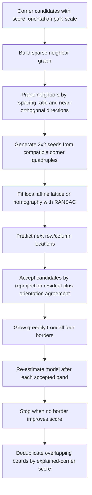
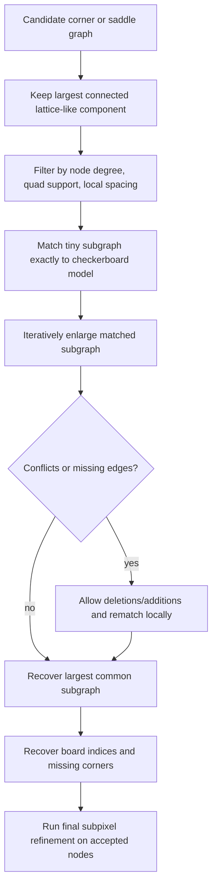

# Recognizing Regular Grids in Images for Calibration

## Executive summary

Regular-grid recognition for camera calibration is best viewed as a two-stage problem: first detect reliable local primitives such as X-corners, square cells, edges, or marker corners; then solve the harder combinatorial problem of indexing those primitives into a regular lattice under projective warp, lens distortion, occlusion, blur, and clutter. The literature shows that the strongest classical detectors are no longer generic Harris-only pipelines: robust modern baselines are sector or Radon-style X-corner detectors, edge/saddle-graph detectors, and graph-based lattice parsers that explicitly enforce grid regularity. In practice, today’s strongest off-the-shelf classical baseline is usually entity["organization","OpenCV","computer vision library"] `findChessboardCornersSB` for full or oversized boards, optionally backed by graph-based recovery when visibility is partial or the distortion is extreme. citeturn35view2turn35view4turn20view5turn10view0turn10view1turn10view2

Published evidence is unusually clear on several points. Quad/contour pipelines remain fast and convenient but depend on good square segmentation, white border margin, and moderate blur/distortion. Rufli–Scaramuzza’s improvements raised omnidirectional detection robustness substantially, reporting an increase from about 20% to 80% on heavily distorted imagery, with near-100% using higher-quality cameras, and on several distorted test sets they recovered far more corners than the then-standard OpenCV pipeline. ROCHADE then replaced quad-centric reasoning with a global edge graph and saddle clustering, detecting 91 of 103 Mesa wide-baseline checkerboards where OpenCV found 8, while OCPAD added partial-board graph matching and reduced outer-image reprojection error by up to 50% when partially visible boards were included in calibration. citeturn9view12turn40view3turn10view0turn8view2turn10view1turn10view2

For subpixel localization, the strongest calibration-oriented ideas are Förstner-style refinement, saddle-point fitting, and sector/Radon operators that produce subpixel corners directly. Duda and Frese’s localized-Radon detector was adopted into OpenCV’s sector-based method and is now documented by OpenCV as more robust to noise and often more accurate than `cornerSubPix`; newer calibration-oriented detectors also report strong subpixel results, such as Geiger et al.’s average corner reprojection error of 0.18 px and Spitschan et al.’s reported 0.08 px mean localization error on synthetic data with 0.11 px reprojection error on a public calibration set. citeturn27search2turn27search1turn35view2turn19view3turn22search4

For grid parsing from detected corners, the strongest ideas are sparse-graph construction, powerful seed selection, local orientation/scale descriptors, growth with affine or projective consistency checks, and exact graph matching only as a fallback on already-pruned candidate graphs. The most effective published systems avoid brute-force combinatorics by restricting attention to local neighbors, 2×2 or triple-based seeds, and connected components whose degree structure already resembles a lattice. Geiger’s single-shot multi-checkerboard method, ROCHADE’s saddle adjacency verification, OCPAD’s error-tolerant subgraph matching, and Yan et al.’s self-correlation plus structure expansion are the main calibration-specific references here. citeturn18view6turn21view3turn11view3turn11view5turn41view0

Deep learning now helps in two distinct regimes. For ordinary checkerboards, CNN-based corner heatmaps can outperform older hand-crafted detectors under distortion, noise, low contrast, and extreme orientation, but they still require a classical parsing step unless the board geometry is encoded in the network or via post-processing. For ChArUco, the strongest published result remains the pattern-specific system from entity["company","Magic Leap","ar company"]: Deep ChArUco reported 97.4% pose success versus 68.8% for the OpenCV baseline at a 3 px reprojection threshold over 26,000 frames, while maintaining real-time variants around 25–101 fps on 320×240 imagery. citeturn40view1turn11view8turn11view9turn34search5

The best practical recommendation, assuming generous compute, is a hybrid pipeline: multi-scale sector/X-corner detection or deep corner heatmaps; local orientation estimation; sparse adjacency graph building through k-nearest or Delaunay neighborhoods; 2×2 seed generation; affine/projective graph growth with robust fitting; local exact graph matching only in ambiguous regions; and final subpixel refinement. For ChArUco, combine marker ID evidence with chessboard-corner interpolation or deep keypoint detection, and disable marker subpixel refinement in the homography-only regime exactly as the OpenCV documentation recommends. citeturn19view1turn18view6turn19view2turn11view3turn14view0turn14view1

## Geometry and nuisance model

A printed chessboard or ChArUco target is a planar lattice. Under an ideal pinhole camera its image is related to the board by a homography, which is why Zhang’s planar-target calibration method became the dominant workhorse. Real systems add radial and tangential distortion in the Brown–Conrady family, or more general wide-angle and fisheye effects better captured by models such as Kannala–Brandt. This matters because some detectors rely on global straightness of checker edges, while others only rely on local corner symmetry or local neighborhood regularity, which survives distortion far better. citeturn28search0turn28search23turn28search2turn23view0

This observation explains much of the literature. Line/Hough methods work best when edges remain approximately straight in the image, or after undistortion is already known. Quad/contour methods work when binarization cleanly separates cells into near-quadrangles. By contrast, sector, saddle, and local graph methods are inherently more distortion-tolerant because they operate on local X-junction evidence and local neighborhood consistency rather than global Euclidean shape. OpenCV’s own ChArUco documentation makes the same point indirectly: interpolation by homography is more sensitive to distortion, so when camera intrinsics are available it switches to pose-based reprojection instead. citeturn23view0turn14view0turn14view1

The main nuisances are not independent. Perspective foreshortening creates anisotropic cell scales and dense corner clusters on one side of the board. Distortion bends lines and can invalidate vanishing-point assumptions. Blur and noise flatten gradients and destabilize gradient-based subpixel solvers. Illumination changes perturb thresholding and cause false quads. Occlusion breaks the topological completeness of the grid and turns a simple detection problem into a partial graph-matching problem. Calibrating near the image border is especially valuable for distortion estimation, but exactly those regions are hardest to detect reliably. citeturn8view2turn10view2turn12view0turn13view3turn41view1

## Classical detection methods

### Core families and their trade-offs

The table below compares the main algorithmic families used in published chessboard and related grid detectors. The listed complexities are typical implementation-level costs, where \(P\) is the number of pixels, \(C\) the number of corner candidates, and \(E\) the number of sparse graph edges.

| Family | Typical input primitive | Output before parsing | Typical complexity | Strengths | Common failure modes | Representative sources |
|---|---|---:|---:|---|---|---|
| Harris / Shi-Tomasi candidates + Förstner or `cornerSubPix` refinement | image gradients, structure tensor | unordered corner candidates | ~O(P) detector + local iterative refinement | simple, mature, good as seed generator | many false positives in clutter; subpixel drift under blur/noise; needs later parsing | citeturn1search0turn1search1turn27search2turn36view1 |
| Circular / sector / X-corner detectors such as ChESS and localized Radon | local intensity symmetry around candidate | corner score, often orientation and/or subpixel point | ~O(P) with fixed local filters; multi-scale variants add pyramid cost | robust local symmetry cue; better under blur/noise than raw gradient corners; often direct subpixel | still needs lattice parsing; can detect off-board chess-like corners | citeturn26search0turn26search5turn12view0turn35view2turn22search4 |
| Quad / contour / square-based methods | thresholded binary blobs, contours | quads or square adjacency graph | ~O(P) + contour extraction/grouping | fast; easy to implement; widely available | requires strong white border and good segmentation; degrades under heavy distortion, tiny cells, strong blur | citeturn20view4turn36view2turn17search1turn40view3 |
| Edge graph + saddle clustering | edge magnitude and centerlines | connected edge components and saddle nodes | ~O(P) + graph traversal | strong under extreme pose and distortion; explicit topology | more engineering; clustering parameters matter; still assumes recognizable connected lattice structure | citeturn21view0turn21view2turn21view3turn10view0 |
| Line / Hough / vanishing-point methods | edges or line segments | line families, intersections, board frame | often superlinear in edge count, especially if exhaustive | good when lines stay straight and board is mostly visible | wide-angle distortion breaks straight-line assumption; weak under clutter/partial views | citeturn23view0 |
| Self-correlation + structure expansion | local correlation response and filtered Harris corners | corner set plus expanded board structure | ~O(P) + local growth over sparse candidates | handles multiple checkerboards and uses local edge constraints | parameter tuning depends on scale; partial-occlusion performance still drops on hardest split-board cases | citeturn11view5turn19view6turn41view0 |

A useful way to interpret the literature is that “detection” and “parsing” are separable. Many methods differ more in how they recover the lattice than in how they score an individual X-corner. This is why a generic corner detector can become very strong when paired with an excellent parser, and why even highly accurate local detectors can fail if the indexing stage is weak. citeturn12view0turn18view6turn11view3turn41view0

### Corner-based detection and subpixel localization

Harris-style and Shi–Tomasi-style detectors remain relevant mostly as proposal generators. The calibration literature consistently adds a second stage that exploits checkerboard-specific structure, because generic cornerness responds to clutter, texture, and T-junctions that are not usable calibration corners. Förstner-style subpixel localization, and OpenCV’s `cornerSubPix`, refine candidates by fitting a local least-squares constraint derived from image gradients around the corner. OpenCV’s classical `findChessboardCorners` still follows this general pattern after finding a valid grid. citeturn1search0turn1search1turn27search2turn36view1

Checkerboard-specific corner models work better because the true primitive is an X-junction with intensity symmetry, not a generic natural-image corner. Lucchese and Mitra’s saddle-point formulation, ROCHADE’s polynomial saddle fitting with a cone filter, and Duda–Frese’s localized Radon transform are all examples of this specialization. Duda and Frese explicitly argue that large box filters suppress noise better than gradient filters and report lower mean indoor calibration residuals than the OpenCV baseline, while OpenCV documents `findChessboardCornersSB` as a sector-based method derived from that paper that returns subpixel corners directly. citeturn27search1turn20view6turn13view0turn35view2turn35view4

Orientation estimation is not just a nice extra; it is one of the best pruning cues for later parsing. Geiger et al. estimate local corner orientations using a weighted gradient histogram with mean shift to find two dominant edge modes, while ChESS also produces a feature strength and orientation measure. In practice, this local pair of edge directions is one of the most useful descriptors to carry forward into graph growth. citeturn19view1turn26search5

### Square, contour, and edge-based methods

The classic OpenCV family detects the board by thresholding, optionally normalizing contrast, extracting contours, filtering quad-like regions, and grouping them into a 2D grid. Duda and Frese summarize this lineage explicitly, and OpenCV documents the major assumptions: the method benefits from adaptive thresholding and quad filtering, and it requires a generous white border around the target so the outer black cells can be segmented correctly. This family is still competitive when images are crisp, distortion is moderate, and boards are fully visible. citeturn20view4turn36view3turn36view1turn36view2

Rufli, Scaramuzza, and Siegwart showed how to harden that family for omnidirectional and blurred imagery by adapting erosion kernels and quad-linking heuristics. Their IROS paper reported a jump in detection rate from 20% to 80% on difficult distorted imagery and provided detailed results on heavily distorted test sets where the improved method recovered roughly 41–42 of 42 corners on average, versus much lower counts for the older OpenCV implementation, while keeping mean corner inaccuracy around or below one pixel. citeturn9view12turn40view3

ROCHADE pushed further by giving up on quads as the primary abstraction. It computes a Scharr-magnitude image, thresholded mask, centerline graph, and saddle clusters, then verifies whether a connected component has the correct lattice adjacency. That edge-graph formulation is explicitly designed for strong lens distortion, non-constant projected cell sizes, and extreme pose. Quantitatively, it found 91 of 103 checkerboards on a challenging Mesa wide-baseline set where OpenCV found 8, and 96 of 100 on a distorted GoPro set where OpenCV found 73. citeturn21view0turn21view2turn21view3turn10view0

### Line and Hough methods

Hough-style detectors use the fact that a checkerboard contains two nearly orthogonal line families converging to two vanishing points. When distortion is mild, those line families let one estimate board extent and infer corner intersections. The MATE paper gives a concise survey and emphasizes the core limitation: wide-angle distortion bends lines enough that pure line/Hough methods become unreliable unless some undistortion is already known. For routine pinhole calibration they are useful as auxiliary structure cues, but they are no longer the dominant family for distorted calibration imagery. citeturn23view0

### Performance-proven classical concepts

The most useful classical published results are summarized below.

| Method | Venue / year | Main idea | Reported evidence | Typical failure mode | Source |
|---|---|---|---|---|---|
| Rufli–Scaramuzza–Siegwart | IROS 2008 | improved quad-linking for blurred/distorted images | standard detector improved from ~20% to ~80% detection on difficult distorted imagery; <1 px mean localization error in several sets | very small cells in low resolution; border/threshold issues | citeturn9view12turn40view3 |
| Geiger et al. / LIBCBDETECT | ICRA 2012 | specialized corner prototypes, orientation refinement, energy-based board expansion | average corner reprojection error 0.18 px; handles multiple unknown checkerboards in one image | still assumes enough visible local regularity to seed valid expansion | citeturn19view1turn19view2turn19view3turn15view2 |
| ROCHADE | LNCS / GCPR 2014 | edge graph, centerlines, saddle clustering, grid adjacency verification | 91/103 Mesa vs 8 for OpenCV; 96/100 GoPro vs 73 for OpenCV | extreme foreshortening can still break connected structure | citeturn10view0turn20view5 |
| OCPAD | CVPRW 2016 | outlier-tolerant graph matching for partial boards | detection and calibration benefit on full+partial datasets; up to 50% reprojection improvement in outer regions | runtime dominated by graph matching on hard cases | citeturn8view2turn10view1turn10view2 |
| Spitschan et al. | VAMR 2018 | Fourier-based corner detector | 0.08 px mean localization error on noisy synthetic data; 0.11 px reprojection error vs 0.27 px baseline on public set | mainly a local detector, not a full parser by itself | citeturn22search4 |
| Duda–Frese | BMVC 2018 | localized Radon / box-filter sector detector | more robust to low contrast, blur, and noise; lower indoor residuals than OpenCV baseline | blur very high can still favor additional smoothing in classical baselines | citeturn12view0turn13view0turn13view3 |
| Abeles | arXiv 2021 | blur-aware multi-scale X-corner detector and connectivity validation | best F1 reported at 0.97 and 1.9× faster than next-fastest in their benchmark | not a standard library yet; benchmark composition is heterogeneous | citeturn41view1 |

## Graph growth and lattice parsing

### What the parsing stage must solve

From a set of corner candidates, a parser must answer five questions: which candidates belong to the board, which are adjacent in row and column directions, which corner is the origin, what the board dimensions are, and how missing nodes should be handled. Pure nearest-neighbor chaining is not enough because perspective warp makes distances anisotropic, distortion bends rows and columns, and clutter creates visually plausible but topologically invalid arrangements. The best parsers therefore combine local descriptors, sparse geometry, robust model fitting, and explicit grid constraints. citeturn18view6turn19view2turn11view3turn11view5

### Strong graph-growing strategies

Geiger et al. start from a seed corner and a pair of edge directions, instantiate a 2×2 hypothesis, and minimize an energy that rewards explaining many corners while penalizing deviations from checkerboard regularity through row and column triples. Expansion moves add a row or column at whichever border most improves the energy, and overlapping candidate boards are greedily deduplicated by score. This is an excellent example of “small seed, strong local growth, global deduplication.” citeturn18view6turn19view2

ROCHADE and OCPAD take a different route. ROCHADE first turns the image into an edge graph whose high-degree nodes are saddle clusters; it then validates whether the adjacency among these nodes is a grid. OCPAD assumes such a candidate graph already exists, prunes it aggressively, keeps only the largest connected component, and then runs error-tolerant subgraph matching against a checkerboard model, iteratively enlarging the matched subgraph to tolerate missing or spurious edges. This is the right strategy when partial visibility matters more than raw speed. citeturn21view2turn21view3turn19view4turn19view5turn11view3

Yan et al. explicitly combine corner evidence and edge evidence. They detect corner candidates using self-correlation, choose seeds and initial neighbors using border geometry, then expand structure using gradient, orientation, and distance constraints on candidate checker edges. This is a useful middle ground when one wants more error tolerance than pure local growth but less machinery than full graph isomorphism. citeturn11view5turn19view6turn41view0

### Two practical graph-growing blueprints

The first blueprint below is the one I would recommend for most new work on ordinary checkerboards; it synthesizes the growth logic from Geiger, Yan, and modern sparse-neighbor practice. The second captures the OCPAD-style fallback for partial boards and ambiguous detections. Both are faithful to the successful literature, but the exact thresholds are deliberately presented as recommended starting points rather than quoted paper constants. citeturn18view6turn19view2turn11view5turn11view3turn29search2

A good default design is: compute a sparse graph with radius-limited k-nearest neighbors; keep only neighbors whose dominant edge-direction pair is consistent with a local orthogonal basis; score 2×2 seeds by orthogonality, alternating polarity if available, and spacing regularity; then grow outward under an affine model, switching to a local homography if residuals suggest strong perspective. With a kd-tree, sparse graph building is typically \(O(C \log C)\), seed generation is near-linear in the candidate degree, and growth is linear in the recovered board size. citeturn19view1turn18view6turn11view5turn29search2

This second strategy is slower but much more tolerant of occlusion and cropped boards. The key to making it practical is not the matching algorithm itself but the pruning before matching: degree filtering, quad support, connected-component restriction, and local geometry gates prevent exact subgraph matching from exploding combinatorially. OCPAD uses the VF2 family to match a small exact subgraph first and then enlarge it; that is a strong design pattern because VF2 has excellent pruning in practice but still has exponential worst-case time, so it should only ever see tiny ambiguity sets. citeturn11view3turn19view4turn19view5turn31view12

### RANSAC, MRF/CRF, spectral matching, and avoiding combinatorial explosion

RANSAC is most useful at two places: estimating a local lattice basis from noisy seed hypotheses and fitting a homography or affine lattice to a growing partial board while rejecting spurious corners. It is a poor substitute for explicit grid parsing, but it is an excellent robust front-end that collapses the search to a handful of plausible hypotheses before graph search begins. citeturn29search2turn18view6

Spectral or higher-order graph matching is attractive when the graph is small and ambiguity is local, because pairwise or higher-order consistency terms can encode spacing, parallelism, and opposite-edge orientation in a principled way. But dense affinity matrices scale quadratically in the number of candidate correspondences, so spectral methods are better used as a refinement stage on already-pruned local ambiguity regions, not as a global parser over all corners. citeturn30search0turn30search22

MRF and CRF formulations are also natural: each candidate corner receives a lattice label or “outlier” label, with unary terms from corner score and pairwise terms from neighbor regularity. In calibration-target literature, however, they are less common than direct growth or graph matching, largely because the structured graph is so regular that simpler deterministic methods already work very well once the candidate set has been pruned. For a modern system, an MRF or CRF is most useful as a local consistency smoother after growth, not as the only parser. citeturn29search11turn29search19turn18view6turn11view3

My strongest practical recommendation for avoiding combinatorial explosion is this: never match raw corners to board indices globally. Instead, carry forward a descriptor \((x,y,\theta_1,\theta_2,s,\rho)\) with position, two dominant orientations, local scale, and response; build only sparse edges; enumerate only 2×2 seeds or short row/column triplets; fit a local model immediately; and escalate to exact or spectral matching only for a connected component that is already almost a lattice. This keeps most real scenes close to \(O(C \log C)\) or \(O(C \log C + E)\) in the common case while preserving strong recovery on partial boards. citeturn19view1turn18view6turn11view3turn31view12turn30search0

## Deep learning and ChArUco-specific methods

### Deep learning for checkerboard corners and board parsing

MATE was one of the earliest strong learned checkerboard-corner detectors for calibration. Its main insight was that the network can be trained directly on noise, perspective skew, and radial/tangential distortion, and that the resulting response map can generalize several hand-crafted circular-boundary detectors. In the published MDPI evaluation, the more robustly trained variant handled stronger distortion and maintained full-board detection up to larger viewing angles, though it traded improved recall for many more false positives on some datasets. citeturn23view0turn24view0turn24view1turn24view5

CCDN strengthened this line by using a fully convolutional heatmap detector plus post-processing. On the uEye benchmark it reported 0.812 px average corner accuracy with 1.169% missed corners, outperforming MATE, ChESS, and ROCHADE on the missed-corner metric; on the GoPro benchmark it reported 0.576 px accuracy with 0.907% missed corners and zero false positives, again sharply improving recall over older learned and classical baselines. The evaluation criterion counted a predicted corner as correct when it fell within 5 px of ground truth, which is a reasonable detection benchmark but should always be complemented by calibration error and peripheral distortion metrics. citeturn40view1

RCDN is best thought of as a pragmatic continuation of CCDN rather than an entirely different paradigm. It adds a coarse-to-fine detector, mixed subpixel refinement, and an improved region-growth mechanism to recover partially visible or occluded boards. It is unpublished at the time of writing and therefore below the conference and journal work in evidential weight, but it captures the direction in which recent systems are moving: deep local detection, classical geometric parsing, and heavier attention to occlusion recovery. citeturn33view0

A separate recent thread focuses less on learning and more on modern robustness engineering. Abeles’s blur-aware multi-scale detector estimates blur, uses it to choose local sampling scale, validates edges in a blur-aware way, and reports the best overall F1 in its benchmark at 0.97 with a 1.9× speedup over the next-fastest method. Hillen et al. add Gaussian-process enhancement to improve occluded-board detection, explicitly targeting cases where a large occlusion splits the board into disconnected visible regions. These are good reminders that learned heatmaps are not the only route to major robustness gains. citeturn41view1turn41view2

### Why ChArUco is different

ChArUco combines a chessboard with ArUco markers. This solves one major weakness of plain checkerboards: ambiguous indexing under partial view. Marker IDs can disambiguate the board frame and allow calibration from partial or occluded views. OpenCV’s calibration tutorial explicitly recommends ChArUco corners over raw marker corners because the interpolated chessboard corners are more accurate, and it notes that occlusions and partial views are allowed. That is why ChArUco remains a dominant engineering choice whenever full-board visibility is hard to guarantee. citeturn15view0turn8view9

But ChArUco creates its own detection difficulties. Marker corners and chessboard corners are interleaved densely in the same image region. OpenCV’s ChArUco detection tutorial warns that, in the homography-based regime without camera intrinsics, marker corner refinement should be disabled because nearby chessboard structure can move marker corners enough to corrupt the subsequent corner interpolation. The same documentation recommends that the margin between the chessboard square and the ArUco marker exceed 70% of one marker module, and it returns only corners whose two surrounding markers are visible. These are not cosmetic details; they are exactly the reasons ChArUco fails in practice when the board design is too tight or the detector mixes marker and chessboard evidence badly. citeturn14view0turn14view1turn14view3

OpenCV also makes an important implementation distinction. If camera intrinsics are available, ChArUco corners are interpolated by rough pose estimation followed by reprojection; otherwise they are interpolated from a local homography using nearby markers only. The latter is faster and more local, but the documentation is explicit that it is more sensitive to distortion. In other words, ChArUco is not distortion-invariant by magic; it still benefits substantially from a calibrated or iteratively improving camera model. citeturn8view9turn14view0

There is also a versioning gotcha: after OpenCV 4.6.0, the ChArUco pattern generation changed for even row counts, and OpenCV now exposes `setLegacyPattern()` to preserve compatibility with boards generated by earlier versions. In real pipelines this matters because a visually similar board can have a different implied ID layout, silently breaking calibration datasets. citeturn8view9

### Performance-proven deep and ChArUco methods

| Method | Target type | Main output | Reported evidence | Main trade-off | Source |
|---|---|---|---|---|---|
| MATE | checkerboard | corner response map | robust to perspective, distortion, and added noise; strong angle robustness, but false positives can rise sharply with robust training | board parsing still classical; false-positive control matters | citeturn23view0turn24view1turn24view5 |
| CCDN | checkerboard | corner heatmap + post-processing | uEye: 0.812 px, 1.169% missed; GoPro: 0.576 px, 0.907% missed, zero false positives | still needs post-processing and board recovery | citeturn40view1 |
| RCDN | checkerboard / X-corner | coarse-to-fine corner detection + growth | claims improved partial-board and occlusion recovery over prior methods | unpublished follow-on; weaker evidential status | citeturn33view0 |
| Deep ChArUco | ChArUco | ID-specific keypoints + RefineNet + PnP | 97.4% vs 68.8% pose success at 3 px threshold over 26,000 frames; 24.9–100.7 fps depending on refinement | board-specific training; original dataset/code not public | citeturn11view8turn11view9turn10view3turn10view4turn15view5 |
| DeepArUco++ | ArUco markers | marker detection and classification | improved difficult-lighting marker detection; public datasets and code available | marker-level, not full ChArUco chess-corner parsing | citeturn6search5turn15view6 |

The clearest conclusion is that deep learning helps most when the nuisance factors are photometric or motion-related and the board appearance is known. For generic checkerboards, deep corner heatmaps improve candidate quality, but one still needs a carefully engineered parser. For ChArUco, where the marker layout and corner IDs are fixed, end-to-end or pattern-specific architectures pay off more directly. citeturn40view1turn34search5turn14view0

## Evaluation, implementations, and practical recommendations

### Recommended evaluation protocol

The literature does not yet offer one universally accepted public benchmark spanning full-board, partial-board, severe fisheye distortion, low light, motion blur, and ChArUco. A serious benchmark should therefore combine multiple public datasets and a synthetic generator. At minimum, include the ROCHADE and OCPAD image sets for wide baseline and distortion, Yan et al.’s aggregate public suite for multi-board and partial-board evaluation, Deep ChArUco’s 26-video evaluation protocol or equivalent low-light video sequences for marker-based targets, and a synthetic generator that sweeps homography, Brown–Conrady parameters, fisheye distortion, blur, noise, gamma changes, partial occlusion, and checker size. citeturn10view0turn10view1turn41view0turn11view8turn15view6

The best metric set has four layers. First, detection metrics: image-level success rate, corner recall, missed-corner rate, double-detection rate, and false positives, following CCDN and MATE. Second, localization metrics: mean and percentile pixel error to hand-labeled ground truth, plus optional orientation error for methods that estimate corner axes. Third, calibration metrics: mean reprojection error and, more importantly, reprojection error as a function of radius from the principal point, exactly because distortion estimation quality lives at the periphery. Fourth, systems metrics: runtime, memory, and robustness under board crop, scale, and photometric stress. citeturn40view1turn24view1turn10view2turn11view8

A fair calibration benchmark must keep the solver fixed when comparing detectors. For perspective cameras use the same Zhang-style planar calibration and Brown–Conrady distortion model; for fisheye or omnidirectional cameras also evaluate a wide-angle model such as Kannala–Brandt or an equivalent generic omnidirectional model. Otherwise, detector differences get confounded with model mismatch. OCPAD’s results are particularly instructive here: including partial boards near the border improved distortion calibration, but the amount of improvement also depended on lens model choice. citeturn28search0turn28search2turn10view2

A practical dataset suite is below.

| Dataset or source | Target type | What it stresses | Use it for | Source |
|---|---|---|---|---|
| ROCHADE Mesa / IDS / GoPro | checkerboard | wide baseline, low resolution, strong distortion, consumer vs industrial cameras | classical and learned checkerboard comparison | citeturn10view0 |
| OCPAD Full Boards / Full+Partial | checkerboard | cropped boards, border coverage, calibration near image edge | partial-board recovery and distortion estimation | citeturn10view1turn10view2 |
| Yan aggregate suite including KITTI | checkerboard | multiple public datasets, multi-board scenes, partial boards | multi-board parsing and generalization | citeturn41view0 |
| Deep ChArUco 26-video evaluation + synthetic lighting | ChArUco | low light, motion blur, dark images, video pose success | ChArUco pose and tracking robustness | citeturn10view3turn10view4 |
| Shadow-ArUco / Flying-ArUco v2 | ArUco markers | difficult lighting and synthetic–real training loops | marker-stage robustness for ChArUco pipelines | citeturn6search5turn15view6 |
| Controlled synthetic generator | checkerboard and ChArUco | exact ground truth for corners, IDs, homography, distortion, blur, noise | localization accuracy and failure attribution | citeturn23view0turn40view1turn8view3 |

### Existing implementations and trade-offs

The implementation landscape is mature enough that one rarely needs to start from zero.

| Implementation | What it provides | Strengths | Caveats | Source |
|---|---|---|---|---|
| entity["organization","OpenCV","computer vision library"] `findChessboardCorners`, `cornerSubPix`, `find4QuadCornerSubpix` | classic chessboard detection and refinement | ubiquitous, easy integration, strong baseline | classical method prefers full boards and good segmentation; requires white border | citeturn36view0turn36view1turn36view2 |
| OpenCV `findChessboardCornersSB` | sector/Radon-based chessboard detector with `CALIB_CB_LARGER` and `CALIB_CB_MARKER` | robust to noise, faster on large images, direct subpixel, supports oversized boards | still not a full partial-board graph matcher; board design matters | citeturn35view2turn35view4 |
| OpenCV `cv::aruco::CharucoDetector` and ChArUco calibration | marker detection, ChArUco interpolation, pose and calibration | partial views and occlusion supported; practical standard for ChArUco | sensitive to marker refinement and board-margin design in homography mode; version-compatibility gotcha | citeturn8view9turn14view0turn15view0 |
| `libcbdetect` / `libomnical` | Geiger-style checkerboard extraction | good on fisheye and omnidirectional imagery; multi-board capable | older codebase and MATLAB/C++ heritage | citeturn15view2 |
| `mrgingham` | ChESS-based corner finding plus geometric grid search | fast, packaged on modern Debian/Ubuntu, useful uncertainty tooling | detects only complete chessboards; no intrinsic corner IDs | citeturn39view0 |
| entity["organization","ROS","robot middleware"] `camera_calibration` | user-facing mono/stereo checkerboard calibration | simple workflow, uses OpenCV internally | checkerboard-centric, not ChArUco-centric | citeturn38view0turn38view1 |
| ROS `checkerboard_detector` | pose from checkerboards in calibrated images | useful robotics integration | assumes calibrated image and explicit checker configs | citeturn38view2 |
| ROS `charuco_calibration` | interactive and file-based ChArUco calibration | practical for robotics and remote calibration workflows | ecosystem-specific; depends on OpenCV ChArUco behavior | citeturn15view4 |
| entity["organization","Kalibr","visual inertial calibration"] | checkerboard, circlegrid, and Aprilgrid targets for multi-sensor calibration | mature visual–inertial calibration stack | it explicitly recommends Aprilgrid over checkerboard for partial visibility and pose disambiguation | citeturn37view0turn37view2 |
| `deepcharuco` | unofficial PyTorch implementation of Deep ChArUco | practical starting point for learned ChArUco systems | not official; original dataset unavailable, fair reproduction impossible | citeturn15view5 |
| `deeparuco` | DeepArUco++ code, data generation, low-light marker datasets | strong marker-level starting point for learned ChArUco front ends | not a full ChArUco chess-corner pipeline | citeturn15view6 |
| CCDN code repositories | learned checkerboard corner detector | useful for baseline reproduction | sparse maintenance and aging code | citeturn32search0turn32search3 |

### Best ideas for an efficient, robust graph-growth system

If I were building a new detector today with no compute limit, I would use the following algorithmic stack.

First, detect corner candidates at multiple scales using either a sector/Radon-style classical detector or a learned corner heatmap. Carry forward not only \((x,y)\), but also a local confidence, local scale, and two dominant edge orientations. Local orientation is the most underused but highest-value attribute for later pruning. citeturn35view2turn19view1turn40view1

Second, build a sparse adjacency graph instead of a dense all-pairs graph. A practical starting point is a union of radius-limited k-nearest neighbors and Delaunay-like triangulation logic, then pruning by spacing band and orientation compatibility. This makes exact combinatorial solvers feasible only where they are actually needed. The common-case cost is then dominated by \(O(C \log C)\) neighborhood search rather than \(O(C^2)\) global matching. This recommendation is a synthesis of the successful local-growth and graph-matching papers rather than a quoted theorem, but it is exactly how those systems remain practical. citeturn18view6turn11view3turn31view12turn30search0

Third, seed from minimal but stable local structures: either a 2×2 checker patch or a corner plus two orthogonal neighbors with similar spacing. Reject seeds unless the orientation pair is near-orthogonal, the spacing ratio across the two axes is plausible, and a local affine model explains all four corners with low residual. If polarity or marker metadata exists, use it immediately; OpenCV’s SB metadata is especially helpful when `CALIB_CB_MARKER` or oversized patterns are used. citeturn18view6turn35view4

Fourth, grow greedily but re-fit often. After each accepted row or column, re-estimate an affine lattice or local homography with RANSAC or robust least squares, then test new frontier candidates by reprojection residual, edge-orientation agreement, and neighbor support. Stop growth when every border expansion worsens the composite score. This is much more stable than committing to a single early global homography. citeturn19view2turn29search2

Fifth, isolate ambiguity. If growth reaches a region with missing nodes, crop, or clutter, do not globalize the problem. Solve that local region with an exact or approximate graph matcher, or with a tiny spectral assignment if multiple equivalent candidates remain. In other words, use growth as the first-order solver and graph matching only as a rescue path. This is the central anti-explosion principle in OCPAD-like designs. citeturn11view3turn19view5turn30search0

Sixth, refine only accepted corners. Apply subpixel refinement such as localized Radon or saddle fitting after a node has been admitted to the lattice, not before. Early subpixeling of many clutter corners increases cost and can actually hurt parsing because refined but wrong features appear deceptively confident. OpenCV’s SB detector, ROCHADE’s saddle fit, and Deep ChArUco’s learned refinement all fit this admission-then-refine philosophy. citeturn35view2turn20view6turn34search5

For parameterization, good starting values are: neighbor degree \(k\) between 6 and 12; orthogonality tolerance about 10–15 degrees around 90; residual threshold for accepting growth candidates of roughly \(\min(3\text{ px}, 0.1 \times\) local cell spacing\()\); and two-stage growth where affine prediction is used first and local homography is enabled only when residual anisotropy indicates strong perspective. These are engineering recommendations derived from the literature’s successful structures, not direct quotations, but they are consistent with what the best systems measure and exploit. citeturn19view1turn18view6turn11view5turn29search2

Finally, for calibration specifically, benchmark not just mean reprojection error but radial error versus distance from the principal point, full-board versus partial-board success, and the number of usable observations at the image border. OCPAD’s results show why: the detector that gives you more reliable peripheral corners can produce materially better distortion calibration even if its average image-level success rate looks only modestly better. citeturn10view2